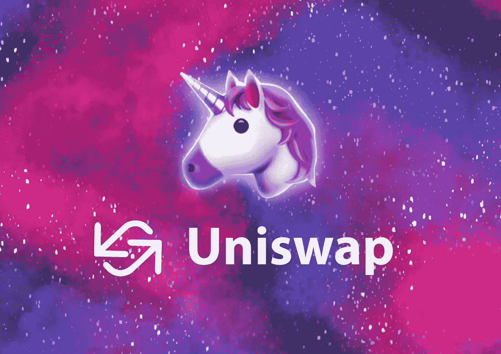

# Uniswap 在 60 秒内解释

> 原文：<https://medium.com/coinmonks/uniswap-explained-in-60-seconds-6f9d9ba80285?source=collection_archive---------48----------------------->

Uniswap 是最大的加密货币分散交易所(DEX)之一。你可能知道比特币基地或币安，它们是集中交易所。你需要获得在集中交易所交易的许可。另一方面，Uniswap 是无许可的，允许在没有任何中央机构的情况下进行加密货币交易。

用户可以像中央交易所一样交易加密资产，但也可以在平台上添加自己的加密货币项目进行交易，而无需任何中央机构的授权。你可以把它想象成一个没有人负责的自由的狂野西部风格的交流。

这有好有坏。好处是购买 crypto 不需要中央权威机构的授权，Uniswap 允许初创企业快速列出他们的项目。不利的一面是，任何人都可以列出一个项目，这意味着无良经营者可以利用它来欺骗和地毯拉投资者。

 [## 你准备好迎接加密经济了吗？加密派

### 每次你打开新闻，阅读报纸，或者浏览你的推特，你很可能会看到一些故事…

www.thecryptopie.com](https://www.thecryptopie.com/) 

> 加入 Coinmonks [电报频道](https://t.me/coincodecap)和 [Youtube 频道](https://www.youtube.com/c/coinmonks/videos)了解加密交易和投资

# 另外，阅读

*   [Unocoin 评论](https://coincodecap.com/unocoin-review) | [最佳加密赌注硬币](https://coincodecap.com/best-crypto-staking-coins)
*   [如何使用 MetaMask Wallet 获得 KCC 地址？](https://coincodecap.com/kcc-address-metamask)
*   [如何获得自己的。XYZ 领域？](https://coincodecap.com/xyz-domain)
*   [最佳加密交换平台](https://coincodecap.com/best-crypto-swap-platforms) | [最佳加密交易所](https://coincodecap.com/crypto-exchange)
*   [购买比特币印度](/coinmonks/buy-bitcoin-in-india-feb50ddfef94) | [Pionex 评论](/coinmonks/pionex-review-exchange-with-crypto-trading-bot-1e459d0191ea) | [加密交易机器人](/coinmonks/crypto-trading-bot-c2ffce8acb2a)
*   [n ave 零点回顾](/coinmonks/ngrave-zero-review-c465cf8307fc) | [Phemex 回顾](/coinmonks/phemex-review-4cfba0b49e28) | [PrimeXBT 回顾](/coinmonks/primexbt-review-88e0815be858)