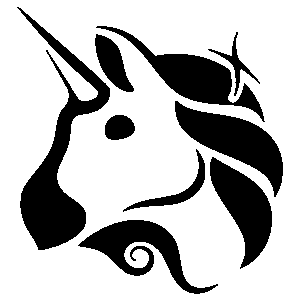

# Uniswap 历史

> 原文：<https://medium.com/coinmonks/uniswap-history-89544c4a6cf8?source=collection_archive---------26----------------------->

Uniswap Logo

分散式交易所(后来被称为 Uniswap)的最初想法是由 Vitalik Buterin 在 2016 年提出的，旨在采用具有某些特定功能的链上自动做市商。第二年，一位名叫海登·亚当斯的前西门子机械工程师开始研究 Vitalik 的想法，并将其转化为工作产品。该协议从以太坊基金会获得了 10 万美元的资助，同时还获得了其他多项资助。Uniswap 终于在 2018 年 11 月推出，并获得了很大的牵引力。在接下来的几个月里，多轮筹资导致了 Uniswap 团队的扩大。

海登·亚当是被他的朋友卡尔·弗罗施逼着写智能合同的，卡尔·弗罗施当时在以太坊基金会的卡斯帕·FFG 工作。正是因为卡尔，海登才得以见到维塔利克，维塔利克让他重写维普大学的合同，然后申请以太坊基金会的资助。

在敌无双的第四天，海登决定启动 Uniswap，因此在敌无双的第四天在以太坊主网上部署了合同。Uniswap 得到了大力支持、合作和新的实施想法。

Uniswap launch day tweet by Hayden on the last day of Devcon

Uniswap 将被海登命名为 UniPeg，但 Vitalik 告诉海登将其命名为 Uniswap。

Uniswap 的发明者其实挺难搞的。芦涛是第一个想出以太坊上的 ***X * Y = K*** (XYK 模型)的人。灵知的马丁·科普勒曼把这个想法告诉了灵知的维塔利克·布特林，维塔利克因为它的潜力开始宣传它。海登受到这个想法的启发，创建了 XYK 模型的具体实现。

Uniswap 与其他产品不同，因为它解决了交易交易所列表中非流动性资产的不均匀分布问题。每个不同的人都可以被识别为买方和卖方。使用 uniswap，任何人都可以通过将资产存入资金池，并根据资金池的交易量和活跃度赚取费用，从而成为流动性提供商。由于 uniswap 汇集的流动性使交易账户的深度变得平滑，因此不再有大的漏洞或价差。不涉及繁重的计算。它提供了一种被动的方式来赚取一些费用，同时为资金池提供流动性。Uniswap 没有上市费，几乎可以忽略不计的汽油费，而且更加分散化。

Uniswap 推出了他们自己的名为 UNI 的令牌，分配给所有以前使用过该平台的人。这种代币在集中和分散的交易所交易量都很大，代币的价格高达 8 美元。流动性提供者获得了更多代币奖励。以下列方式分配了 10 亿个 UNI 令牌:

UNI token 的推出使该平台更加分散化和自我可持续，同时保持了其自主性。

> 加入 Coinmonks [电报频道](https://t.me/coincodecap)和 [Youtube 频道](https://www.youtube.com/c/coinmonks/videos)了解加密交易和投资

# 另外，阅读

*   [AscendEx Staking](https://coincodecap.com/ascendex-staking)|[Bot Ocean Review](https://coincodecap.com/bot-ocean-review)|[最佳比特币钱包](https://coincodecap.com/bitcoin-wallets-india)
*   [霍比审核](https://coincodecap.com/huobi-review) | [OKEx 保证金交易](https://coincodecap.com/okex-margin-trading) | [期货交易](https://coincodecap.com/futures-trading)
*   [网格交易机器人](https://coincodecap.com/grid-trading) | [Cryptohopper 审查](/coinmonks/cryptohopper-review-a388ff5bae88) | [Bexplus 审查](https://coincodecap.com/bexplus-review)
*   [7 个最佳零费用加密交易平台](https://coincodecap.com/zero-fee-crypto-exchanges)
*   [氹欞侊贸易评论](https://coincodecap.com/anny-trade-review) | [霍比保证金交易](/coinmonks/huobi-margin-trading-b3b06cdc1519)
*   [分散交易所](https://coincodecap.com/what-are-decentralized-exchanges) | [比特 FIP](https://coincodecap.com/bitbns-fip) | [Pionex 评论](https://coincodecap.com/pionex-review-exchange-with-crypto-trading-bot)