# Uniswap 简介— 2

> 原文：<https://medium.com/coinmonks/uniswap-introduction-2-c60e66530e68?source=collection_archive---------2----------------------->

## 遍历所有代码

这是分散交换介绍的第二部分。在之前的[文章](/@gregshen0925/decentralized-exchange-intro-3ab7c3937041)中，我们介绍了 Uniswap 的基本概念，如 DEX 德克斯、AMM、常数乘积公式。

然而，这是一个高层次的介绍，我们仍然没有专业到告诉奶奶 Uniswap 到底是什么。引擎盖下有很多东西！幸运的是，我们正在浏览代码以完全理解它。

# 从 Uniswap V2 智能合同的体系结构开始…

> Uniswap 有三个版本，但我刚刚走过 V2，原因如下。
> 1。V1 太简单了，不具备所有的现代特征。
> 2。V3 比 V2 更高效，并且通过添加“tick”优化了资金利用。因此这要复杂得多
> 
> *因为我们正在介绍什么是 AMM 以及它是如何工作的。V2 是徒步穿越的最佳选择。*

# Uniswap V2 智能合同的架构

有两个存储库，它们都包含两个主要的智能合同。

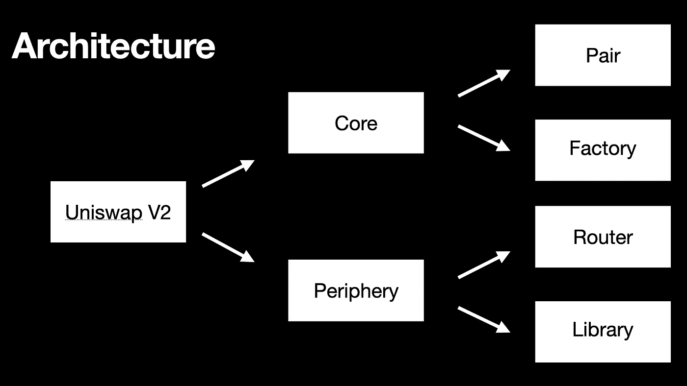

Architecture of Uniswap Repository

# 核心

核心是存储资金和管理资金。它包含两个智能合同，**对**和**工厂**。

*   **Pair**
    智能合约，具有交换、铸造和焚烧代币的功能。
*   **工厂**
    创建和跟踪配对

# 边缘

很明显，外围设备包含智能契约来与核心进行交互。它还包含两个智能契约，**路由器**和**库**

*   **路由器**与核心
    交互。提供`swapETHForExactTokens`、`swapExactETHForToken`等功能。
*   **库**
    有些功能像`getReserves`、`getAmountIn`、`getAmountOut`等。

# 从核心开始

如前所述，core 中有两个智能合约， **Pair** 和 **Factory。在本文中，我将只讨论配对合同。这是最难的一个，可能需要一些时间来理解。**

# 1.一副

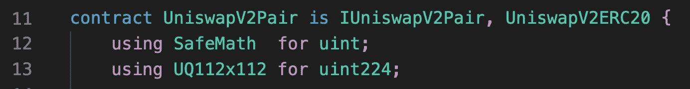

*   这个契约名为 UniswapV2Pair。它固有 IUniswapV2Pair 接口和 UniswapV2ERC20，并扩展了 UniswapV2ERC20。请注意，当合同名称前面有“I”时，大多数情况下是接口。
*   是一个安全数学的库:)它包含了一些安全数学的安全数学。
*   `UQ112x112`是一个支持浮点数的库，因为 solidity 默认不支持浮点数(浮点数大于整数，所以会花费更多的汽油费)。最后 112 位用于小数部分。

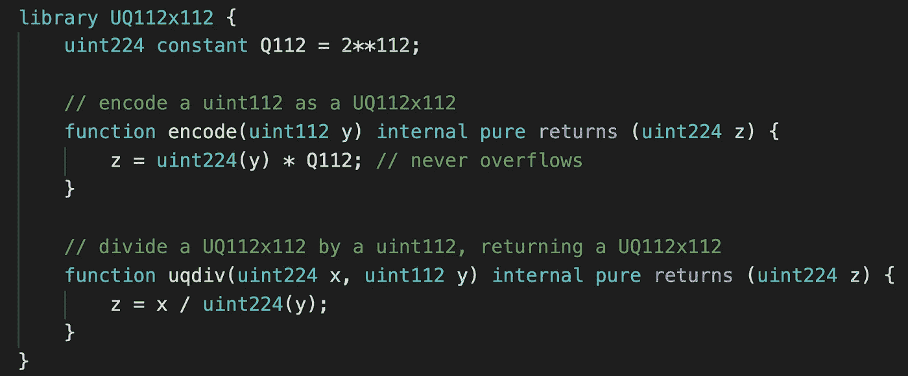

UQ112x112 library

该库将 Q112 设置为 2。有两个功能，`encode`和`uqdiv`(解码)。

`encode`获取参数 y 并用 Q112 乘以它，而`uqdiv`将 UQ112x112 除以 uint112 并返回 UQ112x112。

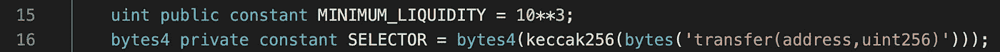

*   `MINIMUM_LIQUIDITY`是将流动性(rootK)保持在 1000 以上，以避免在流动性计算中被零除。这个我们以后再说。
*   选择器允许我们通过 ABI 来调用令牌。

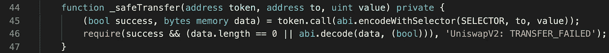

*   第 16 行是为第 45 行设置选择器

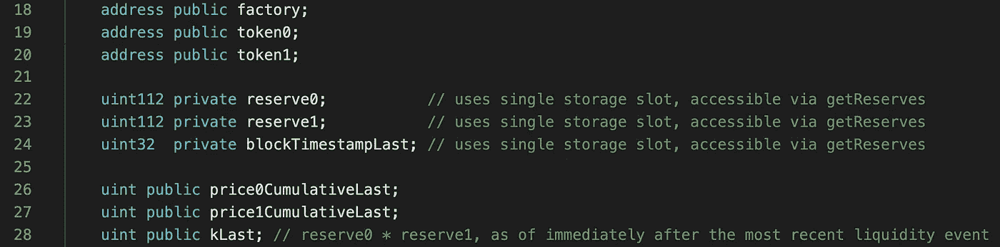

*   声明了一个叫工厂的地址，我们以后再谈
*   令牌 0 和令牌 1 是成对的令牌
*   保留 0 和保留 1 是令牌 0 和令牌 1 的保留
*   blockTimestampLast 将存储该对交互时的最后一个块时间戳
*   price0CumulativeLast 和 price1CumulativeLast 是令牌 0 和令牌 1 的最后价格
*   kLast = reserve0 x reserve1 因为 K= XY (Uniswap 是一个恒定的产品做市商)

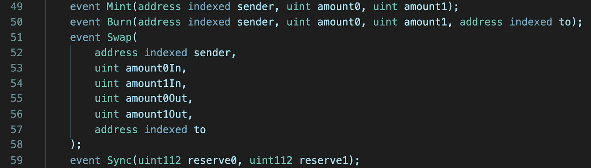

这些事件将在函数被调用时发出

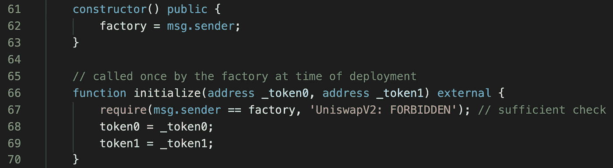

*   `constructor`将仅被调用一次，用于在部署智能合约的同时进行设置。在这里，我们将 factory 设置为 msg.sender，这意味着部署这个智能合约的地址。
*   `initialize`是将 token0 设置为 _token0，将 token1 设置为 _token1。该函数将由工厂在部署时调用一次。

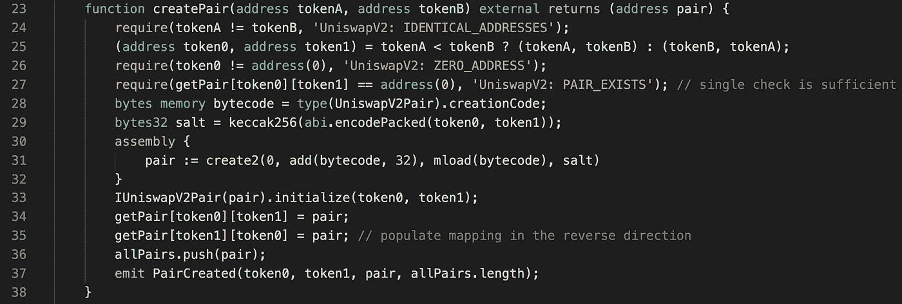

createPair

这是**工厂**的`createPair`合同。

*   第 33 行用两个参数 token0 和 token1 调用`initialize`。

现在这一对已经创建好了。稍后在 **Factory 中我们会更深入的讨论这个功能。**

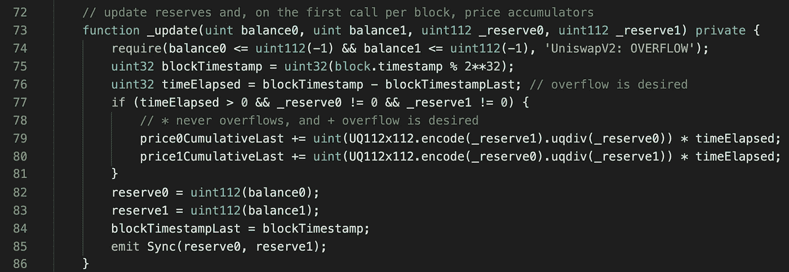

_update function

让我们一步一步地了解这个函数。

*   `require`检查 balance0 和 balance1 是否都小于 2 -1 的`uint112(-1)`。
*   将 blockTimeStamp 设为`uint32(block.timestamp % 2**32)`。

> 为什么是 block.timestamp % 2？
> 我们来看看第 79 行和第 80 行。因为我们跟踪的代码`UQ112x112`变成了 224 位，但是 solidity 用 256 位打包每个事务。为了优化使用，他们决定也存储 blockTimeStamp，它必须是 32 位(256–224)。这就是为什么我们有一个 mod 函数来获取 blockTimeStamp 的剩余部分。32 位的 blockTimeStamp 将在 2106/02/27 溢出。所以现在不用担心了。

*   第 76 行是告诉 blockTimeStamp 是否溢出(这将在 2106/02/27 发生)。
*   第 77 行到第 81 行是为价格 oracle 更新价格。
*   将 reserve0 设置为 balance0，将 reserve1 设置为 balance1
*   将 blockTimeStampLast 设置为当前块时间戳
*   发出同步事件

`update`只是一个更新储量和价格的函数。因此，每当储量、价格发生变化时，就会调用它。如`mint`、`burn`、`swap`、`sync`。

接下来，我们前往`mint`和`burn`。

***铸造*** 是指流动性提供者**将资金**添加到池中，从而铸造 LP 令牌。LP 令牌用于记录流动性提供者拥有的池的百分比。

***燃烧*** 发生在流动性提供者**提取资金**和累计费用(我们将在后面进行计算)时，他的池所有权令牌被燃烧。

> 请关注我的最新发布。
> 
> **随时联系。**
> 
> **邮箱:gregshen0925@pm.me**
> 
> 电报:@gregshen0925

# 铸造

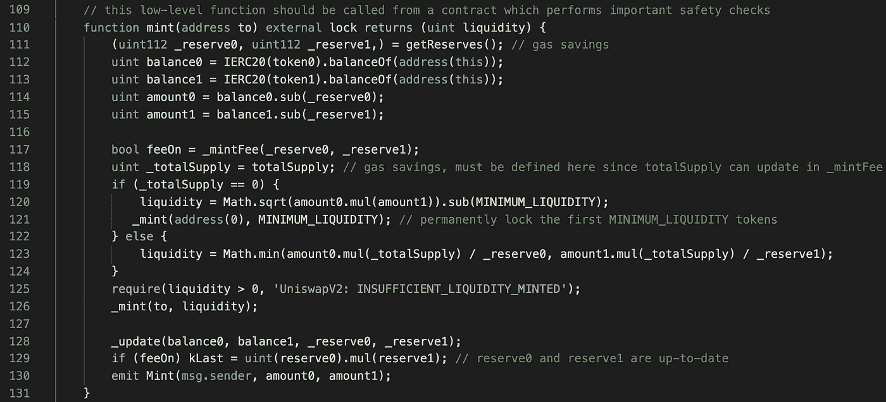

mint function

当一个人提供流动性时，就会发生这种情况:

*   110 线有一个`lock`。

这是一个修饰符，修饰符是当你要在许多函数中检查相同的东西，但你不想写同样的代码这么多次(部署契约时更昂贵)。你可以写一个修饰符并在不同的函数中使用它。

在这种情况下，lock 所做的是检查`unlocked`是否为 1，否则恢复。如果`unlocked`为 1，将其设置为 0。第 34 行意味着运行代码的剩余部分(第 111 行到第 131 行)。完成后，再次将`unlocked`设置为 1。

这是为了确保不会有两个交易同时改变流动性池。

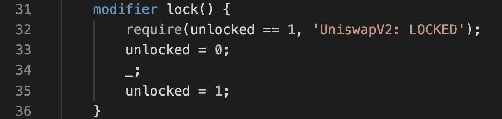

modifier lock()

回到`mint`:

*   第 111 行:获取 token0 和 token1 的**前期储量**。这意味着流动性池中有多少令牌 0 和令牌 1。
*   第 112、113 行:获得令牌 0 和令牌 1 的**当前储备**，因为流动性提供者刚刚提供了他的令牌。
*   第 114、115 行:通过计算当前准备金减去先前准备金，得到流动性提供者提供的金额。

# 费恩和明特费

如果 fee 打开，mint 流动性相当于 sqrt(k)增长的 1/6，其中 sqrt 代表平方根。即 1/6 的费用归**厂**(下图 90 线)。**工厂**是创建此**对**契约的契约。随着时间的推移，流动性池越来越大。

请注意，流动性是平方根 K，因为 K =X * Y，但如果我们将流动性翻倍至 2X 和 2Y，K 就变成 4XY。我们使用 sqrt(K)进行计算，以确保获得正确的流动性。

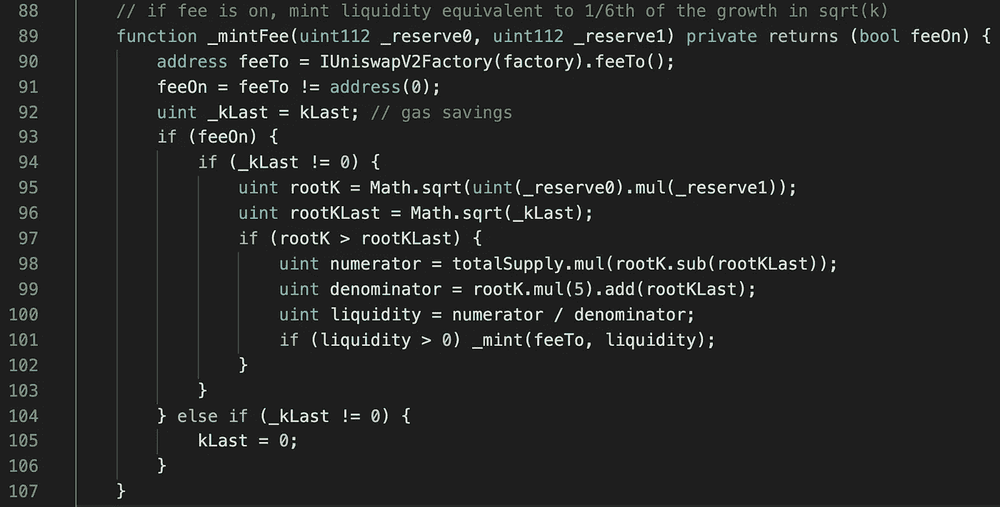

_mintFee

对于被这个函数搞糊涂的人。请检查下面的计算过程。我相信你会理解的。

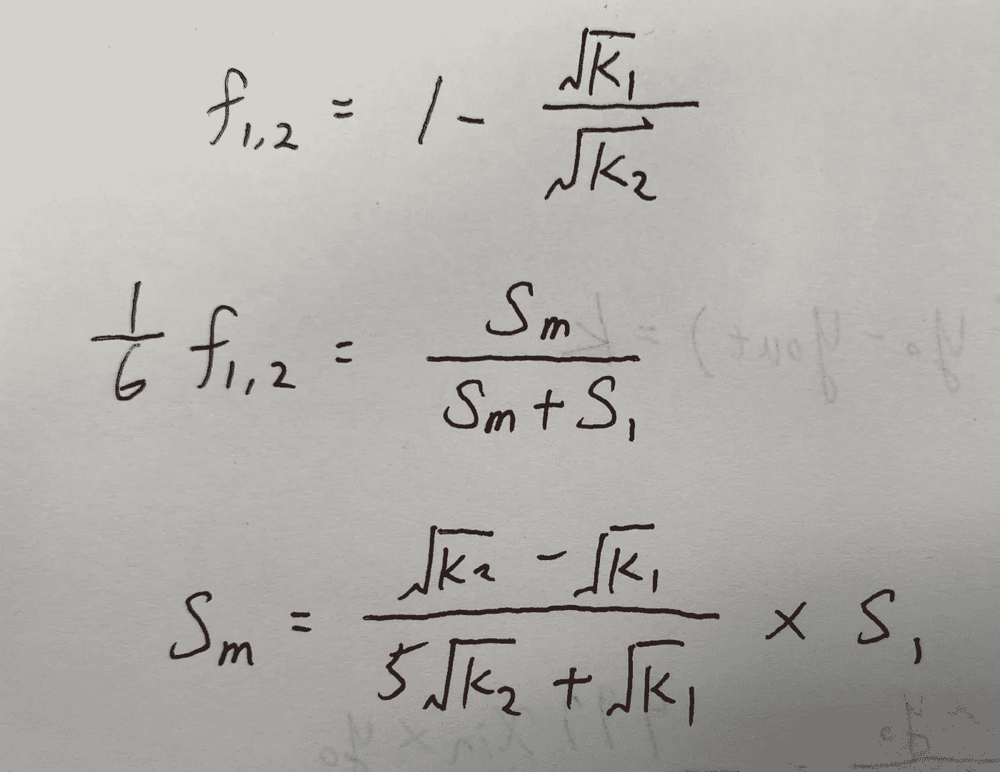

f for fee, k for constant, S for liquidity/supply

mint function

*   第 118 行:`totalSupply`表示池所有权令牌的总供应量，并且是在`UniswapV2ERC20`中存储的变量。结对契约一开始就扩展了`UniswapV2ERC20`，这也是它能够使用`totalSupply`的原因。

如果`totalSupply`为 0，这意味着这是一个新的池，我们需要锁定`MINIMIUM_LIQUIDITY`数量(1000)的 LP 令牌，以避免在流动性计算中被零除。锁定的方法是通过将它发送到**阻塞孔**(地址零)而没有人知道地址零的私钥，令牌被永远锁定。

*   第 123 行:`liquidity`是需要向流动性提供者铸造的新池 LP 令牌的数量。流动性提供者根据其提供的新资金量获得一定比例的资金池所有权令牌。
*   第 126 行:在如此多的动作之后，代币最终被铸造并被转移到流动性提供者。
*   第 128 行:记得更新余额和准备金。
*   第 130 行:发出 **Mint** 事件。

**很多人可能会对添加的基金感到困惑。**

它们只是通过为每个令牌调用`transfer(from: liquidity provider’s address, to: Pair contract’s address, amount)`来存放到 ERC20 契约中。然后，配对合同将读取余额(第 112 和 113 行)，并将它们与最后已知的余额(第 114 和 115 行)进行比较。这就是配对合同如何可以减少存款的数额。

下一个要分解的功能是`burn`，与`mint`正好相反。你猜怎么着你自己看吧，我想看的时候再看！

# 烧伤

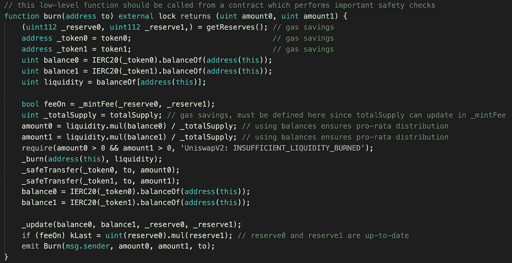

burn function

# 互换

与其他函数不同，swap 是通过用户的地址调用的。它是通过与流动性池相互作用，将一种代币转换为另一种代币。

> 交易新手？尝试[加密交易机器人](/coinmonks/crypto-trading-bot-c2ffce8acb2a)或[复制交易](/coinmonks/top-10-crypto-copy-trading-platforms-for-beginners-d0c37c7d698c)

# 交换费

在交换期间，用户将支付 0.3%的费用，这些费用留在池中，因此池越来越大。5/6 的费用奖励给流动性提供者。他们有 LP 令牌，记录他们拥有的池的比例。由于资金池越来越大(因为里面剩下的费用)，他们在提取资金(烧 LP 令牌)的同时，可以获得更多的资金。那些开发商真是太聪明了！

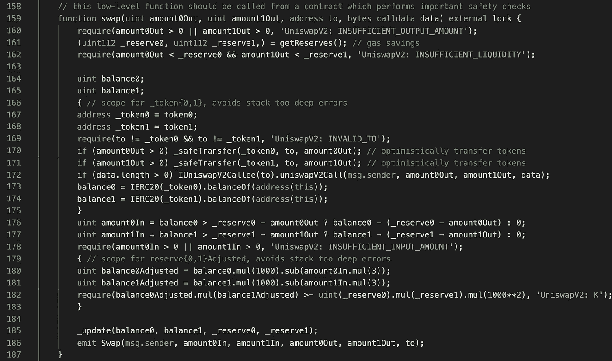

swap function

*   第 160~168 行:检查是否满足要求，并分配一些变量。
*   第 170、171 行:合约乐观地将代币转移给交易者(没有确保交易者已经将相同数量的代币转移到合约的余额中)。它可以乐观地将令牌转移出去，因为函数中稍后会有断言来检查是否收到了相应的令牌(外围协定应该在调用交换之前发送令牌)。
*   第 172 行:如果请求，通知接收者关于交换的信息。
*   第 176，177 行:条件操作，检查收到的令牌契约的数量。
*   第 178 行:检查合同是否至少收到了一个令牌。
*   第 180，181 行:从余额中减去交易费(0.3%)
*   第 182 行:检查交易后 K 是否下降。互换后流动性永远不会降低。
*   第 185、186 行:更新余额和储备，然后发出**交换**事件。

现在我们已经从核心覆盖了**对**合同。还有三份合同。感谢您的宝贵时间！

**请关注我的最新发布。**

**随时联系**

**电子邮件:gregshen0925@gmail.com**