# Uniswap 智能合同细分

> 原文：<https://medium.com/coinmonks/uniswap-smart-contract-breakdown-1f4b787b7f0e?source=collection_archive---------0----------------------->

## 通过对代码行进行分组来解释其功能

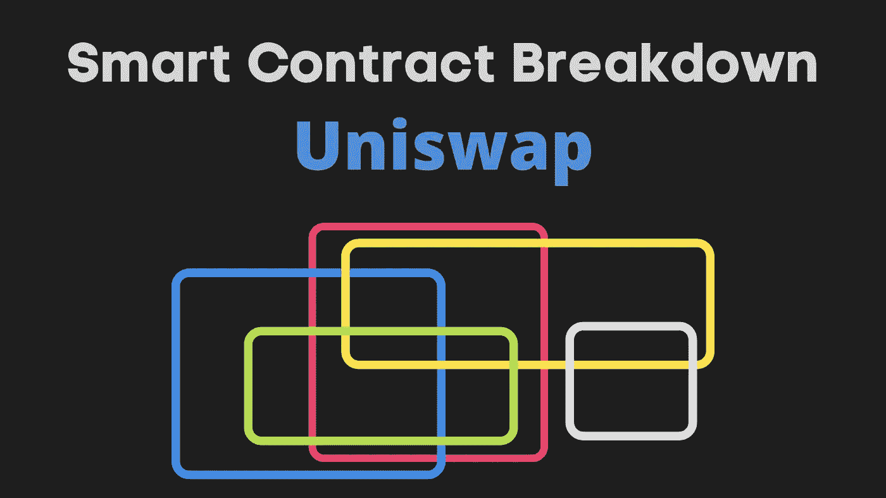

您可能知道 Uniswap 的常数乘积公式(x*y=k)。但是 Uniswap 智能合同是如何在幕后真正发挥作用的呢？

在本文中，我们将通过分解其智能合约来了解 Uniswap 是如何实现的。我们将检查数百行每天产生 12.8 亿美元收入的可靠性代码。

剧透提示:你将会看到一个非常高效、优雅、安全的 Solidity 代码。

下面是这篇文章的提纲:

*   Uniswap 如何在高层次上工作
*   Uniswap 代码的组织方式
*   Uniswap 功能
*   核心合同:配对(硬)
*   核心合同:工厂(简单)
*   外围合同:路由器(易)
*   完全注释的代码

# Uniswap 如何在高层次上工作

Uniswap 的全部目的是允许您将一个 ERC20 令牌换成另一个。例如，你需要 Dogecoin，但你只有柴犬硬币。Uniswap 允许你卖掉你的狗币，并得到柴犬作为回报。这都是以自动和分散的方式完成的。 **Uniswap 只是一个去中心化的交换。**

交换可以通过两种方式实现。

1.  **订单簿模式:**买家和卖家提交订单。并且中央系统将买入订单与卖出订单进行匹配。这就是传统证券交易所的运作方式。
2.  **自动做市商(AMM):** 没有集中的媒人。有人同时提供这两种代币(Dogecoin 和柴犬)。他们被称为流动性提供者。这些流动性提供者创造了一个 Dogecoin 和柴犬代币池。现在，商人可以来存放金币，并得到柴犬作为回报。这是自动完成的，没有集中的实体。交易者为交易支付一小部分费用，这些费用由流动性提供者提供服务。

Uniswap 使用 AMM 技术。它是如何决定一个池子里的汇率的？也就是说，1 个金币值多少柴犬代币？这是由常数乘积公式`(Dogecoin amount)*(Shiba amount)=k`决定的。在交易期间，这个产品必须保持不变。

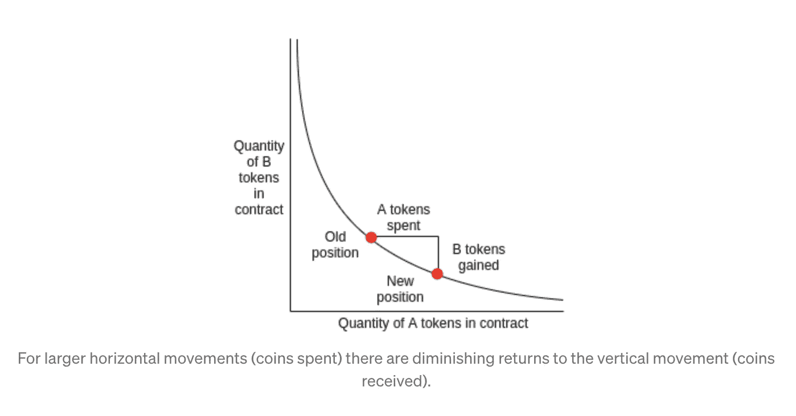

来自" [Uniswap —一个独特的交易所](/scalar-capital/uniswap-a-unique-exchange-f4ef44f807bf)"

如果这个不完全清楚，也不用担心。在本文的其余部分，我们将学习更多关于这个公式和市场动态的知识。

# 关于 Uniswap 版本的说明

Uniswap 有 3 个版本。

*   我们将使用 v2。
*   v1 太简单，不具备所有现代特征。
*   v3 本质上是 v2，但经过了改进和优化——它的代码比 v2 复杂得多。

# Uniswap 代码的组织方式

Uniswap 总共有 4 份智能合同。分为**核心**和**外围**。

1.  **核心**用于存储资金(代币)和暴露用于交换代币、添加资金、获得奖励等的功能。
2.  **外围**用于与**核心**交互。

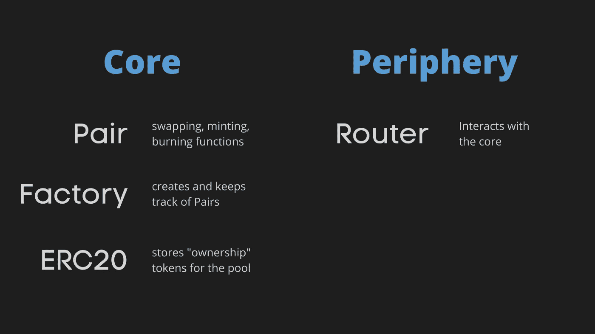

**核心**由以下智能合约组成:

1.  **Pair** —一个智能合约，实现交换、铸造、刻录令牌的功能。这个合约是为每一个像 *Dogecoin ↔十八*这样的交易所对创建的。
2.  **工厂** —创建并跟踪所有配对合同
3.  **ERC20** —用于跟踪池的所有权。把游泳池想象成一种财产。当流动性提供者向资金池提供资金时，他们会得到“资金池所有权代币”作为回报。这些所有权代币获得奖励(交易者为每笔交易支付一小部分)。当流动性提供者想要回他们的资金时，他们只需提交所有权令牌，然后获得他们的资金+累积的奖励。ERC20 契约跟踪所有权令牌。

**外围**只包含一个智能合约:

1.  **路由器**用于与核心交互。提供`swapExactETHForTokens`、`swapETHForExactTokens`等功能。

# Uniswap 功能

我们讨论了 Uniswap 的 4 个智能合同以及它们是如何组织的。但是这些契约实现的主要功能是什么？主要功能如下:

1.  **管理资金**(如何在池中管理 Dogecoin 和柴犬等代币)
2.  **流动性提供者的功能—** 存入更多资金，并随奖励一起提取资金
3.  **交易者**的功能——交换
4.  **管理池所有权令牌**
5.  **协议费用** — Uniswap v2 引入了可切换的协议费用。这一礼宾费是付给 Uniswap 小组的，感谢他们维护 Uniswap 的努力。目前，此协议费用已关闭，但将来可以打开。当交易开始时，交易者仍将支付相同的交易费用，但这笔费用的 1/6 将归 Uniswap 团队所有，其余的 5/6 将归流动性提供者所有，作为他们提供资金的报酬。

除了上面描述的主要功能，Uniswap 还有一个不是 Uniswap 的核心功能，但它是以太坊生态系统中其他合同的有用助手:

1.  **价格预测** — Uniswap 跟踪代币相对于彼此的价格，并可用作以太坊生态系统中其他智能合约的价格预测。由于套利(我们将在本文后面了解)，Uniswap 的价格往往会紧跟代币的实际市场价格。所以 Uniswap 价格 oracle 是真实市场价格的一个非常好的近似值。

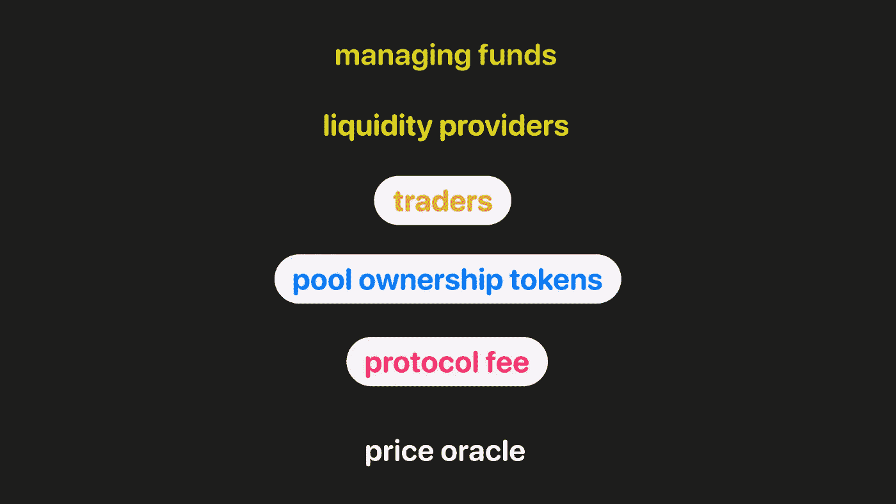

# 核心合同:配对(硬)

现在让我们深入研究 Uniswap 智能合约的实际可靠性代码。我们将从结对合同开始。这是 4 个智能合同中最复杂的一个。剩下的会变得更容易。

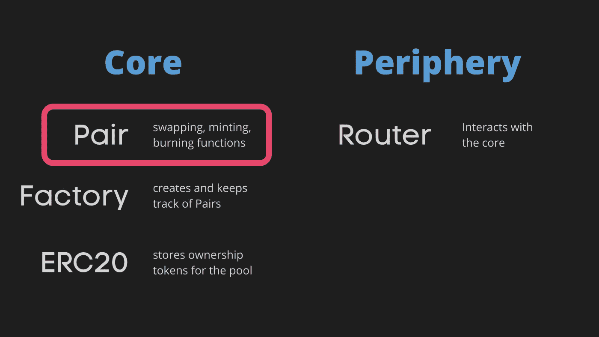

Pair 契约实现了一对令牌(如 Dogecoin 和柴犬)之间的交换。Pair 智能合约的完整代码可以在 Github 上的[v2-core/contracts/uniswapv 2 Pair . sol](https://github.com/Uniswap/v2-core/blob/master/contracts/UniswapV2Pair.sol)下找到

**让我们逐行分解一下。**

一、导入报表:

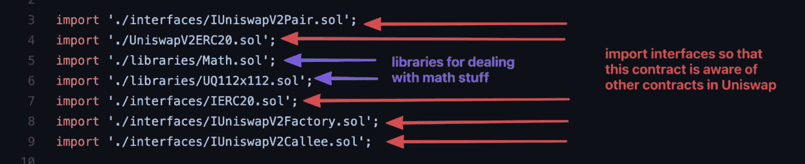

接下来，合同声明:

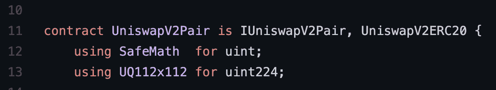

*   合同名称为`UniswapV2Pair`
*   它实现了`IUniswapV2Pair`接口，这只是这个契约的一个接口(这里可以找到)。它也延长了`UniswapV2ERC20`合同。为什么？用于管理池所有权令牌。稍后我们将了解更多相关信息。
*   `SafeMath`是一个处理上溢/下溢的库。`UQ112x112`是一个支持浮点数的库。Solidity 默认不支持浮动。这个库使用 224 位来表示浮点数。前 112 位是整数，后 112 位是小数。

接下来，我们将根据代码实现的功能对其进行分组。

# 管理资金

Uniswap 对是一对令牌(如 Dogecoin 和柴犬)之间的交换。这些令牌在契约中表示为`token0`和`token1`。它们是实现它们的 ERC20 智能合约的地址。

变量存储我们在这个对中有多少令牌。

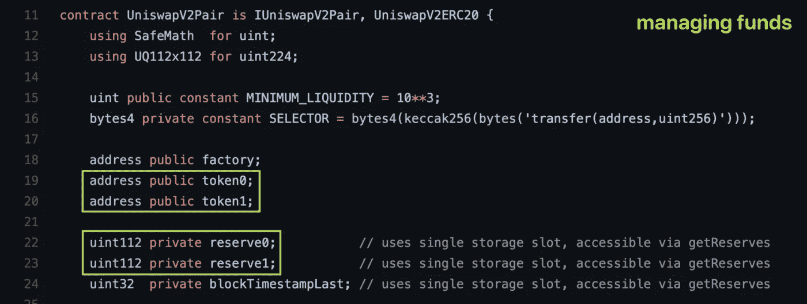

您可能想知道，实际的令牌存储在哪里？这是在令牌本身的 ERC20 契约中完成的。在结对合同中没有这样做。配对合约只是记录储备。从 ERC20 的角度来看，配对合同只是一个可以转移和接收令牌的普通用户，它有自己的余额，等等。

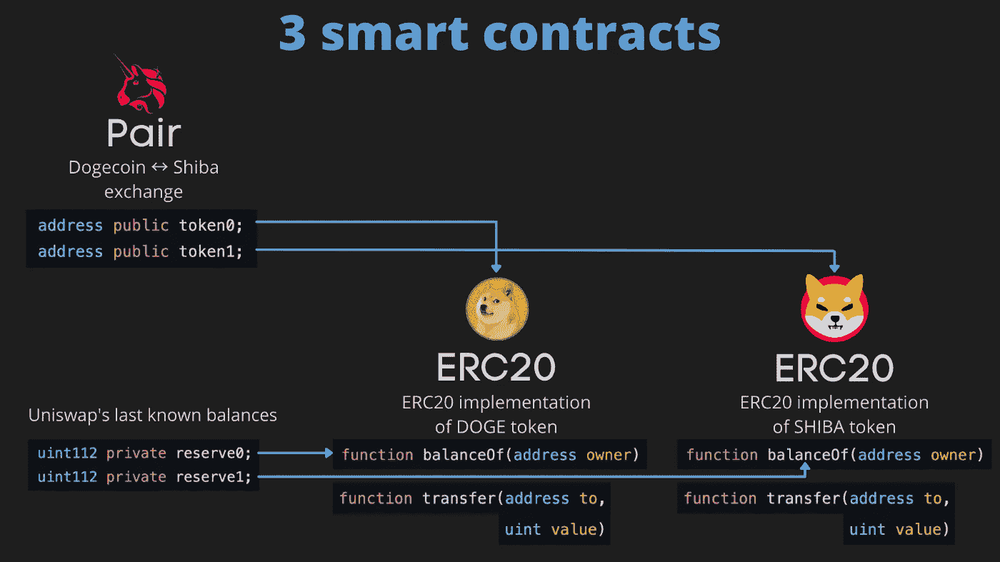

这就是 3 个智能合同的资金管理方式

Pair contract 调用 ERC20 的函数如`balanceOf`(用`owner=Pair contract’s address`)和`transfer`来管理令牌(如果你感到困惑，请参见我的 [ERC20 智能合约分解](https://ilamanov.medium.com/erc20-smart-contract-breakdown-9dab65cec671))。这里有一个例子，说明 ERC20 的`transfer`函数是如何在 Pair contract 中使用的。

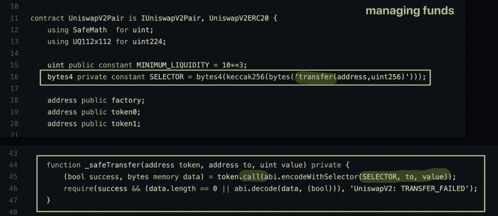

`_update`每当流动性提供者存入或提取新资金，或者交易者交换代币时，就会调用下面的函数。


这个函数中发生了一些事情:

*   `balance0`和`balance1`是 ERC20 中的代币余额。它们是 ERC20 的`balanceOf`函数的返回值。
*   `_reserve0`和`_reserve1`是 Uniswap 之前已知的余额(上次检查`balanceOf`)。
*   我们在这个函数中所做的就是检查溢出(第 74 行)，更新价格 oracle(这将在后面的部分中解释)，更新储备，以及更新一个`Sync`事件。

参数`_reserve0, _reserve1`和存储变量`reserve0, reserve1`有什么区别(如下所示)？它们本质上是一样的。`_update`函数的调用者已经从存储器中读取了`reserve`变量，并将它们作为参数传递给`_update`函数。这只是节省汽油的一种方法。从存储中读取比从内存中读取更昂贵

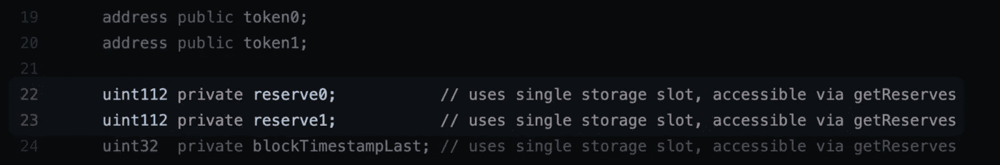

> *你会一再注意到这一点:* ***Uniswap 绝对热爱效率和省油。*** *他们从扎实中挤出每一个他们能挤出的单个表现点。* `*_reserve0*` *和* `*_reserve1*` *就是其中的一个例子。*

# 铸造和燃烧

现在来看下一个功能——铸造和烧制。铸造是指流动性提供者向资金池中添加资金，并因此为流动性提供者铸造(凭空创造)新的资金池所有权令牌。燃烧是相反的——流动性提供者提取资金(和累积的回报),他的池所有权令牌被燃烧(销毁)。

我们来看看`mint`函数。

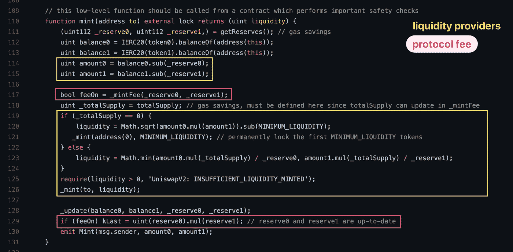

*   您可能会立即再次注意到节省的气体:`reserve0`、`reserve1`和`totalSupply`从存储器转移到内存(第 111 行和第 118 行)，这样读取这些值就更便宜了。
*   我们读取第 112 行和第 113 行的合约(配对合约)余额，然后计算每个代币的存款金额。
*   代码的粉色部分是任择议定书费用。我们稍后将对此进行研究。
*   `totalSupply`表示池所有权令牌的总供应量，并且是`UniswapV2ERC20`合同中的存储变量(参见我在此处对其的分解[)。Pair contract 扩展了`UniswapV2ERC20`,这就是它能够访问`totalSupply`变量的原因。](https://ilamanov.medium.com/erc20-smart-contract-breakdown-9dab65cec671)
*   如果`totalSupply`为 0，这意味着这个池是全新的，我们需要锁定`MINIMIUM_LIQUIDITY`池所有权令牌的数量，以避免在流动性计算中被零除。锁定它的方法是将它发送到地址零。(没有人知道通向地址零的私钥，因此通过向地址零发送资金，您实际上永远锁定了资金)。
*   `**liquidity**` **变量是需要向流动性提供者创造的新池所有权令牌的数量**。流动性提供者根据他提供的新资金的数量获得一定比例的池所有权令牌(第 123 行)
*   我们最后将新的池所有权令牌添加到`to`地址(第 126 行)。`to`是流动性提供者的地址(这将由调用`mint`函数的称为路由器的外围契约提供)

**添加资金的工作方式是:**它们只是存放到 ERC20 合约中(通过为每个令牌调用`transfer(from: liquidity provider’s address, to: Pair contract’s address, amount)`)。然后，配对合同将读取余额(第 112 和 113 行)，并将它们与最后已知的余额(第 114 和 115 行)进行比较。这就是配对合同如何可以减少存款的数额。

`burn`功能是`mint`功能的镜像:


*   我们再次在 135、136、137 和 143 行看到了气体节省
*   `balance0`和`balance1`是该池中代币的总余额。`liquidity`是流动性提供者(希望套现)拥有的池所有权令牌数量。为什么把流动资金作为`address(this)`的余额？因为流动性是在调用`burn`函数之前由外围契约转移到配对契约的。
*   我们根据流动性提供者拥有的流动性(池所有权令牌)的多少，按比例计算提取给流动性提供者的令牌数量(第 144 和 145 行)
*   然后我们烧掉他的流动资金，把代币转给他。
*   对流动性提供者的奖励会随着他的资金自动提取。这种数学方法可以确保奖励合理累积，并且你得到的比你存入的多。

这就是第 1 部分！我把这篇文章分成两部分，因为它太长了。我希望这有所帮助。如果你有任何问题，请在评论中告诉我。

**在第 2 部分**中，我们将介绍:

*   该对合同的其余部分:交换、池所有权令牌、协议费和价格甲骨文。
*   还有 Uniswap 的工厂、ERC20 和路由器合同

你也可以在我的媒体简介上查看我的其他文章。

```
**Want to Connect?** Follow me on [Twitter](https://twitter.com/LakshayMaini_).
```

> *加入 Coinmonks* [*电报频道*](https://t.me/coincodecap) *和* [*Youtube 频道*](https://www.youtube.com/c/coinmonks/videos) *了解加密交易和投资*

# 另外，阅读

*   [交易信号是什么？](https://coincodecap.com/trading-signal) | [Bitstamp vs 比特币基地](https://coincodecap.com/bitstamp-coinbase) | [买索拉纳](https://coincodecap.com/buy-solana)
*   [ProfitFarmers 回顾](https://coincodecap.com/profitfarmers-review) | [如何使用 Cornix Trading Bot](https://coincodecap.com/cornix-trading-bot)
*   [十大最佳加密货币博客](https://coincodecap.com/best-cryptocurrency-blogs) | [YouHodler 评论](https://coincodecap.com/youhodler-review)
*   [MyConstant Review](https://coincodecap.com/myconstant-review) | [8 款最佳摇摆交易机器人](https://coincodecap.com/best-swing-trading-bots)
*   [MXC 交易所评论](/coinmonks/mxc-exchange-review-3af0ec1cba8c) | [Pionex vs 币安](https://coincodecap.com/pionex-vs-binance) | [Pionex 套利机器人](https://coincodecap.com/pionex-arbitrage-bot)
*   [我的加密副本交易经历](/coinmonks/my-experience-with-crypto-copy-trading-d6feb2ce3ac5) | [比特币基地评论](/coinmonks/coinbase-review-6ef4e0f56064)
*   [CoinFLEX 评论](https://coincodecap.com/coinflex-review) | [AEX 交易所评论](https://coincodecap.com/aex-exchange-review) | [UPbit 评论](https://coincodecap.com/upbit-review)