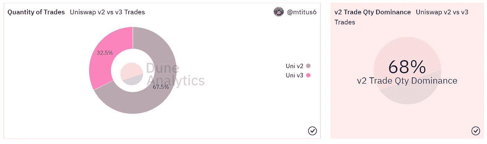
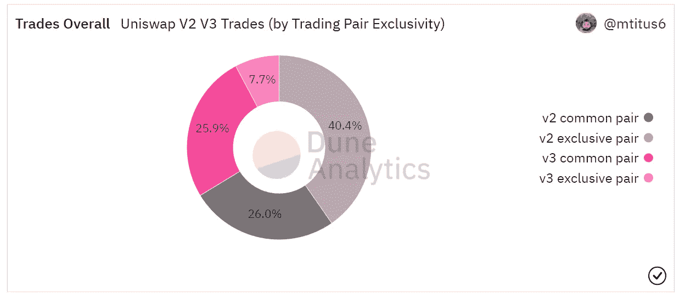
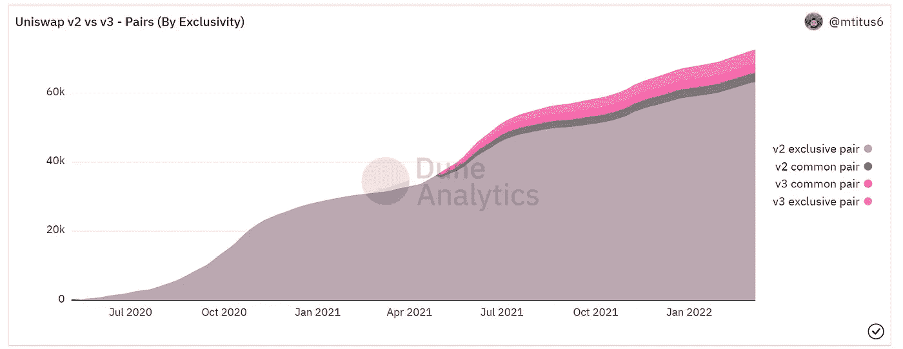
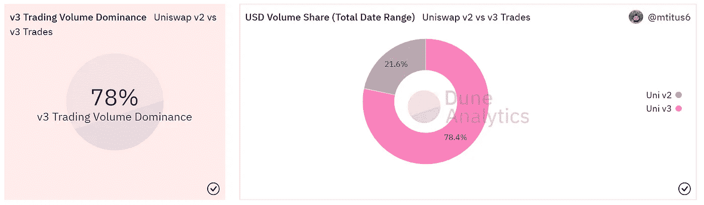
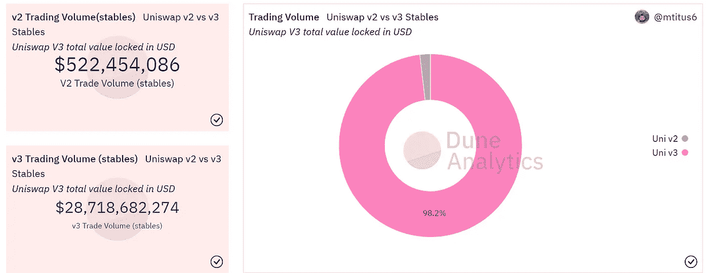
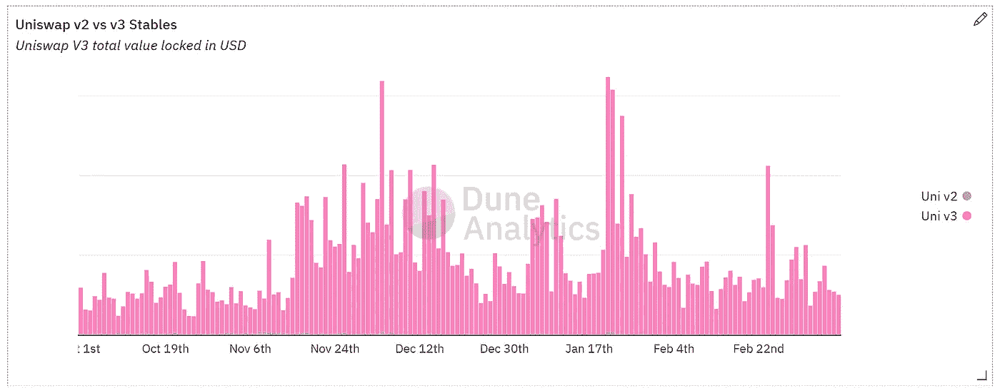

# Uniswap V2 vs V3:按数字

> 原文：<https://medium.com/coinmonks/uniswap-v2-vs-v3-by-the-numbers-10b37124b087?source=collection_archive---------3----------------------->

2020 年 5 月 5 日 Uniswap V2 的发布启动了以太坊上分散金融的发展。它的主要功能是让用户能够在任何 ERC20 令牌之间创建交易池，包括当时在任何其他交易所都无法获得的长尾资产。这一发行取得了巨大成功，并为 Uniswap 在可预见的未来成为分散式交换空间的主要领导者奠定了基础。

Uniswap V2 launch on May 5th, 2020

备受期待的 Uniswap V3 发布会于 2021 年 5 月 5 日举行。关键的突破是**集中流动性**，它允许流动性提供者控制其资产交易的范围。与 V2 资金池相比，这些严格限定的区间为**提供了更好的资本效率**。

V3 中另一个极具前瞻性的特性是引入了**不同交易对的不同费用等级** ( 0.05%、0.30%和 1.00%)。

Uniswap V3 launch on May 5th, 2021

通常，现有协议的更新版本会导致从先前版本的迁移，但对于 Uniswap **来说，情况并非如此**。

我分析了从 2021 年第四季度开始的数据**，在 V3 发布后近五个月。**

V2 在总体交易数量上占据主导地位，占总交易量的 68%。

Quantity of trades dominated by V2

V2 在交易量上的主导地位可以追溯到它最初为长尾资产提供平台的改变游戏规则的特性。**仅在 V2(不在 V3)上存在的交易对占总交易量的 40.4%** ，而两个版本之间的普通对交易量几乎相同。

V2 dominance due to exclusive trading pairs

这一趋势似乎不会停止。独家交易对继续在 V2 出现，超过 62000 种不同的交易对组合。

V2 has significantly more trading pools, mostly exclusive to V2

虽然 V2 在交易量上占据主导地位，但是 **V3 在总体交易量(美元)**上占据主导地位，自 2021 年第四季度以来占总交易量的 78%。

Trade USD Volume dominated by V3

这种交易量优势主要体现在**稳定的硬币(即 USDC/USDT)交易空间。**

从稳定的硬币对来看，V3 占总体交易量的 98%和交易量的 77%。

V3 has significantly more trading volume (USD) across stable coin pairs.

V3 在稳定硬币领域的成功很大程度上是由于**在 2021 年 11 月**引入了 0.01%的费用等级，这削弱了稳定硬币领域的主要参与者，如 Curve Finance。这在查看每日稳定的硬币交易量时得到了很好的反映，2021 年 11 月后，单日交易量飙升至 6 亿美元以上。

Stable coin trading volume increased significantly after the the release of the 0.1% fee tier

从数据中可以清楚地看出，Uniswap 的 V2 和 V3 都开发了适合市场的产品，但是是在不同的用例中。

V2 仍然是寻求交易新奇特硬币的用户的主要玩家，而 V3 已经成为稳定的硬币交易市场中不可忽视的力量。

*包含所有可视化和查询的仪表板可以在* [*这里*](https://dune.xyz/mtitus6/Uniswap-V2V3-Comparison) *找到。*

***感谢 Dune Analytics 让分析成为可能。***