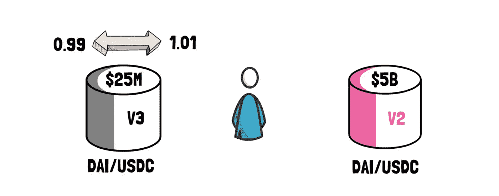
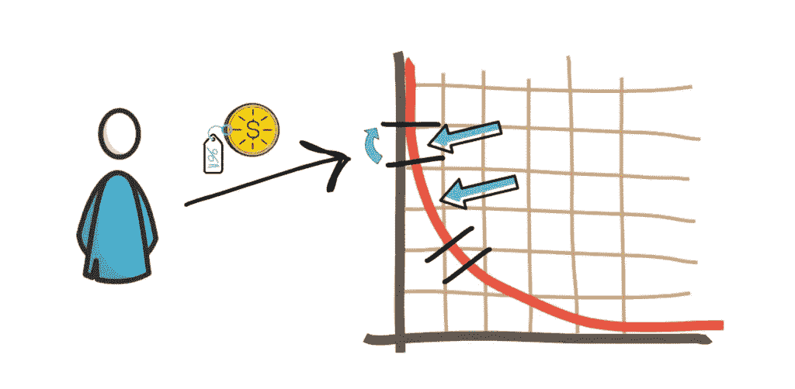

# Uniswap V3 解释

> 原文：<https://medium.com/coinmonks/uniswap-v3-explained-57e0cdf86719?source=collection_archive---------0----------------------->

## 关于 Uniswap V3，您需要了解的所有信息

Uniswap V3

Uniswap，世界上最受欢迎的[**dex**，](https://blog.cryptostars.is/what-are-decentralized-exchanges-how-do-dexs-work-4e54fd477e0e)之一，是超越中央集权机构竞赛中的领先者。在获得所有 DeFi 项目中最高 tvl 之一后，Uniswap 团队推出了这一著名 DEX 的新版本——unis WAP v3。在这篇文章中，我将解释你们都需要知道的 **Uniswap V3** ！

让我们从 Uniswap 开始…

# 什么是 Uniswap？

Uniswap 是以太坊上用于交换 **ERC20** 令牌的协议。与大多数旨在收取费用的交易所不同，Uniswap 旨在作为一种公共产品发挥作用，即社区在没有平台费或中间人的情况下进行代币交易的工具。此外，与大多数匹配买家和卖家以确定价格和执行交易的交易所不同，Uniswap 使用一个简单的数学方程以及令牌和 ETH 池来做同样的工作。

# Uniswap v1 与 v2

在我们看一看 **Uniswap v3** 之前，我们必须提醒自己它的进化之路以及 **v1** 和 **v2** 的区别。这将有助于我们理解为什么 Uniswap 成为 DeFi 领域的领导者是理所当然的事情。

Uniswap V1 & V2

# Uniswap v1

Uniswap v1 于 2018 年 11 月 2 日首次在以太坊 mainnet 上线。尽管它不是第一个 DEX，但它肯定是第一个吸引密码爱好者眼球的。

Uniswap 基于**自动做市商(AMM)** 模式。这个模型依靠一个数学公式来给资产定价。资产管理公司不下订单，而是依靠**流动性提供者****【LPs】**，他们投资流动性池中的交易对。

Uniswap 是一家**恒定功能做市商**，或者更具体地说，是一家恒定产品做市商。这意味着每个流动性池中交易对的比率必须遵循常数乘积公式:

*x*y=k*

其中 ***k*** 为常数， ***x*** 为第一项资产的储备， ***y*** 为第二项资产的储备。

这意味着所有的**LP**都要以不改变 ***k*** 的方式提供额外的流动性。此外，每个交易者都必须知道锁定的资金总量，以避免高滑点。

Uniswap v1 只支持 **ETH-ERC20** 交易对，所以你只能用 **ETH** 换一个 **ERC20 令牌**。所以，如果你想把换成戴，你必须把换成 ETH，然后去 ETH-DAI 池得到戴。

Uniswap V1: DAI to USDC Swap

Uniswap v1 引入的另一个特性是 **LP 令牌**。每个流动性提供者将获得与他们增加的总流动性的百分比成比例的 LP 令牌的数量。这些 LP 代币代表 LP 对池的贡献，并且可以被出售/交易或燃烧以赎回存放的代币。此外，Uniswap 上的每笔交易都会产生 0.30%的交易费。这些费用作为对提供流动性的有限合伙人的奖励被自动发送到流动性准备金。

# Uniswap v2

Uniswap v1 是一种新型分散市场的概念验证。它的初步成功是团队立即重申更好的解决方案的信号。Uniswap v2 于 2020 年 5 月推出。

简而言之，Uniswap v2 是 Uniswap v1 的一个更好、更方便用户的版本。这个新版本中解决的 v1 的主要问题是缺少 ERC20-ERC20 令牌池。对于想要将一个 ERC20 令牌换成另一个的用户来说，这导致了更高的成本和延误。

## ERC20-ERC20 池

Uniswap v2 引入了 ERC20-ERC20 流动性池来解决这个所谓的“ **ETH 桥接**”问题。他们甚至在核心合同中使用包装 ETH 而不是本地 ETH。然而，最终用户仍然可以通过帮助者合同使用 ETH。

Uniswap V2: DAI to USDC Swap with Router

## 神谕

Uniswap 的第二个版本还实现了一个新的功能，能够实现高度分散和抗操纵的链上价格馈送。

## 闪存互换

v2 推出的另一个突破性特性是[闪存交换](https://uniswap.org/docs/v2/core-concepts/flash-swaps/)。这些 Flash Swaps 允许用户从 Uniswap 上的任何 **ERC20** 令牌中提取他们想要的金额，而无需任何前期成本，并且可以对其做任何他们想做的事情(执行任意代码)，前提是在交易执行结束时。

即使在 v2 推出后 Uniswap v1 依然存在，但没过多久，LPs 就将大部分流动性从一个版本转移到了另一个版本。Uniswap v2 取得了巨大的成功，日交易量甚至超过了一些最著名的中央交易所。这一成功使 Uniswap v2 成为最分叉的项目之一——sushi swap 是其最大的竞争对手，被创建为分叉。

# 什么是 Uniswap V3？

Uniswap v3 是即将推出的新的和改进的 **DEX** ，将在以太坊区块链上运行，由与 v2 相同的**自动做市商(AMM)** 模型驱动，但装载了旨在最大化交易商和流动性提供商的回报、最小化价格滑动和管理下行风险的新开发。

# Uniswap 为什么要推出另一个版本？

Uniswap 一直是其自身成功的受害者，受到严厉批评，称其受欢迎程度正在减缓以太坊网络的速度，并导致交易汽油费飙升。此外，Uniswap 的代码被竞争对手如 Sushiswap 和币安智能链反复利用和复制。

Uniswap v3 提高了其 **AMM** 型号的效率，这是在比较 **DEXs** 时要观察的最重要的特征之一。

通过引入**集中流动性**概念，流动性提供者有能力在确定的价格范围内供应其资产，并为此存放流动性。此外，他们根据自己在任何特定资金池中承担的风险程度，给予不同等级的奖励。这可以激励更多的流动性提供者参与进来，因为回报可能有助于抵消他们在更广泛的价格范围内提供流动性的一些潜在损失。

这些功能的结合提高了支持 Uniswap v3 指数的 AMM 模型的效率，这将使交易者受益于更多的流动性。此外，流动性提供者也可能以高达 4000 倍的效率获得更高的资本回报。

# Uniswap V3 有什么新功能？

Uniswap v3 于**2021 年 5 月 5 日**在以太坊主网上发布。Uniswap V3 中引入了一些主要的功能更新:

1.  更多权力下放
2.  集中流动性
3.  更好的安全性
4.  新费用等级
5.  Oracle feed 开发
6.  范围订单
7.  不可替代的流动性
8.  许可证

这些功能将共同为平台的交易者实现更好的资本效率，并为流动性提供者实现更好的风险管理。

# Uniswap v3 功能

现在，让我们逐一查看 Uniswap V3 的一些功能，以便更好地理解它们。

## 集中流动性

集中的流动性是 V3 背后的主要概念。

当有限合伙人向 V2 池提供流动性时，流动性沿着价格曲线均匀分布。虽然这允许处理 0 和 **∞** 之间的所有价格范围，但这使得资本的效率相当低。这是因为大多数资产通常在一定的价格范围内交易。这在资产稳定、交易范围非常窄的资产池中尤其明显。例如，Uniswap 戴/USDC 资金池仅使用大约 0.5% 的资金在**【0.99】美元**和**美元【1.01】美元之间进行交易——绝大多数交易量都在这个价格区间内完成。这也是有限合伙人交易费用的主要来源。**

****

**Liquidity price curve**

**这意味着在这个特殊的例子中，剩余资本的 **99.5%** 几乎从未使用过。**

**在 V3 中，有限合伙人在提供流动性时可以选择一个定制的价格范围。这使得资本集中在大多数交易活动发生的范围内。**

****

**Liquidity price curve**

**为了实现这一点，V3 为每个流动性提供者创建了个性化的价格曲线。**

**在 V3 之前，允许 LP 拥有单独曲线的唯一方法是为每条曲线创建一个单独的池。如果交易必须在多个池之间进行，这些池如果不聚集在一起会导致高的天然气成本。**

**重要的是，用户根据在某一价位可获得的组合流动性进行交易。这种组合流动性来自于在这个特定价格点重叠的所有价格曲线。**

**有限合伙人赚取的交易费用与他们在一定范围内的流动性贡献成正比。**

## **资本效率**

**集中流动性为流动性提供者提供了更好的资本效率。**

****

**Liquidity Capital efficiency graph**

**为了更好地理解它，让我们快速看一个例子。**

****

**Uniswap liquidity capital efficiency example**

**Alice 和 Bob 都决定在 Uniswap V3 上的 ETH/DAI 池中提供流动性。他们每人有 10，000 美元，ETH 的当前价格是**1，750 美元**。**

**Alice 将其全部资本在 ETH 和 DAI 之间分割，并在整个价格范围内进行配置(类似于 V2)。她存了 5000 戴伊和 2.85 埃特。**

**Bob 没有使用他的全部资本，而是决定集中他的流动性，并在 1500 到 2500 的价格范围内提供资本。他存了 600 DAI 和 0.37 ETH——总共 1200 美元，剩下的 8800 美元留着作他用。**

**有意思的是，只要 ETH/DAI 价格保持在 1500 到 2500 区间，两者赚取的交易费用是一样的。这意味着 Bob 只能提供 Alice 资本的 12%,但仍能获得相同的回报——这使得他的资本比 Alice 的资本效率高 8.34 倍。**

**最重要的是，Bob 将更少的总资本置于风险之中。在 ETH 跌至 0 美元的可能性极小的情况下，Bob 和 Alice 的全部流动性将转入 ETH。虽然他们都将失去他们的全部资本，但 Bob 的风险要小得多。**

**更稳定池中的有限合伙人最有可能在特别窄的范围内提供流动性。如果 Uniswap v2 DAI/USDC 池中目前持有的 2500 万美元集中在 v3 的 0.99-1.01 价格区间，那么只要价格保持在该区间内，它将提供与 Uniswap v2 中 50 亿美元相同的深度。**

****

**Capital efficiency example**

**当 V3 推出时，与 V2 相比，最大资本效率为**4000 倍**。当在单一的 0.1%价格范围内提供流动性时，这是可以实现的。最重要的是，V3 pool 工厂将能够支持精确到 **0.02%** 的范围——这相当于相对于 V2 的最大 **20，000 倍**的资本效率。**

## **活跃流动性**

**V3 还引入了**主动流动性**的概念。如果特定流动性池中的资产交易价格超出了有限合伙人的价格范围，有限合伙人的流动性将被有效地从该池中移除，并停止赚取费用。当这种情况发生时，有限合伙人的流动性完全转向其中一种资产，他们最终只持有其中一种资产。在这一点上，有限合伙人可以等待，直到市场价格回到他们指定的价格范围，或者他们可以决定更新他们的范围，以说明当前的价格。**

****

**Active liquidity graph**

**尽管完全有可能在特定的价格范围内没有流动性，但在实践中，这将为流动性提供者创造一个巨大的机会，让他们真正为该价格范围提供流动性，并开始收取所有交易费用。从博弈论的角度来看，我们应该能够看到资本的合理分布，一些有限合伙人专注于狭窄的价格范围，另一些专注于可能性较小但更有利可图的范围，还有一个选择在价格超出之前的范围时更新价格范围。**

****

**Uniswap LPs price ranges**

## **范围限制订单**

**区间限价单是集中流动性带来的下一个特征。**

****

**这使得有限合伙人可以在高于或低于当前市场价格的定制价格范围内提供单一令牌作为流动性。当市场价格进入指定范围时，一种资产会沿着一条平滑的曲线被出售给另一种资产——同时在这个过程中仍能赚取互换费用。**

**当与一个狭窄的范围一起使用时，该特征允许实现与可以以特定价格设置的标准限价单相似的目标。**

**例如，让我们假设戴和在 1.001 以下交易。LP 可以决定将他们的 DAI 存放在 1.001 和 1.002 之间的一个狭窄范围内。一旦戴交易超过 1.002 戴/USDC，整个 LP 的流动性被转换成 USDC。此时，LP 必须收回其流动性，以避免一旦戴/USDC 回到低于 1.002 的交易时自动转换回戴。**

****

**Range order @ 1.001–1.002 DAI/ USDC**

## **不可替代的流动性**

**由于每个 LP 基本上都可以创建自己的价格曲线，因此流动性头寸不再是可替代的，也不能用众所周知的 ERC20 LP 令牌来表示。**

****

**Non-Fungible Liquidity**

**相反，假设流动性由不可替代的 **ERC721** 代币跟踪。尽管如此，看起来处于相同价格范围内的 LP 头寸将能够通过外围合约或其他合作伙伴协议由 ERC20 令牌来表示。**

**最重要的是，交易费用不再代表有限合伙人自动再投资到流动性池中。相反，可以创建外围契约来提供这样的功能。**

## **灵活收费**

**Uniswap v3 为 LP 提供每对三个单独的**费用等级**—**0.05%**、 **0.30%** 和 **1.00%** 。这一系列选项确保有限合伙人根据预期的货币对波动性调整他们的利润:有限合伙人在不相关的货币对(如 ETH/DAI)中承担更多风险，相反，在相关的货币对(如 USDC/DAI)中承担最小风险。**

**虽然不同的费用等级可能会导致某种程度的流动性分散，但我们认为大多数组合将调整到一个“明显”的费用等级，然后作为规范市场。我们预计同类资产对将聚集在 **0.05%** 费用层附近，ETH/DAI 等资产对将使用 **0.30%** ，而外来资产可能会发现 **1.00%** 互换费用更合适。治理可以根据需要增加额外的费用等级。**

**Uniswap v2 引入了一个协议费用开关，该开关允许由治理开启统一的 5 个基点(LP 费用的 16.66%)费用。Uniswap v3 协议费用要灵活得多。费用在默认情况下是关闭的，但可以由治理基于每个池打开，并设置在 LP 费用的 **10%** 和 **25%** 之间。**

****

**Uniswap v3 LPs Fee Tiers**

## **高级神谕**

**Uniswap v2 推出了**时间加权平均价格(TWAP)** 甲骨文。这些神谕作为 DeFi 基础设施的关键部分，已经集成到几十个项目中，包括 Compound 和 Reflexer。**

**V2 Oracle 通过每秒存储 Uniswap 对价格的累积和来工作。这些价格总和可以在一个周期开始时检查一次，在一个周期结束时检查一次，以计算该周期内的准确 TWAP。**

**V3 使得在单个链上调用中计算过去 9 天内的任何最近的 TWAP 成为可能。**

**最重要的是，与 V2 相比，保持 oracles 最新的成本已经降低了大约 50%。**

**这些几乎是 Uniswap V3 背后的所有主要功能。**

****

**Uniswap v3 TWAP Oracles**

**有趣的是，所有这些功能并没有导致汽油成本的增加。恰恰相反，这是最常见的特征——简单的互换比 V2 的同类产品便宜 30%左右。**

## **许可证—防止 Uniswap v3 抄袭**

**这可以被视为与区块链的开源哲学形成对比。该团队宣布了 Uniswap v3 的延时许可。这意味着 Uniswap v3 Core 已在[商业源许可 1.1](https://github.com/Uniswap/uniswap-v3-core/blob/main/LICENSE) 下发布。这限制了 Uniswap v3 源代码在长达两年的商业或生产使用中的使用。**

**他们决定这样做是为了防止未来潜在的模仿者，比如 SushiSwap。然而，外部集成所需的所有代码不受本许可证的影响。**

# **包裹**

**自成立以来， **Uniswap** 一直是**领先的** [**DEX**](https://blog.cryptostars.is/what-are-decentralized-exchanges-how-do-dexs-work-4e54fd477e0e) 和全球最受欢迎的 **DeFi** 平台之一。每一次新的迭代都带来了创新。**

****Uniswap v3** 不仅为其用户带来了更高的资本回报，还为开发者社区带来了围绕其构建生态系统的新可能性。**

**当谈到 AMMs 时，Uniswap V3 似乎可以成为游戏规则的改变者。它基本上结合了标准 AMM 的优点和资产稳定的 AMM 的优点——同时使资本更加有效。这使得 V3 成为一个超级灵活的协议，能够适应各种不同的资产。**

**凭借 **V3** 的超高资本效率，即使现有流动性基于**乐观主义在 V2、V3 和 V3 之间分割，**也应该足以促进所有这 3 种协议的低滑点交易。**

****

**Uniswap v1, v2, v3**

**Uniswap V3 的一个挑战是提供流动性可能会变得有点困难，尤其是对于不太老练的用户。选择错误的价格区间可能会扩大受到非永久性损失影响的机会，而且看到第三方服务的发展会有助于选择分配流动性的最佳策略，这将是一件有趣的事情。继续阅读更多的故事。在 Linkedin 上关注我，保持联系→[https://www.linkedin.com/in/ishanshahzad/](https://www.linkedin.com/in/ishanshahzad/)**

**也读了，**

** [## 什么是去中心化交易所？dex 是如何工作的？

### 分散交易所终极指南(DEX)

blog.cryptostars.is](https://blog.cryptostars.is/what-are-decentralized-exchanges-how-do-dexs-work-4e54fd477e0e)  [## 什么是令牌交换&它们是如何工作的？

### 令牌交换简要指南

medium.com](/coinmonks/what-are-token-swaps-how-do-they-work-3af70a04ec7c)  [## 如何建立一个像 Uniswap 这样的分散式交易所(DEX)

### 构建像 Uniswap 一样的 DEX 的分步教程

blog.cryptostars.i](https://blog.cryptostars.is/how-to-build-a-decentralized-exchange-dex-like-uniswap-e31bb03062b3)**