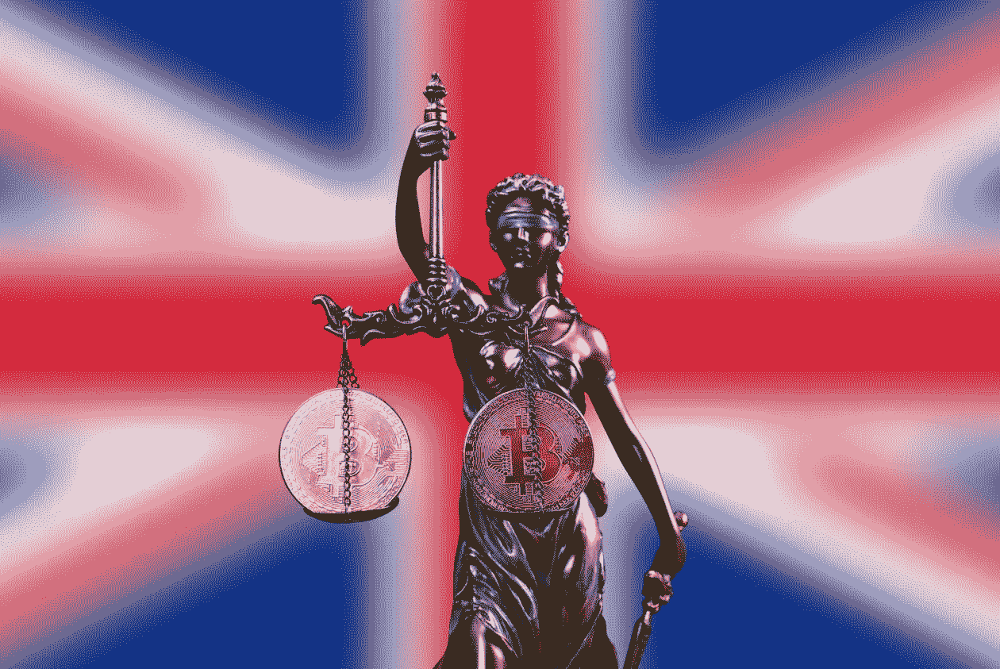

# 英国监管稳定币作为英国执法机构的支付手段

> 原文：<https://medium.com/coinmonks/united-kingdom-to-regulate-stablecoin-as-means-of-payment-for-the-british-enforcement-agency-edc7b2d0dede?source=collection_archive---------73----------------------->

英国监管机构打算加强加密的执行力度，让 stablecoins 成为一种支付方式。

今年 4 月，英国经济和财政部(也称为女王陛下的财政部)宣布，它打算通过将 stablecoins 纳入该国的支付监管来使英国处于技术前沿，这是一个大胆的举措，与最近由 terra USD(UST)的脱钩引起的震惊相比，看起来特别有趣。

后来，在 5 月份的年度女王演讲中，查尔斯王子向议会通报了两项法案，这两项法案将支持“安全采用加密货币”和“建立更快更容易地扣押和收回加密资产的权力”。

综上所述，这些举措给人一种印象，即美国对数字资产的兴趣越来越大，考虑到与欧盟在创新方面不可避免的竞争，这并不令人惊讶。

最近几个月，英国的 crypto 很忙。除了一些重要的先例，如高等法院承认不可兑现代币(NFT)为财产的决定或 gray 的首只欧洲 ETF 在伦敦证券交易所上市，我们还见证了监管机构的一些重大公告。

# 财政部与稳定资本的关系

在经过几个月的公众咨询后，财政部在 4 月 4 日的公告中承认，某些稳定的硬币可能成为零售客户的“广泛支付手段”。它还表示愿意“采取必要的立法步骤”，将稳定的资本纳入一个全面的监管框架。

正如 Koinly 的税务主管 Tony Dhanjal 向 Cointelegraph 解释的那样，这一声明应该被视为一个巨大的新闻，甚至是一个游戏规则的改变者，因为它将导致英国 stablecoins 的重新分类；

> “一旦稳定的货币不再受资本利得税的约束，支出加密可能会变得更加普遍，我们可以看到加密作为主流行业的支付手段的采用。”

财政部表达的意图不仅仅局限于稳定的信贷；金融监管机构还戏弄了加密资产参与小组的启动，该小组将与行业利益相关者进行磋商；重新评估该国关于加密的税收制度，建立“金融市场基础设施沙箱”，甚至皇家铸币局自己的 NFT。

即使是五月第二周臭名昭著的市场崩溃，特别是对稳定银行零波动的最初承诺造成的痛苦，也没有让财政部气馁。据《独立报》报道，将稳定货币作为支付手段的立法将被纳入金融服务和市场法案。

现在已知的是，财政部不打算在这项立法中包括算法稳定币，如 UST——只有完全支持的稳定币，如 Tether (USDT)或 USD Coin (USDC)正在考虑中。

# 扣押和收回

前面提到的金融服务和市场法案，可能包括 stablecoins 的指导方针，是女王演讲的一部分——5 月 10 日向议会宣布的一揽子 38 个立法项目。

就目前的形式而言，它并没有说太多，尽管这种语言听起来对该行业相当有利。该法案旨在“利用金融服务创新技术的机遇”，包括:

> *“支持安全采用加密货币和弹性外包给技术提供商。”*

就目前而言，该法案声明的关键点在于，其意图是打造一个不会照搬欧盟框架的国家框架。虽然它最初将适用于传统的金融部门，但预计对加密资产也有类似的要求。

女王演讲的另一部分预示着对加密产业意义重大的是经济犯罪和公司透明度法案。乍一看，这听起来对数字货币并不友好，在英国执法者将加强控制的风险区列表中提到它们。正如唯一提到加密的一行所述，该法案将赋予以下权力:

> *“更快速、更轻松地获取和恢复加密资产，这是勒索软件使用的主要媒介。”*

虽然“勒索软件的主要媒介”并不完全是善意的措辞，但一个不仅能没收、还能实际追回加密资金的机构的存在将提振市场。

# “英国迈出的一大步”

Djahal 说，英国加密社区的普遍看法是积极的。人们仍然普遍认为，加密是罪犯的天堂，因此监管是受欢迎的，他认为:

> *“不是现有的权力不能没收勒索病毒的钱，而是在 2002 年颁布的反洗钱立法早于加密技术被接受的时间，也许只是不适合加密领域的目的。”*

Qredo 监管事务主管本杰明·惠特比(Benjamin Whitby)倾向于同意这一观点。他告诉硬币电讯报:

“我觉得这项提案中对空间的认可非常积极，认可这一资产类别将为更多金融科技公司提供机会，开始将加密资产纳入他们的技术堆栈。”

虽然在这一点上，发展有效执法的雄心可能仍然被认为是有点矛盾的，但专家们对宣布的稳定币认可感到兴奋。惠特比称之为“英国迈出的一大步”，但他表示，我们不应该自欺欺人地认为“一切都会一帆风顺”

> *“重要的是，人们有一个可以安全转移的位置，有了监管稳定的收入，我们可以进入一个 T0 结算世界，并减轻摇摇欲坠和脆弱的传统基础设施的负担。”*

Dhanjal 认为，英国金融当局甚至可能寻求自己的稳定货币，这很像中央银行的数字货币(CBDC)——一种政府支持的“英国硬币”，将与英镑挂钩。他说，这样做的目的是维护金融稳定，解决加密固有的不稳定性:

> *“在适当的监管下，一枚英国硬币可以提供更有效的支付手段，并扩大消费者的选择，特别是在新兴的分散金融体系中。”*

# 让英国再次伟大？

很难不将英国与其欧洲大陆的邻居进行比较，因为它们已经分离，必须在人才和创新方面相互竞争。女王演讲的精神实质就是借鉴了这种比较，称其使命是“充分利用我们的英国退出欧盟自由”或“抓住英国退出欧盟的好处”——总的来说，“英国退出欧盟”这个词被提到了 20 次。惠特比认为，英国能够并将比许多司法管辖区更快地创新和适应，脱离欧盟监管程序使其能够更快地采取行动:

> *“加密资产开启了更快的结算，消除了信用风险，并将结算时间降至接近于零，这对商业来说是一个巨大的胜利，英国已经确定了将采取主动的意图。英国在探索边界、乘坐小船漂洋过海、为风险投保和组建新企业方面有着悠久的历史——加密也不例外。”*

Dhanjal 相信，英国有很大的机会超越其大陆邻国，因为它拥有数百年的金融服务传统，深厚的人才库，以及来自世界各地的金融部门和创业公司的经验。在他看来，英国不愿意采纳欧盟法规的总体精神，这对英国来说是个好消息。

“现在欧盟的枷锁已经通过英国退出欧盟被解除，英国可以通过齿轮加速成为加密创新和采用的世界领导者，”他说。

总部位于区块链的数据聚合平台 Pool 的首席战略官 Gilbert Hill 告诉 Cointelegraph，英国当局在努力创造一个创业和扩大加密公司的避风港方面是真诚的，但据他估计，并非所有公司都是高效的。

特别是，他发现目前的监管沙盒缺乏灵活性，并表示已经拒绝了三分之二的申请人，这已经导致欧洲大陆一些最好的项目流失。希尔还强调了欧洲方法的优点:

> *“简而言之，欧盟正在将数据改革置于其战略的核心，目标是打破每年价值 3000 亿欧元的孤岛，以及一系列涵盖从人工智能到互联网网守和数据联盟的新法律，所有这些都是高质量英特尔构建更好的 Web3 产品的新来源。”*

希尔表示，要成为未来的领导者，英国需要“在大陆上表现出来的”同样程度的政治意愿，并摆脱僵化的 FCA/沙盒模式。希望竞争的精神和证明其脱离欧洲大陆的冲动将有助于这个国家做出正确的决定。

> 加入 Coinmonks [电报频道](https://t.me/coincodecap)和 [Youtube 频道](https://www.youtube.com/c/coinmonks/videos)了解加密交易和投资

# 另外，阅读

*   [BigONE 交易所评论](/coinmonks/bigone-exchange-review-64705d85a1d4) | [电网交易机器人](https://coincodecap.com/grid-trading)
*   [氹欞侊贸易评论](https://coincodecap.com/anny-trade-review) | [CoinSpot 评论](https://coincodecap.com/coinspot-review)
*   [新加坡十大最佳加密交易所](https://coincodecap.com/crypto-exchange-in-singapore) | [购买 AXS](https://coincodecap.com/buy-axs-token)
*   [投资印度的最佳加密软件](https://coincodecap.com/best-crypto-to-invest-in-india-in-2021) | [WazirX P2P](https://coincodecap.com/wazirx-p2p)
*   [7 个最佳零费用加密交易平台](https://coincodecap.com/zero-fee-crypto-exchanges)
*   [最佳网上赌场](https://coincodecap.com/best-online-casinos) | [期货交易机器人](/coinmonks/futures-trading-bots-5a282ccee3f5)