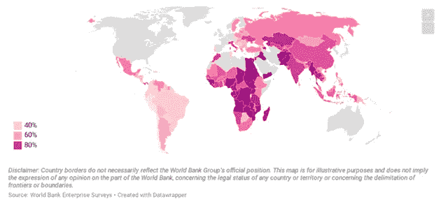
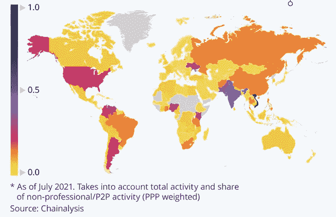

# 普及金融服务需要网络 3

> 原文：<https://medium.com/coinmonks/universal-financial-access-needs-web3-6d808f2ae51c?source=collection_archive---------33----------------------->

作者:[毛里西奥·纳姆](/@mauricio_nm)

**已经做了很多。但仍有许多工作要做。数字技术的伟大盟友**

金融普惠已被确定为 17 个[可持续发展目标](https://www.un.org/sustainabledevelopment/sustainable-development-goals/)中的 7 个目标的推进因素。 **1**

还有一个好消息。金融普惠正在兴起。在过去十年中，全球有 10 亿成年人在金融机构或通过移动支付提供商开设了账户，现在有 69%的成年人拥有账户。尽管取得了这些进展，但仍有 17 亿成年人没有银行账户，不平等现象持续存在，各国之间、性别之间、年龄之间以及社会群体之间都存在巨大差距。 **2**

Account Ownership by Country Income Category

数字技术是开设银行账户和使用支付手段增长的原因。所有地区的移动货币都在持续增长。在低收入经济体，移动货币账户的数量已经是银行账户的两倍。 **3**

**获得信贷。巨大的挑战**

金融普惠不仅仅是拥有一个账户。[金融普惠](https://www.worldbank.org/en/topic/financialinclusion/overview#1)是指个人和企业可以获得有用且负担得起的金融产品和服务，以负责任和可持续的方式满足他们的需求——交易、支付、储蓄、信贷和保险。

中小企业尽管在金融服务提供商那里有账户，但大多被排除在正规贷款之外。例如，在拉丁美洲和加勒比地区，大约 90%的企业都有账户，尽管只有一半的企业有银行贷款或银行信贷额度。 **4**

% of SMEs without a loan or line of credit

17 亿个人和 2 亿没有银行账户的企业(小型、中型和微型企业)的加入将创造一大批新的借款人。这些个人和小企业预计将推动约 2.1 万亿美元的贷款需求。 **5**

获得信贷的决定因素是多方面的，这些因素结合在一起相互加强，并且因国而异。它们与需求相关(如金融教育、地理位置、互联网接入等。)、供应(金融服务的深度、所提供信贷的特征等。)和背景(制度框架、宏观经济等)。). **6**

此外，提供金融服务成本高昂，某些结构性特征会影响这些成本。随着创新被引入以降低这些成本，一些结构特征的相关性必然会减弱。 **7**

但是，即使限制接触信贷提供者的障碍被克服了，作为贷款本质的一部分，仍然会有一个障碍:信任问题……*好吧，但是……你会履行我们的合同吗？你会把我借给你的钱还给我吗？*

**解决信任问题**

纵观历史，人们一直在寻求各种方式来解决——非暴力地——贷款的“担保”问题。抵押物的提供(抵押、质押等。)、担保人的存在或基于信息(声誉、信用评分)是最常用的工具，也是变得更加复杂和制度化的工具。

在拉丁美洲和加勒比，中小企业目前获得银行信贷的主要障碍之一是与行政费用、风险分析和缺乏信用记录相关的高额代理费用。因此，银行需要高水平的抵押品和担保，这是世界上最高的。 **8**

[互保公司](https://es.wikipedia.org/wiki/Sociedad_de_Garant%C3%ADa_Rec%C3%ADproca)在扩大规模和渗透小微企业细分市场时遇到类似的困难。它们最终服务于有限范围的(中型)公司，零售方式的运营成本相对较高，并且它们有限的地理覆盖范围和与公司的接近程度使它们无法提供高质量的信贷风险评估和监控。 **9**

声誉系统已经并将继续被广泛使用。目前，在世界大部分地区，贷款是由亲戚、朋友或商店发放的，因为他们离得近，知道个人的声誉。

Percentage of adults who borrowed money and sources of loans **10**

但是，扩展声誉系统有它的问题。

基于信用分数的信用系统奖励已经有信用的人，惩罚那些还没有信用的人。没有信用记录的消费者和初创企业可能看起来不可见或没有信用评分，因为他们没有足够的交易额度来产生评分。但是他们也不能获得学分来提高他们的分数。这造成了难以打破的排斥循环。在美国，2800 万消费者被视为“信用隐形”，而另外 2100 万被视为“不可记录”，这意味着他们没有传统上用于生成信用评分的账户类型。 **11**

另一方面，收集私人数据来创建信用评分，使人们的在线生活成为可能，这是对个人数据隐私和主权的攻击。 **12**

扩大信任一直是扩大信贷渠道的最大挑战。

**开放和分权的财政。在我们信任的代码中**

Web3 将彻底改变一切，但它是从彻底改变金融世界开始的。今天，金融创新正在 WEB3 中发生，它被称为 DeFi。

在过去的 3 年里，一个分散的金融应用的世界已经出现，从稳定到借贷，分散的交换等等。 **13**

目前，全球估计有 1 亿人在使用基于加密货币的资产。自 2019 年第三季度以来，全球采用率增长了 2300%以上，去年增长了 881%以上。 **14 15**

Index value of global cryptocurrency adoption

在 [DeFi](https://ethereum.org/en/defi/) 金融解决方案通过智能合同实施。 [**智能合同**](https://ethereum.org/en/smart-contracts/) 是储存在区块链上的计算机程序，允许我们将传统合同转换成数字合同。与传统合同相比，智能合同的最大优势之一是，当合同条件得到满足时，结果会自动执行，任何人都无法阻止或更改它。智能合同消除了信任的必要性。

Web3 还带来了技术上的可能性，以开发 [**自我主权身份**](https://en.wikipedia.org/wiki/Self-sovereign_identity) 的全部潜力。根据瑟尔斯博士的说法，“身份与你是谁无关。这是关于其他人可能想要或需要了解你的什么，以及你如何让他们知道”区块链的出现为管理个人身份提供了从集中模式向分散模式转变的机会。只能共享完成交易所需的数据，而不是整个文档。使用区块链作为底层基础设施，个人数据从不存储在中央服务器中；因此，减少了数据泄露。自我主权身份是一个新概念，自主权掌握在使用者手中。 **16 17**

此外，智能合同正在促成新一代合作企业的诞生，即 [**分权自治组织**](https://ethereum.org/en/dao/) 。在 Dao 中，所有权和管理权由它们的成员共同管理。他们有固定的资金，未经集团批准，任何人无权动用。决策由提案和投票管理，以确保组织中的每个人都有发言权。所有人不需要相互了解和信任，因为一切都显而易见，有关资金使用的规则用不变的代码写在 DAO 智能合同中。

WEB3 正在开发扩大信任的技术基础，从而为扩大信贷提供了机会。

**参考文献**

**1** [金融普惠促进发展:妇女、穷人和农民工更好地获得金融服务](https://unctad.org/system/files/official-document/ditctncd2020d6_en.pdf)
**2** [推动金融普惠:世界银行集团的经验教训](https://ieg.worldbankgroup.org/sites/default/files/Data/reports/ap_driveforfinancialinclusion.pdf)
**3** [IMF 数据金融普惠调查](https://data.imf.org/?sk=E5DCAB7E-A5CA-4892-A6EA-598B5463A34C)
**4** [G20 金融普惠指标](https://datatopics.worldbank.org/g20fidata/)
**5** [世界经济论坛。解决金融排斥的关键](https://www.weforum.org/agenda/2018/04/how-big-data-can-fight-financial-exclusion/)
**6** [全球 Findex 数据库](https://globalfindex.worldbank.org/)
**7** [金融包容:迄今为止我们学到了什么？我们要学什么？](https://www.imf.org/en/Publications/WP/Issues/2020/08/07/Financial-Inclusion-What-Have-We-Learned-So-Far-What-Do-We-Have-to-Learn-49660)
**8**[2030 年可持续发展议程与发展融资挑战](https://www.cepal.org/en/publications/40327-economic-survey-latin-america-and-caribbean-2016-2030-agenda-sustainable)
**9** [中小企业和创业融资:信用担保计划和互助担保社在支持中小企业融资中的作用](https://one.oecd.org/document/CFE/SME(2012)1/FINAL/en/pdf)
**10** [普惠金融 以及隐私替代数据](https://publications.iadb.org/publications/spanish/document/Inclusi%C3%B3n-financiera-en-Am%C3%A9rica-Latina-y-el-Caribe-Coyuntura-actual-y-desaf%C3%ADos-para-los-pr%C3%B3ximos-a%C3%B1os.pdf)
**13** [web3 报告 Q3–2021](https://consensys.net/reports/web3-report-q3-2021/)
**14**[2021 年全球加密采用指数](https://blog.chainalysis.com/reports/2021-global-crypto-adoption-index/)
**15** [2022 年全球加密状态](https://www.gemini.com/state-of-crypto)
**16** [区块](/blockchain-for-decentralized-identity/blockchain-for-decentralized-identity-self-sovereign-identity-de-mystified-f9bebd006e84)

> 加入 Coinmonks [Telegram group](https://t.me/joinchat/Trz8jaxd6xEsBI4p) 并了解加密交易和投资