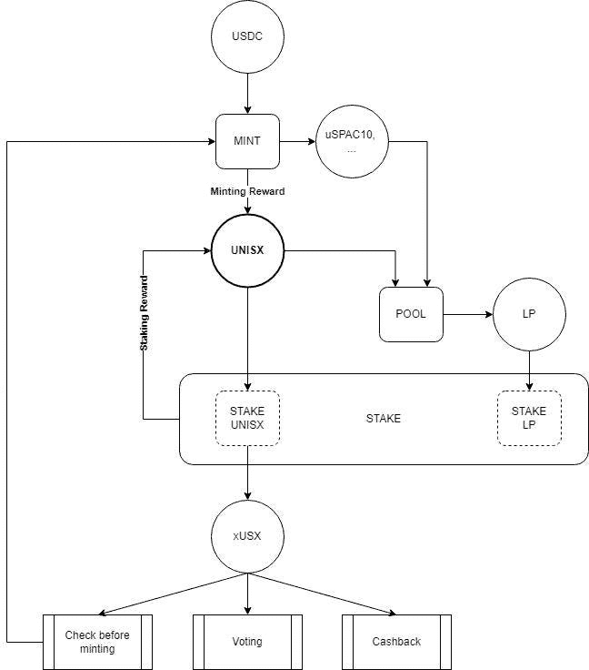

# 通用合成令牌

> 原文：<https://medium.com/coinmonks/universal-synthetics-tokens-b9ab77325728?source=collection_archive---------56----------------------->

互动代币系统为用户提供了风险和收益的平衡，并保证管理决策将完全出于项目长期发展的利益，并保护用户免受投机性攻击。

Photo by [Ferhat Deniz Fors](https://unsplash.com/@ferhat?utm_source=medium&utm_medium=referral) on [Unsplash](https://unsplash.com?utm_source=medium&utm_medium=referral)

通用合成*T3 中操作的代币包括以下五种:*合成代币、stablecoins、DEX 流动性代币、奖励代币*和*治理代币*:*

*   ***uSPAC10(也即将推出:uSPAC50、uSPAC_EV 等)*** 通过合成代币的方式呈现，这些代币与交易所资产和指数的价格挂钩。

> S *ynthetics* 是抵押品支持的代币，其价值根据代币的参考指数而波动。它们结合了博彩市场、期货市场和抵押贷款的特点。

*   *或 *stablecoin* 被用作发行合成资产或补充 DEX 流动性池的抵押品。用户的钱包中应该有足够数量的 USDC，即发行的合成资产成本的 1.5 倍，加上与放在流动性池中的代币价值相等的金额。*
*   ****LP*** 或*流动性代币*一般确认用户在 DEX 流动性池中的份额。为了获得流动性代币，用户应将流动性放入 DEX 流动性池，用于合成代币或 UNISX 代币。*

> *他们需要接受通过 DEX 流动性池兑换合成代币或 UNISX 代币的佣金，或者可以被投入股份以接受 UNISX 代币的奖励。*

*   ****男女通用，*** 此*奖励令牌*用于激励项目用户。一个人可以获得 UNISX 代币作为执行以下行为的奖励:发行合成资产；流动性标记的标记；尤妮斯奖励代币的赌注。*
*   ****xUSX*** 或*治理令牌*主要用于释放合成资产，对项目的开发和管理进行投票表决，以及接收 xUSX 所有者执行 DEX 操作的佣金返现。要获得 xUSX，必须在木桩中放置 UNISX 代币。*

*此外，用户需要有一定数量的以太币才能进行交易(即以太币的确切数量取决于交易时的燃气价格)。*

**

*Fig.1 Scheme of the interaction of project tokens*

*Universal Synthetics 使用自己的 UNISX 奖励令牌，其功能是激励流动性提供者。合成代币的发行对用户来说意味着用更有利可图、更易变的合成数字资产替换低易变、低收益的稳定硬币。因此，该项目需要一种工具来补偿不断增加的风险，并鼓励用户增加所提供的流动性。*

*通用合成的一个关键特征是奖励和管理功能在不同的代币之间划分。这样做是为了促使用户在项目中停留更长时间。因此，投票权不会给予任何在 DEX 上发布合成或购买奖励令牌的用户，而只会给予长期感兴趣的玩家，他们将奖励令牌放在股份中，并因此获得 xUSX 治理令牌。*

*因此，Universal Synthetics 项目采用了一种先进的交互令牌系统，以确保用户的风险和盈利能力之间的平衡，并向用户保证管理决策仅符合项目的长期发展利益，并免受投机性攻击。*

# *[订阅关注我们当前和未来产品的所有新闻](/subscribe/@unisx)。*

*The curated series of articled created via ManyStories*

> *加入 Coinmonks [电报频道](https://t.me/coincodecap)和 [Youtube 频道](https://www.youtube.com/c/coinmonks/videos)了解加密交易和投资*

# *另外，阅读*

*   *[CBET 评论](https://coincodecap.com/cbet-casino-review) | [库科恩 vs 比特币基地](https://coincodecap.com/kucoin-vs-coinbase)*
*   *[折叠 App 审核](https://coincodecap.com/fold-app-review) | [Kucoin 交易机器人](/coinmonks/kucoin-trading-bot-automate-your-trades-8cf0ca2138e0) | [Probit 审核](https://coincodecap.com/probit-review)*
*   *[如何匿名购买比特币](https://coincodecap.com/buy-bitcoin-anonymously) | [比特币现金钱包](https://coincodecap.com/bitcoin-cash-wallets)*
*   *[币安 vs FTX](https://coincodecap.com/binance-vs-ftx) | [最佳(索尔)索拉纳钱包](https://coincodecap.com/solana-wallets)*
*   *[比诺莫评论](https://coincodecap.com/binomo-review) | [斯多葛派 vs 3Commas vs TradeSanta](https://coincodecap.com/stoic-vs-3commas-vs-tradesanta)*
*   *【Capital.com】|[港加密借贷平台](https://coincodecap.com/crypto-lending-hong-kong)*