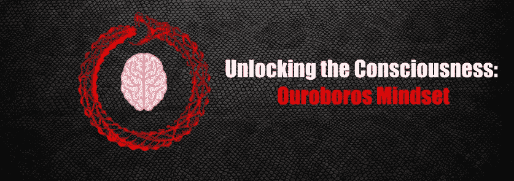

# 打开意识:大毒蛇的思维模式

> 原文：<https://medium.com/coinmonks/unlocking-the-consciousness-ouroboros-mindset-6faae27c85a1?source=collection_archive---------10----------------------->

当我们看到他人取得了杰出的成功时，我们大多数人问自己的“WTF”问题和对话可能类似于这样…

“我希望我有那种天赋和才能。”

**“他们是如何完成如此不可能的事情的？”**

**“哇！她真的很聪明。”**