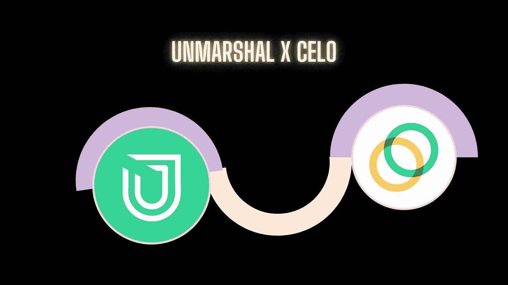

# 解组集成 Celo 网络

> 原文：<https://medium.com/coinmonks/unmarshal-integrates-celo-network-7055ce95424d?source=collection_archive---------56----------------------->

虽然 Unmarshal 离他们的 1 周年纪念日越来越近，但他们仍然没有停止工作，以便提供最好的服务。Unmarshal 很兴奋地宣布将 Celo Network 集成到他们的服务中，为他们的 mainnet 带来索引。

Celo 是第一层协议区块链平台。虽然 Celo chain 是以太坊的一个分支，但它有很大的不同，包括一个基于利害关系证明的 PBFT 共识方法。Celo 建立在两个核心价值观之上:**独特的目的**和**连通性**。这些，反过来，导致实践，促进个人成长和社区。Celo 拥有一个全球开发者社区，该社区在该平台上贡献并构建了超过 **200 个项目**，以支持其构建一个为繁荣创造条件的金融体系的愿景

Unmarshal 是一个多链数据网络，支持超过 7 个不同链的索引和查询。他们目前为 **500 多份智能合同**提供服务，满足其生动的数据需求。

通过 Celo 链索引，Unmarshal 将支持和鼓励开发人员社区在 Celo 上构建和部署 dApps，同时维护链的健壮基础设施。开发人员现在可以通过解组快速 API 从 Celo 平台查询数据。解组提供了对各种 API 的访问，如**资产余额、令牌交易、交易细节、**等。我们还支持构建定制的 API 来满足应用程序的确切需求，以及**通知**和**洞察分析**支持。的确，这是开发商的梦想。

此外，Celo network 将被整合到[**xscan . io**](https://xscan.io)**中，用户将能够在一个地方看到他们的余额和交易。**

**要开始构建 Celo 网络，请访问 [**API 文档**](https://docs.unmarshal.io/)**

## **关于解组**

**Unmarshal 是一个多链 DeFi 数据网络，旨在向 dApps 提供精细、可靠和实时的数据。它提供了从以太坊、币安智能链、Polygon、Solana 和 XDC 查询区块链数据的最简单方法。解组网络由数据索引器和转换工具组成，为任何链上的 DeFi 应用程序提供动力。**

**加入我们的社区，保持联系**

**[**网站**](http://unmarshal.io/) **|** [**电报聊天**](https://t.me/Unmarshal_Chat) **|** [**电报公告**](https://t.me/joinchat/RRUIzbuhlA8-6Kjk)|[|**推特**](https://twitter.com/unmarshal) **|** [**中**](https://medium.com/unmarshal-io)**

> **加入 Coinmonks [电报频道](https://t.me/coincodecap)和 [Youtube 频道](https://www.youtube.com/c/coinmonks/videos)了解加密交易和投资**

# **另外，阅读**

*   **[SmithBot 评论](https://coincodecap.com/smithbot-review) | [4 款最佳免费开源交易机器人](https://coincodecap.com/free-open-source-trading-bots)**
*   **[杠杆令牌](/coinmonks/leveraged-token-3f5257808b22) | [最佳密码交易所](/coinmonks/crypto-exchange-dd2f9d6f3769) | [Paxful 点评](/coinmonks/paxful-review-4daf2354ab70)**
*   **[加密套利](/coinmonks/crypto-arbitrage-guide-how-to-make-money-as-a-beginner-62bfe5c868f6)指南| [如何做空比特币](/coinmonks/how-to-short-bitcoin-568a2d0b4ae5)**
*   **[币安期货交易](https://coincodecap.com/binance-futures-trading)|[3 commas vs Mudrex vs eToro](https://coincodecap.com/mudrex-3commas-etoro)**
*   **[如何购买 Monero](https://coincodecap.com/buy-monero) | [IDEX 评论](https://coincodecap.com/idex-review) | [BitKan 交易机器人](https://coincodecap.com/bitkan-trading-bot)**
*   **[尤霍德勒 vs 科恩洛 vs 霍德诺特](/coinmonks/youhodler-vs-coinloan-vs-hodlnaut-b1050acde55a) | [Cryptohopper vs 哈斯博特](https://coincodecap.com/cryptohopper-vs-haasbot)**