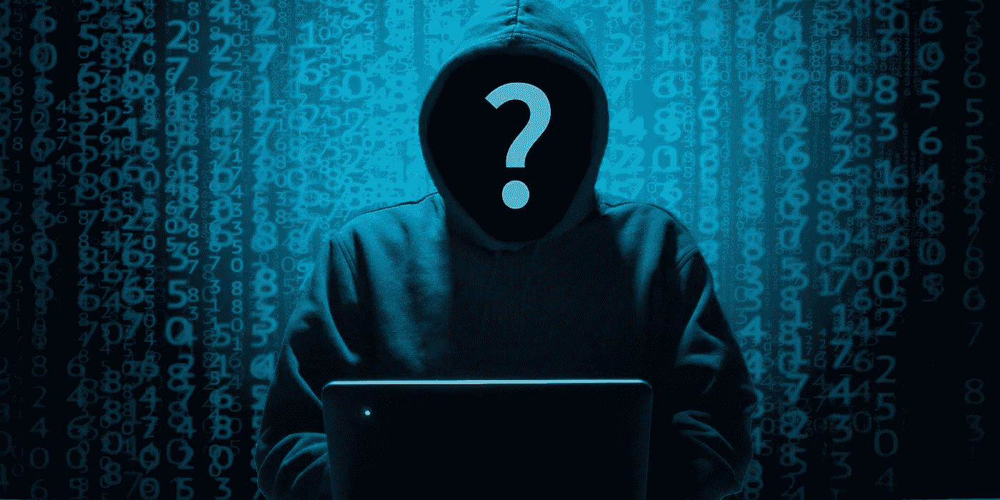
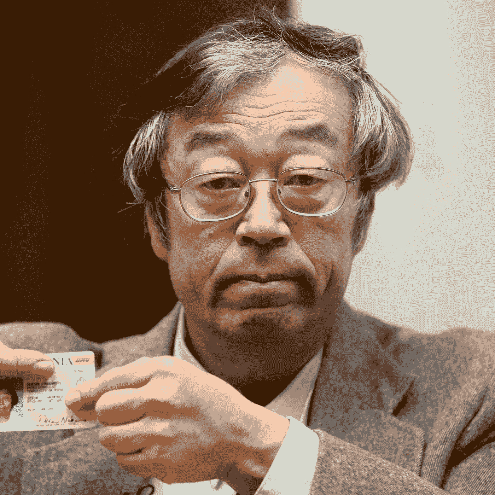

# 揭开比特币背后的身份

> 原文：<https://medium.com/coinmonks/unmasking-the-identity-behind-bitcoin-91a5143da206?source=collection_archive---------28----------------------->

比特币是谁发明的，一直是个谜。以太坊的创始人维塔利克·布特林并没有隐瞒自己的身份。互联网上最后一次公开听说中本聪是在 11 年前的 2010 年 12 月 12 日，当时他留下了最后一条消息，告诉 Bitcointalk 论坛的早期成员，要改善网络还有很多工作要做。在这篇文章中，我将列出可能与中本聪身份相符的嫌疑人，以及为什么这么多人声称是他。

然而，为什么许多人自称是中本聪，这并不是一个谜。目前，中本聪的钱包里大约有 100 万个比特币，根据当时比特币的价格，这相当于大约 560 亿美元。这个未被触及的宝藏就是为什么我相信如此多的个人声称是比特币的创造者。

# **多里安·中本聪**

多里安在 1973 年把他的出生名从中本聪改成了多里安·中本聪。除了名字，是什么让多里安成为比特币创造者的主要嫌疑人？据多里安的大女儿说，多里安被解雇了两次，这导致他拖欠抵押贷款和税款。然而结果是他的房子被取消了赎回权。这和中本聪有什么关系？嗯，中本聪创造一种废黜银行系统的货币的真正动机是因为他“不喜欢我们今天的系统，想要一个更平等的不同系统。”我不知道你怎么想，但是如果银行没收了我的房子，我会很生气的！多里安的家人曾表示，他对隐私有执念。记住，不管中本聪是谁，他很擅长掩盖自己的行踪。十多年来，中本聪一直是个谜！更不用说他曾经为与电子和国防相关的项目工作。现在，我们有了所有这些复选标记，还有一件事让多里安有机会成为聪。自 2001 年以来，多里安的工作经历成了一个谜。多里安离开了他稳定的工作，其余的多里安是一个谜。也许他把过去十年都花在了比特币上？当多里安被问及他对货币的参与时，他说“我不再参与了，我不能讨论这个问题。它已经被转交给其他人了。他们现在负责这件事。我不再有任何联系”。我们找到中本聪了，对吗？嗯，不保证。后来多里安声称他误解了这个问题，他没有创造货币。

# 哈尔·芬尼

让我惊讶的第一件事是，多里安·中本聪和哈尔·芬尼住的地方相距只有几个街区，这种可能性有多大？另一个“巧合”是，比特币历史上记录的第一笔交易是 Hal Finney 的钱包。就连哈尔也是第一个挖掘比特币的人(除了中本聪)。更不用说哈尔也非常喜欢隐私。他早在 1992 年就加入了一个赛博朋克组织。这些朋克聚会是关于隐私和技术等各种事情的会议。其中一次会议强调了这样一个观点，即在不知道对方身份的情况下，电子邮件、信息以及支付服务和商品费用的技术是匿名的。这几乎完美地描述了加密货币比特币背后的想法。另一件需要提及的事情是，那 100 万枚比特币就在一个钱包里。也许真正的 Satoshi 不想套现，因为加密经济最终会崩溃，但我不认为会是这样。可能，这笔财富至今仍无人问津的原因是比特币的创造者已经过世。哈尔·芬尼在 2009 年被诊断出患有 ALS，并于 2014 年不幸去世。补充一些额外信息，哈尔曾在 PGB 公司工作，2011 年因渐冻人症退休。要让哈尔成为聪，我们必须承认，他从比特币诞生之初就给自己发信息，以掩盖自己的行踪。

# **结论**

还有更多嫌疑人，包括保罗·勒鲁、克雷格·赖特、尼克·萨博，甚至埃隆·马斯克。最后一个我是开玩笑的(我觉得)。不管谁是真正的中本聪，如果是哈尔·芬尼，多里安·中本聪，甚至是克雷格·赖特，我相信如果中本聪的身份被暴露，密码空间将会被严重破坏。我们在这里谈论的是一种分散化的货币，拥有 100 万个比特币给了个人太多的金钱和权力。除了克雷格·赖特和埃隆·马斯克，我相信这个名单上的人也有机会成为比特币的创始人。我希望你在阅读这篇文章的时候学到了一些新的东西。如果你喜欢，请留下你的掌声，并评论你对这个话题的看法。一如既往，祝你有美好的一天，我的朋友！

> 加入 Coinmonks [电报频道](https://t.me/coincodecap)和 [Youtube 频道](https://www.youtube.com/c/coinmonks/videos)了解加密交易和投资

# 另外，阅读

*   [比特币基地 vs WazirX](https://coincodecap.com/coinbase-vs-wazirx) | [波洛涅克斯 vs 比特雷克斯](https://coincodecap.com/poloniex-vs-bittrex) | [购买流量令牌](https://coincodecap.com/buy-flow-token)
*   [阿联酋 5 大最佳加密交易所](https://coincodecap.com/best-crypto-exchanges-in-uae) | [SimpleSwap 评论](https://coincodecap.com/simpleswap-review)
*   [购买 Dogecoin 的 7 种最佳方式](https://coincodecap.com/ways-to-buy-dogecoin) | [ZebPay 评论](https://coincodecap.com/zebpay-review)
*   [如何在 Bitbns 上购买柴犬(SHIB)币？](https://coincodecap.com/buy-shiba-bitbns)
*   [最佳加密分析或链上数据](https://coincodecap.com/blockchain-analytics) | [Bexplus 评论](https://coincodecap.com/bexplus-review)
*   [NFT 十大市场造币集锦](https://coincodecap.com/nft-marketplaces)
*   [iTop VPN 审查](https://coincodecap.com/itop-vpn-review) | [曼陀罗交易所审查](https://coincodecap.com/mandala-exchange-review)
*   [最佳期货交易信号](https://coincodecap.com/futures-trading-signals) | [流动性交易所评论](https://coincodecap.com/liquid-exchange-review)
*   [最佳加密交易信号电报](/coinmonks/best-crypto-signals-telegram-5785cdbc4b2b) | [MoonXBT 评论](/coinmonks/moonxbt-review-6e4ab26d037)
*   [OKEx 评论](/coinmonks/okex-review-6b369304110f) | [Coinswitch 俱吠罗评论](/coinmonks/coinswitch-kuber-review-1a8dc5c7a739) | [比特币基地收费](/coinmonks/coinbase-fees-831e77d4f2c5)