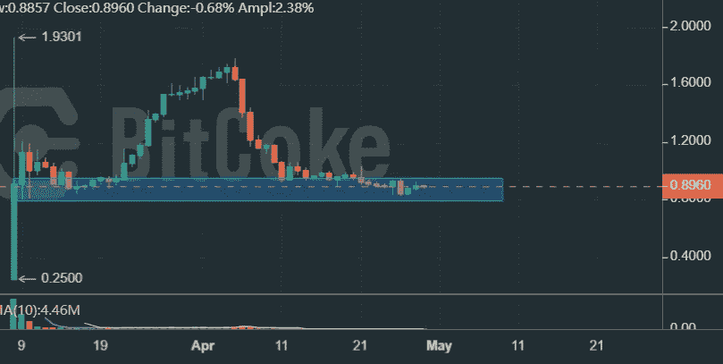

# 解开 BitCoke Token，价值投资者最好的平台令牌？

> 原文：<https://medium.com/coinmonks/unravel-bitcoke-token-the-best-platform-token-for-value-investors-b956dbb54eb1?source=collection_archive---------35----------------------->

BitCoke 是一家在开曼群岛注册的加密交易所。它于 2019 年推出，在香港、澳大利亚和其他几个地方设有运营办公室。该平台虽然不是一个家喻户晓的名字，但有一些独特而有趣的功能，包括其原始的 Quanto swap，以及专业的图表和功能。在撰写本文时，BitCoke 在 CoinMarketCap 衍生品市场的交易量排名第七。

2022 年初，BitCoke 决定推出其原生令牌 Coke，以连接其用户并 nuture exchange 生态系统。像大多数已经推出其平台令牌的交易所一样，BitCoke 逐渐采用授权案例&使用 Coke 作为注册和保留用户的一种方式。

在这篇文章中，我将剖析可口可乐的表征组学和用例，给我的追随者一个关于可口可乐基本面的全面而客观的评估。还有，我会解释为什么可乐是平台代币领域的未打磨宝石，值得价值投资者考虑。

# 令牌组学

发行时，可口可乐代币的最大供应量将为 10 亿，初始发行量约为 2300 万。最初的可口可乐空投发生在 2021 年 11 月 10 日和 11 月 15 日，向用户空投代币。可乐币分布在 BitCoke 生态系统的各个领域，分布情况如下:

焦炭指数— 49%

焦煤岛— 21%

团队— 20%

公共 IEO — 2%

私募——8%

可口可乐代币作为 ERC-20 代币发行，目的是激励交易并奖励其未来项目(即 CokeDex 和 CokeDao)的做市商，建立一个社区并从长远角度有机地提高原生代币的价格。

从表面上看，对于一家中型交易所来说，10 亿英镑的总供应量显得过高。实际上，在最初的 5 年里，真正的流通供给将保持在非常低的水平。

根据白皮书上的官方发布时间表，大多数令牌分配给了团队或附属项目& Dao treasury。抛售供应来自在私募轮次中获得代币的机构投资者。从 2022 年 6 月开始，8000 万枚私人圆形代币将开始以线性速度解锁。然而，这不会对焦炭价格产生重大影响，因为解锁期持续 5 年，每月供应量约为 134 万。

COKE distribution and releasing schedule from BitCoke website

# 用例

可口可乐白皮书比可口可乐令牌的各种实用程序和应用程序都长，我们看到 BitCoke 正在研究这些用例。2022 年 3 月，BitCoke 推出了其专属的 launchpad 平台，用于新项目融资。用户需要购买可乐来订阅新的项目令牌。launchpad 效仿了币安 Launchpad 的成功范例，并在新项目 IEO 之前创造了对 platfrom token 的巨大需求，BNB 的情况就是如此。

BitCoke exclusive launchpad

在 launchpad 首次亮相一个月后，BitCoke 推出了可口可乐固定收益产品，持有人可以存放代币，赚取稳定但无风险的利息。365d 沉积的 APY 高达 22%，这一诱人的收益率肯定会锁定大量焦炭，减少市场流通。

22% APY for 365D COKE Earn product

此外，BitCoke 团队向社区保证，他们完全致力于实施白皮书中列出的所有 Coke 采用选项。在接下来的几个月里，可口可乐的持有者将获得费用折扣，为新上市投票，以及通过 CokeDao nodes 下注。

# 费用回购

在过去几年中，大多数集中交易代币，特别是 BNB，FTT，OKB，KCS，价格都有所上涨，这主要是由于费用回购。这是为流通代币提供购买力的直接而有力的方法。BitCoke 还提出了一个非常激进的回购方案，即每个季度交易所将使用 33%的交易费用回购并在市场上燃烧焦炭。这一措施将有效支撑焦炭价格，减少流通环节。

# 外汇增长前景

如上所述，比特可乐公司已经采取了一系列措施来支撑焦炭价格。然而，从长远来看，交换令牌命运的决定因素是其用户增长和生态系统的发展。

作为加密领域的第一家 Quanto 掉期交易所，它的功能和特点是为专业交易者和机构量身定制的。由于其灵活性和节省成本，Quanto 掉期在专业交易员和散户投资者中广受欢迎，因为它使 BTC/瑞士联邦理工学院/USDT 作为保证金来利用所有可用的永久合约。BitCoke 提供自定义图表、绘图工具和用户友好的交易功能和界面。

除了优秀的产品和功能，可口可乐白皮书还认识到营销和与社区合作的重要性。通过可口可乐的私募发行，BitCoke 声称它与营销机构、媒体、社交媒体 KOL 建立了关系，以便未来扩张。在这些资源和关系的帮助下，比特可乐将向东南亚、日本、韩国等新市场扩张，并成为这些地区的主导交易所。

# 价格目标

在写这篇分析文章的时候，可口可乐的价格是 0.9 美元，相当于 9 亿美元的稀释市值。考虑到市场上流通的代币只有 2600 万，实际市值只有 2500 万美元。

鉴于该交易所正在强制推行一系列高度激励性的可口可乐采用方案，并扩大可口可乐的使用范围。我认为可口可乐的合理估值至少是 3B 美元，是目前市值的 3 倍。

Price has bottom at 0.9 USDT

随着交易所增长的加快，随着交易所费用的不断回购，焦炭的流通供应基本上将很快陷入通缩，并有机地推动价格上涨。我会说在 3-5 年的时间范围内；焦炭价格可能会飙升至 10 美元的水平。

**参考文献:**

*   可口可乐白皮书:[https://www.bitcoke.com/token](https://www.bitcoke.com/token)
*   BitCoke 网站:【https://www.bitcoke.com/ 
*   比特可乐推特:【https://twitter.com/BitCokedotcom 
*   比特可乐 TG 社区:[https://t.co/yCcToWDQl9](https://t.co/yCcToWDQl9)

> *加入 Coinmonks* [*电报频道*](https://t.me/coincodecap) *和* [*Youtube 频道*](https://www.youtube.com/c/coinmonks/videos) *了解加密交易和投资*

# 另外，阅读

*   [Bookmap 评论](https://coincodecap.com/bookmap-review-2021-best-trading-software) | [美国 5 大最佳加密交易所](https://coincodecap.com/crypto-exchange-usa)
*   最佳加密[硬件钱包](/coinmonks/hardware-wallets-dfa1211730c6) | [Bitbns 评论](/coinmonks/bitbns-review-38256a07e161)
*   [新加坡十大最佳加密交易所](https://coincodecap.com/crypto-exchange-in-singapore) | [购买 AXS](https://coincodecap.com/buy-axs-token)
*   [红狗赌场评论](https://coincodecap.com/red-dog-casino-review) | [Swyftx 评论](https://coincodecap.com/swyftx-review) | [CoinGate 评论](https://coincodecap.com/coingate-review)
*   [投资印度的最佳密码](https://coincodecap.com/best-crypto-to-invest-in-india-in-2021)|[WazirX P2P](https://coincodecap.com/wazirx-p2p)|[Hi Dollar Review](https://coincodecap.com/hi-dollar-review)