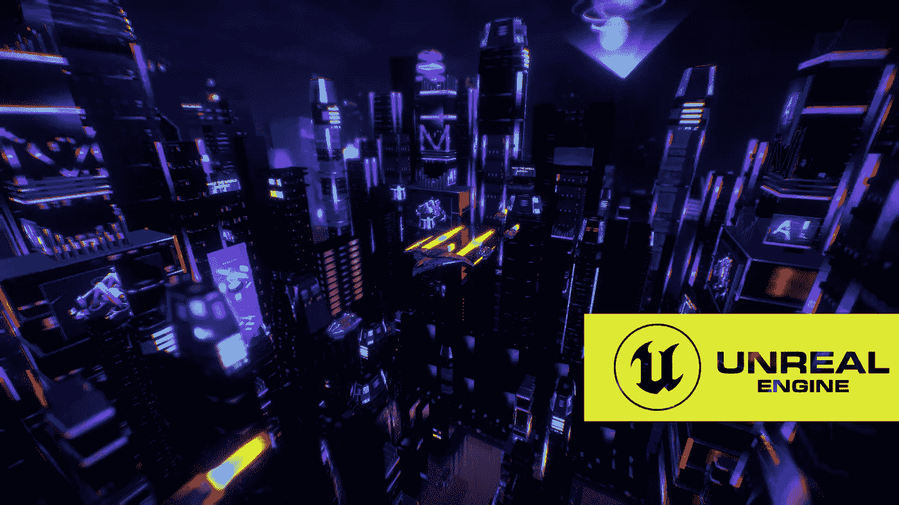

# 虚幻引擎:新时代游戏的工具

> 原文：<https://medium.com/coinmonks/unreal-engine-tool-for-new-age-gaming-4457e3f9c74c?source=collection_archive---------20----------------------->

在线游戏继续获得压倒性的流行。从简单的益智游戏到战略性多人游戏，游戏行业的创新不断为我们提供令人惊叹的体验。与这些发展相一致，游戏行业继续设计新时代的工具来支持引人入胜的游戏的开发。

谈到最新的工具，虚幻引擎被个人游戏开发者和企业广泛用于创建融合了视觉、声音、图形和实时 [3D 开发的其他方面的逼真游戏。](https://www.leewayhertz.com/how-to-build-a-virtual-world-using-the-unreal-engine/)

# 什么是虚幻引擎？

虚幻引擎是一个强大的，先进的实时三维创作工具，旨在开发虚拟现实项目，并带来生活中的数字体验。该平台提供免费的在线资源，由社区的专业支持支持，以重新定义 3D 开发方法。

无论是有经验的还是幼稚的开发者都可以从虚幻引擎中获益[。](https://www.leewayhertz.com/how-to-build-a-virtual-world-using-the-unreal-engine/)熟练的开发人员可以使用教程、文档和免费课程来构建他们的项目，并与虚幻的创作者一起加入数字革命。同时，新开发人员可以使用相同的资源磨练他们的 3D 创作技能。开发人员还可以从平台上提供的数百个示例项目中获得灵感。

# 为什么虚幻引擎如此受欢迎？

## 无限的可能性

虚幻引擎提供了全方位的建筑可视化，由一套完整的工具和框架提供支持，帮助开发人员以更具战略性的统一方式创建逼真的油田、救生医疗基础设施、市场和许多更令人惊叹的数字项目。

## 杰出项目

每个 3D 项目都旨在从竞争项目中脱颖而出，以获得更高的观众参与度。借助虚幻引擎，开发人员可以使用真人镜头、实时元素和吸引人的 VR(虚拟现实)效果来创建极具吸引力的项目。该工具确保您的项目符合行业领先的特性。

## 免费和开源

虚幻引擎是完全免费使用的，对所有人开放。开发人员可以利用它的子工具、编辑器和资源来创建他们的 VR 和 3D 项目。用户可以利用免费的源代码、Python 和 Blueprint 脚本——一个地方的一组元素，允许创建者构建自定义项目来满足特定的需求。

## 专门小组

虚幻引擎(UE)的专家团队始终支持游戏开发者，了解他们项目的挑战和需求，并为他们提供解决方案。开发人员甚至可以从现场培训中受益，按照大纲创建真正的项目。

# 虚幻引擎有什么新功能？

虚幻引擎 5 是 web 3 开发人员社区的最新热点，它是该工具多次迭代的结果。开发人员现在可以下载 UE5，体验更加互动和逼真的 3D 内容体验。从核心虚幻引擎开发方面来看，这个最新版本提供了以下好处:

*   UE 5 为开发人员提供了开发更大、更具沉浸感的内容所需的一整套工具和资产，如虚拟世界、水、地面覆盖效果和高清闪电。
*   【Lumen 和 Nanite 等新功能使世界完全动态化，并具有更好的视觉保真度图形，以支持任何项目的现实交互环境。
*   *通过新的艺术家友好的重定目标、创作和运行时工具，Unreal 5 支持扩展建模工具集的开发，从而加快任何项目的创作过程。*

此外，虚幻引擎 5 使不同行业的创作者能够通过各种迷人的功能在项目中提供交互式 3D 内容和身临其境的体验。

# 虚幻引擎有哪些用例？

凭借快速数据导入、蓝图、实时协作和多平台开发等新时代功能，Unreal Engine 在以下行业中有其各种使用案例:

**博彩业**

从 2D 到 3D，再到现在的区块链游戏，视频游戏的发展源于新技术和技术趋势。虚幻引擎进一步代表了全面的趋势，技术和工具，将游戏带到一个新的水平，以支持像元宇宙[大技术。](https://www.leewayhertz.com/metaverse-development-company/)

**媒体和电影**

媒体和电影中的 3D 和 VR 技术代表了利用 3D 技术在影院播放具有更真实效果的电影的能力。同样的 3D 效果也可以用于移动和其他便携式设备，这在很大程度上取决于项目类型。

**架构**

虚幻引擎可以在建筑公司中提供各种用例。许多大型建筑公司已经利用 3D 建模和 3D 打印的优势来虚拟设计项目，并在最终执行之前根据客户的要求进行修改，从而节省了相关的费用和时间。

**汽车和交通**

汽车和运输公司可以用虚幻引擎这样的工具来建立他们的虚拟展厅。在这里，他们可以展示各种各样的汽车，以更详细的方式突出它们的特点，甚至向人们提供虚拟试驾。

**现场活动和广播**

虚幻引擎凭借其实时渲染能力，将彻底改变直播和体育等活动。它采用了实时捕捉和分析物体动作的技术，让创作者体验到像真实世界一样的环境。

# 结论

[虚幻引擎](https://www.leewayhertz.com/unreal-engine-development-services/)的出现及其不断发展的版本，给 3D、VR 和 AR 开发行业带来了巨大的变化。虽然该工具的主要焦点是游戏项目，但每个行业都可以利用 UE 的工具、资源和技术来设计自己的品牌特定项目，并在日益激烈的竞争中保持高增长势头。最重要的是，虚幻引擎与元宇宙项目的开发需求配合得很好，这是当前世界的趋势。