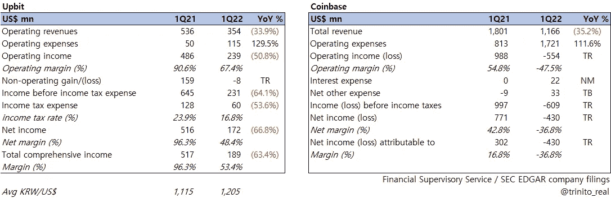
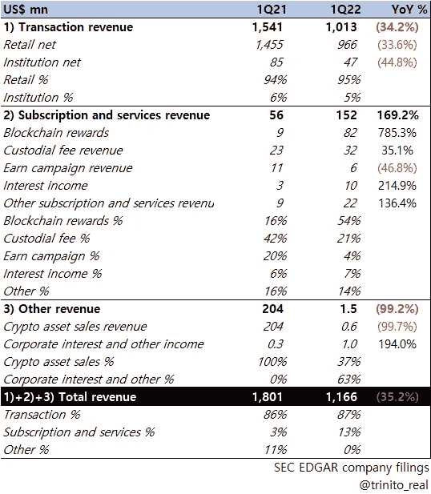
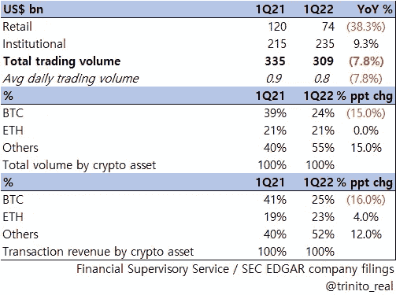
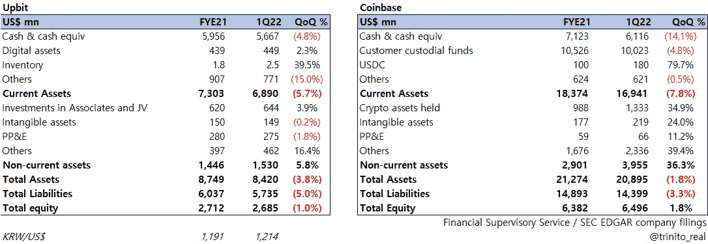
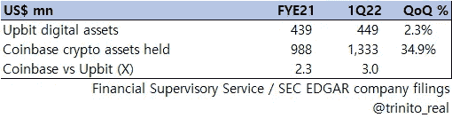
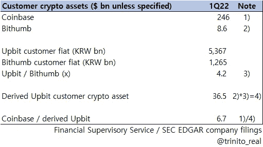
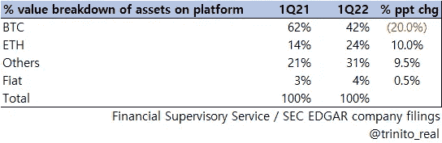
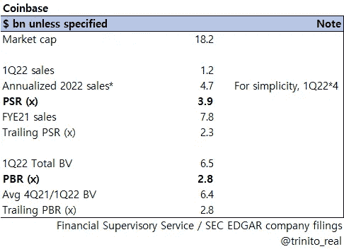
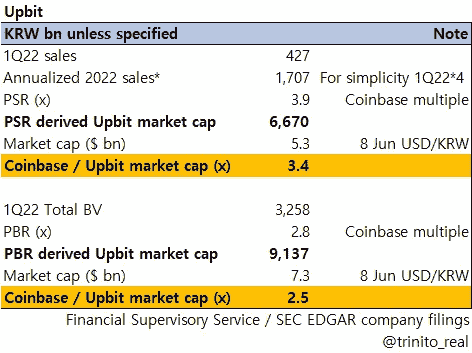

# 上比特与比特币基地比较-第一季度 22

> 原文：<https://medium.com/coinmonks/upbit-vs-coinbase-comparison-1q22-3a4657f01b8e?source=collection_archive---------15----------------------->

[1Q22 财务报表对比]

下面是 CEX 金融系列的最新数据，分别是韩国和美国最大的交易所 Upbit 和比特币基地的第一季度对比。

请看我们之前的帖子:
1) [一览:Upbit Q1 2022 利润表要点](/coinmonks/at-a-glance-upbit-q1-2022-18b1bd8b4717)
2) [一览:Upbit Q1 2022 资产负债表要点](/coinmonks/at-a-glance-upbit-q1-2022-293140213a0f)

# 乐观与比特币基地的比较

## **1)损益表**

**A .顶线和 op 的比较**

***** Pleaseclick the image for expanded view *

*   与去年同期相比，两家公司的收入降幅相同(> 30%)。
*   比特币基地在 1Q21 和 1Q22 的营收一直比 Upbit 高出 3 倍以上。
*   收入下降和 OPEX 增长(同比增幅均超过 100%)导致 OPM Upbit 下降超过 23%，比特币基地下降 102%。
*   虽然其收入基础比 Upbit 高出 3 倍以上，但比特币基地的 OP 一直未能保持同样高的水平。
*   考虑到 Upbit 的美元换算数字由于韩元/美元同比平均汇率的变化而受到更大的打击，Upbit 在防止利润下降方面做得更好，而比特币基地在本季度出现亏损。

**B .比特币基地收入明细**

*   与 Upbit 相比，比特币基地提供了更多关于其收入明细的细节。
*   比特币基地的大部分收入(Upbit 也是如此)仍来自交易费(占总收入的 87%)。
*   零售仍然占据总交易收入的 95%的最大份额，而机构方面的同比降幅更大(-44.8%对-33.6%)。
*   有趣的是，在“区块链奖励”(主要包括公司参与 POS 共识算法网络的赌注收入)的推动下，比特币基地的订阅和服务收入同比增长 169%(尽管顶线下降了 35%)。

>目前，由于外部压力(即“如何成为验证者+在自己的交易所上市+在那里销售”的叙述)，没有韩国 CEX 在该领域表现活跃。

*   比特币基地的保管费同比增长超过 35%，但仅占总收入的不到 3%。

**C .比特币基地交易量/收入明细**

*   与 Upbit(迄今为止)不同，比特币基地对交易量和资产类型的披露提供了更多细节
*   根据上述数字和其他公开信息，Upbit 的交易量远远高于比特币基地(可能高出 10 倍),再次显示了韩国零售的巨大力量
*   值得注意的是，尽管零售交易量大幅下降(同比下降 38%)，但机构交易量同比增长+9%
*   2012 年第一季度，BTC 和瑞士联邦理工学院在比特币基地的总交易量略低于 50%；假设 Upbit 的 BTC 和瑞士联邦理工学院的总体积%低于这个数字是公平的(一般来说，朝鲜也低于这个数字；又名“奥特币王国”)。

## **2)** **资产负债表**

***** Pleaseclick the image for expanded view *

*   两家公司都有大量的现金和现金等价物。(超过 50 亿美元)而 Upbit 的现金占总资产的比例更高，超过 65%(相比之下，比特币基地的水平为 29%)。

>大多数韩国 CEX 不会将客户的现金和/或数字资产作为资产负债表上的资产进行报告；Upbit 在负债部分报告客户的现金存款(2012 年第一季度约为 44.5 亿美元)；Upbit 是韩国唯一一个每年从该地区赚取 0.1%利息收入的 CEX，而所有其他 CEX 都没有赚取一毛钱的利息收入(这在韩国是一个烫手山芋，所以我们希望以后会有变化)；无论如何，比特币基地将此列为资产，并从中赚取利息。

*   比特币基地拥有的密码比 Upbit 多 2 到 3 倍(以美元计算)。这是有道理的，因为 1) Upbit 的佣金主要来自 KRW trading，2)由于法规，韩国 CEX 不能轻易收购或处置 cryptos，因此他们不会积极收购(这对比特币基地来说肯定容易得多)，以及 3)由于法规，限于韩国 CEX 的准无用例(而比特币基地可以贷款，对冲，或使用此类资产进行场外交易等)。

*   上述数字没有直接出现在资产负债表上，而是出现在附注中。
*   Bithumb 在其平台上披露客户资产(而 Upbit 不披露)，如果我们应用 Upbit 和 Bithumb 之间的客户现金余额比率，我们得出前者为 365 亿美元，而比特币基地披露的同类资产为 2460 亿美元。
*   目前没有一家 CEX 在其资产负债表上包括上述数字(因为根据目前的标准，这不是一项义务)，但如果未来有任何变化，这可能真的会使所有这些数字发生巨大变化。

*   与此同时，如果我们看看比特币基地客户资产的百分比，我们可以注意到 BTC/ETH 合计约占总额的 66%。

>将菲亚特从上述 2460 亿美元中剔除，42% * 2460 亿美元= 1033 亿美元/BTC 3 月底的价格为 455.28 亿美元/1033 亿美元，超过 455.28 亿美元= 22.69 亿 BTC

>>如果我们对 ETH 进行同样的计算，我们将得到 1798.1 万个 ETH

>>>所以比特币基地大约代表其客户保留了**226.9 万 BTC**和**1798.1 万 ETHs** ！

## 3)有趣的简单评估组合

现在，我们已经简要介绍了韩国最大的 CEX 和美国最大的 CEX，让我们来做一个简单的估值比较。比特币基地已在纳斯达克上市并活跃交易，而 Upbit 尚未上市。我们将使用比特币基地作为 Upbit 公开可用信息的代理。

***** (来自彭博的)最近的普遍收入估计约为 50 亿美元(同比下降 36%)，因此上述数字稍微保守一些。

*   粗略地说，比特币基地目前的股价是 PSR 的 3.9 倍，账面价值的 2.8 倍。

*   我们得出的市值区间为 6.67 万亿韩元(合 53 亿美元)~ 9.14 万亿韩元(合 73 亿美元)，相当于比特币基地市值的 2.5 倍至 3.4 倍。
*   值得注意的是，PBR 推高的 9.14 万亿韩元市值，与几个韩国未上市股票平台和私下交易中公布的近期数据没有太大差异；我们认为上市后的比特币基地价值是 Upbit 估值的一个强有力的代理。顶线下降/高度集中于加密交易收入等)；现在，比特币基地的市值是否应该超过 Upbit 的 3 倍(或者 Upbit 是否只有比特币基地市值的一半或 1/3)，这要由市场来决定。

>两家公司都受到巨大波动的影响(就像加密市场价格一样),特别是如果你考虑到比特币基地股价今年比 beg 下跌了 72%,而去年 11 月 Hybe(韩国流行乐队 BTS 的代理)收购了 Dunamu 2.5%的股份时，Upbit 的价值约为 20 万亿韩元。

请在未来几周继续关注更多的韩国 CEX 号码！

由 Trinito 联合创始人 Eric Yoo 撰写，Trinito 投资主管 SungPil Huh 供稿。

# Upbit #比特币基地# POS # CEX # bith umb # BTC # ETH #数字资产
# crypto #纳斯达克#Dunamu #Hybe #BTS

# 链接

杜纳姆(Upbit)季报 1q 22
https://dart.fss.or.kr/dsaf001/main.do?rcpNo=20220530000847 T2

比特币基地季报 1q 22
[https://www . sec . gov/Archives/Edgar/data/000167978822000048/coin-20220331 . htm](https://www.sec.gov/Archives/edgar/data/0001679788/000167978822000048/coin-20220331.htm)

> 加入 Coinmonks [电报频道](https://t.me/coincodecap)和 [Youtube 频道](https://www.youtube.com/c/coinmonks/videos)了解加密交易和投资

# 另外，阅读

*   [CoinLoan 审查](https://coincodecap.com/coinloan-review) | [YouHodler 审查](/coinmonks/youhodler-4-easy-ways-to-make-money-98969b9689f2) | [BlockFi 审查](https://coincodecap.com/blockfi-review)
*   [XT.COM 评论](https://coincodecap.com/profittradingapp-for-binance) | [币安评论](https://coincodecap.com/xt-com-review)
*   [SmithBot 评论](https://coincodecap.com/smithbot-review) | [4 款最佳免费开源交易机器人](https://coincodecap.com/free-open-source-trading-bots)
*   [比特币基地僵尸程序](/coinmonks/coinbase-bots-ac6359e897f3) | [AscendEX 审查](/coinmonks/ascendex-review-53e829cf75fa) | [OKEx 交易僵尸程序](/coinmonks/okex-trading-bots-234920f61e60)
*   [如何在印度购买比特币？](/coinmonks/buy-bitcoin-in-india-feb50ddfef94) | [WazirX 审查](/coinmonks/wazirx-review-5c811b074f5b)