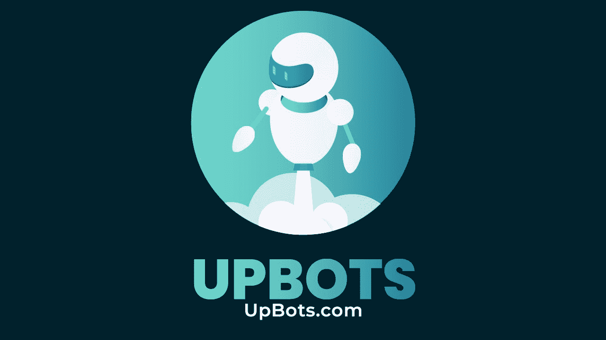
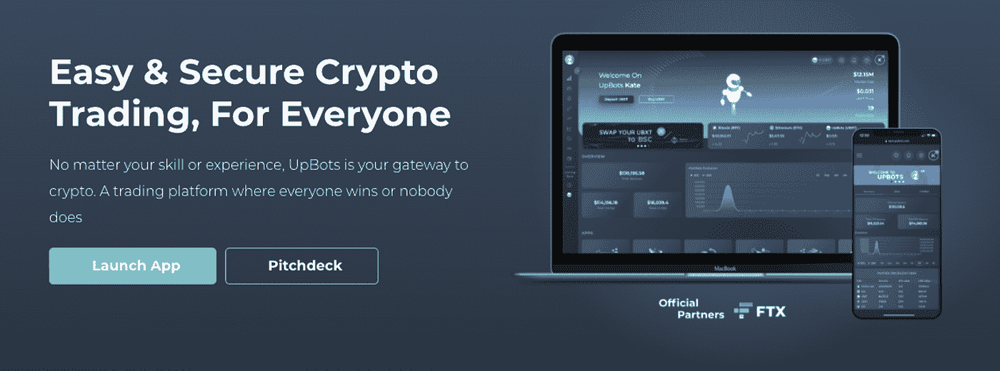
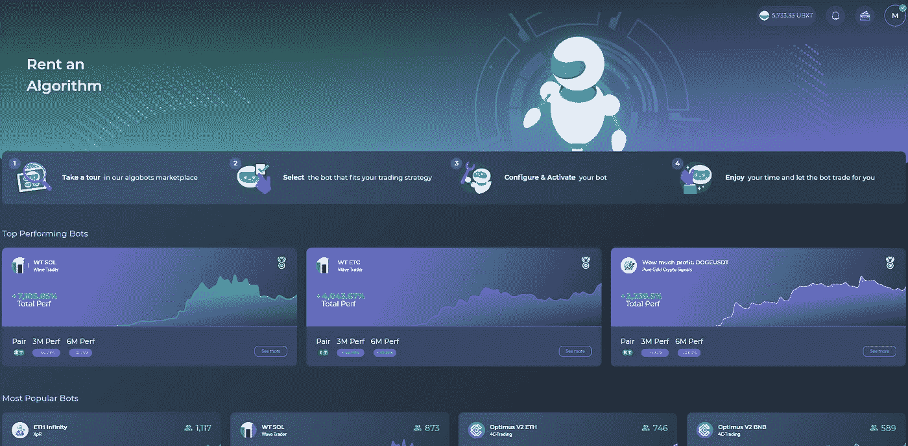
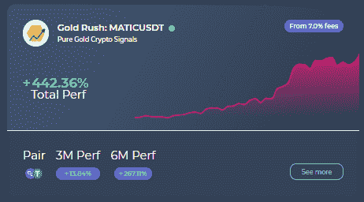
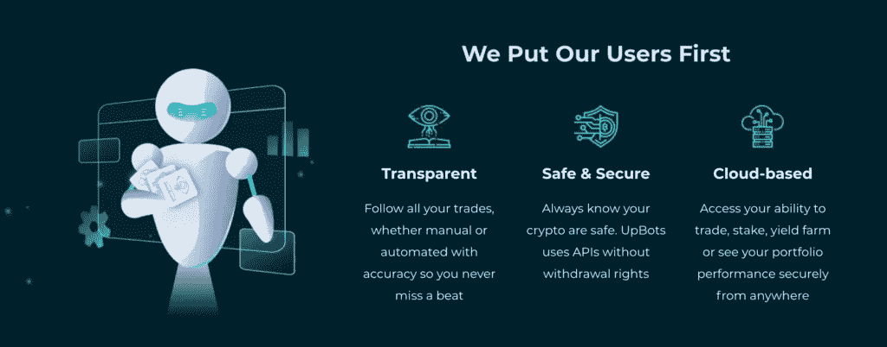

# UpBots:一个所有人都赢或没有人赢的交易平台

> 原文：<https://medium.com/coinmonks/upbots-a-trading-platform-where-everyone-wins-or-nobody-does-390f73d6d825?source=collection_archive---------5----------------------->

嗨，我是莫菲。对于那些还不了解我的人来说，我正在努力寻找更好的方法来获得被动收入，特别是通过交易机器人或项目投资。今天我将分享关于机器人的故事。

鉴于加密货币交易所今天饱和生态系统的速度，新交易平台在吸引大量用户之前开拓独特的销售主张变得非常重要。UpBots 是少数几个创造性地接近这种增长的项目之一。

## 什么是 UpBots？

UpBots 是一个主要为有经验的交易者和新交易者建立的交易平台。它托管并集成了多种服务，UpBots 允许您对您的集中式和分散式投资组合有一个完整的视图。跟踪您的钱包余额和演变随着时间的推移，连接到一个机器人或使用我们的赌注计划赚取 UBXT。

只需快速浏览该平台，其用户友好、易于导航的界面无疑会以其简单性吸引您的注意力。此外，UpBots 提供了几个有趣的工具，如交易机器人、交易课程和其他适合所有经验水平的交易者的功能。该平台的部分使命是提供一个安全可靠的地方，让加密货币初学者能够茁壮成长。

然而，不想采用平台预先定义的策略的用户可以开发自己的算法，另一方面，用户也可以通过复制来“租赁”一个成功的机器人，以换取收益回报。

## 交易机器人

就我而言，我不是加密交易的专业人士，我正在寻找被动收入，正是 UPBots 上的机器人吸引了我，这可能是 UpBots 最有趣的特点。通过使用这些机器人，你可以很容易地简化你的交易策略。这些机器人不仅容易激活，而且一旦激活，交易者所要做的就是坐着看机器人为他们交易资产。交易者只需选择他们希望交易的交易所，以及每个机器人的资本量。他们还需要将 UBXT 分配给 bot 以支付绩效费(成功交易的应付佣金)。一旦设置好这些参数，机器人就会处理剩下的事情。我再往下讲一点令牌 UBXT。

对于更有经验的交易者来说，这个平台已经建立了一个简单的引导过程，允许你根据你的策略开发一个机器人。该功能是为那些希望创建自己的机器人而不是租赁他人开发的机器人的交易者设计的，他们可能会让平台验证您的机器人，以从租赁您的机器人的人的收入中赚取佣金。

在“算法租赁”页面上，您有大量的机器人选择，包括它们的配对和 3 个月和 6 个月的性能。这样你才能找到适合自己的。就我而言，我选择了淘金热:从长期来看，这是一种回报颇丰的投资。

不幸的是，我在币安 API 上投资了大约 100 美元，一个月后的表现大约为-3%。

但是我不担心未来，就像我之前说的，从长远来看这是一个机器人。我喜欢 UpBots，如果你感兴趣的话，我会在接下来的几天测试其他的 bot。

## 如何激活平台上的交易机器人？

**第一步** —向 UpBots
**添加一个加密交易账户第二步** —选择您想要关注的 bot
**第三步** —向您的 UpBots 账户充值 UBXT 的 perf 费用
**第四步** —配置&激活您的 bot
**第五步** —在交易 bot 完成其工作的同时享受您的生活

## 令牌，UBXT

本质上，UpBots 是一种循环经济，其活动范围围绕 UBXT 令牌。UBXT 令牌是区块链不可知的。它在 ETH、BSC 和 SOL 上可用。付款包括订阅 UpBots、信号提供商、绩效费、社交副本交易绩效费、赞助和培训。任何人向平台推荐新会员，以及被推荐人，也可以获得代币作为推荐奖金。

此外，该令牌的使用将部分扩展到交易机器人和社交副本的佣金。因此，高级交易者可以通过向其他交易者提供他们的策略和机器人来赚取 UBXT。UpBots 从这些佣金中保留一小部分作为平台开发的资金。他们 UBXT 收入的一部分也将被定期烧掉，以避免象征性的通货膨胀。

## 结论

作为一个交易平台，UpBots 拥有经验丰富的交易者和业余交易者成功所需的所有功能。我觉得获得机器人副本很有趣，尤其是对于业余爱好者或那些想通过遵循适合自己的策略来获得被动收入的人。不要忘记:

> “要么大家都赢，要么没人赢”

这也激励了机器人程序员去寻找最好的策略，并使其进化到最佳性能。

**隶属关系**

这篇文章包含附属链接。没有额外的费用给你，UpBots 给我 200 UBXT，你也是。

这有助于我测试其他程序和平台，所以我可以与您分享。

这里是推荐链接: [UpBots](https://next.upbots.com/auth/register?ref=Q2E3B6O6&userName=Moffice)

Moffice

#加密#交易#骗局#比特币# UpBots #交易 Bot #CEX #DEX

> 加入 Coinmonks [电报频道](https://t.me/coincodecap)和 [Youtube 频道](https://www.youtube.com/c/coinmonks/videos)了解加密交易和投资

# 另外，阅读

*   [Bookmap 点评](https://coincodecap.com/bookmap-review-2021-best-trading-software) | [美国 5 大最佳加密交易所](https://coincodecap.com/crypto-exchange-usa)
*   最佳加密[硬件钱包](/coinmonks/hardware-wallets-dfa1211730c6) | [Bitbns 评论](/coinmonks/bitbns-review-38256a07e161)
*   [新加坡十大最佳加密交易所](https://coincodecap.com/crypto-exchange-in-singapore) | [购买 AXS](https://coincodecap.com/buy-axs-token)
*   [红狗赌场评论](https://coincodecap.com/red-dog-casino-review) | [Swyftx 评论](https://coincodecap.com/swyftx-review) | [CoinGate 评论](https://coincodecap.com/coingate-review)
*   [投资印度的最佳密码](https://coincodecap.com/best-crypto-to-invest-in-india-in-2021)|[WazirX P2P](https://coincodecap.com/wazirx-p2p)|[Hi Dollar Review](https://coincodecap.com/hi-dollar-review)