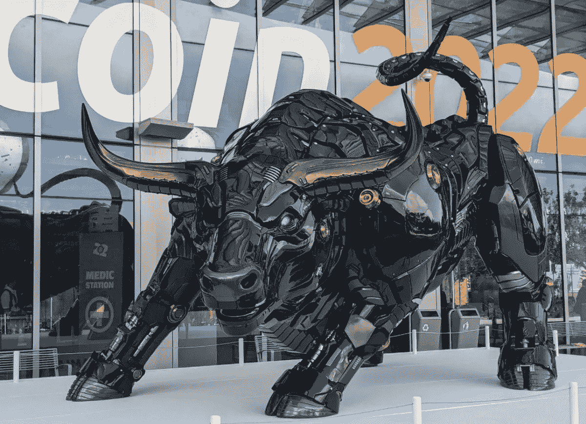
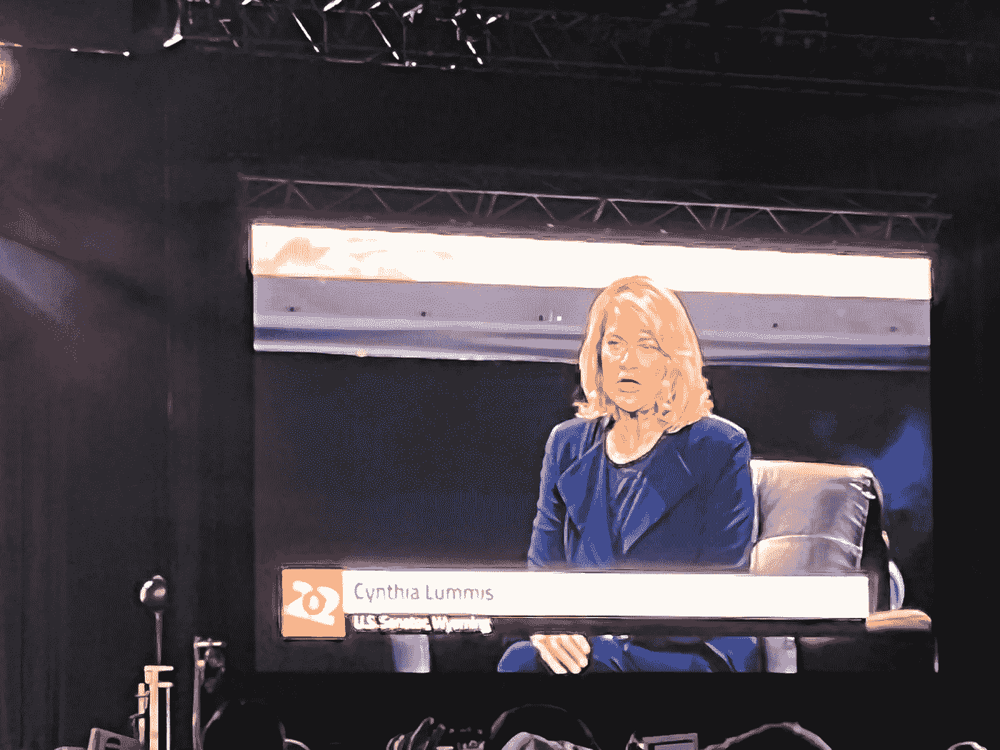

# 来自前线的加密政策和法规更新(2022 年 4 月)

> 原文：<https://medium.com/coinmonks/update-on-crypto-policy-and-regulation-from-the-front-lines-april-2022-ef91825ceaf8?source=collection_archive---------53----------------------->

作者:[克里斯托弗·h·卢，医学博士](http://www.drchrisloomdphd.com)

Miami Bitcoin Conference 2022

1.  2022 年 3 月 9 日，乔·拜登总统发布了[“关于确保数字资产负责任发展的行政命令”](https://www.whitehouse.gov/briefing-room/presidential-actions/2022/03/09/executive-order-on-ensuring-responsible-development-of-digital-assets/)，呼吁对包括加密货币在内的数字资产进行广泛审查。该行政命令要求政府审查加密货币资产的风险和收益。
2.  2022 年 3 月 28 日，美国国会议员推出[《电子货币与安全硬件法案》(ECASH Act)](https://ecashact.us/) 。该法案呼吁开发美元的电子版本。该法案旨在推动一种方便、易用、数字化的美元，并促进传统上被金融边缘化的人的经济包容，同时“最大限度地”保护消费者和数据隐私。该法案由众议院金融服务委员会金融科技工作组主席斯蒂芬·林奇发起。电子现金将由财政部而不是美联储发行。因此，从技术上讲，它不能被认为是 CBDC，也不能建在区块链。对 CBDC 氏症的担忧是，它们将被用作一种监视和限制个人隐私的形式。
3.  怀俄明州参议员辛西娅·卢米斯(Cynthia Lummis)概述了一项新的两党法案[“负责任的金融创新法案”](https://decrypt.co/94834/bill-bitcoin-senator-lummis-alter-capital-gains-landscape-crypto)，旨在推动美国的比特币创新。最近在迈阿密举行的比特币 2022 会议上，在与马克·桑托里的炉边讨论中，她表示她不认为美国会向 CBDC 迁移，但会采用一种稳定的类似于比特币的数字货币，以维护个人隐私。
4.  [汉密尔顿项目](https://www.bostonfed.org/publications/one-time-pubs/project-hamilton-phase-1-executive-summary.aspx) —波士顿美联储大学和麻省理工学院的联合项目，旨在研究和检验 CBDC 的开发、可用性、可行性、可扩展性和实用性。

Senator Cynthia Lummis (Miami Bitcoin Conference 2022)

那么，所有这些最近的发展意味着什么呢？

1.  这对更广泛的密码行业意味着什么？
2.  为什么白宫现在突然感兴趣了？
3.  这是什么信号？

过去十年来，重大的金融、地缘政治和社会危机凸显了不稳定的金融体系中不健全的货币、腐败的政府体制所带来的问题。

1.  经济危机越来越频繁、越来越严重、越来越普遍
2.  不稳定的货币导致恶性通货膨胀
3.  过度的政府债务和税收
4.  利润私有化在少数人手里，亏损由纳税人补贴
5.  缺乏自主权和财务控制
6.  缺乏隐私
7.  监督
8.  缺乏经济包容、准入和机会

由于过时的金融基础设施和系统，加密资产及其市场近年来出现了显著增长。

然而，这一极其新兴的行业中的重大问题围绕着如下问题:

1.  价格过度波动
2.  可能用于犯罪和非法活动
3.  市场操纵
4.  加密开采和网络维护的高能耗，以及相关的环境风险
5.  隐私和安全
6.  赋税
7.  政策和法规

美国政府希望将上述风险降至最低，同时又不丧失在这一快速增长行业中的领导地位和利益。

然而，近年来许多公司和企业家[已经](https://thecryptobasic.com/2022/04/16/ripple-ceo-more-and-more-talent-and-investment-leaving-u-s-because-of-not-clearer-crypto-laws/)离开美国，前往新加坡、欧洲和拉丁美洲等国家，原因是缺乏监管清晰度和如何在这一领域创新的清晰框架。

抑制增长的进一步例子可以在最近的严厉监管政策中看到，如禁止地下采矿(中国)，加拿大政府冻结参与向卡车司机和平抗议捐款的人的资产，对俄罗斯实施的制裁，以及无数其他例子。

美国利用了互联网革命，因此硅谷成为了世界上一些最有价值的科技公司的所在地(苹果、Meta、谷歌)。

为了保持其作为全球强国的地位，促进加密行业的创新和增长，同时提供明确的监管、合规、法律和金融保障措施至关重要。

拜登总统、卢米斯参议员和斯蒂芬·林奇最近推出的监管政策表明，Capital Hill 承认加密行业、其潜力以及缺点，并要求政府机构成立委员会，研究加密货币，并努力为加密资产市场创建监管框架。

这表明美国继续对密码的存在持开放态度，并希望保持在创新的前沿，同时提供明确的监管框架。

**关于:**[Christopher Loo](http://www.drchrisloomdphd.com)博士是一名内科医生，他在 29 岁时获得财务自由，并在 38 岁时提前退休，这是 2008 年金融危机后进行战略投资的结果。他是由贝勒医学院和莱斯大学生物工程系联合提供的医学博士项目的毕业生，是《我如何放弃赚钱的职业并利用房地产实现财务自由》的作者，也是医生财务自由播客的主持人。他是 KevinMD 的定期撰稿人，并谈到了金融知识对被动收入 MD、白大褂投资者、Board Vitals、SEAK 非临床职业、一些 Docs、Doximity、Medpage Today、FinCon 和其他面向高收入专业人士的高知名度金融品牌的重要性。他对加密、金融科技和创新在未来几十年为整个世界实现金融自由、经济包容、准入和机会方面将发挥的作用充满热情。

> 加入 Coinmonks [电报频道](https://t.me/coincodecap)和 [Youtube 频道](https://www.youtube.com/c/coinmonks/videos)了解加密交易和投资

# 另外，阅读

*   [折叠 App 回顾](https://coincodecap.com/fold-app-review) | [本地比特币回顾](/coinmonks/localbitcoins-review-6cc001c6ed56) | [Bybit vs 币安](https://coincodecap.com/bybit-binance-moonxbt)
*   [加密保证金交易交易所](/coinmonks/crypto-margin-trading-exchanges-428b1f7ad108) | [赚取比特币](/coinmonks/earn-bitcoin-6e8bd3c592d9) | [Mudrex 投资](https://coincodecap.com/mudrex-invest-review-the-best-way-to-invest-in-crypto)
*   [WazirX vs coin dcx vs bit bns](/coinmonks/wazirx-vs-coindcx-vs-bitbns-149f4f19a2f1)|[block fi vs coin loan vs Nexo](/coinmonks/blockfi-vs-coinloan-vs-nexo-cb624635230d)
*   [比斯勒评论](https://coincodecap.com/bitsler-review)|[WazirX vs coin switch vs coin dcx](https://coincodecap.com/wazirx-vs-coinswitch-vs-coindcx)
*   [7 大副本交易平台](https://coincodecap.com/copy-trading-platforms) | [买币点评](https://coincodecap.com/buycoins-review)
*   XT.COM 评论[币安评论](https://coincodecap.com/profittradingapp-for-binance) |