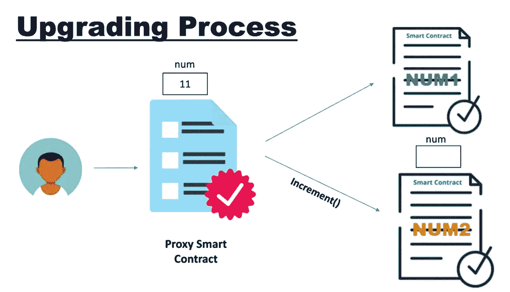

# 升级智能合同(代理)

> 原文：<https://medium.com/coinmonks/upgrading-smart-contract-proxy-657be91c2557?source=collection_archive---------52----------------------->

让我们先来了解一下为什么有人想要升级他们的智能合同？这个问题的答案很简单，创作者可能希望在合同中添加一些新功能，就像我们都收到通知，更新我们手机的软件以获得新功能。其次，如果智能合约被黑客攻击，或者甚至有一个 bug，这可能是有帮助的。

你可能会认为我们可以部署一个全新的升级合同，但是部署一个新的合同将再次花费你大量的天然气费用，而且我们的合同地址也会改变，因为我们可能会失去与以前的智能合同相关的客户。

> 交易新手？试试[加密交易机器人](/coinmonks/crypto-trading-bot-c2ffce8acb2a)或者[复制交易](/coinmonks/top-10-crypto-copy-trading-platforms-for-beginners-d0c37c7d698c)

**如何升级？**

Openzeppelin 升级插件用于修改智能合同的代码，同时保留它们的地址、状态和余额。

当您使用 deployProxy 部署协定时，该协定实例可以在以后升级。

只有最初部署合同的地址有权升级它。

不变性真的会受到影响吗？

如果我们看到这个过程，我们就会明白，我们既不能直接在我们的版本 1 契约中修改值，也不能在版本 2 契约中修改值。这就像我们已经聘请了代理管理合同，谁是调用基于需求的合同，并作出改变。

通过**实现契约**使用逻辑

状态通过**代理契约**使用