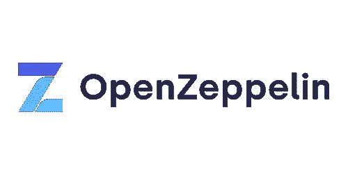
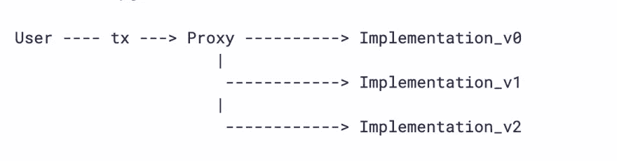

# 使用 OpenZeppelin 升级插件升级智能合同

> 原文：<https://medium.com/coinmonks/upgrading-smart-contracts-using-openzeppelin-upgrade-plugin-d0213fb5ab53?source=collection_archive---------4----------------------->


# 一点介绍

当我看到可升级合同时，我有点吃惊。*升级*？当智能合约被设计为默认不可变时，为什么升级是一个话题？*一旦在区块链上签订了合同，就无法更改了*。你可能和我有同样的问题/想法，甚至更多。在研究如何编写可升级合约时，我在理解和找到一个解释清楚的指南方面遇到了一点挑战，这就是为什么我将在本文中讨论一些基础知识，并向您展示如何使用 openzepplin 插件编写一个简单的可升级智能合约。

# 为什么

有些情况需要修改合同。与日常生活相关，签订合同的双方可以决定更改协议，也许他们必须删除一些条款或增加一些条款或修正错误。只要他们双方都同意，就可以改变。在以太坊这样的区块链上，可能在已经部署到生产中的智能合约中发现了一个 bug，或者只是需要更多的功能。可能是任何事。它绝对需要升级。

# OpenZepplin



OpenZeppelin

在保护产品、自动化和操作分散应用方面，OpenZeppelin 是领先的公司。他们通过对系统和产品进行安全审计来保护领先的组织。他们有一个以太坊网络的模块化、可重用、安全的智能合同库，用 Solidity 编写。多亏了 [OpenZeppelin 升级插件](https://docs.openzeppelin.com/upgrades-plugins/1.x/)，在保留地址、状态和余额等重要信息的同时，修改合同非常容易。

# 怎么做

智能合约可以使用代理进行升级。基本上，有两个合同:

1.  契约 1(代理/访问点):这个契约是一个将直接交互的代理或包装器。它还负责在我接下来要谈到的第二个合同中来回发送事务
2.  契约 2(逻辑契约):这个契约包含逻辑。

***需要注意的一点是，代理从不改变，但是，您可以将逻辑契约换成另一个契约，这意味着接入点/代理可以指向不同的逻辑契约(换句话说，它得到了升级)。这在下面的*和**中有说明



*来源:*[*https://docs . open zeppelin . com/upgrades-plugins/1 . x/proxy # upgrading-via-the-proxy-pattern*](https://docs.openzeppelin.com/upgrades-plugins/1.x/proxies#upgrading-via-the-proxy-pattern)

要了解有关代理概念的更多信息，请访问[openzeplin 代理升级模式文档页面](https://docs.openzeppelin.com/upgrades-plugins/1.x/proxies)和[openzeplin 代理页面](https://docs.openzeppelin.com/contracts/4.x/api/proxy)

# 可升级性模式

我们有几种可升级模式。下面列出了四种模式

*   UUPS 代理:EIP1822
*   透明代理:EIP1967(我们将在本文中重点关注这一点)
*   钻石储存:EIP2355
*   永恒存储:ERC930

# 透明代理(EIP1967)

透明代理包括代理本身的升级和管理逻辑。我认为管理员是启动第一次升级的合同的所有者。

使用透明代理，除了调用代理的管理员之外的任何帐户都将把他们的调用转发到实现。同样，如果管理员调用代理，它可以访问管理功能，但是管理调用永远不会被转发到实现。

总之，对于管理员来说，最好是一个专用帐户，只用于其目的，这显然是管理员*。*

# *实际步骤*

*先决条件:如何设置开发环境和如何编写智能合同的知识。更多信息[点击此处](https://docs.openzeppelin.com/learn/developing-smart-contracts)*

*让我们写一份可升级的合同吧！我们将开放 zeplin 的安全帽升级插件。要安装，只需运行*

```
*npm install --save-dev @openzeppelin/hardhat-upgrades @nomiclabs/hardhat-ethers ethers*
```

*在您的`hardhat.config`文件中，您需要加载它*

```
*// js
require('@openzeppelin/hardhat-upgrades');// ts
import '@openzeppelin/hardhat-upgrades';*
```

**我将在这篇文章中使用 js**

*您的`hardhat.config.js`文件应该与此类似*

```
*require("@nomiclabs/hardhat-ethers");
require("@openzeppelin/hardhat-upgrades");
require("@nomiclabs/hardhat-etherscan");//Using alchemy because I intend to deploy on goerli testnet, an apikey is required
//The mnemonic is your account's mnemonic
//if you intend to verify your contracts, you need to open an account on etherscan and copy the apikey
//all important keys should not be exposed, it can be kept in a secret.json file and added to gitignoreconst { alchemyApiKey, mnemonic } = require("./secrets.json");module.exports = {
  networks: {
    goerli: {
      url: `https://eth-goerli.alchemyapi.io/v2/${alchemyApiKey}`,
      accounts: { mnemonic: mnemonic },
    },
  },
  etherscan: {
    apiKey: "YOUR_API_KEY",
  },
  solidity: "0.8.4",
};*
```

***合同一(** `**contracts/Atm.sol**` **)(代理合同)***

*在您的 contracts 文件夹中，创建一个新的`.sol`文件。在本文中，我将模拟一个自动取款机/银行。于是，创造了`Atm.sol`。代码应该如下所示*

```
*// SPDX-License-Identifier: MIT
pragma solidity ^0.8.0;
contract Atm { // Declare state variables of the contract
    uint256 bankBalances; // Allow the owner to deposit money into the account
    function deposit(uint256 amount) public {
        bankBalances += amount;
    }
    function getBalance() public view returns (uint256) {
        return bankBalances;
    }
}*
```

***测试合同***

*如下图所示，在`test/Atm-test.js`中测试您的合同*

```
*const { expect } = require("chai");
const { ethers } = require("hardhat");describe("Atm", function () {
  before(async function () {
    this.Atm = await ethers.getContractFactory("Atm");
  }); beforeEach(async function () {
    this.atm = await this.Atm.deploy();
    await this.atm.deployed(); it("", async function () {});
    await this.atm.deposit(1000);
    expect((await this.atm.getBalance()).toString()).to.equal("1000");
  });
});*
```

*要进行测试，请运行以下命令*

```
*npx hardhat test*
```

***部署合同***

**！重要提示:*为了能够升级自动柜员机合同，我们需要首先将其部署为可升级合同。这与我们习惯的部署程序不同。我们正在初始化开始余额为 0。该脚本使用来自插件的`deployProxy`方法。*

*创建一个`deploy-atm.js`脚本*

```
*const { ethers, upgrades } = require("hardhat");async function main() {
  const Atm = await ethers.getContractFactory("Atm");
  console.log("Deploying Atm...");
  const atm = await upgrades.deployProxy(Atm, [0], {
    initializer: "deposit",
  }); console.log(atm.address, " atm(proxy) address");
}main().catch((error) => {
  console.error(error);
  process.exitCode = 1;
});*
```

*您也可以决定对此进行测试。如果您希望测试，您的测试文件应该类似于以下内容*

***测试脚本***

```
*const { expect } = require("chai");
const { ethers, upgrades } = require("hardhat");
const { Contract, BigNumber } = "ethers";describe("Atm (proxy)", function () {
  let box = Contract; beforeEach(async function () {
    const Atm = await ethers.getContractFactory("Atm");
    //initilize with 0
    atm = await upgrades.deployProxy(Atm, [0], { initializer: "deposit" });
  }); it("should return available balance", async function () { expect((await atm.getBalance()).toString()).to.equal("0"); await atm.deposit(1000);
    expect((await atm.getBalance()).toString()).to.equal("1000");
  });
});*
```

*确认测试后，*

*让我们先部署到本地，我们使用 run 命令并将 Atm 合同部署到 dev network。*

```
*$ npx hardhat run --network localhost scripts/deploy-atm.js
Deploying Atm...
0xDc64a140Aa3E981100a9becA4E685f962f0cF6C9  atm(proxy) address*
```

*至此，我们已经成功部署并拥有了我们的代理和管理地址。*

***合同二***

*我们想添加一个新的功能到我们的合同，一个简单的功能是包括一个添加功能，增加 500 到我们的平衡。*

*创建`contracts/AtmV2.sol`*

```
*// SPDX-License-Identifier: MIT
pragma solidity ^0.8.0;import "./Atm.sol";contract AtmV2 is Atm{
    // adds to the balance by 500
    function add() public {
        deposit(getBalance()+500);
    }
}*
```

***测试合同***

*参考我们如何测试合同 1，基本上遵循相同的逻辑。*

***升级合同***

*现在是使用我们的代理/接入点地址的时候了。我们将使用插件中的`upgradeProxy and 'getAdmin'`方法。从上面的部署控制台调用我们的代理地址，因为我们在这里需要它。*

*创造`scripts/upgrade-atmV2.js`。您的脚本应该类似于以下内容*

```
*const { ethers, upgrades } = require("hardhat");const proxyAddress = "YOUR_PROXY_ADDRESS_FROM_DEPLOYMENT";async function main() {
  console.log(proxyAddress, " original Atm(proxy) address");
  const AtmV2 = await ethers.getContractFactory("AtmV2");
  console.log("upgrade to AtmV2...");
  const atmV2 = await upgrades.upgradeProxy(proxyAddress, AtmV2);
  console.log(atmV2.address, " AtmV2 address(should be the same)");
  console.log(
    await upgrades.erc1967.getAdminAddress(atmV2.address),
    "Proxy Admin"
  );
console.log('Atm upgraded');
}main().catch((error) => {
  console.error(error);
  process.exitCode = 1;
});*
```

***测试脚本***

*创建一个`scripts/AtmProxyV2-test.js`。它应该看起来像这样*

```
*const { expect } = require("chai");
const { ethers, upgrades } = require("hardhat");
const { Contract, BigNumber } = "ethers";describe("Atm (proxy) V2", function () {
  let atm = Contract;
  let atmV2 = Contract; beforeEach(async function () {
    const Atm = await ethers.getContractFactory("Atm");
    const AtmV2 = await ethers.getContractFactory("AtmV2"); //initilize with 0
    atm = await upgrades.deployProxy(Atm, [0], { initializer: "deposit" }); atmV2 = await upgrades.upgradeProxy(atm.address, AtmV2);
  }); it("should get balance and addition correctly", async function () {
    expect((await atmV2.getBalance()).toString()).to.equal("0"); await atmV2.add();
    //result = 0 + 500 = 500
    expect((await atmV2.getBalance()).toString()).to.equal("500");
    //balance is now 500, so add 100;
    await atmV2.deposit(100);
    //result = 500 + 100 = 600
    expect((await atmV2.getBalance()).toString()).to.equal("600");
  });
});*
```

*确认测试后，*

*让我们部署我们新添加的具有附加功能的合同，我们使用 run 命令并将 AtmV2 合同部署到 dev network。*

```
*npx hardhat run --network localhost scripts/upgrade-atmV2.js
Compilation finished successfully
upgrade to AtmV2...
0xDc64a140Aa3E981100a9becA4E685f962f0cF6C9  AtmV2 address(should be the same)
0xe7f1725E7734CE288F8367e1Bb143E90bb3F0512  Proxy Admin*
```

*部署在格利上，只需更换*

```
*npx hardhat run --network localhost*
```

*随着*

```
*npx hardhat run --network goerli*
```

*现在你有了它，在 [Goerli Explorer](https://goerli.etherscan.io/) 上检查你的地址并验证它。*

*要查看所有合同，您可以访问查看我的合同*

*   *[委托书(合同一)](https://goerli.etherscan.io/address/0xB8E702904efb9D0DCC3601135922e870F9a10fF4)*
*   *[逻辑实现(合同二)](https://goerli.etherscan.io/address/0xdA10DF35A73984de06d0B70870A98650a4316982)*
*   *代理管理员*

# *摘要*

*虽然这是一种使用 openzeplin 插件的快速方法，并且它因团队而异，但理解和进行升级的更好方法是将[透明代理 sol](https://github.com/OpenZeppelin/openzeppelin-contracts/tree/master/contracts/proxy/transparent) 文件和相关 sol 文件从 openzeplin 复制到您的项目中。这可以保护您免受上游攻击。*

*这就到了本文的结尾。希望你学到了一些东西。我也希望得到反馈！请留言评论。快乐大厦！*

*参考资料:
[https://docs . open zeppelin . com/upgrades-plugins/1 . x/writing-upgradable](https://docs.openzeppelin.com/upgrades-plugins/1.x/writing-upgradeable)*

*[https://github . com/open zeppelin/open zeppelin-contracts/tree/master/contracts/proxy](https://github.com/OpenZeppelin/openzeppelin-contracts/tree/master/contracts/proxy)*

*[https://dev . to/yakult/tutorial-write-upgradable-smart-contract-proxy-contract-with-open zeppelin-1916](https://dev.to/yakult/tutorial-write-upgradeable-smart-contract-proxy-contract-with-openzeppelin-1916)*

> *加入 Coinmonks [电报频道](https://t.me/coincodecap)和 [Youtube 频道](https://www.youtube.com/c/coinmonks/videos)了解加密交易和投资*

# *另外，阅读*

*   *[3 商业评论](/coinmonks/3commas-review-an-excellent-crypto-trading-bot-2020-1313a58bec92) | [Pionex 评论](https://coincodecap.com/pionex-review-exchange-with-crypto-trading-bot) | [Coinrule 评论](/coinmonks/coinrule-review-2021-a-beginner-friendly-crypto-trading-bot-daf0504848ba)*
*   *[莱杰 vs n rave](/coinmonks/ledger-vs-ngrave-zero-7e40f0c1d694)|[莱杰 nano s vs x](/coinmonks/ledger-nano-s-vs-x-battery-hardware-price-storage-59a6663fe3b0) | [币安评论](/coinmonks/binance-review-ee10d3bf3b6e)*
*   *[Bybit Exchange 评论](/coinmonks/bybit-exchange-review-dbd570019b71) | [Bityard 评论](https://coincodecap.com/bityard-reivew) | [Jet-Bot 评论](https://coincodecap.com/jet-bot-review)*
*   *[3 commas vs crypto hopper](/coinmonks/3commas-vs-pionex-vs-cryptohopper-best-crypto-bot-6a98d2baa203)|[赚取秘密利息](/coinmonks/earn-crypto-interest-b10b810fdda3)*
*   *最好的比特币[硬件钱包](/coinmonks/hardware-wallets-dfa1211730c6) | [BitBox02 回顾](/coinmonks/bitbox02-review-your-swiss-bitcoin-hardware-wallet-c36c88fff29)*
*   *[BlockFi vs 摄氏度](/coinmonks/blockfi-vs-celsius-vs-hodlnaut-8a1cc8c26630) | [Hodlnaut 审核](/coinmonks/hodlnaut-review-best-way-to-hodl-is-to-earn-interest-on-your-bitcoin-6658a8c19edf) | [KuCoin 审核](https://coincodecap.com/kucoin-review)*
*   *[Bitsgap 评审](/coinmonks/bitsgap-review-a-crypto-trading-bot-that-makes-easy-money-a5d88a336df2) | [Quadency 评审](/coinmonks/quadency-review-a-crypto-trading-automation-platform-3068eaa374e1) | [Bitbns 评审](/coinmonks/bitbns-review-38256a07e161)*