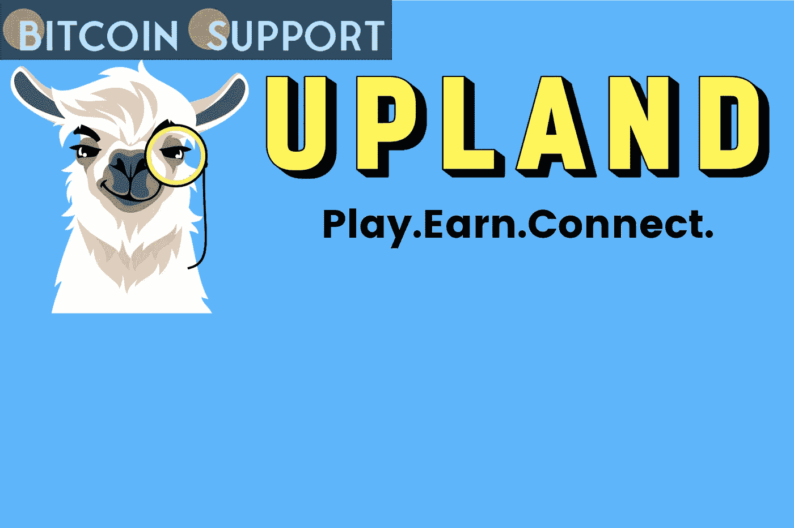

# 成功发布后，高地元宇宙扩展了新功能

> 原文：<https://medium.com/coinmonks/upland-metaverse-expands-with-new-features-following-a-successful-launch-a76ecfb657af?source=collection_archive---------60----------------------->

**Visit our website for full blog:-**[**https://bitcoinsupports.com/upland-metaverse-expands-with-new-features-following-a-successful-launch/**](https://bitcoinsupports.com/upland-metaverse-expands-with-new-features-following-a-successful-launch/)

高地的最新发展将使你能够开始在元宇宙自己的生意，赚取代币，并建立自己作为一个真正的企业家。此外，NFT 汽车正在走向平台，带来了令人兴奋的新方式来享受游戏赚取的经验，如街头赛车。

这是加入元宇宙的最佳机会:访问此链接，获得双倍的 6000 UPX 注册奖金。

**高地经济表现良好**

高地是一个映射到现实世界的 NFT 元宇宙，用户可以在其中使用游戏中的硬币 UPX 购买、出售和交换数字财产。这是一款免费游戏，可以在 iOS、Android 和网络上下载。最近，元宇宙实现了一些值得注意的里程碑，显示了其经济的力量。

自 2021 年以来，高地社区已经发展到 252，594 名业主，游戏玩家已经赚了超过 280 万美元。除了财产，铸造的 NFT 资产总数(如探险者，NFLPA 合法，精神合法，和结构装饰 NFT)达到 905，831，包括 20，077 独特的 NFT。此外，游戏中创建的属性总数为 2，883，723 个。

此外，在此期间购买了 35，819，364，000 UPX。日均交易量为 107，316，000 UPX。

高地房地产市场同样相当繁忙，一级市场每天有 5962 笔交易，二级市场每天有 6701 笔交易。一级市场交易 2，635，225 笔，二级市场销售 1，983，560 笔。事实证明，在二级市场上，高地房屋的平均售价是其初始价格的 3.58 倍，业主们已经做得非常好了。

**高地元宇宙很快就会有商店和赛车**

高地经济被赋予了在未来保持其当前表现水平的选择权，正如元宇宙的工程师们所添加的令人兴奋的新功能一样。Metaventures 就是这样一种发展——玩家拥有并经营遍布高地的商店。这些将使未来的企业家能够在元宇宙建立新的经济和谋生手段。每个 Metaventure 所有者都将有机会通过创建、制造和销售 NFT 来发展自己独特的品牌，并作为其他玩家的经纪人和出借游戏中的资产。十名参与者已经建立了自己的品牌，并准备在 Metaventures 的测试版中推出他们独一无二的 Block Explorers。

https://youtu.be/hpY-EbSU3wc

此外，NFT 汽车即将登陆陆地！一种新的交通模式将提供实时旅游、赛车和汽车相关的商业前景。高地甚至形成了自己的汽车品牌，M 汽车，将首次在加利福尼亚州圣克拉拉的旗舰展厅。汽车将用于城市之间和城市内部的交通，有些城市只能通过汽车才能到达。玩家将能够连接到拼车，这将通过允许在高地运输货物来实现服务经济。赛车将是一个互动的体验，玩家在高地赞助和玩家生成的比赛中竞争(见下面的视频)。此外，玩家将能够经营一系列新的与汽车相关的元企业，包括展厅(经销商)、车身商店和赛车学院。甚至传统的汽车制造商也被要求通过这一最新的高地进步加入到 Web3 革命中来。

[https://youtu.be/b7J2z6s2tbE](https://youtu.be/b7J2z6s2tbE)

**访问我们的网站获取完整博客:-**[**https://bitcoinsupports . com/upland-元宇宙-expands-with-new-features-following-a-successful-launch/**](https://bitcoinsupports.com/upland-metaverse-expands-with-new-features-following-a-successful-launch/)

**免责声明:以上为作者观点，不应视为投资建议。读者应该自己做研究。**

> 加入 Coinmonks [电报频道](https://t.me/coincodecap)和 [Youtube 频道](https://www.youtube.com/c/coinmonks/videos)了解加密交易和投资

# 另外，阅读

*   [Bookmap 点评](https://coincodecap.com/bookmap-review-2021-best-trading-software) | [美国 5 大最佳加密交易所](https://coincodecap.com/crypto-exchange-usa)
*   最佳加密[硬件钱包](/coinmonks/hardware-wallets-dfa1211730c6) | [Bitbns 评论](/coinmonks/bitbns-review-38256a07e161)
*   [新加坡十大最佳加密交易所](https://coincodecap.com/crypto-exchange-in-singapore) | [购买 AXS](https://coincodecap.com/buy-axs-token)
*   [红狗赌场评论](https://coincodecap.com/red-dog-casino-review) | [Swyftx 评论](https://coincodecap.com/swyftx-review) | [CoinGate 评论](https://coincodecap.com/coingate-review)
*   [投资印度的最佳密码](https://coincodecap.com/best-crypto-to-invest-in-india-in-2021)|[WazirX P2P](https://coincodecap.com/wazirx-p2p)|[Hi Dollar Review](https://coincodecap.com/hi-dollar-review)