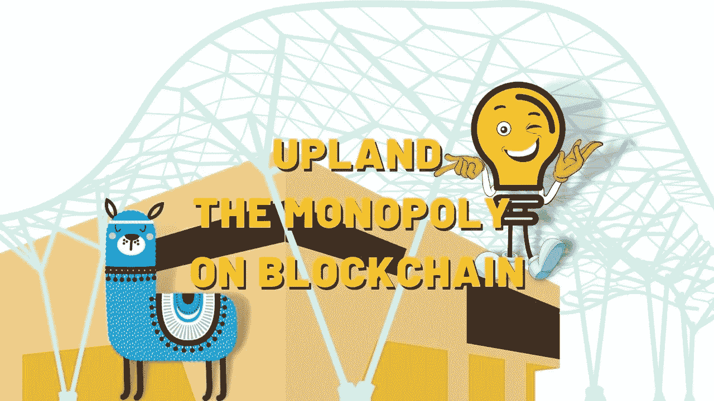
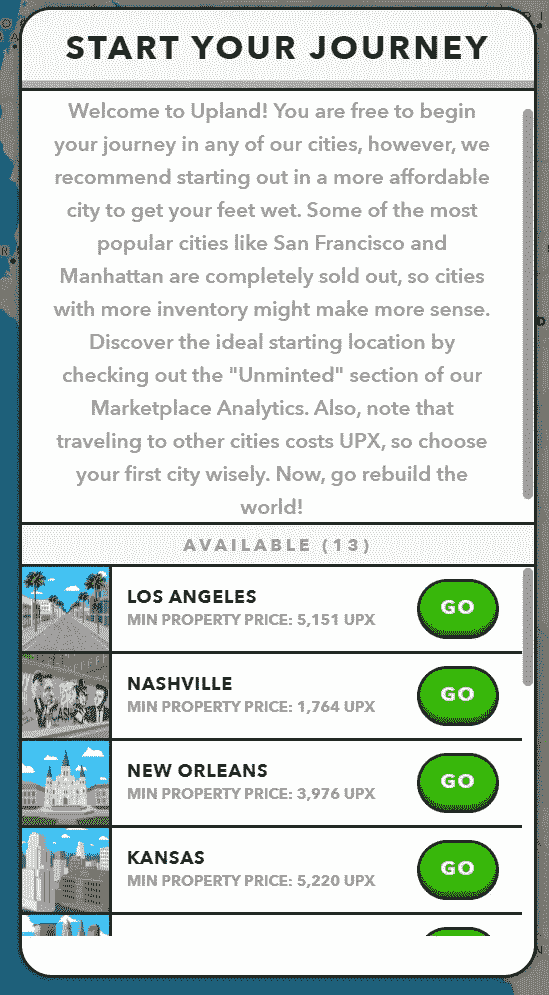
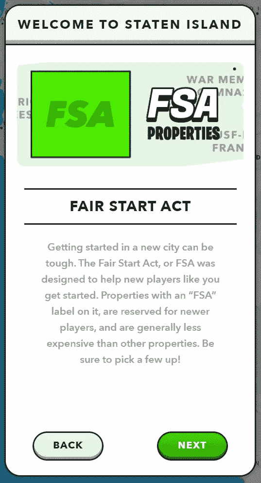
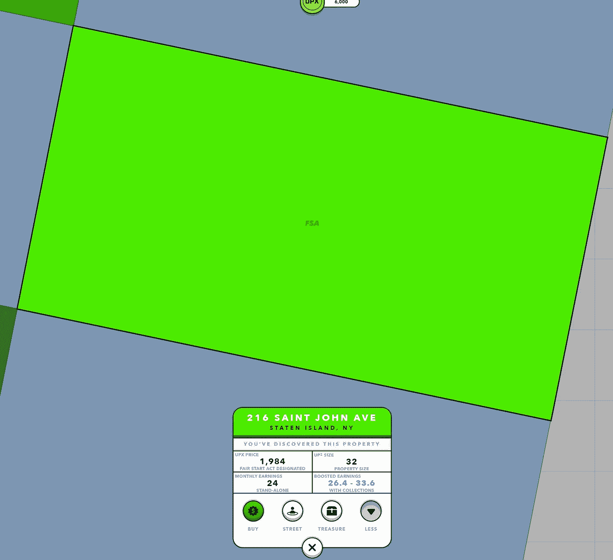
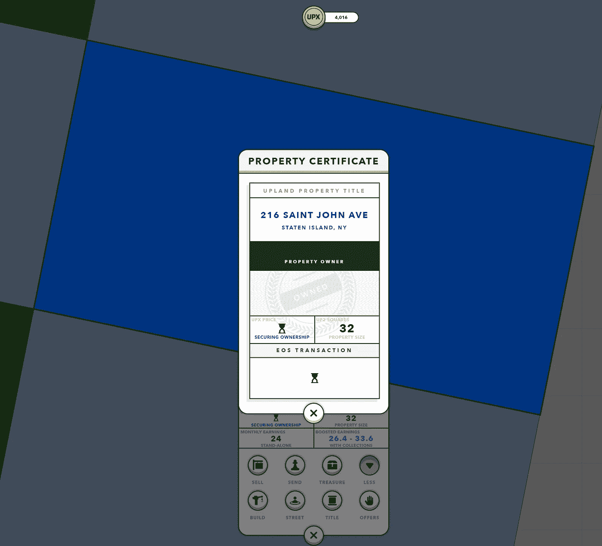
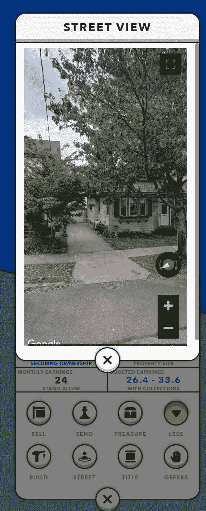
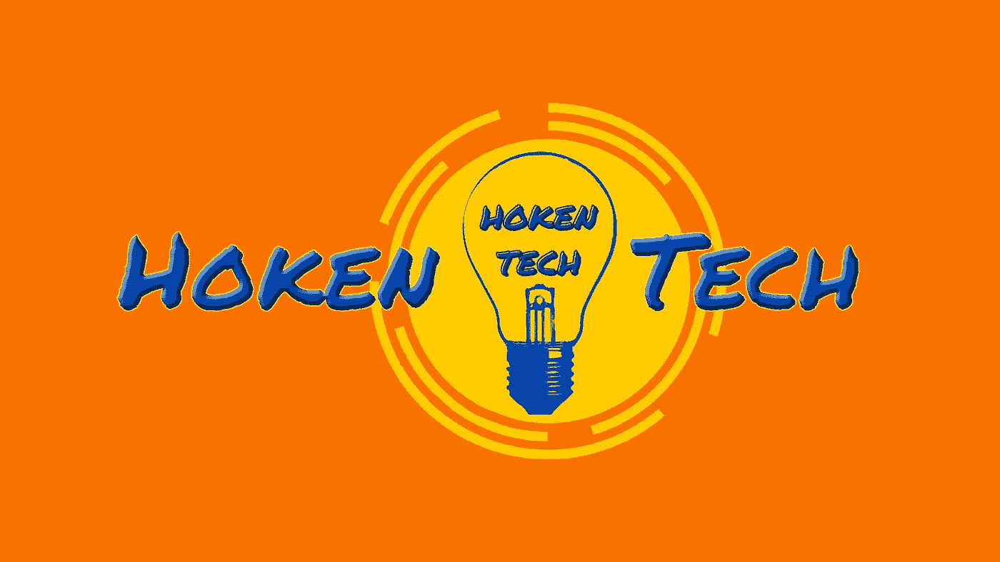

# 高地——区块链的垄断

> 原文：<https://medium.com/coinmonks/upland-the-monopoly-on-blockchain-87ea24ad046c?source=collection_archive---------17----------------------->

Hoken Tech — Upland — The monopoly on blockchain

欢迎来到#HokenTech！

谈到加密，尤其是区块链，每个人都想到了当今的加密，如比特币或最近的 NFT 现象，但很少有人停下来看看随着时间的推移而发展起来的其他新兴和蓬勃发展的行业。

今天，我们将分析区块链的一个行业，即视频游戏行业，但它不是在集中式的传统平台上，而是位于区块链，只能通过使用钱包进行互动。

从玩家的角度来看，我们可能会遇到的一个问题是，在游戏过程中或完成游戏后，完全没有将我们的进展货币化，花费了我们最宝贵的资源，也就是玩我们最喜欢的游戏和关卡角色的时间。

游戏中最强的物体到底是什么？我可以卖掉或交易它吗？

正是在这里，区块链游戏给视频游戏行业带来了新的动力，因为用户不仅可以玩他们喜欢的游戏，还可以通过将他的资产作为盔甲甚至角色出售给另一个用户来赚钱，并利用游戏的内部市场。

**如果它们是虚拟的土地，而不是我们可以在其上建造房屋的物体，会怎么样？**

在这里，Upland 将两者结合起来，创建了一个视频游戏，用户可以拥有一块土地，然后在上面建造一些东西，例如财产，此外，任何经过或停留在我们这块土地上的人，我们也将获得游戏本身的令牌。

# 高地是如何运作的？

换句话说，Upland 已经创建了一个包含整个世界和各个城市的虚拟地图，任何人都可以在他们喜欢的地方购买一块土地，只要它是可用的，否则他们应该出价购买那块土地。

这个游戏是基于 EOS 区块链的，现在已经有几年的时间了，并且取得了一些成功。这使得它成为这个区块链上最大的游戏，全球成千上万的用户环游这个世界，一个真正的元宇宙。

在里面，我们还发现了它的数字货币 UPX，我们需要用它来购买我们想要的土地，比例是 1€/1000 UPX，这里的各种土地从 3000 UPX 起。

# 高地怎么玩？

进入这个世界的第一步是在 Upland 网站上注册，在这里，我们从那些可用的角色中选择我们的角色，并遵循解释我们将要使用的游戏机制的方便教程。

然后，我们必须从 13 个不同价格的区域中选择第一个购买的区域:

Hoken Tech — Upland selection journey

在我们选择了我们感兴趣的区域后，我们将受到 Upland 针对新用户的倡议的欢迎，那里有为他们保留的土地，可以以低廉的价格购买，允许每个人在不投资任何东西的情况下开始游戏，这些地块在地图上是绿色的:

Hoken Tech — Upland first start act

在确定了我们感兴趣的地块后，我们可以点击“购买”按钮并确认购买，在本例中，物业成本略低于 2000 UPX:

Hoken Tech — Upland map selection

过一会儿，我们购买了我们的资产，交易是在 EOS 区块链上生成的，从图像中可以看出，资产的颜色现在变成了蓝色:

Hoken Tech — Upland property certificate

这个游戏的一个非常有趣的方面是，它允许我们在现实世界中看到该区域和我们的财产的图像，还允许我们评估或多或少有趣的区域来投资该案例:

Hoken Tech — Upland street view

越多的游客将在我们的地块上，收入越大，因此我们将收到 UPX 代币，然后通过购买更多的地块，我们也可以让他们以更进一步的方式支付。

但最有趣的是“建造”项目。一旦我们成为高地人，达到 1 万 UPX 的门槛，我们将能够在我们的土地上建造，然后在数字土地上建造数字结构，扩展可能的选项。

最后，我们记得 Upland 最近推出了在游戏中开设数字商店的可能性，即所谓的 metaventures，所有者可以出售他们的 NFT，以换取 UPX 或法币，如美元，这远远超出了游戏的简单娱乐，事实上允许创建一个平行的经济。

Hoken Tech — Italian’s NFT

seguiteci sui**nostri social**e scarica la nostra[applicazione Android](https://play.google.com/store/apps/details?id=io.kodular.sergio_decandia.Hoken_Tech)

[**insta gram**](https://www.instagram.com/hokentechitalia/)/[/**脸书**/](https://www.facebook.com/hokentechitalia/)/[/**YouTube**/](https://www.youtube.com/channel/UCU3PG-j_Venl0OvxrwEnPKw)[**电报**/](https://t.me/HokenTech)[/**中型**/](/@hokentechitalia)/[/**LinkedIn**](https://www.linkedin.com/company/hoken-tech/)

> 加入 Coinmonks [电报频道](https://t.me/coincodecap)和 [Youtube 频道](https://www.youtube.com/c/coinmonks/videos)了解加密交易和投资

# 另外，阅读

*   [如何在印度购买比特币？](/coinmonks/buy-bitcoin-in-india-feb50ddfef94) | [瓦济克斯评论](/coinmonks/wazirx-review-5c811b074f5b)
*   [隐翅虫替代品](/coinmonks/cryptohopper-alternatives-d67287b16d27) | [HitBTC 审查](/coinmonks/hitbtc-review-c5143c5d53c2)
*   [CBET 评论](https://coincodecap.com/cbet-casino-review) | [库科恩 vs 比特币基地](https://coincodecap.com/kucoin-vs-coinbase)
*   [Fold App 审核](https://coincodecap.com/fold-app-review) | [Kucoin 交易机器人](/coinmonks/kucoin-trading-bot-automate-your-trades-8cf0ca2138e0) | [Probit 审核](https://coincodecap.com/probit-review)
*   [如何匿名购买比特币](https://coincodecap.com/buy-bitcoin-anonymously) | [比特币现金钱包](https://coincodecap.com/bitcoin-cash-wallets)
*   [币安 vs FTX](https://coincodecap.com/binance-vs-ftx) | [最佳(SOL)索拉纳钱包](https://coincodecap.com/solana-wallets)