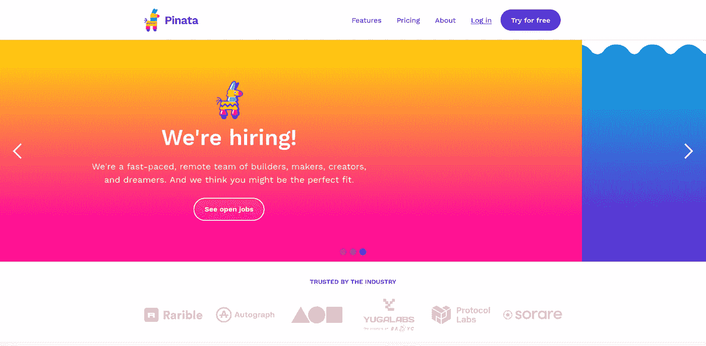
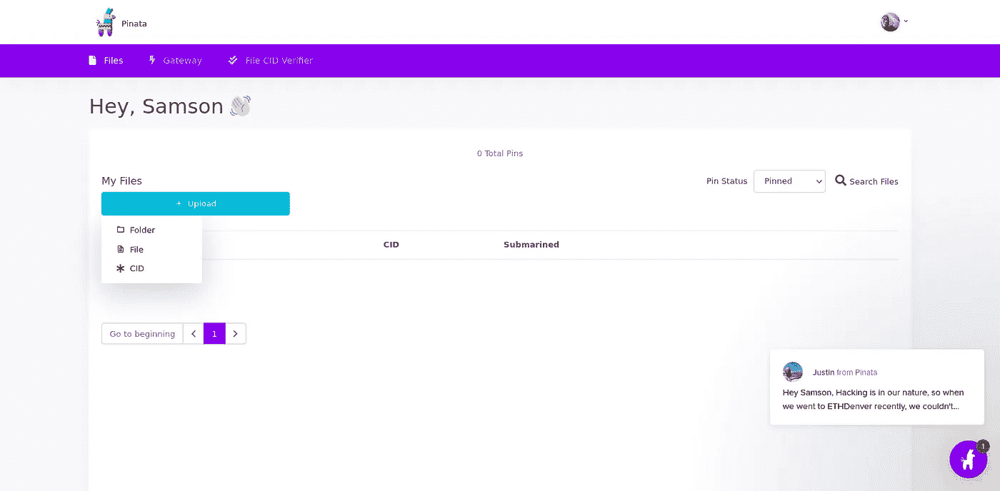
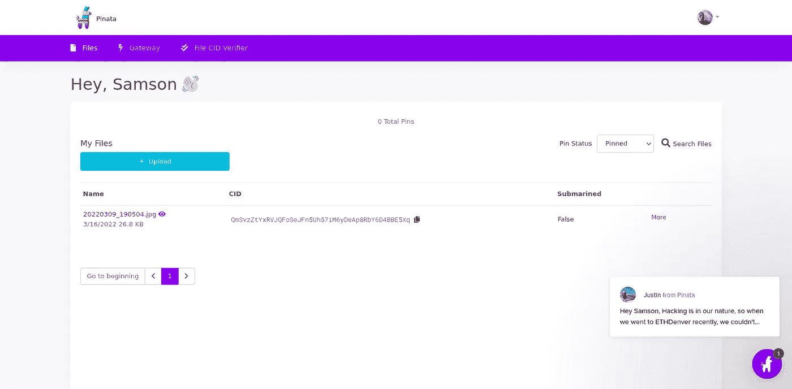

# 使用 Pinata 上传到 IPFS

> 原文：<https://medium.com/coinmonks/upload-to-ipfs-using-pinata-bf59ce265ab5?source=collection_archive---------10----------------------->

**IPFS(星际文件系统)**是一种协议和对等网络，用于在分布式文件系统中存储和共享数据，上传到 IPFS 需要使用终端或 IPFS 桌面应用程序，这就是 Pinata 的用武之地。
**Pinata** 是一个快速可靠的分享你的 NFT 的平台，他们有不同的计划，从 **pro，个人和自由计划**。在本教程中，我们将使用免费计划，附带 1 GB 的存储空间、API 访问、Pinata 上传和文件管理器，我们将使用它们来管理上传的文件。让我们直接进去。💌

1.  **创建账户:**访问 Pinata 网站([https://www.pinata.cloud/](https://www.pinata.cloud/))点击**免费试用**按钮，将带您进入注册页面，填写所有详细信息。确认码将发送到您的邮箱，您将使用它来确认您的帐户。注册成功后，您将被重定向到仪表板



Pinata homepage ([https://www.pinata.cloud/](https://www.pinata.cloud/))

**2。** **上传文件:**点击*上传按钮>文件>选择文件>输入文件名(保留默认)>上传。*
上传成功后，将显示成功消息，新添加的文件将显示在仪表板中。



Pinata Dashboard: Upload file

3.**文件分解:**现在你的文件已经完全上传了，点击文件名会在新标签页打开文件，你会看到新上传的文件。
**CID** —上传文件的哈希(我们稍后会用到)
**More** —提供更多控件，如编辑名称、删除文件等
您现在可以使用[https://ipfs.io/ipfs/CI](https://ipfs.io/ipfs/Qmd8LBVH4tdQb2pue5f7Y33Ms6WprFEB1r62Tz4zoF6Npz)d .
在 IPFS 链接上访问您的新文件，用您的文件 **CID** 替换 **CID** ，恭喜您刚刚在 IPFS 上上传了您的第一个文件。



break down of file data

4.**上传 NFT 元数据:**元数据是一个 **JSON** 文件，它允许像 OpenSea 这样的应用程序为数字资产提取丰富的数据，并轻松地在应用程序中显示它们。尽管不同的平台有他们自己的元数据标准，这里有一个到开放海洋标准([https://docs.opensea.io/docs/metadata-standards](https://docs.opensea.io/docs/metadata-standards))的链接，我将坚持使用较小的元数据。我将把这个文件命名为“**my-snapshot . JSON**”。使用**步骤 2** 作为指导，将 Pinata 上的元数据上传为文件。

```
// format
{
"name" : // Any name,
"image" : // URL to image on IPFS,
"description": // Some text
}// my-screenshot.json
{
"name" : "My screenshot",
"image" : "[https://ipfs.io/ipfs/QmSvzZtYxRVJQFoSeJFn5Uh57iM6yDeAp8RbY6D4BBE5Xq](https://ipfs.io/ipfs/QmSvzZtYxRVJQFoSeJFn5Uh57iM6yDeAp8RbY6D4BBE5Xq)",
"description": "my screenshot of etherscan"
}
```

5.**恭喜:**现在你已经上传了你在 Pinata 上的元数据，你可以在铸造你的 NFT 时简单地添加**URL**([https://ipfs.io/ipfs/CI](https://ipfs.io/ipfs/Qmd8LBVH4tdQb2pue5f7Y33Ms6WprFEB1r62Tz4zoF6Npz)D)。👌


Congratulation

**资源:** [https://docs . ipfs . io/how-to/address-ipfs-on-web/# dweb-addressing-in-brief](https://docs.ipfs.io/how-to/address-ipfs-on-web/#dweb-addressing-in-brief)

[](https://www.inmindsoftware.com/2021/06/30/compile-and-deploy-nft-smart-contract-using-remix-an-easy-tutorial-part-3/) [## 使用 REMIX 编译和部署 NFT 智能合约:简单教程(第 3 部分)

### 为了做到这一点，你有两个选择:如果你在 Remix 中标记了自动编译选项，每次你保存文件…

www.inmindsoftware.com](https://www.inmindsoftware.com/2021/06/30/compile-and-deploy-nft-smart-contract-using-remix-an-easy-tutorial-part-3/) 

> 加入 Coinmonks [电报频道](https://t.me/coincodecap)和 [Youtube 频道](https://www.youtube.com/c/coinmonks/videos)了解加密交易和投资

# 另外，阅读

*   [如何在 Uniswap 上交换加密？](https://coincodecap.com/swap-crypto-on-uniswap) | [A-Ads 审查](https://coincodecap.com/a-ads-review)
*   [WazirX vs coin dcx vs bit bns](/coinmonks/wazirx-vs-coindcx-vs-bitbns-149f4f19a2f1)|[block fi vs coin loan vs Nexo](/coinmonks/blockfi-vs-coinloan-vs-nexo-cb624635230d)
*   [本地比特币评论](/coinmonks/localbitcoins-review-6cc001c6ed56) | [加密货币储蓄账户](https://coincodecap.com/cryptocurrency-savings-accounts)
*   什么是融资融券交易
*   [维护卡审核](https://coincodecap.com/uphold-card-review) | [信任钱包 vs 元掩码](https://coincodecap.com/trust-wallet-vs-metamask)
*   [Exness 评测](https://coincodecap.com/exness-review)|[moon xbt Vs bit get Vs Bingbon](https://coincodecap.com/bingbon-vs-bitget-vs-moonxbt)