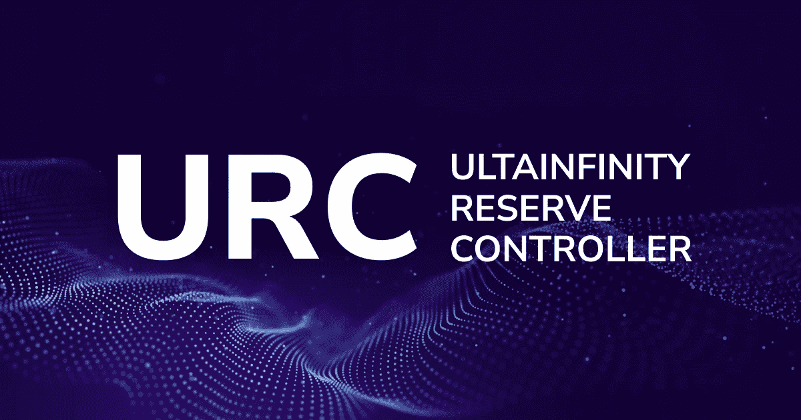

# URC — ULTAINFINITY 储备控制器。值得一看的秘密奇迹。

> 原文：<https://medium.com/coinmonks/urc-ultainfinity-reserve-controller-a-crypto-wonder-to-behold-232f434d82bd?source=collection_archive---------28----------------------->

一个庞大、安全的财政部、基金和经理；外部评级、审计和评估。通过商业上丰富的分支、加密货币和资产向世界开放。

Ultainfinity 拥有其生态系统引擎的 SLAPA 模型和系统设计组件之一，即独特的 Ultainfinity 储备控制器 URC。一个超大的、数十亿美元的多储备池，旨在支持 SLAPA 模型和系统以及无限加密货币和加密资产。城市资源中心将是非杠杆化的，没有算法稳定的资本，在规模和价值上不封顶，以达到任何可能的总额，并要求至少包括其支持的总资产价值的 150%。城市资源中心应增持 BTC、瑞士联邦理工学院、索尔、UTTA、迪维特、斯拉帕、BNB、阿达和 USDT USDC，以及以美元、欧元、英镑计价的债券、黄金和商业票据，并具有无限迪维特、UTTA、斯拉帕、BTC、[比特币]的超级增持购买授权。

城市资源中心的部分或全部、其资金、基金和证券应由外部审计员、证券评估员和信贷机构进行审计、评估和评级，例如:令人垂涎的 S & P 评级机构的评级。城市资源中心的设计设想了分支机构、可交易的商业资产、经风险调整的定制份额和合成物。城市资源中心的这些基本的和创新的特征应该是巩固的、使能的和增强的。他们将在一级和二级投资者(包括利益相关者)中促进它和 Ultainfinity 的本地加密货币和加密资产的蓬勃发展。更重要的是，Ultainfinity 的这些创新、审计、评估和评级方法将让许多人放心，包括机构投资者、管理者、监管者、怀疑论者和投机者。

SLAPA Model & Systems 和 URC 的优势不仅在于 URC 不包含杠杆，而是拥有大量盈余和保守的风险利差；加密资产和非加密资产持有量及其退出流动性策略。两者都防止了退出少数集中持有的资产的危险，在快速的市场洪流和流动性紧缩中，这些资产可能因套利机会而暴跌。

SLAPA 模式和 URC 战略的内在优势是不可估量的。

Ultainfinity 可以在这方面引领世界。

采用 Ultainfinity 方式将刺激许多投资者、政府和监管机构的信心，并防止加密项目陷入流动性紧缩。

SLAPA 模型和 URC 应确保 Ultainfinity 的全球生态系统不会承担市场参与者被困在其旗舰令牌 UTTA 或其实用令牌 DIVIT 或其生态系统模型和引擎令牌 SLAPA 的可怕风险。这些风险消失了，并显著降低到几乎为零，即使一些众所周知的加密屋在激流中烧毁，围绕 Ultainfinity 及其加密货币。

# 关于 SLAPA 模型&作者

SLAPA 模型和系统、URC、其公式化的帕拉、团和相关主题，如 Ultainfinity 区块链，包括 Ultainfinity 全球项目的目的，由作者 M. Michael 先生(慈善家、发明家、企业家、创始人和 [Ultainfinity Global Group](https://ultainfinity.com) 的董事长兼集团首席执行官)在大量的白皮书、文字材料和 Flashpapers 中进行了深入介绍。