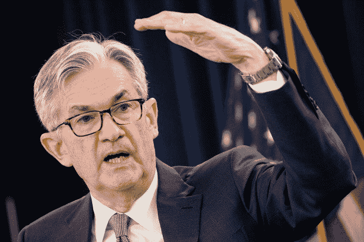

# 美国可以实施国家数字货币

> 原文：<https://medium.com/coinmonks/us-could-implement-a-national-digital-currency-e44ffb5095fa?source=collection_archive---------10----------------------->

美国银行的分析师认为，美国距离采用国家数字货币只有几年的时间了。他们预测，第一个美元数字美元可能会在 2025 年至 2030 年间发行。

公众被鼓励在 5 月 20 日之前对美联储的立场做出回应。

