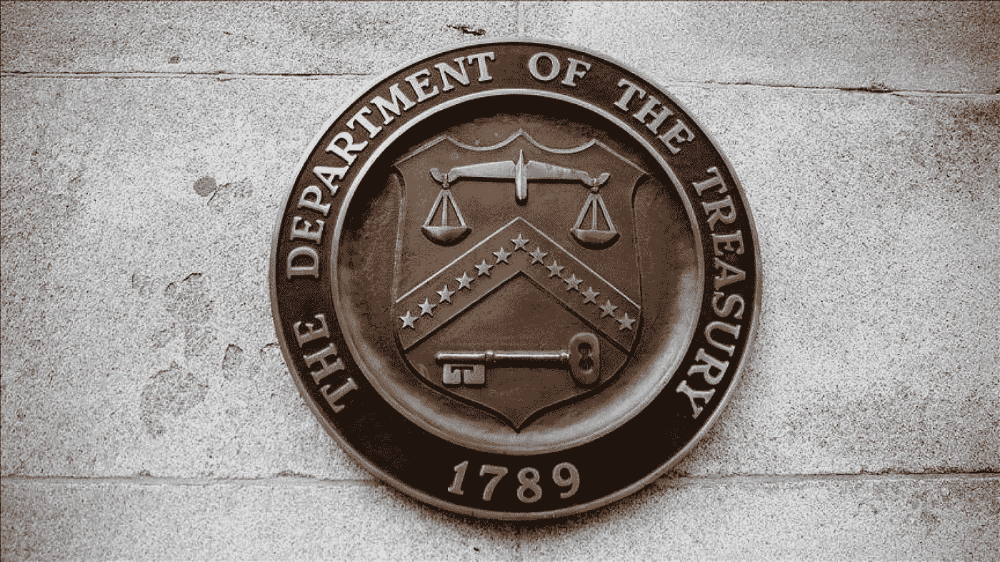

# 美国民主党人正在询问加密货币资产对俄罗斯制裁的影响

> 原文：<https://medium.com/coinmonks/us-democrats-are-inquiring-about-the-impact-of-cryptocurrency-assets-on-russian-sanctions-3511a96ad89d?source=collection_archive---------86----------------------->

**Visit our website:-** [**https://bitcoinsupports.com/**](https://bitcoinsupports.com/)

**Democrats warned on Wednesday that crypto might jeopardize sanctions aimed at preventing future bloodshed between Ukraine and Russia.**

— Democrats in the United States are questioning the Treasury Department’s ability to track Russian sanctions evasion using cryptography.

— Bitcoin’s value versus the ruble has soared in recent days, prompting questions.

Following fears that Russia may be utilizing digital assets to dodge its economic sanctions, four Democratic Senators have urged the Treasury to clarify its plan for monitoring and enforcing crypto sanctions compliance.

Senators Elizabeth Warren, Mark Warner, Sherrod Brown, and Jack Reed wrote to Treasury Secretary Janet Yellen on Wednesday, expressing their concern that “criminals” and “rogue governments” are embracing crypto as a “new tool to mask cross-border transactions for nefarious purposes.”

The US’s efforts to combat what it sees as criminal-related crypto activities have been re-energized by the Ukraine situation.

“Concerns have grown even more urgent in light of the sanctions imposed on Russia following its invasion of Ukraine, as well as reports that Russian entities are preparing to mitigate some of the worst effects of the sanctions by employing a variety of “cryptocurrency-related tools at their disposal,” according to the letter.

Sanctions, according to the Treasury Department, are “first-resort” economic and financial weapons used to address a variety of risks to the US’s national security, foreign policy, and economic health.

Following Russia’s invasion of Ukraine, the West imposed economic sanctions on the former Soviet republic in the hopes of inducing a cease-fire and troop withdrawal.

Sanctions are already sending shockwaves across the global financial ecosystem, with some assets faring better than others, despite the fact that they have not yet been completely imposed.

As a result of the run on deposits, Russia’s largest lender, Sberbank, lost 95 percent of its value on the London stock exchange on Wednesday. Other London-listed equities, including as Lukoil, Novatek, and Rosneft, were also hammered hard. The currency of Russia has plummeted to less than a cent ($0.0098).

In response to the senators’ worries, Jake Chervinsky, the head of policy at the Blockchain Association, a Washington-based trade group, took to Twitter to explain that cryptocurrencies cannot be used to overcome penalties.

[*https://twitter.com/jchervinsky/status/1498786025438650369*](https://twitter.com/jchervinsky/status/1498786025438650369) 
“US citizens around the world, regardless of what payment systems they were using earlier, are cutting relations with Russian right now,” he wrote.

“There’s no reason to believe that the existence of cryptocurrency will persuade any of them to willfully break sanctions rules, incurring fines and jail time.”

Meanwhile, aggrieved Russian oligarchs and businesses seeking financial refuge are said to have reacted positively to cryptocurrency.

The senators wrote in their letter that “trading volumes between the Russian ruble and Bitcoin have surged to their highest level since May 2021 in recent days following the flurry of punitive announcements.”

Democrats are asking for more from the crypto community.

The letter also gives concrete examples of what the US considers to be the crypto community’s disrespect for banking regulations.

In May, mining business Marathon Digital refused to accept transactions from wallets identified on the Office of Foreign Assets Control’s (OFAC) Specially Designated Nationals and Blocked Persons List, only to backtrack in June.

OFAC is the Treasury Department’s financial intelligence and enforcement office, tasked with issuing and enforcing sanctions in accordance with US foreign policy and national security goals.

DeFi and its use of smart contracts, which seek to replace brokers, banks, and financial intermediaries, were also mentioned as a growing threat to financial stability and sanctions restrictions.

According to the letter, “the cryptocurrency business may not be fulfilling its responsibilities to comply with US sanctions.” “Many “members of the virtual currency sector implement OFAC sanctions policies and procedures months, if not years, after commencing operations,” according to OFAC’s October advice.

As a result, the four Democrats said they want to know what steps the Treasury Department plans to take in response to OFAC’s recommendations on enforcing sanctions compliance by crypto players.

Senators also posed questions to the Treasury Department, including how OFAC collaborates with foreign governments to ensure crypto does not circumvent sanctions, the problems the agency faces under the October directive, and the number of self-disclosed sanctions violations.

Two other questions were posed, one about how DeFi’s (decentralised finance) expansion has aided “maligned actors’” ability to circumvent sanctions and the agency’s ability to enforce them, and the other about what more legal tools and money are needed to prevent Russia’s evasions.

Senators are asking for a response to their queries as well as further material by March 23.

**访问我们的网站:-**[**【https://bitcoinsupports.com/】**](https://bitcoinsupports.com/)

**免责声明:这些是作者的观点，不应被视为投资建议。读者应该自己做研究。**

> *加入 Coinmonks* [*电报频道*](https://t.me/coincodecap) *和* [*Youtube 频道*](https://www.youtube.com/c/coinmonks/videos) *了解加密交易和投资*

# 另外，阅读

*   [折叠 App 审核](https://coincodecap.com/fold-app-review) | [Kucoin 交易机器人](/coinmonks/kucoin-trading-bot-automate-your-trades-8cf0ca2138e0) | [Probit 审核](https://coincodecap.com/probit-review)
*   [如何匿名购买比特币](https://coincodecap.com/buy-bitcoin-anonymously) | [比特币现金钱包](https://coincodecap.com/bitcoin-cash-wallets)
*   [币安 vs FTX](https://coincodecap.com/binance-vs-ftx) | [最佳(索尔)索拉纳钱包](https://coincodecap.com/solana-wallets)
*   [比诺莫评论](https://coincodecap.com/binomo-review) | [斯多葛派 vs 3Commas vs TradeSanta](https://coincodecap.com/stoic-vs-3commas-vs-tradesanta)
*   [Capital.com 评论](https://coincodecap.com/capital-com-review) | [港加密借贷平台](https://coincodecap.com/crypto-lending-hong-kong)
*   [如何在 Uniswap 上交换加密？](https://coincodecap.com/swap-crypto-on-uniswap) | [A-Ads 评论](https://coincodecap.com/a-ads-review)
*   [WazirX vs CoinDCX vs bit bns](/coinmonks/wazirx-vs-coindcx-vs-bitbns-149f4f19a2f1)|[block fi vs coin loan vs Nexo](/coinmonks/blockfi-vs-coinloan-vs-nexo-cb624635230d)