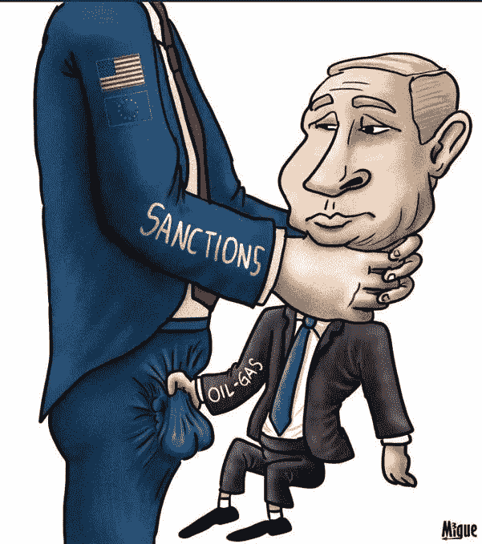
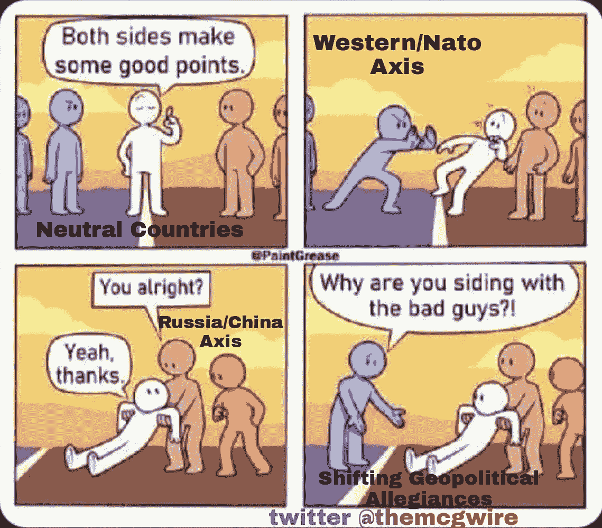
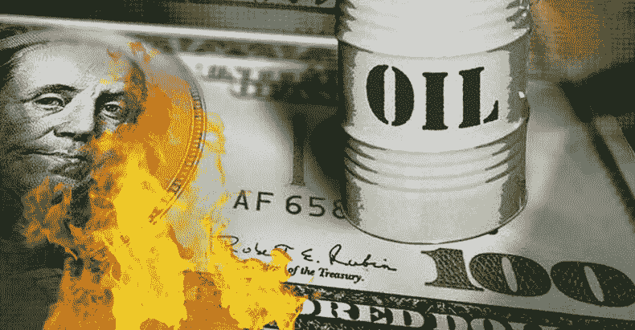
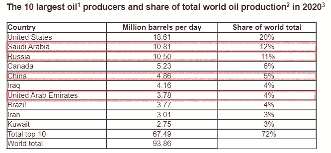

# 沙特、阿联酋和印度无视制裁威胁，转向俄罗斯和中国，美国霸权受到威胁

> 原文：<https://medium.com/coinmonks/us-hegemony-threatened-as-saudis-uae-india-ignore-threats-of-sanctions-turn-to-russia-china-9473f26a6342?source=collection_archive---------2----------------------->

**本文是我** [**上一期**](https://bitboycrypto.com/ukraine-crisis-triggered-a-massive-shift-in-fundamentals-for-bitcoin/)**[**《乌克兰危机引发比特币基本面大转变》**](/coinmonks/ukraine-crisis-triggered-a-massive-shift-in-fundamentals-for-bitcoin-336af1b5e2b4) 的后续。**概要是，由于制裁和世界金融体系的分裂，美联储可能推迟或缓解预期即将到来的紧缩政策，以及不断上涨的能源价格**(采矿的主要费用)**和比特币被许多人部分视为数字商品**(地缘政治和经济动荡导致商品蓬勃发展)，比特币的基本面发生了积极变化。此外，文章还讨论了世界大国的储备货币地位相对于其总实力和影响力的重要性，美元储备地位的下降，以及新的潜在世界经济秩序的可能性。**

# **沙特阿拉伯和阿联酋发出可能脱离美国的信号，与中俄联盟的关系日益密切**

## **沙特和阿联酋拒绝与拜登通话，为普京接电话**

**一周前，一则新闻的头条是“[沙特、阿联酋领导人在乌克兰危机期间拒绝与拜登通话](https://www.wsj.com/articles/saudi-emirati-leaders-decline-calls-with-biden-during-ukraine-crisis-11646779430)”以及“[沙特、阿联酋领导人在拜登打电话讨论天然气价格时不予理睬:报道”](https://nypost.com/2022/03/08/saudi-uae-leaders-ignore-biden-when-he-calls-to-talk-gas-prices-report/)。在后者中，《纽约邮报》称，根据一份 [*报告*](https://www.wsj.com/articles/saudi-emirati-leaders-decline-calls-with-biden-during-ukraine-crisis-11646779430) *，当拜登总统试图打电话给沙特阿拉伯和阿拉伯联合酋长国的领导人* *讨论增加石油出口以抵消与俄罗斯入侵乌克兰相关的价格上涨时，他们不会接电话。*两国领导人都曾为普京做过怎样的接机。**

**《华尔街日报》打破了所有人都避之不及的独家报道，给他们的文章加了副标题， ***“波斯湾君主国已经发出信号，除非华盛顿在也门和其他地方支持他们，否则他们不会帮助缓解飙升的油价”。*** 值得一提的是**阿联酋是沙特的亲密盟友，早在也门冲突之前**就已经是了。《纽约邮报》还报道了拜登对伊朗和委内瑞拉的反弹尝试，这两个国家是美国多年来一直制裁的对象。**

> ****“拜登正试图拉拢一系列产油独裁国家——包括伊朗、沙特阿拉伯和委内瑞拉**——以抵消俄罗斯入侵乌克兰对能源市场的影响。…**
> 
> **与此同时，美国外交官正在努力与伊朗达成一项新的核协议，以换取制裁的解除，其他外交官被派往加拉加斯，以消除与委内瑞拉社会主义强人尼古拉斯·马杜罗的分歧，美国政府不承认他为该国的合法统治者。 …**
> 
> **白宫没有对此置评。"**

**几天后，凯特琳·麦克福尔为雅虎新闻撰写了一篇文章，标题为:**[***布林肯淡化了关于沙特、阿联酋不信任拜登的报道***](https://news.yahoo.com/blinken-downplays-reports-saudi-uae-214904775.html?guccounter=1&guce_referrer=aHR0cHM6Ly93d3cuZ29vZ2xlLmNvbS8&guce_referrer_sig=AQAAAJDV8u576mc1zsetzj_pJ7Akmr1c2-jnCHCykWaHcbvV5Pe6Q8p23B-wm7PEwcHxmU7uEaEr6ejlXoojR9nPBVa7QUv4j-fvIKeZGXJc5XpPTRyFi5SKCuo5hRzzpVP3b8rsqKlp_bkSZCeD4EO0SxYz79q3EmFaJI1OgFBJjvy4)***:*******

> ****本周三，美国国务卿安东尼·布林肯淡化了拜登政府受到中东主要产油国冷落的说法，因为美国正试图应对油价飙升、俄罗斯在乌克兰的战争。****
> 
> ****报道还称，尽管拒绝与拜登交谈，沙特王储穆罕默德·本·萨勒曼和阿联酋的谢赫·穆罕默德·本·扎耶德·阿勒纳哈扬还是与俄罗斯总统弗拉基米尔·普京进行了交谈。****
> 
> *****据报道，一名美国官员在谈到沙特王子默罕默德与拜登计划中的会谈时表示，人们曾期待他会打电话，但没有实现。*“**这是打开(沙特石油)龙头的一部分。******

****麦克福尔在文章的后面指出，在周三与布林肯举行的联合记者招待会上，英国外交大臣伊丽莎白·特拉斯敦促其他国家“加入我们的制裁努力”这种敦促其他国家支持和参与针对俄罗斯全体人民的广泛措施的态度对美国的国家和经济安全是有害的。****

****猜测美国正在向其他国家政府施压，迫使其遵守对其外交利益的制裁。这产生了负面影响。夹在中间的国家开始迷恋普京和中国，后者对中立国家采取了不那么咄咄逼人的立场。我们在沙特阿拉伯、阿联酋和印度见证了这一点——这也是本文的重点。在**[***乌克兰危机引发比特币基本面的巨大转变***](/coinmonks/ukraine-crisis-triggered-a-massive-shift-in-fundamentals-for-bitcoin-336af1b5e2b4)中，我写道**“一名美国高级外交官** [**引用**](https://www.independent.co.uk/asia/india/india-ukraine-sanction-biden-unga-b2027646.html) **的记录称，拜登政府希望*‘印度会发现现在是时候进一步疏远自己了’*“俄罗斯。”美国甚至威胁说，如果印度不制裁俄罗斯，他们就要制裁印度。** ***这样企图胁迫的结果是什么？负面影响美国金融安全和美元强势的反弹。印度*** [**刚刚从俄国**](https://thehill.com/policy/energy-environment/598762-india-buys-3-million-barrels-of-russian-oil-report) **购买了 300 万桶石油。他们甚至考虑在与俄罗斯的贸易中放弃美元，这是迄今为止的标准。********

****昨天 Wapo 发表了标题[“随着对乌克兰战争的制裁升级，俄罗斯转向印度购买石油和武器”](https://www.washingtonpost.com/world/2022/03/17/india-russia-oil/)。这个标题有点误导，因为**俄国转向印度*出售*石油(** [**)比全球价格**](https://www.aljazeera.com/economy/2022/3/18/russian-oil-sale-to-india-complicates-bidens-efforts) )低 20%。请记住，印度 85%的石油依赖进口，预计今年该国的总需求将超过 8%。从经济上讲，从俄罗斯购买打折石油无疑符合印度的最大利益。：****

> ****"..在未来的几个月里，这一数量可能会增加，并强化一种日益增长的看法，即印度决心保持与莫斯科的广泛贸易和军事联系，尽管美国及其盟友敦促世界各国政府孤立俄罗斯。****
> 
> ****据另外两名了解此事的印度官员透露，除了石油交易，印度政府还在探索通过恢复冷战时期的卢比-卢布交易来维持与俄罗斯的贸易。该机制类似于两国之间的贸易总账，将允许印度和俄罗斯公司做生意，同时绕过使用国际贸易主要货币美元的需要，并降低美国可能制裁 T21 的风险。****

****最后一句话尤其重要，因为在国际贸易中绕过美元是美元作为储备货币面临的威胁的具体表现。这也支持了我上一篇文章的论点，即我们的单边制裁正在加速美元作为储备货币的贬值，不仅严重损害了被美国制裁的国家，也严重损害了美国自身。****

****半岛电视台在一篇题为“[俄罗斯向印度出售石油使拜登的努力复杂化”](https://www.aljazeera.com/economy/2022/3/18/russian-oil-sale-to-india-complicates-bidens-efforts)的文章中进一步报道了印度最近从俄罗斯购买石油的情况:****

> ******虽然印度并不是唯一一个购买俄罗斯能源******——德国等几个欧洲盟友也继续这样做**——但这一决定与拜登试图[通过制裁孤立俄罗斯经济](https://www.aljazeera.com/news/2022/3/9/us-bans-russian-oil-what-does-this-mean-for-oil-prices)的努力相冲突。******
> 
> ******增加的石油流量可能会使华盛顿和新德里之间的关系进一步紧张，这种关系已经通过印度最近采购先进的俄罗斯防空系统得到了考验**【洛克希德和波音公司被激怒了】。****

****值得注意的是，这 300 万桶的交易只是一个开始。半岛电视台注意到，向美联社透露这一消息的印度政府官员表示，该国将增加对俄罗斯石油的进口，使其能够在经济努力从冠状病毒疫情*【这很可能是美国资助的生物实验室泄露的结果】* ***中恢复的同时，以折扣价增加能源供应*******

****当记者联系印度外交官寻求置评时，印度外交部发言人 Arindam Bagchi 指出，许多欧洲国家进口俄罗斯的石油和天然气。****

> ****“印度的石油需求大部分依赖进口。我们正在探索全球能源市场的所有可能性。巴奇说:“我不认为俄罗斯是印度的主要石油供应国(就像它对欧洲大部分地区一样)。****

****这种围绕印度的国家关系的发展是一个缩影，说明了美国向盟国和中立国施压，迫使它们做不符合各自利益的事情，将这些国家推向俄罗斯和中国的怀抱。印度不是唯一一个寻求在其国际贸易中逐步淘汰美元的国家，沙特阿拉伯正寻求开始接受人民币来代替美元来支付他们的石油。由于沙特阿拉伯为石油美元奠定了基础，这一点尤为重要，在此消息爆出后的过去 4 天里，外汇市场对人民币的评估反应积极。****

****沙特和阿联酋对拜登冷眼相待，就在几天前，有广泛报道称，英国首相约翰逊被要求让沙特和阿联酋提高产量。《卫报》在一篇题为[*Johnson 面临说服沙特和阿联酋提高石油产量*](https://www.theguardian.com/world/2022/mar/14/johnson-criticised-saudis-gulf-oil-production) 的文章中报道*“沙特和阿联酋都不热衷于提高石油产量，因为这将打破他们与被称为欧佩克+的* [*俄罗斯*](https://www.theguardian.com/world/russia) *的石油协议。”*****

> ****作为与俄罗斯交易的一部分，沙特阿拉伯已经表示他们不会增加去年同意的产量****

****美国和西方大国之间关于海湾国家的动态存在额外的地缘政治复杂性，因为随着公众反弹的加剧，拜登政府远离了他们在也门的野蛮运动，部分撤回了美国对 6 年战争的支持。****

****乔·拜登与王储穆罕默德·本·萨勒曼关系不佳，这使得英国成为最有可能说服沙特和阿联酋增产的西方大国之一****

****5 天前，《国土报》报道说“乔 B [*iden 似乎找到了一条通往海湾国家心灵的道路。他让阿联酋同意敦促欧佩克+成员(包括俄国)增加石油产量。”*](https://www.haaretz.com/middle-east-news/.premium.HIGHLIGHT-as-ukraine-burns-saudi-arabia-and-uae-try-to-get-biden-to-do-their-bidding-1.10669092)****

> ****“一时间，阿联酋的声明降低了油价。但在周四，他们恢复了涨势。”****

****很明显，产量的增加并不能满足市场的需求。当英国首相开始他的海湾之行并与沙特阿拉伯和阿联酋进行会谈时，他未能获得额外的公开石油涨价承诺。同样，与美国结盟，英国政府试图向印度施压，因为“[对印度的中立非常失望。](https://www.reuters.com/world/uk-very-disappointed-with-indias-stance-ukraine-trade-minister-2022-03-17/)****

********

## ****紧张的关系****

****拜登在 2021 年 11 月批准的[6.5 亿美元武器交易，以及其他交易和支持形式，并没有掩盖关系紧张的事实。拜登的竞选信息让他称沙特王国为贱民，因为 Khashoggi 的杀戮、也门战争的影响，以及人权活动人士的监禁和对卡塔尔的抵制。据《卫报》报道，在一篇题为“随着油价飙升，白宫面临与沙特阿拉伯和阿联酋的石油僵局”的文章中，](https://www.aljazeera.com/news/2021/11/4/biden-administration-approves-650m-weapon-sale-to-saudi-arabia)****

> ****然而，除此之外，两国首都都有一种强烈的感觉，拜登带着对长期以来一直是安全盟友的国家的深刻批评态度对待该地区，而对仍然是敌人的伊朗却很宽容。****
> 
> ****在上周试图招募委内瑞拉来孤立俄罗斯后，白宫认为努力修复与沙特阿拉伯和阿联酋的关系是一个可以接受的代价。****
> 
> ****今年 2 月，奥巴马政府派遣白宫中东政策协调员布雷特·麦古克(Brett Morrison)和国务院能源特使阿莫斯·霍赫斯坦(Amos Hochstein)前往沙特会见王储。在入侵乌克兰前夕，美国财政部宣布对一个所谓的胡塞融资网络实施制裁(试图安抚海湾国家)。****

****美国一直在玩两面派，阿联酋也是如此。半岛电视台 12 日报道称，**的俄罗斯人被** [**“清算阿联酋的密码以寻找避风港”**](https://www.aljazeera.com/news/2022/3/12/russians-liquidating-crypto-in-the-uae-as-they-seek-safe-havens)****

> ******据公司高管和金融消息人士称，随着俄罗斯人为自己的财富寻找避风港，阿拉伯联合酋长国(UAE)的加密公司收到了大量清算数十亿美元虚拟货币的请求。******
> 
> ******消息人士称，一些客户正在使用加密货币投资阿联酋的房地产，而另一些客户则希望通过那里的公司将他们的虚拟货币转换成硬通货，存放在其他地方******
> 
> ****迪拜是海湾地区的金融和商业中心，也是一个不断发展的加密中心，长期以来一直吸引着世界超级富豪，阿联酋拒绝在西方盟友和莫斯科之间选边站，这向俄罗斯人发出了他们的钱在那里是安全的信号。****

****我上一篇文章的主题和重点是，由于当前围绕乌克兰危机的事件，比特币的基本面发生了积极变化，这个故事正好符合这一点——但这不是本文的重点，尽管值得一提的是，这个具体案例表明阿联酋无视美国的愿望和制裁，并安抚俄罗斯。其结果是*“阿联酋本月被列入‘灰名单’，以加强金融犯罪和洗钱监管机构金融行动特别工作组(FATF)的监控。”*****

****在上述文章发表两天后，半岛电视台发表了一篇相关文章，标题为: [*“分析:阿联酋能成为俄罗斯寡头的避风港吗？”。*](https://www.aljazeera.com/news/2022/3/14/analysis-can-the-uae-be-a-safe-haven-for-russian-oligarchs)****

> ****随着对俄金融战的加剧，普京政府明确表示，对俄罗斯的制裁相当于 [**宣布**](https://www.aljazeera.com/program/inside-story/2022/3/11/will-the-sanctions-against-russia-work)**[**战争**](https://www.aljazeera.com/program/inside-story/2022/3/11/will-the-sanctions-against-russia-work)**。莫斯科正在注意哪些国家支持西方对俄罗斯的金融打击，哪些国家没有。********
> 
> ******最终，阿联酋和其他一些阿拉伯国家不想因乌克兰战争而与莫斯科断绝关系。这些国家认为，在战争结束后很长一段时间内与俄罗斯保持密切的伙伴关系最符合它们的国家利益。******

******但是，正如这篇文章所暗示的，美国并不寻求容忍这种中立，美国政府寻求的是顺从的盟友，而不是主权和平等的伙伴。**虽然“*阿布扎比已经表示，它正试图在美国及其欧洲伙伴与俄国之间寻求平衡，”*美国正在与**争夺，因为它不习惯自己的单边权威受到挑战——尤其是在如此严峻的形势下。******

> ****如果华盛顿越来越相信阿联酋是莫斯科外交政策议程的推动者，帮助俄罗斯绕过制裁，拜登政府将考虑采取什么行动。****
> 
> ****为了迫使阿联酋制裁普京圈子里的人，美国可以警告这个海湾国家的银行和其他金融机构，如果他们继续与他们做生意，可能会面临制裁或惩罚。然而，随着白宫寻求与阿联酋在石油生产和其他领域的合作，目前还不清楚拜登政府是否会在这个微妙的时刻这样做。****

****上述文章的副标题是:“*阿联酋在乌克兰问题上采取了中间路线，但拜登政府能对其施加压力促使其改变吗？”*****

****…字幕也可以在字里行间读出，如下所示:****

> ****“阿联酋一直保持中立，*拜登政府应该威胁这个国家以获得它的支持吗？*****

*****正如我们已经看到的那样，对中立的海湾国家和印度的制裁威胁会对美国自身的安全和稳定产生积极影响，还是适得其反？ 正如**拜登用制裁威胁印度，似乎只会把印度推向俄罗斯的怀抱，用制裁威胁海湾国家很可能也会这样做，** ***鼓励他们加强与中国和俄罗斯*** 的联系，这些国家对中立国不那么咄咄逼人(如果有的话)。中国的怀抱是开放的——甚至对印度，中国与印度的关系是出了名的紧张。就在几天前，中国提议与印度进行和平谈判，寻求加强关系。在这篇文章发表的前一天，[**叙利亚总统阿萨德前往阿联酋**](https://www.rt.com/news/552274-syria-assad-visit-uae/) **进行外交会谈，试图扩大关系。旅行很顺利。*******

*****路透社报道如下:*****

> *****“领导人讨论了扩大双边合作——特别是在投资和经济关系方面——以促进两个兄弟人民的愿望，”阿萨德政府说。*****
> 
> *****据报道，本·扎耶德确认了阿联酋对叙利亚领土完整的支持，并申明所有非法存在于叙利亚土地上的外国军队必须撤出。*阿萨德表示，鉴于世界各地的不稳定局势日益加剧，*我们必须继续坚持我们的原则、我们国家的主权和我们人民的利益。”*******

## ******思考的食粮:阿联酋寻求与我们视为敌人的政府发展关系是美国政策的结果吗？西方大国是否通过不容忍中立并试图迫使中立方表明立场，将中立国家推向中国和俄罗斯的怀抱？******

************

******比喻:如果有人在约会现场与多个潜在的合作伙伴交谈，那么选择一个滥用权力、占有欲强、想控制他们生活所有方面的人是否符合他们的最大利益，从财务到他们可以和不可以交谈的朋友，或者他们是否更有可能选择与一个寻求更平等的关系的人合作，这种关系建立在更公平的条件上，更少控制和更合作？美国不是国内施虐者，而是国外施虐者。这种表明美国扮演施虐者角色的隐喻是不必要的，但美国人和欧洲人可能完全不知道世界其他国家如何看待他们政府的行为。******

## ******寻找石油，拜登转向长期制裁的委内瑞拉，伊朗******

******拜登一直在努力获得沙特的青睐，努力安抚，例如 7 日将在关塔那摩度过 20 年的“第 20 名劫机者”移交给沙特关押。然而，拜登两面下注，不仅向委内瑞拉(世界上最大的石油储备国)伸出援手，还向伊朗伸出援手，伊朗也遭受了多年的严厉制裁。**许多人认为，试图恢复与委内瑞拉的关系主要是出于获得替代石油供应以抵消能源危机的需要。**尽管《卫报》认为这是为了孤立俄罗斯，尽管这肯定是一个相互影响的因素。10 日，《华尔街日报》发表《 [**乌克兰战争将拜登推向委内瑞拉、**](https://www.wsj.com/articles/ukraine-war-drives-u-s-hunt-for-more-oil-to-help-tame-rising-prices-11646935216) **》，**他们在其中总结道:******

> ********乌克兰战争给拜登政府数月来寻找新的石油供应增加了紧迫性，因为它试图通过国内谈判和与朋友和敌人的外交来遏制飙升的能源价格。********
> 
> ******俄罗斯对全球能源市场的贡献迅速下降，美国急于填补这一空白，这导致白宫与中东石油丰富的国家、受到美国制裁的 T2 国家以及私营部门的石油巨头本周在休斯顿举行会议。但这一寻求因几个因素而变得复杂，包括拜登总统发誓要在侵犯人权、国内政治压力和[大流行后供应链中断](https://www.wsj.com/articles/frackers-say-bottlenecks-slow-them-from-ramping-up-as-oil-prices-soar-11646835536?mod=article_inline)等问题上对沙特采取更强硬的态度。"******

******3 月 8 日，马杜罗宣布他在周末会见了 DC 代表团，这是自 1999 年以来美国最高级别的访问。马杜罗甚至就未来会谈的议程达成了一致，他对媒体说:“上周六晚上，美利坚合众国政府的一个代表团抵达委内瑞拉，我在总统府这里受到了接待。我们进行了一次会面，我可以用尊敬、亲切、非常有外交手腕来形容。”半岛电视台会[指出](https://www.aljazeera.com/news/2022/3/8/venezuela-talks-us)在会议前一个月，美国曾暗示，如果马杜罗政府和反对派之间的谈判取得进展，它将审查对该国的全面制裁。据报道，会议期间讨论了美国放松对委内瑞拉石油出口制裁的可能性。虽然有些人可能会认为这是在马杜罗面前晃来晃去的胡萝卜，但在这种情况下，胡萝卜只是隐喻大棒的一种解脱。******

******同样，伊朗也受到了多年的全面制裁。**在此期间，当美国在需要的时候探索与伊朗重建关系的想法时，他们仍然通过扣押伊朗油轮**参与海盗活动，正如路透社上周在[中报道的那样，“美国扣押油轮未能阻止伊朗的石油出口，部长说”](https://www.reuters.com/world/us-seizing-tankers-has-failed-stop-irans-oil-exports-minister-says-2022-03-12/)。******

> ******贾瓦德·奥吉在接受伊朗媒体采访时说:“美国在过去几个月中多次侵犯伊朗油轮，以阻止船只出口。******
> 
> ******Owji 说:“当敌人意识到他们无法阻止我们的出口和合同时，他们就盯上了我们的船只。******

******再次强调我的论点..**这种对外国贸易、财产和主权的专横侵犯**，是美国例外论和权利的产物**将在经济和外交上导致美国的垮台** **因为我们试图控制的国家意识到继续让美国保持世界主导力量不符合它们的利益。********

******与此同时，预计到伊朗核协议的重新谈判，[阿联酋一直在游说](https://www.timesofisrael.com/israel-uae-said-pressing-us-for-security-guarantees-from-iran/)加强对[伊朗的保护，随着全球紧张局势的加剧，伊朗最近“暂时中止”了与沙特阿拉伯的直接谈判](https://www.aljazeera.com/news/2022/3/13/iran-temporarily-suspends-direct-talks-with-saudi-arabia)。**随着美国的重要盟友看起来要弃船，美国已经找到了敌人，**多年来一直遭受严重制裁的政府，以寻求安慰——如果他们有石油的话。人们不必从字里行间去解读太多，就能意识到这是美帝国衰落的标志；这种动态对于美国的长期外交稳定来说不是一个好兆头。甚至是绝望的信号。******

## ******当前世界经济秩序剧变，石油美元受到挑战******

******沙特阿拉伯和阿联酋在寻求加强与俄罗斯和中国的关系时，似乎在与西方大国保持距离。当美国向中立党派施压，要求他们制裁俄罗斯，或者他们自己可能面临制裁时，俄罗斯和中国正在建立一个替代经济体系，取代主导全球几十年的体系。[俄罗斯被踢出 SWIFT](/coinmonks/ukraine-crisis-triggered-a-massive-shift-in-fundamentals-for-bitcoin-336af1b5e2b4) 国际支付系统，必然加速了这一进程的快速发展。《林伍德时报》3 月 6 日刊文，*[***濒临成为替代全球储备货币的中国人民币***](https://lynnwoodtimes.com/2022/03/06/brics-nations/)**，其中报道:*********

> *******“今天，**俄罗斯银行宣布计划发行使用中国** [**银联系统**](http://www.unionpayintl.com/en/) **的信用卡，之后 Visa 和万事达卡移至** [**暂停在俄罗斯**](https://www.reuters.com/business/finance/visa-suspends-operations-russia-over-ukraine-invasion-2022-03-05/) **的业务**结束莫斯科对乌克兰的军事干预。**银联现在是全球第二大、增长最快的信用卡网络。俄罗斯主要银行 Sberbank、Alfa Bank、Rosbank、Tinkoff Bank 和 MKB 信贷银行已确认，他们将立即着手推出银联卡。”*********

> *******“中国的 [CIPS 系统](https://www.cips.com.cn/en/index/index.html)是以欧洲为中心的 [SWIFT 银行系统](https://www.swift.com/)的替代系统，这是一个全球金融机构用来安全传输货币交易信息的信息网络。俄罗斯银行今天宣布发行数百万张信用卡，这些信用卡可以在中国的银联全球信用卡网络(全球第二大)下交易，这进一步削弱了以欧元为中心的西方对全球央行系统的控制。”*******

# *******“我们可能实时看到的是金砖国家放弃美元作为全球储备货币的‘借口’。”根据布雷顿森林协定，美元于 1944 年成为全球储备货币*******

*********BRICS, composed of Brazil, Russia, India, China, and South Africa** is a term coined byO’Neill, Goldman Sachs’ head of economic research in 2001\. **BRICS nations are those developing countries expected to be the dominant suppliers of manufactured goods and raw materials by 2050\. South Africa joined India and China in abstaining from the UN resolution condemning Russia.** The president of **South Africa also** [**recently**](https://www.jpost.com/international/article-701571) **pointed blame at NATO for provoking the Russia-Ukraine war with its eastern expansion**. Speaking to parliament, president Ramaphosa said the, ***“The war could have been avoided if NATO had heeded the warnings from amongst its own leaders and officials over the years that its eastward expansion would lead to greater, not less, instability in the region.****”* He also clarified that South Africa “cannot condone the use of force and violation of international law” — referring to the invasion itself.*******

> *******“There are those who are insisting that we should take a very adversarial stance against Russia. The approach we are going to take (instead) is … insisting that there should be dialogue. Screaming and shouting is not going to bring an end to this conflict.”*******

*******As Lynnwood reported, ***“According to*** [***BRICS 2021 Economic Bulletin***](https://lynnwoodtimes.com/wp-content/uploads/2022/03/getdocu-72.pdf)***, BRICS nations account for 41% of global population, 24% of global GDP, and 16% of global trade. BRICS nations signed a Contingent Reserve Arrangement to meet short-term liquidity needs of its fellow members. This financial safety net is now front and center as Euro-centric western banks are threatening the economic stability of Russia, a BRICS member, with economic sanctions.”**********

*******Chinese state-run media announced yesterday that Chinese president [“Xi Jinping says China’s ready to work with South Africa to advance BRICS cooperation](https://news.cgtn.com/news/2022-03-18/Xi-Ramaphosa-hold-phone-talks-18vlLtaS3Xq/index.html)”.*******

> *******“China stands ready to work with South Africa to promote the BRICS cooperative mechanism and maintain its momentum of development, Chinese President Xi Jinping said during a phone call with South African President Cyril Ramaphosa on Friday afternoon.*******
> 
> *******注意到中国是今年金砖国家主席国，Xi 呼吁成员国建立更加全面、紧密、务实和包容的高质量伙伴关系，以实现自身发展，促进更强劲、更绿色和更健康的全球发展。*******
> 
> *******Xi 表示，中方也愿与其他成员一道，维护真正的多边主义，维护国际公平正义，保护新兴市场和发展中国家的合法权益和共同利益，为世界经济稳定复苏作出贡献，推动建设人类共同未来的共同体。*******
> 
> *********拉马福萨表示，南非支持中国作为金砖国家主席国的工作，并期待金砖国家峰会取得成功。*********

*******Zerohedge 在关于经济分裂(这是经济战争的结果)的报道中指出 ***“银联是中国占主导地位的支付处理商，但在世界第二大经济体之外的市场份额很小。*“换句话说，他们有很大的成长空间。*********

*******俄罗斯不是唯一一个希望与中国发展关系的国家。就在几天前，RollCall 发表了[“中国和阿联酋的关系引发了美国立法者的技术安全问题”](https://rollcall.com/2022/03/15/china-uae-ties-raise-us-technology-safety-questions-for-lawmakers/)。*******

> *******国会指示美国情报机构更密切地关注中国和阿拉伯联合酋长国之间日益增长的关系，这引发了关于美国军事技术通过一个亲密盟友泄露给北京的问题。*******
> 
> *******在上周通过的 2022 财年情报授权法案中，立法者要求美国情报机构评估并提供“中国和阿联酋在国防、安全、技术和其他涉及美国国家安全利益的战略敏感问题上的合作”的细节。*******

*******就在几天前，《华尔街日报》发表了一篇独家报道，标题为: [***【沙特考虑用人民币代替美元销售中国石油】***](https://www.wsj.com/articles/saudi-arabia-considers-accepting-yuan-instead-of-dollars-for-chinese-oil-sales-11647351541) ***。副标题为“随着沙特与华盛顿之间的不快增加，利雅得与北京之间的谈判已经加速”。**********

> *******"**沙特正积极与中国谈判，以人民币结算其对中国的部分石油销售，**知情人士透露，**此举将削弱美元在全球石油市场的主导地位**和**标志着世界最大原油出口国再次向亚洲转移******。***********
> 
> *******知情人士说，与中国就人民币计价的石油合同进行的谈判已经断断续续进行了六年，但今年有所加快，因为沙特对美国几十年来保卫沙特王国的安全承诺越来越不满*******

**************

## *******石油美元体系的意义*******

*******沙特阿拉伯的这一举动对世界能源市场意义重大，正如这场冲突迄今所表明的那样，它影响了几乎所有外部市场。石油美元体系是以美元进行石油交易的全球标准，也是保持美元作为世界主要储备货币的主要因素，这一体系的建立在很大程度上得到了沙特阿拉伯的支持和帮助。 [Investopedia 总结](https://www.investopedia.com/articles/forex/072915/how-petrodollars-affect-us-dollar.asp#:~:text=The%20emergence%20of%20the%20petrodollar,investments%20in%20the%20United%20States.):*******

> *******石油美元的出现可以追溯到 20 世纪 70 年代早期[1974]，当时美国与沙特阿拉伯达成协议，以美元为基础规范石油销售*******

*******请注意该协议是如何发生在 20 世纪 70 年代初的，从 1974 年开始，直接发生在 1972 年布雷顿森林体系全面崩溃之后，当时尼克松取消了金本位制，并将“金本位制”(由黄金支持的美元)转变为“绿币”(没有任何支持的美元)。石油美元因是美元占主导地位的储备货币地位的支柱而声名狼藉。**虽然许多**，像第一篇文章中的雷伊·达里奥、**都指出世界经济秩序似乎正处于大规模转型的边缘，但许多专家却** [**呼吁**](https://cointelegraph.com/news/bretton-woods-2-0-is-knocking-at-our-door-and-it-s-not-here-to-help) **建立一个新的** [**布雷顿森林会议**](https://en.wikipedia.org/wiki/Bretton_Woods_Conference)**即 1944 年成立的国际货币基金组织和原来的[布雷顿森林体系](https://en.wikipedia.org/wiki/Bretton_Woods_system)。*********

## *********布雷顿森林体系及其崩溃*********

*********[根据国际货币基金组织自己](https://www.imf.org/external/about/histend.htm)的说法，在 1968 年到 1973 年之间，**布雷顿森林体系开始崩溃，因为美元疲软，黄金储备被掠夺，许多人将美元兑换成黄金**。1971 年，尼克松宣布“暂时”停止美元与黄金的兑换，这是暂时的，就像我们正在经历的通货膨胀是短暂的一样。*********

> *******“布雷顿森林体系是旨在管理独立国家间货币关系的完全谈判货币秩序的第一个例子。**布雷顿森林体系的主要特征是每个国家都有义务采取******的货币政策，通过** [**将其货币与黄金**](https://en.wikipedia.org/wiki/Gold_standard) 挂钩，将外部 [**汇率**](https://en.wikipedia.org/wiki/Exchange_rate) **维持在 1%以内，以及[国际货币基金组织](https://en.wikipedia.org/wiki/International_Monetary_Fund) (IMF)有能力弥补暂时的[国际收支失衡](https://en.wikipedia.org/wiki/Balance_of_payments)。此外，还需要解决其他国家之间缺乏合作的问题，并防止货币的竞争性贬值。”***********
> 
> *******这些协议建立了规范国际货币体系的规则、机构和程序体系，并成立了国际货币基金组织和国际复兴开发银行(IBRD)，后者如今是世界银行集团的一部分。 ***控制了全球三分之二黄金的美国，坚持布雷顿森林体系既要依靠黄金，也要依靠美元。**********

*******取而代之的体系将以浮动汇率为特征，浮动汇率是货币相对于其他世界货币的价值，而不是与黄金和美元挂钩。[**布雷顿森林体系的成功依赖于**](https://www.tandfonline.com/doi/abs/10.1080/09538259.2021.1952011?journalCode=crpe20)***【低国际】*** [***资本流动性***](https://en.wikipedia.org/wiki/Capital_mobility) ***，紧缩的*** [***金融监管******，以及美国的主导经济和金融地位*系统的崩溃导致**](https://en.wikipedia.org/wiki/Financial_regulation) [**由经济后果导致的级联债务**](https://www.sciencedirect.com/topics/economics-econometrics-and-finance/bretton-woods-system) **，并最终导致一个以债务为基础的经济，围绕着主要由信仰支持的债务货币——而不是黄金或任何看似有形的东西。然而，石油美元基本上是由全球石油需求支撑美元的，因为石油需求与美元的购买压力有着具体的关联。*********

# *******转变经济秩序*******

*********Saudi Arabia, the UAE, and India appear to be distancing themselves from Western Powers as they explore expanding their relations with Russia and China.** This is significant in terms of the world energy market which, as this Ukraine conflict thus far has demonstrated, impacts nearly all extraneous markets. According to the most [recent statistics](https://www.eia.gov/tools/faqs/faq.php?id=709&t=6) released by the Energy Information Administration Statistics, Russia, Saudi Arabia, and the UAE collectively control roughly 27% of the world’s oil production. Brazil, a [BRICS](https://www.investopedia.com/terms/b/brics.asp) member along with Russia and China, contributes another 4%, Iran another 3%.*******

**************

*******As referenced in the introduction, the [UAE minister recently said that the UAE is keen to cooperate with Russia on energy security](https://www.reuters.com/world/uae-keen-cooperate-energy-security-with-russia-minister-2022-03-17/). The Wall Street Journal published four days ago the headline, “[Saudi Arabia Invites China’s Xi to Visit Kingdom Amid Strained U.S. Relations”](https://www.wsj.com/articles/saudi-arabia-invites-chinas-xi-to-visit-kingdom-amid-strained-u-s-relations-11647284211)*******

> *******“**Saudi Arabia has invited Chinese President Xi Jinping to visit Riyadh as the kingdom looks to deepen ties with Beijing amid strained relations with Washington**, people familiar with the plan said.”*******

*******On the same day the WSJ published the aforementioned article, Al-Moniter published [**“Saudi cooperation with China continues with finalization of long-planned refinery deal”**](https://www.al-monitor.com/originals/2022/03/saudi-cooperation-china-continues-finalization-long-planned-refinery-deal)*******

> *******Saudi’s state-owned oil company, Aramco, finalized a [10 billion dollar] deal yesterday to built a major refinery and petrochemical complex in China. **One Aramco executive said that China is key to their plans to expand in Asia.*********
> 
> *******“**China is a cornerstone of our downstream expansion strategy in Asia and an increasingly significant driver of global chemical demand**,” said Mohammed al-Qahtani, per the agency.*******

*******Aramco has held the title for the largest company in the world on-and-off for nearly two decades, and [is nipping on the heels of Apple’s market cap](https://www.google.com/search?q=largest+company+in+the+world+aramco&ei=v540Yuv9M6mFytMP5byyyAg&ved=0ahUKEwir2cva9s_2AhWpgnIEHWWeDIkQ4dUDCA4&uact=5&oq=largest+company+in+the+world+aramco&gs_lcp=Cgdnd3Mtd2l6EAMyBggAEBYQHjIGCAAQFhAeOgcIABBHELADOg0ILhDHARCjAhCwAxBDOgcIABCwAxBDOgoIABDkAhCwAxgBOhIILhDHARDRAxDIAxCwAxBDGAI6EgguEMcBEKMCEMgDELADEEMYAjoECAAQQzoFCAAQgARKBAhBGABKBAhGGAFQiAFYnAdgygloAXABeACAAXOIAecFkgEDMi41mAEAoAEByAETwAEB2gEGCAEQARgJ2gEGCAIQARgI&sclient=gws-wiz). The significance and influence of the company cannot be understated. Of course, **this development by Aramco is parallel and connected with the Saudi’s recent consideration of breaking away from the petrodollar standard and accepting the Yuan.** In the face of shifting allegiances, and defiance of US expectations, **the future of geopolitical relations is uncertain, although the trend paints a picture of the US losing allies as Russia and China gain momentum.*********

*******Just 7 years ago, **in 2015, the Asian Infrastructure Investment Bank(AIIB) launched**, which China’s leader Xi Jinping had proposed in 2013\. **Many economists have interpreted the AIIB**(should be self-evident in this author’s opinion) **to be a rival to international lending bodies such as the International Monetary Fund (IMF), the World Bank and the Asian Development Bank, *“which some consider too reflective of American foreign policy interests”.**********

*******Investopedia 报道称“中国控制了该银行一半的****有投票权的股份，这给人一种 AIIB 将会为中国政府的利益而运作的感觉。”**自然，**美国对其掌控下的世界经济机构受到中国的挑战并不感到兴奋，*“迫使盟友不要申请加入。****[Investopedia 总结](https://www.investopedia.com/terms/a/asian-infrastructure-investment-bank-aiib.asp):***然而，尽管美国反对，大约一半的北约已经签署了*** *，几乎每一个亚洲大国都是如此，除了日本。* ***这一结果被广泛认为是中国以美国为代价不断增长的国际影响力的指标。”*************

## *********结论*********

*******在我一周前发表的上一篇文章 [**中，AIIB 和金砖四国可能会在新的世界经济秩序中扮演重要角色。AIIB 已经有一半的北约成员国签署了该协议，并且正在与一带一路丝绸之路倡议**](https://bitboycrypto.com/ukraine-crisis-triggered-a-massive-shift-in-fundamentals-for-bitcoin/)****取得联系。中国是今年金砖国家峰会的领导人**，参加第十四届峰会。**金砖国家成员南非和印度一直保持相对中立**，**尽管在作者看来****他们正在寻求与俄罗斯/中国轴心及其新兴经济网络搞好关系，因为他们意识到他们的中立性使他们成为美国和北约联盟的明显敌人——从后者的制裁威胁来看。海湾国家也是如此，尽管它们不是金砖四国。单方面制裁的威胁必须认真对待。普京称对俄罗斯的制裁类似于“战争行为”。**这位作者认为 ***“感谢上帝。终于有人叫它怎么了！”************

*******很多左派人士会谈论贫穷如何杀人，人类如何需要钱来生存。他们承认金钱对人们的实际生活是多么重要，但又转而为针对整个人口的经济/生命线的制裁辩护。正如凯特琳·约翰斯通在"[饥饿制裁比公开战争更糟糕"](https://caitlinjohnstone.com/2019/06/23/starvation-sanctions-are-worse-than-overt-warfare/)中写道:*******

> *********“制裁比公开战争更糟糕”，**我是认真的。**我并不是说饥饿制裁比公开的军事力量本身更具破坏性或更致命。我要说的是，总体效果更糟，因为他们没有公共责任，因为他们故意以平民为目标。”*********

*******重新引入家庭施虐者的比喻，如果施虐者严重威胁受害者，例如威胁要杀死他们。受虐待者，如果他们意识到他们必须逃离或者这个循环将继续下去，可能会试图保持低调，显得自满，等待时机，直到他们有机会永远离开。让那些对你发出疯狂威胁的人知道你已经受够了并要离开，这可能是危险的，并导致威胁继续下去。**印度、沙特阿拉伯、阿联酋、南非和其他尚未陷入困境的国家可能只是在等待时机，寻求平稳过渡。尽管印度和海湾国家因继续与俄罗斯进行贸易而受到美国的指责和威胁，但德国等许多外围国家仍在继续进口俄罗斯石油。*********

*********随着沙特阿拉伯寻求放弃石油美元，印度寻求在与俄罗斯的贸易中逐步取消美元作为储备货币的地位**(很可能是其未来的贸易伙伴，如中国)**美元的储备货币地位面临巨大威胁。沙特阿拉伯偏离了它在其中发挥作用的标准，这可能会鼓励其他国家效仿。类似地，随着多个国家加强与俄罗斯和中国**(或其盟友，如阿联酋与叙利亚总统阿萨德的会晤)**的关系，并藐视美国的愿望和隐含或直接的威胁，这可能会鼓励其他国家在未来做同样的事情——摧毁美国的霸权。我们可能正在见证美国帝国及其储备货币的衰落，与此同时，一个新兴的权力结构和世界经济体系正在崛起，其中金砖国家崛起为全球新的主导力量。*********

> *******加入 Coinmonks [电报频道](https://t.me/coincodecap)和 [Youtube 频道](https://www.youtube.com/c/coinmonks/videos)了解加密交易和投资*******

# *******另外，阅读*******

*   *******[比斯勒评论](https://coincodecap.com/bitsler-review)|[WazirX vs coin switch vs coin dcx](https://coincodecap.com/wazirx-vs-coinswitch-vs-coindcx)*******
*   *******[7 大副本交易平台](https://coincodecap.com/copy-trading-platforms) | [BuyCoins 点评](https://coincodecap.com/buycoins-review)*******
*   *******[XT.COM 评论](https://coincodecap.com/profittradingapp-for-binance)币安评论 |*******
*   *******[SmithBot 评论](https://coincodecap.com/smithbot-review) | [4 款最佳免费开源交易机器人](https://coincodecap.com/free-open-source-trading-bots)*******
*   *******[杠杆代币](/coinmonks/leveraged-token-3f5257808b22) | [最佳密码交易所](/coinmonks/crypto-exchange-dd2f9d6f3769) | [Paxful 点评](/coinmonks/paxful-review-4daf2354ab70)*******
*   *******[加密套利](/coinmonks/crypto-arbitrage-guide-how-to-make-money-as-a-beginner-62bfe5c868f6)指南| [如何做空比特币](/coinmonks/how-to-short-bitcoin-568a2d0b4ae5)*******