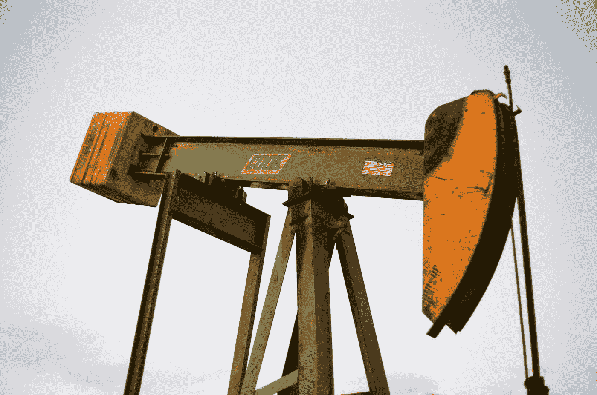

# 美国股市下跌 797 点，因反俄制裁将汽油推升至每桶 130 美元以上

> 原文：<https://medium.com/coinmonks/us-stocks-fall-by-797-points-as-anti-russia-sanctions-push-petrol-above-130-per-barrel-8c049a77630b?source=collection_archive---------67----------------------->

白宫发言人珍·普萨基周一告诉记者，拜登政府尚未决定是否禁止从俄罗斯进口石油。据报道，美国总统乔·拜登已经计划敦促沙特阿拉伯增加产量，甚至向委内瑞拉发出和平试探。

Photo by [Jeremy Morris](https://unsplash.com/@valueforvalue?utm_source=medium&utm_medium=referral) on [Unsplash](https://unsplash.com?utm_source=medium&utm_medium=referral)

当周一收盘钟声响起时，美国股市继续几周前的下跌趋势，并在很大程度上受到相同担忧的推动:美国因俄罗斯在乌克兰的特别军事行动而对其实施制裁的影响。

道琼斯指数周一下跌 797.42 点，收于 32817.38 点；纳斯达克综合指数也下跌，下跌 482.48 点，收于 12830.96 点；标准普尔 500 下跌 127.78 点，收于 4201.09 点。

> 随着美国[汽油价格 15 年来首次突破每加仑 4 美元](https://oilprice.com/Energy/Energy-General/US-Gasoline-Prices-Top-4-For-First-Time-Since-2008.html)，石油价格在周末继续上涨，在[周一](https://oilprice.com/Energy/Crude-Oil/Oil-Prices-Settle-At-120-As-Fears-Of-A-Russian-Crude-Ban-Remain.html)稳定在 123 美元之前达到每桶 130 美元。因此，石油公司的股票周一大幅上涨，石油和天然气服务提供商贝克休斯的股票价值上涨了 5%。雪佛龙增长 1.4%，埃克森美孚增长 2%。

“油价上涨正在破坏市场的稳定，”基础设施资本顾问公司首席执行官兼投资组合经理杰伊·哈特菲尔德告诉《华尔街日报》。“市场担心这场战争及其对美国经济增长和美国公司的影响。”

然而，银行股遭受了巨大的损失，美国银行损失了 3%的价值，花旗集团下跌了 1.4%。基于对油价上涨导致运营成本上升的预期，服务公司也有所下降，麦当劳，星巴克和耐克都有所下降。

美国对俄罗斯经济的制裁主要针对其金融部门，导致全球市场混乱，周一，美国及其盟友开始讨论可能禁止进口俄罗斯石油产品，这是该国最大的出口产品。俄罗斯提供了欧洲 40%的天然气。

> 然而，白宫发言人珍·普萨基周一表示，“总统目前还没有做出任何决定”，也没有提供做出决定的时间表。

据报道，拜登正考虑前往沙特阿拉伯，要求世界上最大的石油生产国和美国的亲密伙伴增加石油产量，以抵消俄罗斯天然气的潜在损失。

《T2 时报》周六还报道称，美国外交官已经前往委内瑞拉，试图与委内瑞拉总统尼古拉斯·马杜罗和解，利用取消美国破坏性制裁的诱惑，让他与俄罗斯总统弗拉基米尔·普京决裂，后者长期支持委内瑞拉反对美国在该地区霸权的立场。美国[多年来一直试图通过支持一位名为胡安瓜伊多的无名反对派候选人将马杜罗赶下台，胡安瓜伊多三年前宣布自己为该国临时领导人。](https://sputniknews.com/20210622/us-doubles-down-on-venezuela-sanctions-as-guaido-tours-europe-touting-penalties-as-leverage-tool-1083213905.html)

一些人担心油价上涨会进一步加剧通货膨胀，由于新冠肺炎疫情引起的其他运营成本增加，通货膨胀已经达到 40 年来的最高点。

> Leuthold Group 首席投资策略师吉姆·保尔森(Jim Paulsen)周一对美国消费者新闻与商业频道表示，“‘滞胀’正迅速成为投资组合策略的核心焦点”，他指的是 20 世纪 70 年代中东石油出口国对在 1973 年战争中支持以色列的西方国家实施禁运造成的现象。

“为更慢的增长和更持久的通胀做准备正在推动投资者的恐惧和行动，”这位分析师补充道。