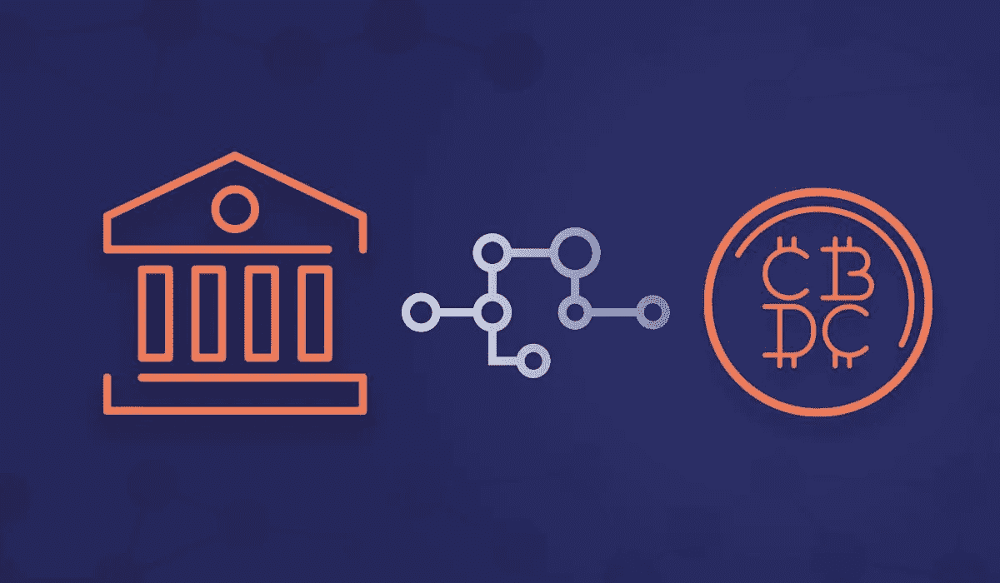

# USDC，USDT，稳定的硬币将被 CBDC 控制。

> 原文：<https://medium.com/coinmonks/usdc-usdt-stable-coins-will-be-cbdc-controlled-57a9374310bf?source=collection_archive---------17----------------------->

~dwulf

**集中重组**

一些稳定的硬币将很快落入集中控制，尽快退出集中交易。

腐败的监管机构正迫使中央加密交易所冻结你的账户，强制 KYC，并迫使用户披露他们向谁发送比特币以及发送金额的所有辅助数据。

你的硬币不是你的硬币，你的隐私对他们来说是个笑话。不要被哄骗去使用集中交易，自学并学习如何用你的密码编排第一层和第二层交易。

**不要交出你的 KYC 数据**

**不要把你的密码存放在集中的密码交易所里，除非有必要进行交易。**

创建一个退出策略，让自己摆脱集中式交换，转而使用 DeFi 交换技术。

**那么，你能做什么呢？**

首先，如果你在加密生态系统中，那么恭喜你，许多没有创造者的人甚至不想进入这个生态系统。但是你必须警惕你用什么方法来存储，购买和出售你的密码。腐败的监管者会不择手段地控制你的加密财富，坦率地说，集中交易正是他们这样做的一种方式。

这意味着，像币安、比特币基地、火币环球、北海巨妖、Bithumb、Bitfinex、Bitstamp 这样的老牌公司，甚至很长一段时间都在支撑着 KuCoin。会受到未来问题的影响，这些问题会使您的加密资产受到检查。

侵犯性的法规正在尽一切努力迫使密码行业屈从于他们的意志，迫使发送者和接收者 KYC，并给予第三方保管人单方面的权力来控制你的密钥。

你可以采取行动，通过 DIY 损害控制来缓解这种情况。我不打算对你撒谎，这意味着在用户方面要做更多的工作，以防止你落入这个陷阱，并使你的财产在你的控制之下，但是，在你被锁在你的加密财产之外之前，现在处理它是明智的。

**稳定的困境**

USDC，USDT 将很快被控制，但 UST，澳元，和其他稳定的硬币会来救援。如果你幸运地获得了加密支付，很可能你会得到一个稳定的硬币，从那里你可以用它交换任何其他加密硬币/令牌。我认识一些人，他们会立即将美元换成 ETH、DOT 或 ATOM 进行投资，并保持 UST 和澳元至少部分投资与美元挂钩。

我的利差是非传统的，这不是金融建议，但我认为 BTC 是全球经济的稳定硬币，UST 和澳元等常规“稳定”硬币是美元经济的稳定硬币。

Acala 允许你从 DOT 或 ACA 抵押品中铸造澳元，这比 USDC 或 USDT 更好(更分散)。但没那么出名。

UST，土地月神稳定硬币是火箭燃料，在这里更有名。

**深挖，学习高等函数**

可悲的现实是，所有用户都需要停止依赖和适应集中式机制，并学习和理解分散式机制。这意味着人们需要挖掘比简单交易的表面知识更深的东西，因为有了新的规定，它们就不那么简单了。

有一些抵制和方法来规避大多数的控制。但它们并不总是容易使用，这是一个问题，但也是一个必须解决的问题。

诀窍是如何解决这些问题，而又不超出你的能力范围。

**各个击破**

你的基础是你的钱包，分类账钱包是冷藏的最佳选择，但并不是所有的区块链系统都可以很好地使用它来进行交易或高级交易。

Polkadot 的群体拍卖和 Acala 当前的 DeFi 系统迭代是有问题的，并且与 Ledger 有兼容性问题。我确信这将随着 DeFi 替代方案变得更加成熟而得到解决，但目前，至少对我来说，我参与的 Polkadot 准链生态系统仍然通过我的 Polkadot.js 原生钱包来处理。

这意味着我必须在征服我的密码控制的策略上更加分裂。从核心加密钱包开始，将它们转移到 DeFi 专用加密交换机，而不是集中式加密交换机，尽管它们更容易处理。

**结论**

一个人应该通过定义来寻找交换的方法。这是一个艰难的问题，但很快就会成为一个非此即彼的命题。要么走 DeFi 路线，要么成为 CBDC 的奴隶。

Polkadot 和 Cosmos(以及许多其他区块链协议)是可行的选择。Polkadot 和他们的 para-chain 项目，奠定了 Polkadot 第 0 层的基础，这些项目奠定了第 1 层和第 2 层的选择。

在第 3 层，事情变得复杂和集中，KYC 成为强制性的，你的身份被附加到你的密码，你的密码被跟踪和监控。集中交易成为菲亚特进出匝道的共同路径。

**税收？**

这个想法是为了避免对法令的需求，并通过加密友好的供应商和商人保持与非 KYC 加密的交易。仅在需要时与菲亚特交易，并且仅从您的流动资产中贷款，以避免(而不是逃避)非法或过度征税。

税收的动态将会改变，迫使税务当局考虑直接征税。也就是说，税收直接流入消费领域，而不是来自赚取的资本。意思是说*所得税不在考虑范围内*与有意义的服务直接相关的税是唯一应该缴纳的税，这些服务直接有利于个人收入购买的东西(即购买房产，缴纳财产税，购买汽车缴纳销售税，购买消费品缴纳增值税)。

这是可以做到的，随着人们对集中式银行业务的兴趣减弱，以及加密交易的减少，美国国税局将被迫对此进行协调。与工作的关系转移到更加加密的点对点合同，消除了 HR、W2 和 1099 关系，并消除了社会保障和税收 ID 索引号。

归根结底，这只是一个退出旧世界经济、不玩他们的游戏的问题。

加入 Coinmonks [电报频道](https://t.me/coincodecap)和 [Youtube 频道](https://www.youtube.com/c/coinmonks/videos)了解加密交易和投资

# 另外，阅读

*   [本地比特币审核](/coinmonks/localbitcoins-review-6cc001c6ed56) | [加密货币储蓄账户](https://coincodecap.com/cryptocurrency-savings-accounts)
*   [什么是融资融券交易](https://coincodecap.com/margin-trading) | [成本平均法](https://coincodecap.com/dca)
*   [支持卡审核](https://coincodecap.com/uphold-card-review) | [信任钱包 vs 元掩码](https://coincodecap.com/trust-wallet-vs-metamask)
*   [Exness 回顾](https://coincodecap.com/exness-review)|[moon xbt Vs bit get Vs Bingbon](https://coincodecap.com/bingbon-vs-bitget-vs-moonxbt)
*   [如何开始用加密贷款赚取被动收入](https://coincodecap.com/passive-income-crypto-lending)