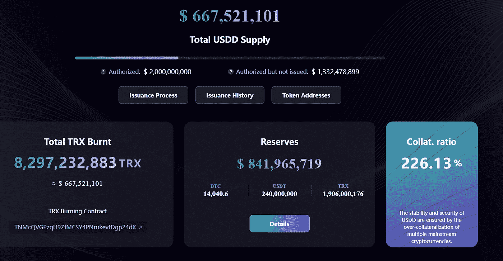
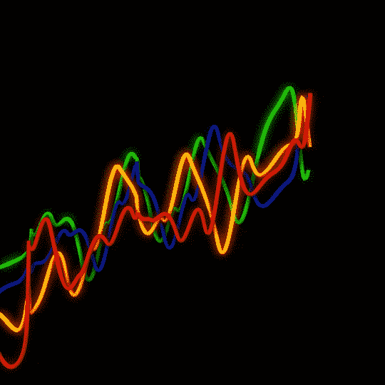
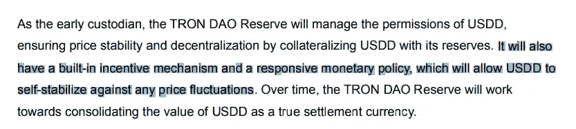
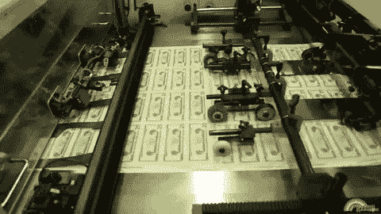
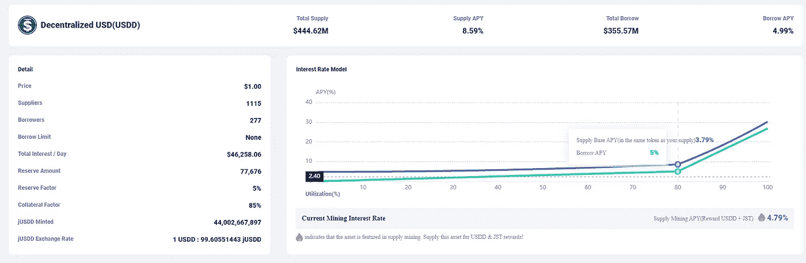
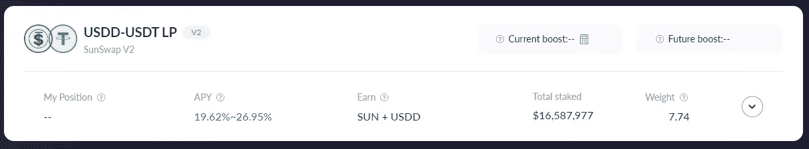
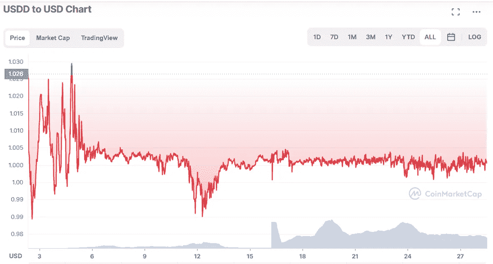

# USDD，未来的分散稳定中心？还是会走向不可避免的死亡？

> 原文：<https://medium.com/coinmonks/usdd-a-decentralized-stablecoin-for-the-future-or-will-it-head-towards-an-inevitable-death-c40f048e6272?source=collection_archive---------13----------------------->

## 另一种算法 stablecoin 奋起迎接挑战。在本文中，我们将对白皮书进行分解，以更好地理解它是如何工作的

USDD by TRON

大约几周前，孙正义宣布推出 USDD。我们今天要看的是一个分散的算法稳定器。

对于所有那些新的或者不清楚稳定硬币是什么的人来说，它实际上是一种在动荡的世界中为你提供稳定性的硬币。根据你所关注的稳定币的类型，它可以是部分支持的，完全支持的，也可以是完全不支持的。

USDD 属于算法稳定币类别，因为它没有任何资产支持，但通常由另一个令牌支持，在这种情况下，就是 TRX。

******在我们开始之前，请注意这篇文章是我从他们的白皮书中读到和理解的，可能正确也可能不正确。我确实对它的某些部分有疑问，如果我设法找到它们的答案，我可能会做一个更新。* * ****

一如既往，希望你喜欢阅读这篇文章。作为回报，请欣赏下面这些小猫的可爱😆

Photo by [The Lucky Neko](https://unsplash.com/@theluckyneko?utm_source=medium&utm_medium=referral) on [Unsplash](https://unsplash.com?utm_source=medium&utm_medium=referral)

*** *编辑于 2022 年 6 月 6 日****
只想做个快速更新。看起来 USDD 目前的超额抵押率达到了 220%，这是朝着正确方向迈出的一步。我们也可以在他们官方网站上的新仪表板上看到它。当新的稳定币刚刚推出时，在开始时谨慎行事总是好的，但我不认为这是最好的解决方案。他们不能只是不断提高抵押品比率，这只会让资本效率越来越低。

白皮书首先向我们解释了 BTC 由于其高价格波动性而仍未被广泛接受为结算货币。由于它的不确定性，也不适合在交易中使用。这就是为什么需要 USDD 的原因，因为它有灵敏的货币政策和铸币机制。
稍后将详细介绍……

接下来，它将讨论稳定性，包括稳定性的定义、衡量和实现方法。
**USDD 协议将与美元挂钩**因为美元是世界上使用最广泛的货币，所以这并不奇怪。

该系统还将不得不依赖于一个分散的价格 oracle 来获得一个准确的价格估计。它通过以下方式实现这一点，

*   超级代表将提供 USDD 的价格，他们需要就他们认为的 USDD 当前的美元汇率提交投票
*   通过取加权中值，真实的比率将来自每 N 个街区发生的那些记录的投票
*   奖励将给予那些已经投票但在所选中位数(真实比率)1 个标准差以内的人

为了阻止在价格预测中串通虚报价格，投票只给予那些在系统中有很深既得利益的用户，即超级代表。(SR)

那些未能在投票结束前提交投票或提交的投票超出 1 个标准差的 SR 将受到惩罚。

# **问题**

> *—N 个街区是多少个街区？100 块换一个速率刷新？1 街区？在价格变化过快的情况下，多少个街区是仍能获得相当准确价格的最佳地点？*
> 
> *—由于投票仅限于 SR，那么 SR 是如何选出的呢？根深蒂固是选拔的唯一标准吗？如果他们 5 个顶级 SR 一起操纵价格对他们有利呢？*
> 
> *—提到的惩罚是什么？*

接下来，我们将讨论如何实现价格稳定。当它检测到 peg 的变化时采取的对策如下，

*   如果 USDD 低于盯住汇率，收缩货币供应，使价格水平恢复正常
*   如果 USDD 高于盯住汇率，则扩大货币供应，使价格水平恢复正常

Up and Down, here we go

用户将 USDD 烧成薄荷 TRX，使 USDD 回到盯住美元，反之亦然。这将暂时稀释斯洛伐克共和国在 TRX 的采矿力量

由于 USDD 协议公司将吸收 USDD 价格的波动性，中长期内，该 SR 将从代币互换中获得费用奖励**。**

因此，创令牌，TRX 将被用作这个稳定硬币的支持令牌。它还将依靠套利者将价格拉回盯住汇率。该协议还允许套利者进行 1 美元对 1 美元的 TRX 互换。

提到的**奖励**来自稳定币掉期和 TRX 稳定币掉期产生的费用。由此，提到了其中的两个，

*   托宾税:生态系统内稳定的货币互换的固定费率。
    由于 USDD 是 USDD 协议中唯一的稳定币，因此这并不适用，只有在引入其他稳定币时才会起作用。
*   传播费用:USDD 和 TRX 之间的每次互换将产生最低 0.5%的传播费用。价差费用也将根据市场波动自动调整。

# **问题**

> — *铸币和焚烧机制并无新意，因为大多数稳定货币都依赖同样的方式来维持其盯住汇率。如果没有什么新的东西，是什么把这个稳定的硬币和其他硬币区分开来呢？最高的 APY%？*
> 
> *——由于这与 UST 的运作方式非常相似，如果没有其他额外的措施来防止这种情况发生，死亡螺旋很有可能发生*
> 
> *—传播费用，这似乎也类似于 UST 的机制。了解费用如何因波动而变化将是有益的，这样我们至少可以知道套利者不再有任何动力捍卫钉住汇率的水平*

Photo by [NASA](https://unsplash.com/@nasa?utm_source=medium&utm_medium=referral) on [Unsplash](https://unsplash.com?utm_source=medium&utm_medium=referral)

# 路标

**1.0 空间—** 创道和那些白名单上的机构将成为 USDD 的第一批造币者。它还谈到使用创道储备，以减轻严重和长期的经济衰退。他们将能够通过给出无风险利率来稳定特龙和其他区块链上的集中和分散稳定货币的汇率

“一体行动”还将从著名的区块链参与者那里筹集 100 亿美元，同时吸引更多的流动资产和合规机构成为利益相关方，以提高权力下放的水平

From the whitepaper

看起来越南盾将通过使用其储备作为 USDD 的抵押品来确保价格稳定。尽管他们将完全实施可兑换性(1:1)，但这是作为早期储备提到的，所以不知道一旦 USDD 增长并脱离这个“早期阶段”会发生什么

30%是基本的无风险年利率。这样做是为了让使用 USDD 的其他组织能够拥有有效和一致的利率政策。这背后的想法与 Anchor 试图或已经试图做的事情类似，即成为低波动性利率的基准。

**2.0 ISS —** 谈论 USDD 分散式网络的测试网将如何上线。部署 oracle 测试价格反馈系统

**3.0 月—**USDD 分散式网络正式发布。TRON V5 支持 USDD。铸造，燃烧和交换的权利将给予创主网。

**4.0 Mars—**TRON SRs 更新至 V5.0。部署 Oracles 以确保系统的稳定性。创道保护区将把 USDD 的发行权和刻录权移交给创道维护网。

# 问题

> — *创道储备如何提供 30%的无风险利率？这会不会像主播通过押利息和借利息来做？一旦它退出第一阶段，它是否仍将在需要时依靠道储备来维持价格稳定？*
> 
> —“**内置激励机制**”或“**响应性货币政策**”是提到的允许 USDD 自我稳定以应对价格波动的机制。这是如何做到的？鉴于 UST 最近发生的事情，这一点变得至关重要。

# **发行**

Printer goes Brrrrrr

创道将预发行 999B TRC-10 USDD，然后将其 1B 转让给一个**授权**，多签署合同作为 USDD 早期储备。剩余的 USDD 将在一份**发行**合同中持有，该合同由 5/7 分散机构控制，10 天时间锁定 multisig。(妈的，真拗口)

当授权合同中的 USDD(前面提到的 1B)不足时，创导将在发行合同中授权部分 USDD(被押中的 USDD)进行补充。

在**空间**阶段，只有白名单上的机构才有资格铸造和发行 TRX USDD。他们将需要转移 TRX 到燃烧合同和创道储备将决定多少 USDD，他们将得到回报，根据现场汇率。

从那里，TRON DAO 将通过 5/7 分散多 sig 将 USDD 从授权合同转移到流通帐户。一旦完成，他们将把这些 TRC-10 USDD 转换成 TRC-20 USDD，然后转移到那些白名单上的机构。

# 问题

> 为什么他们要把已经开采好的 USDD 分成两部分？
> 
> —为什么 USDD 的发行/铸造需要额外的步骤？
> 
> —是否是由于需要 TRC-10 和 TRC-20 USDD 令牌的限制？

在白皮书的最后部分，它提到“USDD 议定书根据需求的变化调整 USDD 的供应，以稳定其价格”。这是通过利用 TRX 来吸收 USDD 的价格波动来实现的。

ABSORB? Did someone say absorb? UST flashback begins…

只有在第 4 阶段，火星阶段，创刀将摧毁所有那些 TRX 发送到燃烧合同之前和所有那些授权但未发行的 USDD。
新 USDD 的发行权也将授予 TRON USDD 分散网络。用户可以在网络上用 1 美元的 TRX 铸造 1 USDD。

# 问题

> *—在稍后阶段而不是立即烧掉这些 TRX 的理由是什么？*

—是的，最初创道将处理 USDD 的所有铸造和发行，但是为什么呢？是否可以通过这样一种方式来实现，即机构或感兴趣的团体可以从一开始就直接在网络上创造和燃烧？

最初，我认为我们会得到一个类似于 Anchor 的协议，向储户提供“稳定的”30%的收益率，但也许他们不想这样做，或者也许不久的将来会有这样的协议？
不管怎样，这里有两个例子可以让你从 USDD 中获得一些收益。

Rates from JustLend

我们看到的 8.58%包含了两种报酬(JST & USDD)。

由于利用率接近 80%，(355.57 米/444.62 米= 79.97%)
从图表中我们可以看出，供应**基数** APY 只有 3.79%，所以加上供应**矿业** APY 的 4.79%，我们将得到 8.58%的总 APY(接近…)

LP rates from SUN.io

如果你想参与流动性池挖掘，请注意 APY 提到的 19.62%-26.95%包含了孙和 USDD 的奖励。

太阳= 4.88% — 12.21%

USDD =14.74%

因此，你将从 USDD 的 LP 中获得 14.74%的收益率，这也将根据资产池的 TVL 和其他因素而波动
尽管%收益率远低于白皮书中提到的 30%，但我相信这根本不是一件坏事。如果我们只单纯看 APY%而不看其他(涉及的风险)，在一对稳定的货币上获得 14.74%的回报率实际上是相当有吸引力的。

# 结论

CMC — accurate at time of writing

从表面上看，USDD 和 UST 没什么不同。众所周知，algo stables 也面临着同样的问题，即死亡螺旋。就目前而言，USDD 仍然是“中央集权”的，但随着我们进入硬币的后期，他们将变得更加分散。

直到我能找到更多关于他们打算如何降低风险的信息，或者想出一个新的机制来对抗它。我觉得对我来说参与其中太冒险了，即使回报(APY)很高。
赚 30%*的好处与损失接近 100%资金的坏处。(又是去钉住事件？)

鉴于最近 UST 事件和普遍看跌的市场，这并不能很好地反映 crypto 的整体情况。

我在另一篇文章中谈到的风险之一是，项目的表面可以被认为是一种风险。如果您有兴趣了解更多信息，请查看下面文章中的第 3 点。
鉴于 TRON 创始人的推文记录，我将让你决定这是否值得关注。

 [## 我从 Terra 的崩溃中学到了什么

### 痛苦时期的教训，这一集的主要收获

medium.com](/coinmonks/what-ive-learnt-from-the-collapse-of-terra-88c03ee5b177) 

目前，关键的一点是，与其他稳定的市场相比，USDD 的市场份额或总供应量仍然很小。鉴于此，当银行挤兑发生时，应该不会有任何问题，因为创道储备将能够支持他们的 USDD。

这就是我从白皮书中获得的基本信息。总的来说，我觉得它可以包含更多的信息，但仍然是一个非技术性的阅读。

你怎么想呢?在下面的评论区让我知道
感谢阅读！😄

有用的链接

> [白皮书](https://usdd.io/USDD-en.pdf)
> 
> [创刀储备](https://tdr.org/#/)
> 
> [slowmisaudit—USDD](https://usdd.io/SlowMistAuditReport-USDD.pdf)
> [slowmisaudit—USDD TRC 20](https://usdd.io/SlowMistAuditReport-USDDTRC20.pdf)

> 加入 Coinmonks [电报频道](https://t.me/coincodecap)和 [Youtube 频道](https://www.youtube.com/c/coinmonks/videos)了解加密交易和投资

# 另外，阅读

*   [德国最佳加密交易所](https://coincodecap.com/crypto-exchanges-in-germany) | [Arbitrum:第二层解决方案](https://coincodecap.com/arbitrum)
*   [币安交易机器人](/coinmonks/binance-trading-bots-d0d57bb62c4c) | [OKEx 评论](/coinmonks/okex-review-6b369304110f) | [Atani 评论](https://coincodecap.com/atani-review)
*   [最佳加密交易信号电报](/coinmonks/best-crypto-signals-telegram-5785cdbc4b2b) | [MoonXBT 评论](/coinmonks/moonxbt-review-6e4ab26d037)
*   [如何在 Bitbns 上购买柴犬(SHIB)币？](https://coincodecap.com/buy-shiba-bitbns) | [购买弗洛基](https://coincodecap.com/buy-floki-inu-token)
*   [CoinFLEX 评论](https://coincodecap.com/coinflex-review) | [AEX 交易所评论](https://coincodecap.com/aex-exchange-review) | [UPbit 评论](https://coincodecap.com/upbit-review)
*   [十大最佳加密货币博客](https://coincodecap.com/best-cryptocurrency-blogs) | [YouHodler 评论](https://coincodecap.com/youhodler-review)