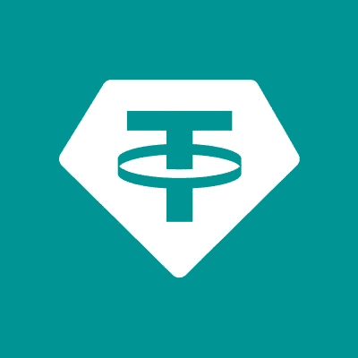

# USDT·德佩格斯:恐慌的时候到了吗？

> 原文：<https://medium.com/coinmonks/usdt-depegs-is-it-time-to-panic-c8fe2263d78b?source=collection_archive---------29----------------------->

在加密市场的混乱和 UST 稳定币的脱钩之后，引发了恐慌和几乎所有硬币和代币的下跌，泰斯也对美元挂钩感到恐慌，其价格跌至 0.97 美元以下。UST 稳定币的脱钩引发了人们对其它更成熟的稳定币的担忧，而系绳是最新的目标。2022 年 5 月 12 日价格跌破 0.97 美元时，crypto 社区陷入恐慌。一些交易员似乎正在从 USDT 转移到其他稳定的地区，如 USDC 和 BUSD。虽然 USDT 有所反弹，现在交易价格为 0.99 美元，但对于系绳仍有一些未解决的问题和模糊之处。
人们总是担心 tether 的储备，以及它是否得到了适当的支持，尽管事实上它最近在证明方面更加开放，但对 tether 的 fud 仍然存在。
尽管 USDT 是市场上最大的稳定货币，但在剧烈波动的时候也经历了挑战。2017 年 4 月 23 日，USDT 跌至 0.97 美元，并未迅速反弹。系绳花了一个多星期才爬回 1 美元以上。
至少在本周，对 USDT 的担忧在很大程度上是投机性的，是对 UST 发生的事情的反应，鉴于 Tether 的储备大大超过 UST 的储备，后者由风险资产 Luna 支持，应该没有太多担忧的理由。然而，这是一个需要密切关注的情况。
根据该公司的网站，Tether 的稳定存款由法定现金或其对手以及短期存款支持。归类为“其他投资”的数字资产仅占 Tether 资金的 6.3%。

> 加入 Coinmonks [电报频道](https://t.me/coincodecap)和 [Youtube 频道](https://www.youtube.com/c/coinmonks/videos)了解加密交易和投资

# 另外，阅读

*   [3 商业评论](/coinmonks/3commas-review-an-excellent-crypto-trading-bot-2020-1313a58bec92) | [Pionex 评论](https://coincodecap.com/pionex-review-exchange-with-crypto-trading-bot) | [Coinrule 评论](/coinmonks/coinrule-review-2021-a-beginner-friendly-crypto-trading-bot-daf0504848ba)
*   [莱杰 vs Ngrave](/coinmonks/ledger-vs-ngrave-zero-7e40f0c1d694) | [莱杰 nano s vs x](/coinmonks/ledger-nano-s-vs-x-battery-hardware-price-storage-59a6663fe3b0) | [币安评论](/coinmonks/binance-review-ee10d3bf3b6e)
*   [Bybit 交易所评论](/coinmonks/bybit-exchange-review-dbd570019b71) | [Bityard 评论](https://coincodecap.com/bityard-reivew) | [Jet-Bot 评论](https://coincodecap.com/jet-bot-review)
*   [3 commas vs crypto hopper](/coinmonks/3commas-vs-pionex-vs-cryptohopper-best-crypto-bot-6a98d2baa203)|[赚取加密利息](/coinmonks/earn-crypto-interest-b10b810fdda3)
*   最好的比特币[硬件钱包](/coinmonks/hardware-wallets-dfa1211730c6) | [BitBox02 回顾](/coinmonks/bitbox02-review-your-swiss-bitcoin-hardware-wallet-c36c88fff29)
*   [block fi vs Celsius](/coinmonks/blockfi-vs-celsius-vs-hodlnaut-8a1cc8c26630)|[Hodlnaut 审核](/coinmonks/hodlnaut-review-best-way-to-hodl-is-to-earn-interest-on-your-bitcoin-6658a8c19edf) | [KuCoin 审核](https://coincodecap.com/kucoin-review)