# USDT 解释道

> 原文：<https://medium.com/coinmonks/usdt-explained-b17f50cbbbbe?source=collection_archive---------14----------------------->

Tether 也称为 USDT，是一种基于区块链的加密货币，实际上是一种以太币令牌，被归类为稳定硬币。

正如您所知，在撰写本文时，在 coin market cap 网站(www.coingecko.com)和 coingeckco(https://www . coingecco . com)上大约有 9951 种加密货币上市。这些网站列出了加密货币，满足了注册要求。值得注意的是，还有许多网站尚未注册。因此，这个名单还在增长。

根据创建加密货币的目的，以及它们是在自己的网络上独立运行还是在区块链的现有网络上运行，加密货币被分为特定的类别。这些类别包括:DEFI(分散金融)、NFT(不可替代代币)、代币、稳定硬币等

稳定硬币是与某些法定货币挂钩的加密货币，如欧元、美元或日元。USDT 是我们在加密领域拥有的众多稳定硬币之一。稳定币的例子有:(系绳)、(美元币)、(币安美元)、(泰拉美元)、戴(戴)、(真美元)、(派克斯美元)。

现在，让我们快速地看一下什么是 USDT，以及你需要了解什么

什么是系绳(USDT)？

Tether (USDT)是一种建立在以太坊网络上的稳定硬币，与美元挂钩。Tether 的发行人声称，USDT 得到了银行准备金和贷款的支持，这些准备金和贷款相当于或超过了流通中的 USDT 的价值。

需要注意的是，USDT 有不同的变体，这取决于它们构建的链/网络。因此，您需要确保为取款和存款选择相同的网络，否则资产可能会在从一个钱包转移到另一个钱包的过程中丢失。

1.TRC20 USDT 指的是在 TRON 网络上发布的 USDT

2.ERC20 USDT 指以太坊网络上通过系绳发布的 USDT。USDT 发行于

注意:TRC20 和 ERC20 是一样的，但是在 Tron 网络上使用 TRC20 转账 USDT 的交易费更便宜。

3.OMNI·USDT 指的是区块链网络上发布的 USDT

4.BEP 20 USDT 是在币安智能链网络或 BSC 上发布的

5.其他包括在以下网络上发布的:AVAXC (AVAX C-Chain)、BEP2 (BNB 信标链网络)、MATIC (Polygon)、SOL (Solana)。

**如何拿到你的 USDT 钱包**

为了解释这一点，我将利用币安平台，然而同样的原则适用于其他钱包或交易所。

如果您没有币安账户，[点击此处注册](https://bit.ly/381vsLa)

注册后:

登录，然后点击钱包，如下所示:

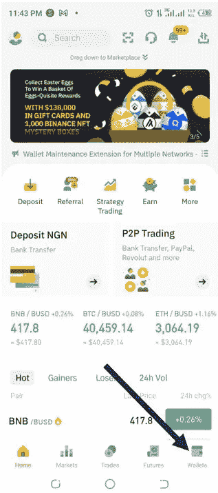

当场点击

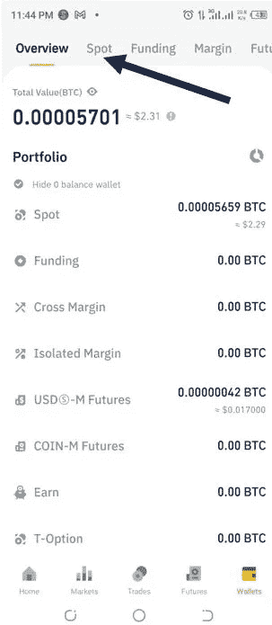

点击存款:

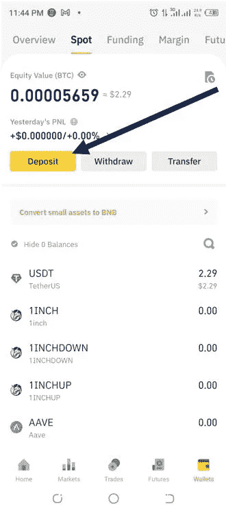

在搜索框中，键入 USDT。或者，如果它已经在您的搜索历史，选择 USDT。

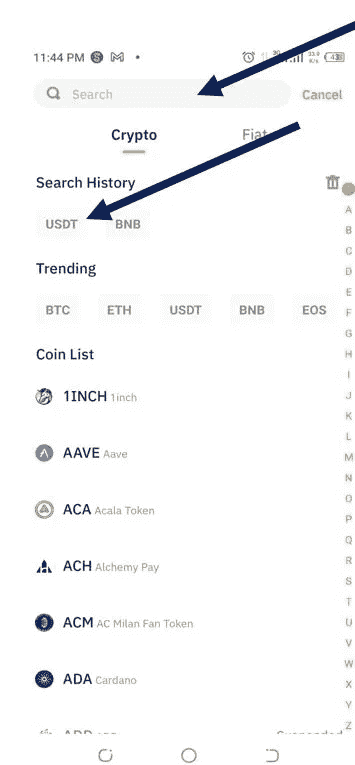

选择一个链网络。每个网络都有其唯一的钱包地址。时间报告代码 20 的钱包地址不同于 ERC 20 等。

如果您希望使用 TRC20 钱包地址，请选择它。

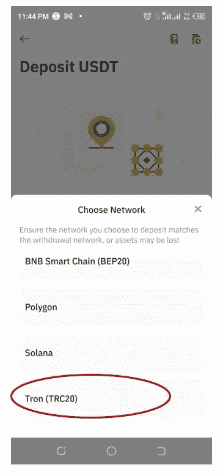

复制显示的 TRC20 钱包地址。点击复制(见箭头)

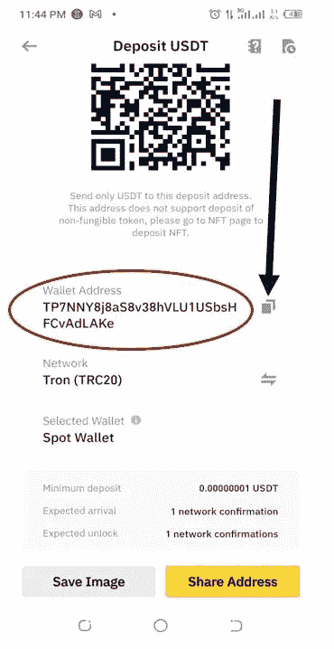

如果这个钱包是你的，那么可以肯定地说你的 TRC20 USDT 钱包地址是:TP 7 nny 8j 8 as 8v 38 hvlu 1 usbshfcvadlake

如果您选择了 ERC20 网络，那么您的钱包地址将会不同。看到圈出的地址。

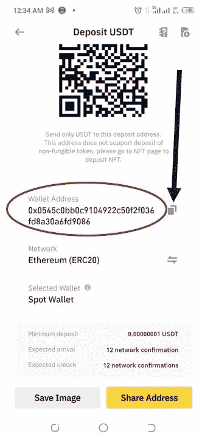

同一个钱包的 ERC20 USDT 地址是:0x 0545 c 0 bb 0 c 9104922 c 50 F2 f 036 FD 8 a 30 a6fd 9086

**如何为你的 USDT 钱包存钱**

有很多方法可以为你的 USDT 钱包提供资金，包括:

1.  **线下商家**

您可以通过将您的钱包地址发送给受信任的离线加密经销商/商家来为您的钱包提供资金，他们会在您根据商定的价格付款后为您的钱包提供资金。

无论经销商何时发送 USDT，它都会在几分钟后落入您的钱包中，具体取决于网络确认需要多长时间。

值得注意的是，包括加密货币在内的数字资产的价格会波动。因此，今天的价格，可能不是明天或未来的价格。这就是所谓的价格波动。这有助于交易者赚钱，无论市场走向是看跌(向下)还是看涨(向上)。我在这方面的文章。

2. **P2P 资金**

P2P(点对点)是一种利用交易平台提供的托管服务为钱包提供资金的方式。在这里，注册和验证的会员互相销售，而平台作为托管服务，确保没有人在这个过程中被诈骗或欺骗。

**如何使用 P2P 购买 USDT**
出于解释的目的，我们仍将使用币安交易所。
如前所述，不管你用的是什么类型的钱包，我在这里教的都适用，无论是 [remitano](https://bit.ly/3uEvbXM) 、 [ftx](https://bit.ly/3L3NI4Q) 、 [bybit](https://bit.ly/36rpYc8) 、 [bittrex](https://bit.ly/3rALfr1) 、 [okex](https://bit.ly/3xDnPoK) 还是 [huobi](https://bit.ly/3jM6mlX) 。

登录你的钱包，在这种情况下，币安钱包。

**第一步:**点击 P2P 交易

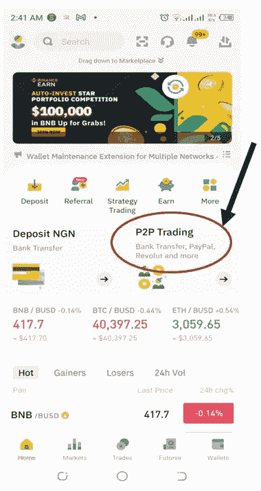

**第二步:**选择想要购买/基金的加密货币。在这个例子中是 USDT

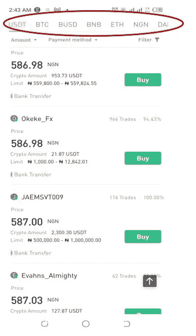

**步骤 3:** 你可以使用金额或付款方式过滤器来搜索最佳交易，否则你可以向下滚动，直到找到一笔好交易。
然而，要注意加密金额(这是卖方拥有的资产数量)和限额(这是卖方愿意交易的最小和最大数量)。仔细看下面的图片，你会发现每个卖家都有这个。为了挑选一个好的卖家，你还需要考虑他/她已经完成的交易数量和完成率。
你还需要留意卖家偏好的支付方式。这出现在每个卖家的广告下方。

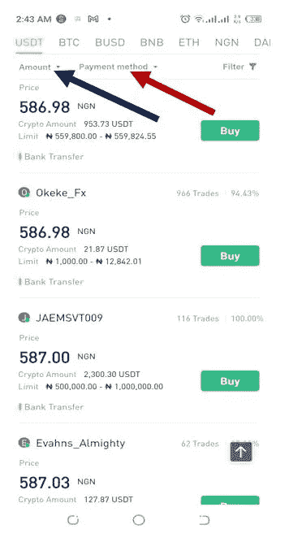

**第 4 步:**决定好要购买的卖家后，点击“购买”

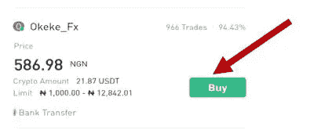

第五步:输入你打算购买的数量，比如说₦10,000。然后点击“零手续费购买”

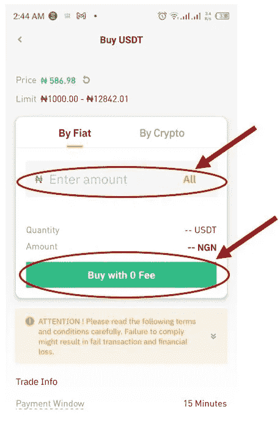

**第 6 步:**点击“付款”完成交易

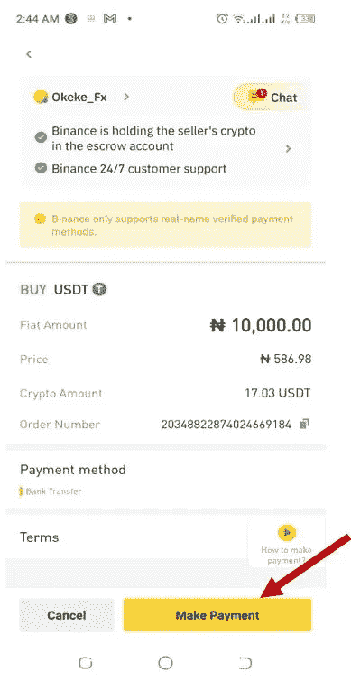

**步骤 7:** 显示卖家的银行账户详情。
付款后点击“已转账，通知卖家”
请按照屏幕上显示的卖家账户信息付款。此处显示的详细信息仅用于解释目的。

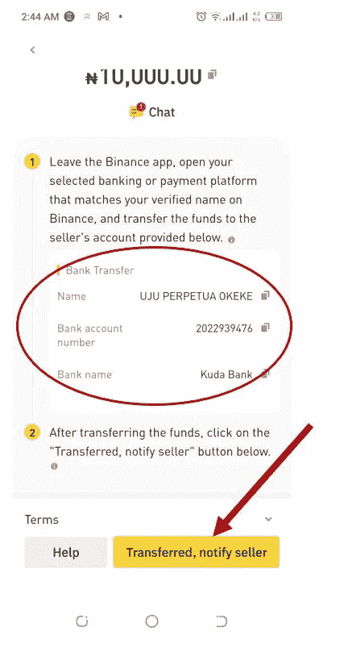

**第八步**:等待卖家通知你付款。一旦付款被确认，卖方将授权币安释放 USDT 给你。
寻找卖家的联系方式也是一个很好的做法，这样你就可以打电话给他/她，他/她知道可能会有需要。

**注:**
当币安(平台)向您发布 USDT(任何购买的密码)时，将会在 P2P 钱包中看到。
如果您打算向任何外部 USDT 钱包汇款/取款，您需要将其从 P2P 钱包转移到 SPOT 钱包。

**如何将密码从 P2P 钱包转移到 SPOT 钱包**

**步骤 1** :点击“钱包”，然后点击“资金选项卡”

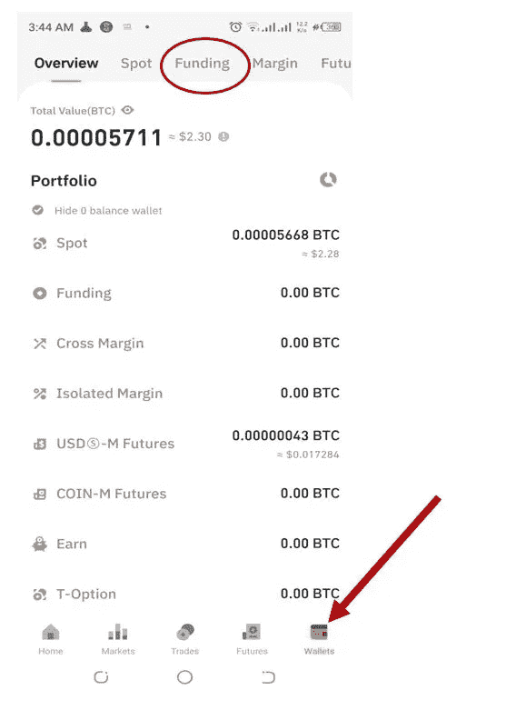

**第二步:**点击转账

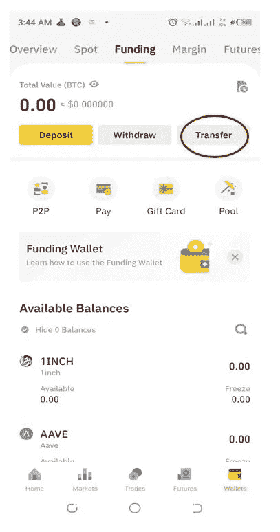

**步骤 3:** 使用小圆圈中的图标在“从”字段和“到”字段的参数之间切换。单击箭头所指的图标，选择出现在“从/到”字段中的钱包选项。您可以点击查看钱包选项。

然后点击确认转移。

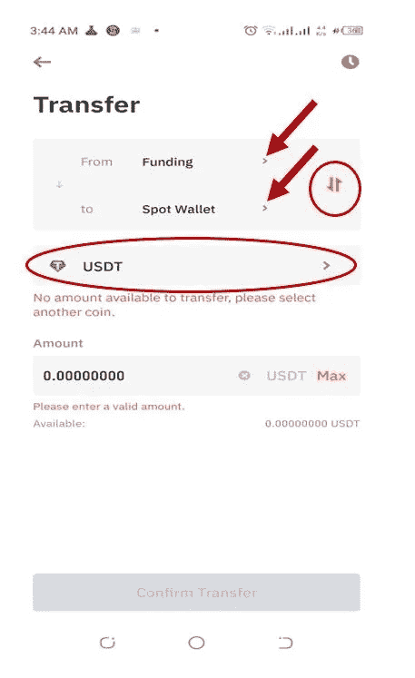

在成功地从 P2P/资金钱包转移到现货钱包之后，资产/加密(在这种情况下是 USDT)出现在现货钱包中，并且显示转移的金额。

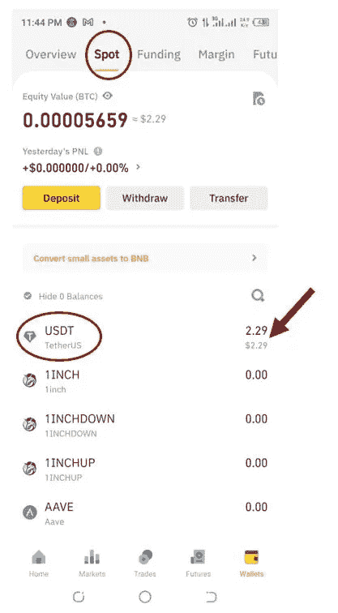

**如何从你的钱包里取出 USDT 到另一个钱包里**

在你从一个钱包如币安提取加密货币到另一个钱包之前，比如信任钱包或比特钱包等。或者，您可能希望向给定的钱包付款。知道你要取款的钱包地址是很重要的。

为了本文的目的，让我们假设:
1。您正在从币安钱包
2 中转账/取款。您取款/付款的 USDT 钱包地址已知，为:tfmxmevdiavzyesy 4 jvqgki 5 usgntmx8e
3。链/网是 TRC20
4。要提取的金额是 1 美元

**第一步:**点击撤回

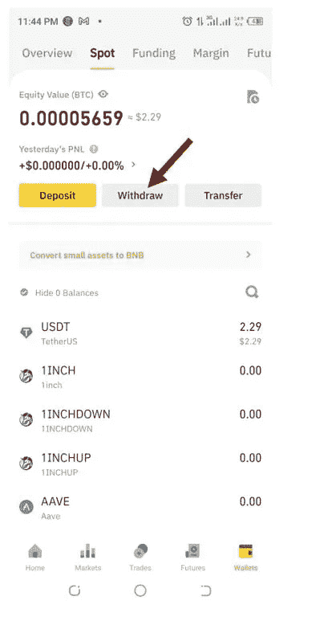

**步骤 2:** 搜索您想要撤销的加密，或者如果它在您的搜索历史中，您可以选择它。

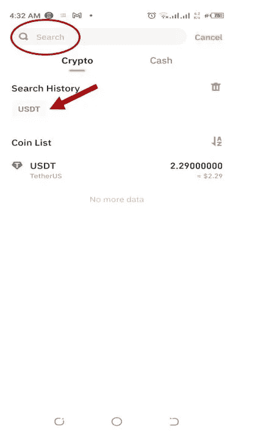

**步骤 3:** 提供所有需要的详细信息:粘贴您要支付的 TRC20 钱包地址，选择 TRC20 作为连锁/网络，输入您要发送的金额。
要确认您要继续交易，请点击“取款”。

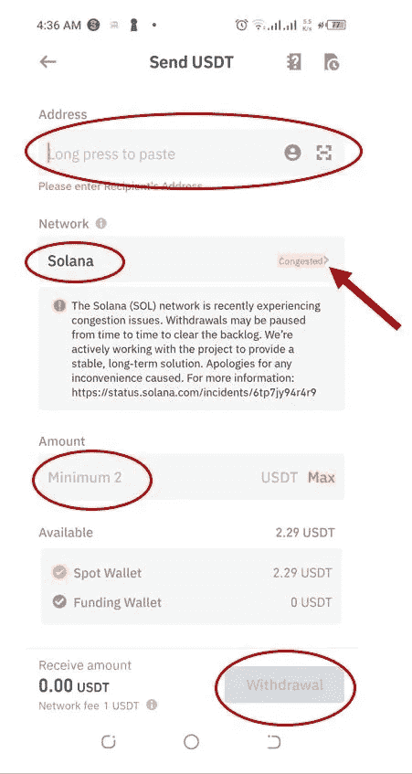

**第四步:认证提现。**

最后一步是根据需要提供身份验证代码。
这可能是发送到您注册的&验证过的电话号码、电子邮件和/或谷歌认证器的代码。
出于安全原因，旨在保护您的资金安全，如果没有此认证，提款将不会被批准。

点击[创建一个币安账户](https://bit.ly/381vsLa)。

如需进一步查询、澄清或专业聘用/合同
联系人:
邮件:akanfeoluwagbemiga@gmail.com
Whatsapp:[点击此处](https://wa.me/message/2OTJVOE7654RC1)

> 加入 Coinmonks [电报频道](https://t.me/coincodecap)和 [Youtube 频道](https://www.youtube.com/c/coinmonks/videos)了解加密交易和投资

# 另外，阅读

*   [有哪些交易信号？](https://coincodecap.com/trading-signal) | [Bitstamp vs 比特币基地](https://coincodecap.com/bitstamp-coinbase) | [买索拉纳](https://coincodecap.com/buy-solana)
*   [ProfitFarmers 回顾](https://coincodecap.com/profitfarmers-review) | [如何使用 Cornix Trading Bot](https://coincodecap.com/cornix-trading-bot)
*   [十大最佳加密货币博客](https://coincodecap.com/best-cryptocurrency-blogs) | [YouHodler 评论](https://coincodecap.com/youhodler-review)
*   [MyConstant 点评](https://coincodecap.com/myconstant-review) | [8 款最佳摇摆交易机器人](https://coincodecap.com/best-swing-trading-bots)
*   [MXC 交易所评论](/coinmonks/mxc-exchange-review-3af0ec1cba8c) | [Pionex vs 币安](https://coincodecap.com/pionex-vs-binance) | [Pionex 套利机器人](https://coincodecap.com/pionex-arbitrage-bot)