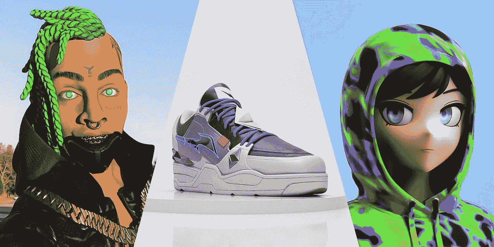
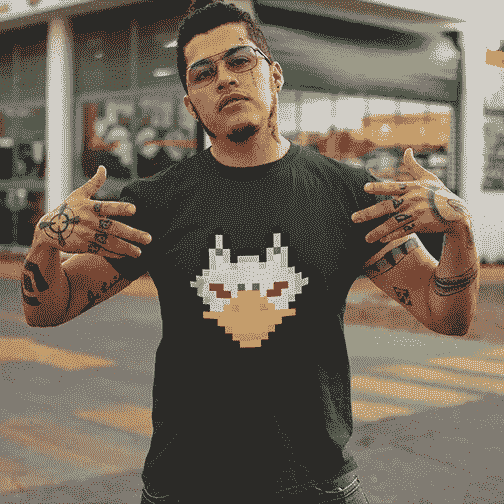

# 品牌 x NFTs 的使用案例

> 原文：<https://medium.com/coinmonks/use-cases-for-brands-x-nfts-21dc706b0e2c?source=collection_archive---------30----------------------->

from GRYPH, a global clothing and NFT marketplace

对于品牌来说，了解市场的新趋势、消费者如何变化，以及最终是什么影响了消费者如何选择一个品牌，这一点非常重要。世界在变化，多年来，一些运动涌现出来，迫使品牌重新思考他们的战略。

环境可持续性。道德劳动。动物权利。现在是不可替换令牌(NFT)。是的，你没听错。

我们已经走过了 NFT 被认为是可爱的数字艺术品的阶段。这里有全球公共利益。排名第一的 NFT 市场 OpenSea 在 2022 年 1 月创下了 40 亿美元的销售记录。NFT 为客户创造价值，并拥有建立紧密社区的能力。

*NFT 和品牌有什么关系？*

价值。社区。咄。

NFT 代表了品牌与客户互动的一种新方式。它们的用途非常广泛，可以用来表示数字文件，如文档、视频剪辑、声音字节和艺术。这为时尚(RTFKT)、虚拟房地产(HighStreet)、游戏(Axie Infinity)等领域的各种实用程序开辟了道路。

品牌可以通过以下方式使用 NFT:

*   创造独一无二的体验
*   增强品牌粘性
*   吸引新的客户群
*   培养品牌意识

RTFKT, from virtualhumans.org

*全球范例*

2021 年 12 月，耐克收购了 RTFKT，这是一家设计初创公司，生产可以在各种在线环境中穿着的数字运动鞋和其他收藏品。收购该公司使耐克得以进军元宇宙，即现实世界和虚拟世界的融合。

通过使用 NFTs，耐克将能够向其现有客户和新客户群提供大量新的虚拟产品。这对 Nike 来说是一个机会，可以抓住那些可能不在现实世界中购买产品，但积极参与元宇宙的群体。

2022 年 2 月，NBA 推出了一个抽奖流程，通过 31 张“全明星 VIP 通行证 NFT”获得全明星周末的特别入场券，这些门票为接下来的五个全明星周末提供了独特的套餐以及全明星赛的门票。要参加抽奖，球迷可以扫描出现在某些 NBA 比赛中的二维码。将从抽奖中选出一名获胜者。

然后，剩余的 NFT 将在其 NFT 平台 NBA Topshot 上拍卖 30 天，每个 NFT 代表一支球队。

通过使用 NFTs，NBA 能够创造一种真正独特的体验来吸引客户。

*菲律宾的例子*

菲律宾拥有 32%的非传统产业所有权。让它先放一会儿。 *NFT。最大的*。虽然其中大部分可能是由 Axie Infinity NFTs 的所有权推动的，这是一款在 2021 年广受欢迎的游戏，但这对品牌来说是一个机会，因为菲律宾公众对 NFT 概念的接受度很高。

本土品牌已经开始与非传统品牌合作，以加深与客户的接触。2021 年 11 月，知名名人哈特·伊万格丽斯塔的第一个 NFT 系列卖了 360 万菲律宾比索，而 2022 年 1 月，流行漫画和网飞热门作品“Trese”发布了限量版的 13 幅动作绘画 NFT。

from gry.ph

与此同时，当地科技初创公司 Gry.ph 正在通过在销售实体服装的同时发布 NFT，让全球服装和街头服饰品牌为客户提供真实的体验。忠诚的追随者可以通过拥有这些有限的收藏品获得不同的风味。不一样的味道。不同的表达方式。

这些只是 NFT 带给客户的一些本地品牌和使用案例。

尽管 NFT 受到了大肆宣传和关注，但人们很容易忘记它们仍处于起步阶段，出现还不到五年。许多品牌继续保持观望，这为那些更有信心进入这个勇敢新世界的人创造了机会。

查看 GRYPH 如何通过 NFTs 重新定义品牌如何重新定义客户体验: [www.gry.ph](http://www.gry.ph)

> *加入 Coinmonks* [*电报频道*](https://t.me/coincodecap) *和* [*Youtube 频道*](https://www.youtube.com/c/coinmonks/videos) *了解加密交易和投资*

# 另外，阅读

*   [Bookmap 评论](https://coincodecap.com/bookmap-review-2021-best-trading-software) | [美国 5 大最佳加密交易所](https://coincodecap.com/crypto-exchange-usa)
*   最佳加密[硬件钱包](/coinmonks/hardware-wallets-dfa1211730c6) | [Bitbns 评论](/coinmonks/bitbns-review-38256a07e161)
*   [新加坡十大最佳加密交易所](https://coincodecap.com/crypto-exchange-in-singapore) | [购买 AXS](https://coincodecap.com/buy-axs-token)
*   [红狗赌场评论](https://coincodecap.com/red-dog-casino-review) | [Swyftx 评论](https://coincodecap.com/swyftx-review) | [CoinGate 评论](https://coincodecap.com/coingate-review)
*   [投资印度的最佳密码](https://coincodecap.com/best-crypto-to-invest-in-india-in-2021)|[WazirX P2P](https://coincodecap.com/wazirx-p2p)|[Hi Dollar Review](https://coincodecap.com/hi-dollar-review)
*   [加拿大最佳加密交易机器人](https://coincodecap.com/5-best-crypto-trading-bots-in-canada) | [KuCoin 评论](https://coincodecap.com/kucoin-review)
*   [火币加密交易信号](https://coincodecap.com/huobi-crypto-trading-signals) | [HitBTC 审核](/coinmonks/hitbtc-review-c5143c5d53c2)
*   [如何在 FTX 交易所交易期货](https://coincodecap.com/ftx-futures-trading) | [OKEx vs 币安](https://coincodecap.com/okex-vs-binance)