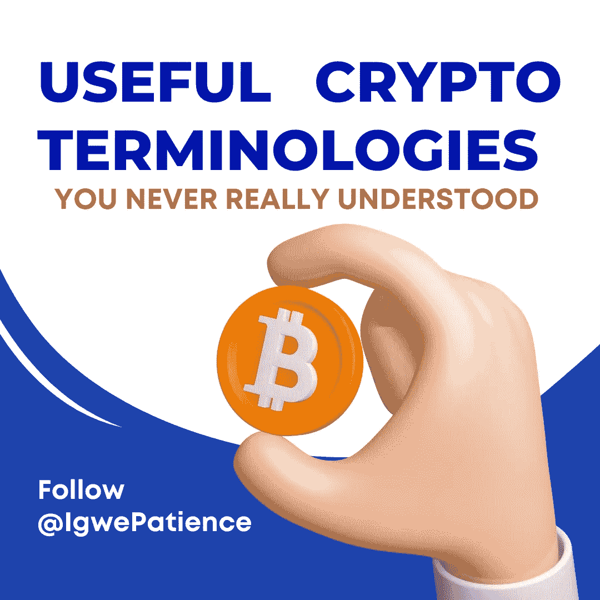

# 你从未真正理解的有用的加密术语

> 原文：<https://medium.com/coinmonks/useful-crypto-terminologies-you-never-really-understood-976935319c7a?source=collection_archive---------42----------------------->

毫无疑问，区块链的空间里刻有许多含糊不清的词，如果不小心处理，这些词会让一个新手不知所措。因此，为了解决这个问题，我列出了 30 个最相关的密码术语，可能对新手有用。点击查看

此外，我仍然有一些人来到 [@BAC](https://t.me/blockchainafricancommunity) 电报频道，询问一些他们觉得难以理解的其他术语，因此，我决定汇编新手需要学习的重要加密术语的第二部分，我将尽力给它一个非常叙述性和简化的解释。那么，让我们开始吧:

下面是一个详细描述的加密术语列表，供您使用，因此:

*   **TA-** TA 代表技术分析。这只是一个用来预测未来价格行为的数学指标。基本思想是，市场根据特定的模式运行，一旦确定，朝着特定方向的趋势通常会沿着相同的路线持续一段时间，然后才会发生转变。然而，要进行良好的投资分析，需要基本面和技术面的分析。
*   **POW-** 表示工作证明。这是比特币采用的共识机制，要求网络成员努力解决数学难题，以防止任何人利用该系统。工作证明广泛用于验证交易和挖掘新令牌，但是它消耗大量的能量。
*   **POS-** 意为利益证明，一种用于验证加密货币交易的共识机制。在该协议中，矿工被认为拥有一种货币的所有权，并且具有最高数量的货币(赌注)的矿工将有机会向链中添加/验证下一个块。
*   **弱手-** 这是一个不会长久持有硬币的人。每当价格下跌时，他总是急于卖出。
*   **白皮书** —白皮书是一份概述加密货币的用途、目标解决的问题以及如何在特定时期内实现目标的文档。
*   ROARMAP- 这是一个项目在规定的时间内旨在实现的事件或成就的及时日历或时间表。如果路线图是最新的，您也可以确定一个好的项目。
*   令牌经济学(Token omics)—这是令牌经济学&的组合。它有助于理解加密货币的供求特征。了解一个项目的令牌组学将帮助你知道何时进入和退出项目，以及你应该在一个项目中长期或短期的持续时间。如果你必须是一个成功的交易者或投资者，理解一个项目的记号经济学是必须的。
*   **ICO** —代表“初始硬币发行”，它主要用于一个新的加密货币项目以折扣率赠送一些硬币来为项目融资。
*   **I do**——代表“首次公开发行 DEX ”,它指的是在分散交易所(DEX)发行加密货币，通常以低于上市价格的价格发行，以筹集资金。
*   稳定币(stable coin)—这是一种加密货币，与美元的价值挂钩，使其更加稳定，波动性更小。例如 USDt、Usdc、Busd、Ust 等。现在，我知道你心里关于 terra USD 崩溃的问题，但那将是另一天的故事，所以，你需要粘在这个页面上更新。
*   这更像是鲸鱼用来掠夺人们收入的骗局。在这里，他们可以决定购买或拥有大量的硬币，只是为了鼓励其他人购买，就像你知道供求规律一样，“它越稀缺，价格越高”。因此，当这种情况发生时，他们会抛售他们所有的股票，价格会大幅下跌。
*   **WHEN LAMBO** —这是一个术语或俚语，投资者经常用来询问他们持有的特定硬币/代币的价格何时会过度上涨。
*   **NFTs** —这仅仅意味着不可替换的令牌。你知道吗，你可以使用智能合约轻松地买卖收藏品，如艺术品、音乐、交易卡、时尚物品，甚至是地产。是的。这可以通过使用 NFTs 来实现。你可以在这里了解更多关于 NFTs [的信息](/@michaelsihuoma/understanding-nfts-in-laymans-language-6eda30197400)
*   DYOR 的意思是“做你自己的研究”。事实是，区块链非常广阔，无论你从哪里获得信息，你总是需要自己做研究。目的是减少对加密货币不知情的投资者的数量，并鼓励他们在投资前研究和了解加密货币。
*   FUD 意味着恐惧、不确定和怀疑。例如，对市场造成负面影响的事件和新闻就像最近崩溃的 terra luna，新闻和事件有办法造成负面影响，从而使人们大量抛售。
*   **NFA**——(非金融顾问)当加密货币交易员和爱好者在社交媒体平台上发布公共帖子或分享他们的市场分析时，该术语也经常被用作免责声明。例如，如果你不是金融顾问，你做了交易分析，并鼓励人们去做，如果交易最终出错，你可能会因此被起诉，甚至被捕。这就是为什么当密码分析师或交易爱好者发布这样的帖子时，总是建议添加免责声明，以便任何希望跟踪分析的人自担风险。

这并不是要吓你不要交易或投资，而是提醒你市场不可能 100%可预测，即使是“正确的”分析也可能失败，所以用户在投资时谨慎是很重要的。

总之，有许多秘密术语，其中一些我们已经处理过了，其他的每天都会出现，我们需要留意这些术语，以免出错或错放在其他地方。所以，我希望你喜欢学习这几个密码术语，并能在你接触它们时正确地定位或识别它们？我相信你会的。

此外，不要犹豫，看看本文的第一部分:[加密货币爱好者和新手需要熟悉的 30 个最重要的单词](/@michaelsihuoma/30-most-important-words-cryptocurrency-enthusiasts-and-newbie-s-need-to-familiarize-ed0b5e4862b0)

# 关于作者

Igwe Ihuoma Patience 是一名自学成才的创意和特定行业内容作家，也是一名加密货币爱好者，拥有 2 年多的经验和不断发展的区块链空间的知识。

我擅长内容创作、文案撰写、字幕管理、视频编辑和手机图形设计，我教其他人如何在加密货币和区块链领域起步，我的目标是让区块链的学习和更新易于任何人理解。