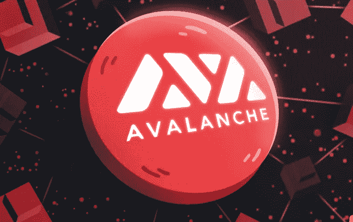

# Avalanche 的用户现在可以在一次交易中购买多边形或 BSC 资产

> 原文：<https://medium.com/coinmonks/users-of-avalanche-can-now-purchase-polygon-or-bsc-assets-in-one-transaction-615363dc8aa1?source=collection_archive---------64----------------------->

**Visit our website:-** [**https://bitcoinsupports.com/**](https://bitcoinsupports.com/)

路由器系统是一种跨链消息协议，现在支持 Avalanche 的 C 链，允许用户跨多个网络执行交易。

Avalanche 网络的 C 链已经链接到路由器协议跨链消息传递系统，允许 Avalanche 与包括 Polygon 和币安智能链(BSC)在内的其他兼容区块链进行通信。

用户现在可以通过单笔交易在 Polygon 或 BSC 上购买数字资产，而无需离开雪崩网络。跨链服务允许用户在可能不兼容的多个区块链之间发送数据。

路由器之前在一轮战略资本轮中筹集了大约 410 万美元，包括比特币基地的投资部门比特币基地风险投资公司和有影响力的加密基金 QCP 资本。

C 链代表契约链，是雪崩三链之一。交换链(X 链)和平台链是另外两个(P 链)。单一核心网络验证和保护一切。

用户将能够使用 X-Chain 生成和交换资产。P-Chain 支持构建“子网”或更小的网络。开发人员可以使用 C-Chain 来部署智能合约，然后可以使用智能合约来创建基于雪崩的业务和服务。

用户受益于低成本的本地资产转移，例如在 Avalanche 的 AVAX 和 Polygon 的 MATIC 上，而不必依赖第三方或集中的加密交换。据该公司称，大多数交易预计不到一分钟就能完成。

路由器将在支持的区块链上匹配分散交易所(DEX)之间的交易，以获得最佳定价。如果用户希望从 AVAX 切换到 MATIC，Router 将检查 Trader Joe 和 Pangolin 这两个基于 Avalanche 的 DEX，并在收费最低的 DEX 上执行交易。Router Protocol 的联合创始人 Ramani Ramachandran 认为，这种解决方案使更广泛的行业能够实现“多区块链”的未来，产品和服务在多个互联网络上运行，而不是在一个单一的、占主导地位的区块链上运行。他在声明中说:“随着区块链生态系统在规模和复杂性方面的发展，它们变得越来越条块分割，相互脱节，阻碍了该部门实现其全部潜力。”

路由器协议将提供一个软件开发工具包，让开发者创建可以与各种链通信的跨链应用。

**访问我们的网站:-**[**https://bitcoinsupports.com/**](https://bitcoinsupports.com/)

**免责声明:这些是作者的观点，不应被视为投资建议。读者应该自己做研究。**

> *加入 Coinmonks* [*电报频道*](https://t.me/coincodecap) *和* [*Youtube 频道*](https://www.youtube.com/c/coinmonks/videos) *了解加密交易和投资*

# 另外，阅读

*   [Bookmap 评论](https://coincodecap.com/bookmap-review-2021-best-trading-software) | [美国 5 大最佳加密交易所](https://coincodecap.com/crypto-exchange-usa)
*   最佳加密[硬件钱包](/coinmonks/hardware-wallets-dfa1211730c6) | [Bitbns 评论](/coinmonks/bitbns-review-38256a07e161)
*   [新加坡十大最佳加密交易所](https://coincodecap.com/crypto-exchange-in-singapore) | [购买 AXS](https://coincodecap.com/buy-axs-token)
*   [红狗赌场评论](https://coincodecap.com/red-dog-casino-review) | [Swyftx 评论](https://coincodecap.com/swyftx-review) | [CoinGate 评论](https://coincodecap.com/coingate-review)
*   [投资印度的最佳密码](https://coincodecap.com/best-crypto-to-invest-in-india-in-2021)|[WazirX P2P](https://coincodecap.com/wazirx-p2p)|[Hi Dollar Review](https://coincodecap.com/hi-dollar-review)
*   [加拿大最佳加密交易机器人](https://coincodecap.com/5-best-crypto-trading-bots-in-canada) | [库币评论](https://coincodecap.com/kucoin-review)
*   [用于 Huobi 的加密交易信号](https://coincodecap.com/huobi-crypto-trading-signals) | [HitBTC 审查](/coinmonks/hitbtc-review-c5143c5d53c2)