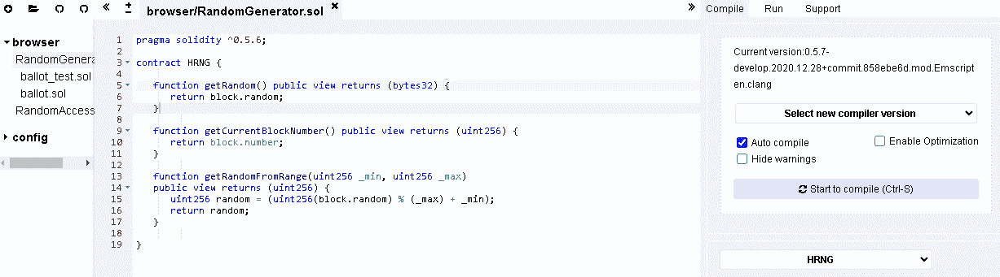

# 使用来自 HPB 链的可证明的随机发生器

> 原文：<https://medium.com/coinmonks/using-a-provable-random-generator-from-hpb-chain-40568fcbc2d9?source=collection_archive---------35----------------------->

[高性能区块链](https://hpb.gitbook.io/high-performance-blockchain/)最酷的事情之一是使用物理组件作为种子来生成可证明的随机数。正如他们所说

> 这个 HRNG 是由 HPB 网络中的每个节点运营商安装的硬件加速器( [BOE](https://hpb.gitbook.io/high-performance-blockchain/what-is-high-performance-blockchain-hpb/blockchain-offload-engine-boe) )的一个特征。它可以感知元件中微小的电压变化(小到 0.00001 伏)。这引入了一个现实世界的物理变量，使得 HPB 的随机数无法预测，因此非常适合 100%公平的彩票和机会游戏。

在本帖中，我们将介绍使用这一功能的一些快速步骤。

Jeff P 在[也有一个关于这个的很棒的教程，从 HPB 链](https://waxlyrical.medium.com/get-a-provable-random-number-on-a-blockchain-from-hpb-chain-a2e0b680a724)的区块链上得到一个可证明的随机数，这是我所做的基础，他实际上帮助我完成了它(非常感谢！).在我的指南中，我不会做太多的解释，我会直截了当，但如果你需要更多的信息，你肯定会从中获得很大的乐趣。

# 你需要什么

您将不得不部署两个合同。第一个是生成器源，以非标准的混音/实度发布。第二个契约是实际实例化生成器的契约。

## 发电机电源

*   它使用`block.random`非标准函数来访问随机数生成器，所以必须用 [HPB Solidity 编译器](https://remix.hpb.io/#optimize=false&version=soljson-v0.5.7+commit.6da8b019.js)来编译，选择当前版本为 0.5.7(并自动编译)。
*   这个契约**不会在 [HScan 验证器](https://hscan.org/verifyContract)上验证**，不用费心去尝试。原因是 HScan 使用了标准的 Solidity 编译器。
*   设置编译器版本的提示如下所示

*   完整的代码如下。

## 准入合同

*   现在，您只需使用来自 HRNG 契约函数调用者的部署地址来部署 RetrieveRandom 契约，但是现在使用通常的混合可靠性(不一定是 HPB 的)。
*   这个可以通过 HScan 验证，因为它使用了标准的 solidity 编译器。
*   完整的代码如下。

您还可以查看[https://regodefies . git book . io/home/区块链-projects/smart-contracts/random-generator-from-hpb](https://regodefies.gitbook.io/home/blockchain-projects/smart-contracts/random-generator-from-hpb)以获得更直接的应用和部署信息。

如果你想像这样直接支持 post，请发送一些 ERC-20 令牌到 0x FB 46 af 21 e 74 af 3 e 44411 c 00 f 7617 b 397204 c 6 aff

> 加入 Coinmonks [电报频道](https://t.me/coincodecap)和 [Youtube 频道](https://www.youtube.com/c/coinmonks/videos)了解加密交易和投资

# 另外，阅读

*   [如何在 FTX 交易所交易期货](https://coincodecap.com/ftx-futures-trading) | [OKEx vs 币安](https://coincodecap.com/okex-vs-binance)
*   [CoinLoan 审查](https://coincodecap.com/coinloan-review) | [YouHodler 审查](/coinmonks/youhodler-4-easy-ways-to-make-money-98969b9689f2) | [BlockFi 审查](https://coincodecap.com/blockfi-review)
*   [XT.COM 评论](https://coincodecap.com/profittradingapp-for-binance)币安评论 |
*   [SmithBot 评论](https://coincodecap.com/smithbot-review) | [4 款最佳免费开源交易机器人](https://coincodecap.com/free-open-source-trading-bots)
*   [比特币基地僵尸程序](/coinmonks/coinbase-bots-ac6359e897f3) | [AscendEX 审查](/coinmonks/ascendex-review-53e829cf75fa) | [OKEx 交易僵尸程序](/coinmonks/okex-trading-bots-234920f61e60)