# 利用深度学习预测密码市场——又来了。

> 原文：<https://medium.com/coinmonks/using-deep-learning-to-predict-crypto-markets-here-we-go-again-93c82361d0e9?source=collection_archive---------9----------------------->

我已经看到你的眼睛在转动——又是一篇关于预测金融市场的文章！

使用机器学习来预测股票和密码市场的想法确实在激增。自从疫情开始，许多人，包括我自己，决定掷骰子来预测未来。毕竟股市是数字，数据科学是可以预测数字的吧？


Credit: XKCD

然而，我发现的大多数项目最终都宣称这个目标无法实现；要么是因为股票以随机游走的方式运行，要么是因为所选的机器学习工具不完全适合手头的任务。我觉得这很难相信；考虑到许多对冲基金和金融公司使用数据科学来平衡他们的投资组合——也有一些人可以成功地利用技术分析进行交易(尽管这部分人确实很少)。

我认为这种结论的主要原因是缺乏金融领域的知识，因为正常的数据科学方法在物理学中可能行得通，但在金融业中很可能行不通。这需要重新思考我们在努力完成这项任务时使用的工具和方法。

在本文中，我将列出我在其他项目中发现的常见缺陷；然后利用 Tensorflow 创建我自己的 python 项目，以证明创建一个捕捉信号的模型是可能的，我们可以在此基础上构建一个交易系统。我的目标是表明，使用深度学习从可用数据中获取信息是可行的，然而，我们还不会推导出信号或根据这些信息采取行动。

除了这里指出的步骤之外，还有很多工作要做，才有希望建立一个盈利的交易系统，所以我会指出在未来的迭代中可以改进的地方。

**第 1 部分:常见陷阱**

和所有数据科学一样，首先要讨论的是我们如何使用数据。所有加密和股票市场 API 将提供关于资产的特定时间段的开盘价、最高价、最低价、收盘价和成交量信息。如果你曾经看过股票市场图表，这些可以被解释为蜡烛——一种可视化给定资产在每个时期如何移动的工具。我将把这些数据称为 OHLCV。

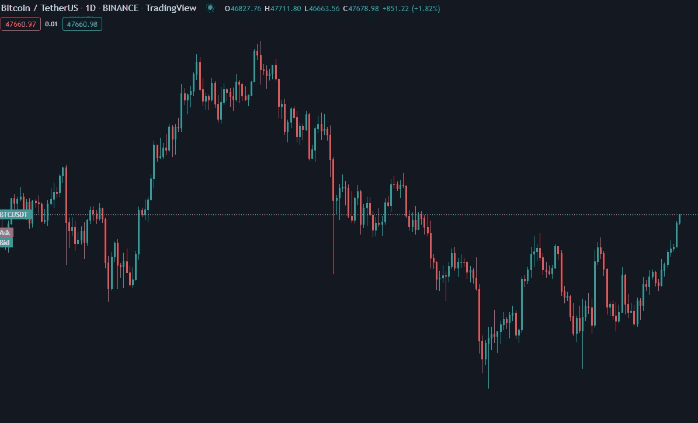

Example of OHLCV candles visualized.

**这让我们陷入第一个陷阱**——对于最简单的分析，所有这些漂亮的信息都被丢弃，只保留收盘价或开盘价。

这几乎每次都会导致预测落后真实价格一步，因为该模型只有很少的数据可以处理。此外，最常用的损失函数 MSE 不会给我们带来任何好处。因此，虽然从视觉上看起来我们预测了市场——几乎是完美的！—实际上，我们所做的是生成一个可以用一行代码描述的模型:

```
 next_price = price[-1]
```

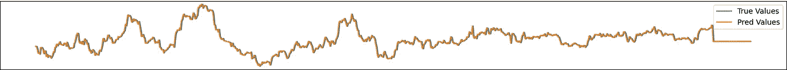

Looks perfect, but is entirely useless

我在大多数文章、Youtube 视频，甚至讨论使用 DL 预测未来价格的科学论文中都见过这种图表。不用说，那里没有有用的预测。

因此，我们必须使用所有 5 个特征——OHLCV 来获得任何成功预测的机会。这是有道理的，任何有经验的交易者都会肯定交易量和高点/低点对确立趋势有多重要。

**这导致了第二个陷阱**——无法用额外的功能增加我们的数据。

现在我知道，从理论上讲，DL 应该是一颗神奇的子弹，可以自己找出模式和趋势，但在实践中，我们经常需要用额外的信息来帮助它建立一个良好的工作模型。

在金融领域，最明显的选择是技术分析。技术分析是一系列帮助交易者预测未来资产模式和方向的工具和技术。这类工具包括移动平均线、布林线、相对强弱指数等等。

现在，有些人可能会说技术分析只是“交易者的占星术”——但是我们必须做一些假设才能继续。这里的假设是，技术分析在一定程度上对决定价格走向是有用的。

我们可以包括的其他信息是现实生活中的东西:债券收益率、VIX(恐惧和贪婪指数)、大宗商品价格、新闻文章、Twitter 情绪等等。对于我的项目，我将只包括技术分析——至少现在是这样。

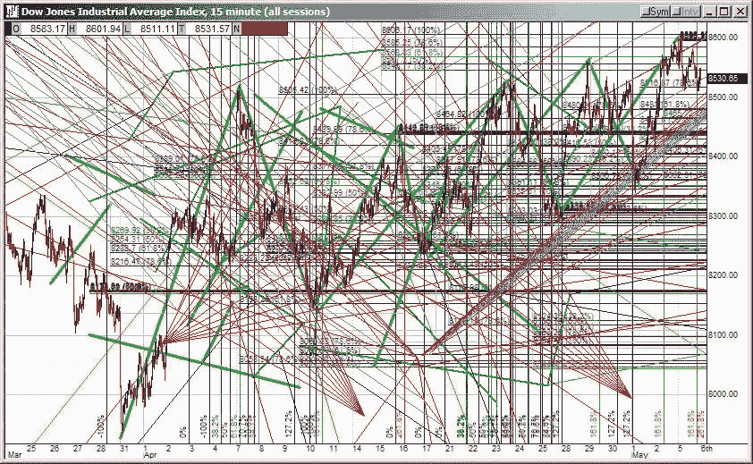

I think I see a bull flag pennant archway triangle dodecahedron forming.

还有一个选项是使用线性代数的黑魔法来创建新的功能——ts fel(【https://pypi.org/project/tsfel/】)等库拥有允许我们为时间序列创建数百个新功能的模块——这是值得在未来探索的东西。

**这导致了第三个陷阱**——错误的目标。

我们需要确定我们要实现的目标——日内交易者或摇摆交易者会从预测 OHLCV 蜡烛线中受益，以便知道何时进入或退出头寸，而投资组合经理会对一段时间内的总回报更感兴趣。我将着重于第二种方法，尽管预测蜡烛线本身可以提供一些关于模型如何运行的见解，甚至可能帮助它更好地收敛。

*快速搁置* —理想情况下，我们应该为多个报价机准备上述数据(形成所谓的投资领域)。这样，我们可以按分位数对预测进行排序，并计算出我们在任何给定时间想要投资的资产。

**陷阱 4**—数据不足。

不幸的是，在没有花很多钱的情况下，我们往往局限于股市的每日数据。像 yfinance([https://pypi.org/project/yfinance)](https://pypi.org/project/yfinance/)这样的库对于玩具例子来说非常有用，但是对于每日数据来说，即使是超过 30 年的时间跨度，对于任何给定的股票来说，它给我们的总点数也不会超过 8000 点。

我将尝试通过与加密市场合作来补救这一点——在那里很容易免费获得微小的数据。我们将解决每小时的数据，因为这给了我们一个很好的点数和计算成本的平衡。

**陷阱 5** —使用错误的损失函数。

这是一个大问题——因为我们现在预测回报率，这可能是积极的，也可能是消极的，大多数正常的损失函数，如 MSE，就不会这样做。原因很简单——默认损失函数不关心特定值的符号，只要 2 个点足够“接近”,函数就被优化。

我将在接下来的章节中探索各种解决方案——包括编写我们自己的损失函数，并找到更适合我们目标的函数。

**第 6 个陷阱** —缺乏关于生成预测的适当分析。

不幸的是，大多数正常的数据科学结果验证方法都不能很好地处理金融数据。

我们需要的是一种回测交易数据的方法，看看它在过去的表现如何——这是一项非常复杂的任务！另一种更简单的方法是使用统计工具来查看我们的信号中是否有任何有用的信息——我将在我的项目中使用 Spearman 秩相关来生成信息比率。

我们将在接下来的章节中探索这两种方法——对于回溯测试，我们将使用一个非常简单的矢量化回溯测试——虽然不理想，但至少应该向我们粗略地展示我们的模型是如何执行的。

总的来说，这些是我发现大多数项目在试图实现财务预测时会陷入的主要陷阱。可能还有更多，我自己的项目可能会有很多错误——但是没有人说手头的任务是简单的。毕竟，如果是这样的话，每个人都会成为股市亿万富翁。

**第二部分** —数据管道

声明:这个项目会走一些捷径；为真正的投资组合管理优化它的使用将需要更多的工作。这里的代码被裁剪以显示流程的逻辑，因为整个项目依赖于许多内部变量，而这些变量在独立的脚本中不起作用。

**数据**是数据科学最重要的部分(滚学分！).所以让我们获得一些。

我将使用来自 Kaggle 的 1 分钟加密行情数据集—

[](https://www.kaggle.com/datasets/tencars/392-crypto-currency-pairs-at-minute-resolution) [## 1 分钟解析 400 多个加密货币对

### Bitfinex 交易所的历史加密货币数据，包括比特币

www.kaggle.com](https://www.kaggle.com/datasets/tencars/392-crypto-currency-pairs-at-minute-resolution) 

这些数据将用于培训和验证。为了测试，我将使用 Cryptowatch API 的最新 1000 点——

 [## 加密手表

### 加密手表

cryptowat.ch](https://cryptowat.ch/products/cryptocurrency-market-data-api) 

通过这种方式，我们可以轻松获取最新的预测数据，同时利用 Kaggle 的大量加密价格进行训练。你能发现技术分析中可能出现的潜在问题吗？

**首先**，我将从 1 分钟到 1 小时的间隔重新采样 Kaggle 数据。我目前没有兼容 CUDA 的 GPU，所以我认为这是点数和计算时间之间的一个很好的权衡。

代码如下:

要点是，我们将所有 1 分钟的 CSV 文件放入一个名为 1m 的文件夹中，然后使用 glob 获得所有文件的列表，然后使用 pandas 重采样方法对蜡烛进行重采样。

重要的是要记住这样做是正确的，我们必须抓住开盘价的第一个值，最高点为高，最低点为低，最后一点为关闭，并为我们的蜡烛累计量重新采样正确。

对于 Cryptowatch 数据，我们可以通过他们的 API 获取 1 小时蜡烛线:

这段代码允许我们从币安获取任何时间间隔和资产对。

我们获取数据，重命名这些列(为了一致性)，并将 time 列转换为 DateTime，以便与上面获得的 Kaggle 数据保持一致。

如第 1 部分所述，理想情况下，我们应该使用多个报价器来创建一个投资宇宙。这是我计划在未来实现的，现在，让我们只关注 BTC-美元对。

另一个非常重要的部分是将订单簿添加到这个过程中——这稍微有点难，因为 Kaggle 数据库没有订单簿，但 Coinapi 等其他 api 可以为我们提供这些数据——不幸的是，这有点昂贵，所以我现在将省略订单簿——但我相信如果包含订单簿，将对结果产生很大影响。

**下一步**是增加技术分析。我将使用一个名为 ta(【https://pypi.org/project/ta/】)的 python 库——它不是最全面的，但它只用一行代码就完成了工作:

我们将添加库中的每一个指标。理想情况下，我们应该研究指标和我们的目标之间的相关性，但是，就目前而言，这是可以接受的。其他 TA 库也允许我们添加蜡烛模式——这将要求我们使用一键编码向量来应用于我们的网络——这可能会产生额外的有用功能。这肯定是将来要试验的东西。

此外，我们还应该使用其他时间间隔进行技术分析——而不是仅仅使用 1 小时的数据，使用 30 分钟、4 小时和每日数据应该可以改善结果——毕竟，技术分析交易者很少使用单一的时间间隔。这是我计划在这个项目的进一步迭代中添加的东西。

**理论上**，在这里或者在应用 TA 之前，我们应该应用某种去噪，比如小波或者傅立叶去噪。由于项目的范围，我决定放弃这一步，但这肯定是有助于提取额外的特征，或者只是确保我们的数据有更少的噪音。

**我们的下一步**可以说是最重要的——创造滞后回报。为此，我将使用 1、4、12、24 和 48 小时的滞后时间。

首先，我们为每个滞后创建一个百分比变化的回报。我们将把它们作为特征，也作为目标，通过各自的滞后将它们向后移动。这确保了我们没有任何数据泄漏，并且我们可以使用较小区间的回报来预测较大区间的回报。

**下一步**是在训练、验证和测试集之间进行简单的数据分割。

这里没有太多要讨论的—确保 shuffle 是假的，因为我们正在处理时间序列。

**在此**之后，我们要将数据分成特征和目标，这里也没有什么特别的:

可以改进的一点是，现在目标的数量被硬编码为 5(因为我使用了 5 个滞后)。将来，这应该变成一个变量，以说明不同数量的目标。

不要忘记从特性中删除目标——否则你将会以巨大的数据泄露而告终。

**下一步** —从我们的特征数据中去除平均值和标准偏差。这将有助于我们的网络学习，并有助于这一步之后的步骤 PCA 特征约简。

我们将使用 SciKit 学习库中的 StandardScaler 来实现这一点:

请注意，我们仅在训练数据上拟合缩放器，然后在所有 3 个数据集上拟合它。这是为了避免验证/测试数据的任何潜在偏差。我们还创建了一个文件夹来存储我们的定标器，以备将来需要。

我决定不缩放 y 值，对于这个和我们将在未来看到的最小-最大变换，我们的损失函数将是符号敏感的，所以如果我们要缩放 y 值，我们将不得不在训练期间在损失函数中取消它们的缩放。虽然可行，但我们的 y 值是基于百分比的，并且通常在分布方面表现良好，所以最好不要对它们进行缩放。如果这是正确的选择，请在评论中告诉我！

**现在，**来点令人兴奋又常被忽略的东西——PCA(主成分分析)。

PCA 分析是非常方便的方法之一，它允许我们减少基于主成分的特征数量。

这将使我们的特征不相关，并可能减少一些噪音——考虑到我们跳过了这一步，这是很好的。

**在此**之后，我们将对我们的特征数据进行最小-最大缩放:

这是非常标准的，我们仍然适合训练数据，然后基于这种适合来转换验证和测试。我们还创建了一些文件夹来转储我们的 scaler，以备不时之需。这里选择的范围是(0，1)-最初我想将特征缩放到(-0.5，0.5)范围，但是在我的尝试中(0，1)范围更好。当然，这里要讨论的是(-0.5，0.5)范围总体上是否会更好，因为它会保留一些负面的特征，就像它们最初一样，但考虑到我们在两步前删除了平均值，我们可能会扭曲它们。

**最后一步**是创建带有移动窗口的时间序列数据。我们需要一种(批处理、时间步长、特征、通道)格式的输入数据，因为这是 CONV2D 网络所需要的。

trim_dataset 函数修剪数据集，使序列的总长度可被批处理大小整除。如果我们决定使用有状态 LSTM 网络，这将变得非常有用。

**一般是**，这是我的数据管道的要旨。这可以大大改善，但对于这个玩具例子，它会做得很好。

**第 3 部分** —损失函数

在我们谈论网络架构、参数等等之前，我们需要解决一个事实，即大多数数据科学家习惯使用的标准损失函数并不适用于金融数据。

原因很简单——他们(损失函数，而不是科学家)不关心结果的符号。对于 MSE 或绝对值损失，如果真实结果为 0，则-0.1 等于 0.1，但这两者在实践中非常不同——一个告诉我们需要做空，而另一个会让我们做多——这根本不理想。

对于下面的损失函数图，我将真实值固定为 0.1，并绘制了一组从-0.5 到 0.5 的 pred 值，以更好地显示损失函数。

所以我们需要某种损失函数，它确实关心符号。如果我们做一些谷歌搜索，我们可以找到一个例子:

Loss from [Probabilistic-Programming-and-Bayesian-Methods-for-Hackers](https://github.com/CamDavidsonPilon/Probabilistic-Programming-and-Bayesian-Methods-for-Hackers), Chapter 5 (Adapted for Tensorflow)

这个函数等于绝对值损失，除了如果 y_true 和 y_pred 的符号不同时，它将增加* y _ pred * * 2 的额外损失。这是一个很好的开始，但我认为这有 3 个问题:

1)绝对值误差对于收敛来说不是最好的——将其修改为使用 MSE 会给我们带来更好的性能。

2)它依赖于一个 alpha 参数——这个参数的值很可能会影响我们将得到什么样的结果。我们可以通过使用贝叶斯优化来找到这个参数的值，或者更好的是，通过将其包装到一个自定义层中并使其可训练。不管怎样，这都是额外的工作。

3)它在翻转标志周围有一个奇怪的行为——我不是 100%确信网络会对此做出什么反应。

我将通过重新编写 MSE 损失函数来解决第 1 点:

为了修复第 2 点，我们理想地将损失函数包装在一个定制的 Keras 层中，该层将通过动态学习来调整 alpha 参数。这是我未来的计划，但目前，我们将坚持α= 100。

第 3 点可以通过找到一个不同的函数来解决，该函数在符号翻转时是连续的，并将该损失乘以它。

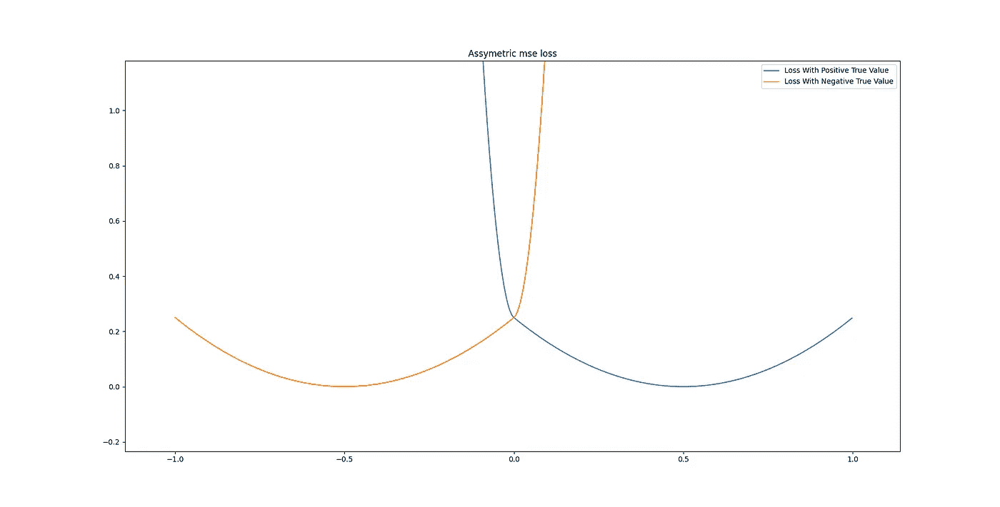

Asymmetric MSE loss. Local minima where y_true = y_pred, exponential growth when the sign of y_true and y_pred are different.

**这就是**余弦相似性损失派上用场的地方。这是一个非常简单的损失，本质上是测量两个向量之间的角度。这对我们来说太好了，因为这正是我们所需要的。如果两个向量具有相同的角度，Keras 的实现给出的值为-1，如果它们彼此正交，则为 1。

我在任何地方都找不到余弦相似性的用法与这类工作相关——所以尝试一下绝对是个好主意。这种方法的问题是，它不关心幅度值，好在我们有上面的不对称损耗来帮助解决这个问题。

**我提议的功能#3** 是这样的:


Minima at y_true = y_pred, horizontal parabolic increase as values diverge in the same sign direction, linear increase as values diverge in the direction of different signs.

我们在这里做的是取预测值与真实值的比值，如果它们超过 1 或-1，我们取比值的倒数，以保持范围在-1 和 1 之间。

理论上，这应该有助于我们将不对称 MSE 损失和余弦相似性“粘合”在一起——因为该函数既关心我们预测的幅度，也关心预测的符号。

现在，这种损失可能会有一些我不知道的问题——如果是这样，请在评论中告诉我。我看不出它有任何明显的问题(至少它是可微的)，但是考虑到我在其他地方没有见过它，这可能是有原因的。

**我提出的总损失**是这样的:

```
loss = assymetric_mse + cosine_similarity + ratio_loss
```

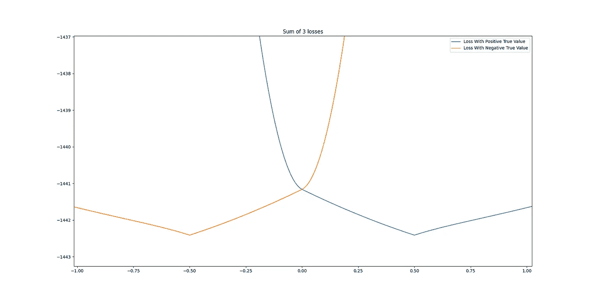

This loss grows faster in the direction of the opposite sign — hopefully, we are more likely to overshoot our target, than undershoot — making it so we are more likely to hit the correct signs.

这应该涵盖所有方面的基础——包括值方面和符号方面。平方余弦相似性的一些实验可能是有用的，但现在，这是我将使用的。

更好的方法是自定义 Keras 层充当亏损——可能带有一些伪交易逻辑，或者作为亏损实现的矢量化回溯测试。这是我打算在未来尝试的东西。

我们还应该想出一些衡量标准来看看我们的训练进展如何。余弦相似性和我们的比率损失确实在某种程度上作为一种度量，但一种更易于人类阅读的方法将是很好的。

经过一些修补，这个对我来说最有意义:

我们抓住 y_true 和 y_pred 的符号，将它们相减，然后取结果的绝对值。在此之后，我们将从我们的批量中减去这些值的总和，然后除以总批量，再将最终结果乘以 100。我们应该得到的是，与 y_true 相比，y_pred 中正确的符号总数，以百分比表示。这将为我们提供一个简单的指标，显示网络的运行状况。由于我们预测了 5 个不同的时间滞后，如果其中一个做得不好，它可能会抵消该指标的可用性，但作为一个通用指标，这应该做得很好。

**关于专门的损失和度量函数，肯定有很多事情还没有被公开探索——我不认为我在这里所做的是可以完成的事情的顶峰——只是一些目前对手头的任务有意义的事情。自定义图层作为一种损失肯定有改进的空间-那些允许将累积值保留在内部的图层，所以也许虚假交易损失或类似的事情可能会产生更好的结果。**

**第四部分** —评估结果

在我们进入建模部分之前，我们需要弄清楚如何确认我们的潜在模型是否实际产生了足够的结果。

完全公开——这是我目前最薄弱的地方——我在这里提出的工具是初步的，但如果我们预测的不仅仅是随机噪声，它们的组合应该至少给我们一个想法。

理想情况下，我们将使用基于事件的回溯测试引擎来查看我们的策略在行动中的表现——这是我计划在未来做的事情，但现在让我们看看手头的工具:

**用斯皮尔曼系数计算信息比**

衡量我们的预测有多好的最简单、最自然的方法是衡量我们的预测和实际回报之间的相关性。

我们将使用一个非参数 Spearman 等级相关系数，它测量两个变量之间的关系可以用一个单调函数描述的有多好。

在这种情况下，Scipy.stats 为我们提供了帮助，代码非常简单:

我们将分别计算五个滞后中每一个的系数，以查看相关性的强度，以及信号是否相关。

如果样本是相关的，任何高于 0.05 的相关系数都可以用于主动投资组合管理。如果幸运的话，我们应该能够看到 0.1 或以上的值。不幸的是，由于这是金融，我们很可能不会看到高于 0.15 的结果，由于市场的混乱性质。

**矢量化回测。**

向量化的回溯测试远不如事件驱动的好，但是仍然可以给我们一个很好的指示，告诉我们是否做得好。

我们将做一个非常简单的版本:从一些钱开始，根据预测进行固定的下注，然后根据实际价值评估新的余额。

总的来说，它看起来有点像这样:

**另一个简单的方法**是简单地计算我们正确得到了多少个符号(向上/向下):

这将表明有多少更多/更少的符号是正确的而不是不正确的。我希望这与上面的矢量化回溯测试密切相关，因为这实际上是相同的想法。(尽管回溯测试依赖于 y_true 的原始值，所以结果可能会有所不同)。我将这种方法称为准确性。

**总的来说**，我们寻找的结果是与原始信号相关的结果，相关强度至少为 0.05，使用 Spearman 相关系数，在向量化回溯测试中表现良好，正确猜测的天数多于错误猜测的天数。如果 3 个都是真的，我们可以得出结论，如果积极的投资组合管理做得正确，我们的预测中有某种信号有机会胜过买入并持有策略。

**第五部** —造型。

因此，有了上面的所有工具，让我们看看是否可以生成模型，产生符合我们标准的结果。

**让我们简单地**看看我用来生成模型的设置:

**激活函数—** 我将使用 swish 激活函数，x * sigmoid(x)。它避免了梯度爆炸和消失，通常优于大多数其他激活函数。这是我试过的大多数网络中唯一运行良好的激活功能。

**最终层激活**—线性。毫无疑问，这是回归任务的经典之作。

**归一化** —不应用归一化。

**优化器** —将使用 Adam，典型的学习率为 0.0001。

**时间步长** — 5，如果适用于模型。

所有其它超参数值都是用试凑法选取的。理想情况下，我们将使用 Keras HyperTuner 来完成这项任务，但是如上所述，我目前没有足够的计算资源来完成这项任务。这是令人兴奋的，因为这意味着如果这种方法奏效，将有无限的改进空间！

完全披露:我正在从所有的模型中去除均值(偏差)。我的大多数模型，如果不是全部的话，都有我目前无法解决的偏差。这是由于我们使用的损耗造成的拟合不足。你能发现问题吗？关于如何潜在地使用偏差作为估计模型“可信度”的来源，有一个讨论，但是这超出了本文的范围。

**那么，**让我们来看看我们的模型:

**密集**:

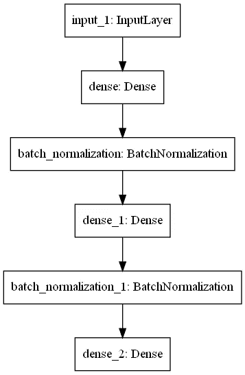

Structure of our dense model.

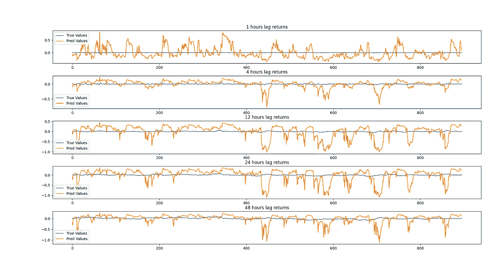

Predictions generated by the best Dense Model

```
1h lag spearman statistics:
Samples are un-correlated (Fail to reject H0) p=0.067
Spearmans correlation coefficient: -0.061
4h lag spearman statistics:
Samples are un-correlated (Fail to reject H0) p=0.826
Spearmans correlation coefficient: -0.007
12h lag spearman statistics:
Samples are un-correlated (Fail to reject H0) p=0.717
Spearmans correlation coefficient: 0.012
24h lag spearman statistics:
Samples are correlated (reject H0) p=0.000
Spearmans correlation coefficient: -0.131
48h lag spearman statistics:
Samples are un-correlated (Fail to reject H0) p=0.968
Spearmans correlation coefficient: 0.001
```

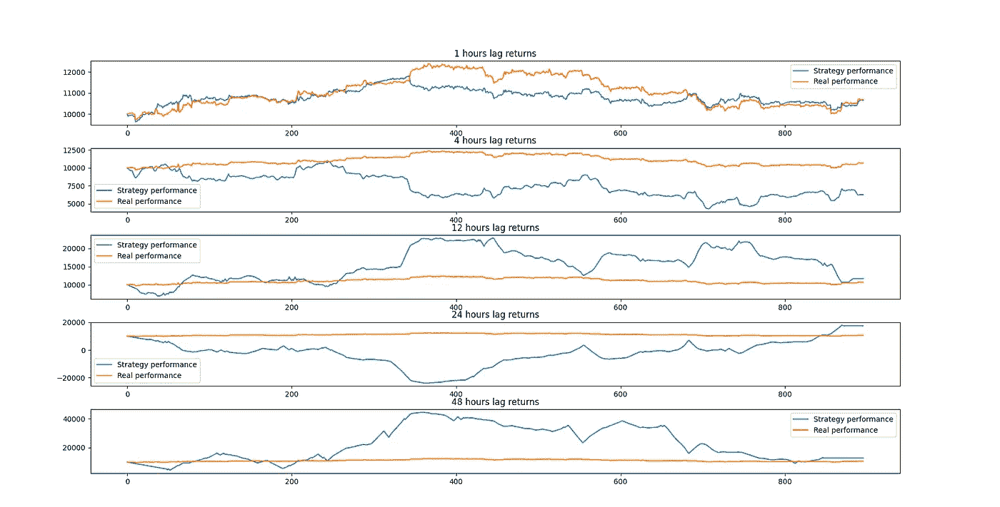

Backtest for Dense model.

```
1h correct amount of signs is: -55.0
1h correct amount of signs with mean removal is: -61.0
4h correct amount of signs is: 6.0
4h correct amount of signs with mean removal is: -18.0
12h correct amount of signs is: -12.0
12h correct amount of signs with mean removal is: -36.0
24h correct amount of signs is: -10.0
24h correct amount of signs with mean removal is: -116.0
48h correct amount of signs is: 42.0
48h correct amount of signs with mean removal is: 38.0
```

令人惊讶的是，密集模型与 24 小时滞后有很强的相关性(尽管是负相关性)。在去除平均值后，它似乎也有相当好的精确度。这就是它的优点所在，因为它完全没有通过回溯测试(即使是 24 小时间隔)，并且图表显示该模型对于严肃的预测没有多大用处。

这是意料之中的，因为密集模型通常不适合时间序列数据。我无法解释它在 24 小时后得到的像样的数字结果——尽管我尽了最大努力避免数据泄露，但这种可能性仍然存在。另一种可能是我没有使用足够的点数来进行回溯测试(只有 1000)。无论哪种方式，我们都不能利用这种模式的结果，而必须继续下去。

**LSTM** :

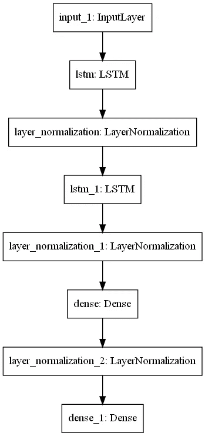

Structure for LSTM network.

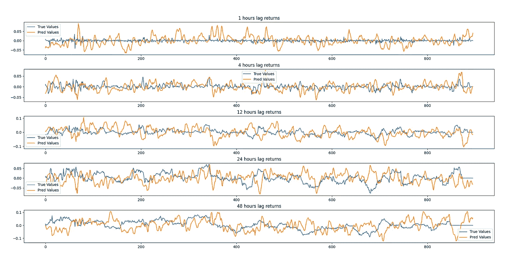

LSTM predictions.

```
1h lag spearman statistics:
Samples are un-correlated (Fail to reject H0) p=0.657
Spearmans correlation coefficient: -0.015
4h lag spearman statistics:
Samples are un-correlated (Fail to reject H0) p=0.897
Spearmans correlation coefficient: -0.004
12h lag spearman statistics:
Samples are correlated (reject H0) p=0.007
Spearmans correlation coefficient: -0.090
24h lag spearman statistics:
Samples are correlated (reject H0) p=0.000
Spearmans correlation coefficient: -0.131
48h lag spearman statistics:
Samples are un-correlated (Fail to reject H0) p=0.553
Spearmans correlation coefficient: 0.020
```

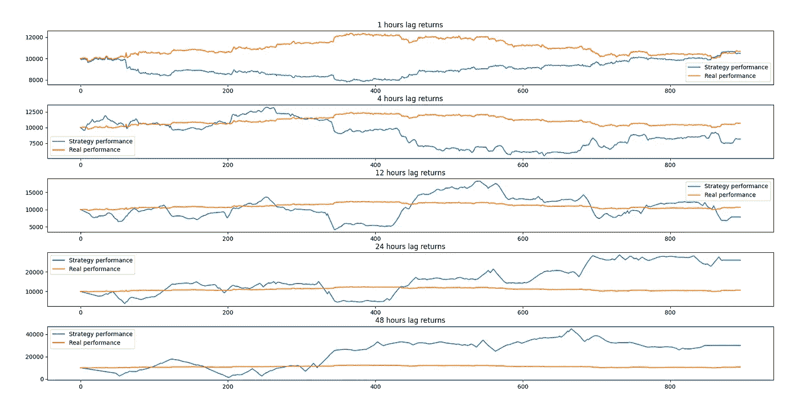

LSTM backtest vs buy and hold strategy

```
1h correct amount of signs is: 15.0
1h correct amount of signs with mean removal is: 11.0
4h correct amount of signs is: -2.0
4h correct amount of signs with mean removal is: -18.0
12h correct amount of signs is: -82.0
12h correct amount of signs with mean removal is: -80.0
24h correct amount of signs is: -14.0
24h correct amount of signs with mean removal is: -88.0
48h correct amount of signs is: 64.0
48h correct amount of signs with mean removal is: 42.0
```

正如我们所见，LSTM 网络比密集网络做得更好。它与 12 小时和 24 小时间隔有很好的相关性，尽管对前者的后验检验是缺乏的。相关性仍然是负的——我在我的一些模型上看到了这一点，但并不总是如此。它以 12、24、48 小时的间隔猜测了相当多的正确方向——总而言之，通过更好的超参数选择，它可能是一个可靠的选择。

**卷积 LSTM**

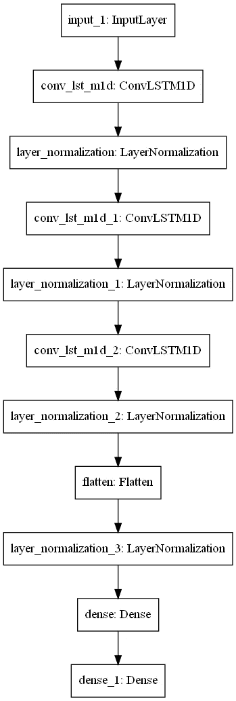

Structure for convolutional LSTM network

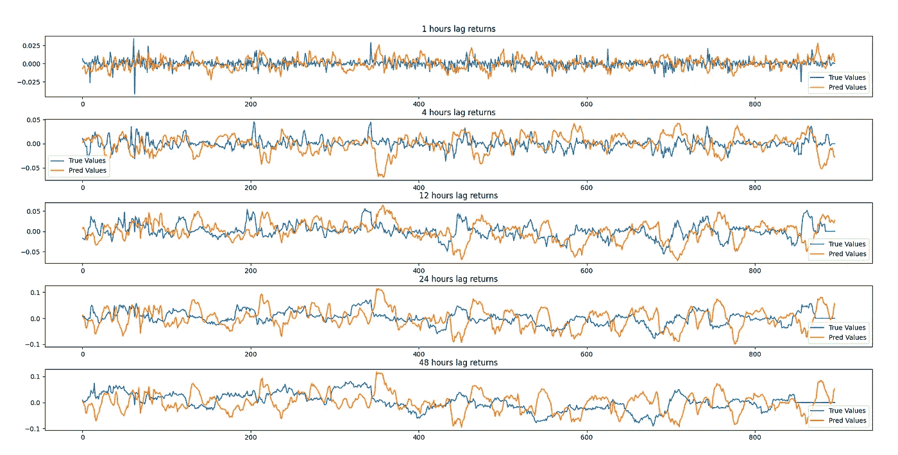

ConvLSTM predictions.

```
1h lag spearman statistics:
Samples are un-correlated (Fail to reject H0) p=0.378
Spearmans correlation coefficient: 0.029
4h lag spearman statistics:
Samples are un-correlated (Fail to reject H0) p=0.676
Spearmans correlation coefficient: -0.014
12h lag spearman statistics:
Samples are un-correlated (Fail to reject H0) p=0.288
Spearmans correlation coefficient: -0.036
24h lag spearman statistics:
Samples are correlated (reject H0) p=0.002
Spearmans correlation coefficient: -0.104
48h lag spearman statistics:
Samples are correlated (reject H0) p=0.010
Spearmans correlation coefficient: -0.086
```

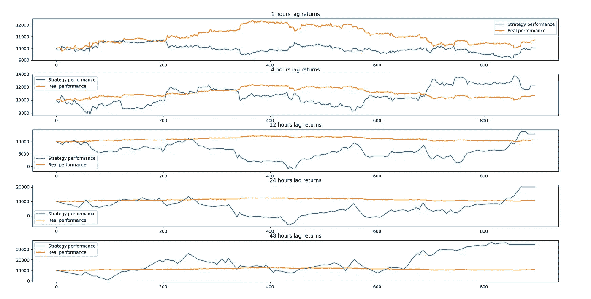

Backtest for ConvLSTM.

```
1h correct amount of signs is: -35.0
1h correct amount of signs with mean removal is: 11.0
4h correct amount of signs is: -10.0
4h correct amount of signs with mean removal is: 4.0
12h correct amount of signs is: 24.0
12h correct amount of signs with mean removal is: -58.0
24h correct amount of signs is: 58.0
24h correct amount of signs with mean removal is: -80.0
48h correct amount of signs is: 62.0
48h correct amount of signs with mean removal is: -84.0
```

卷积 LSTM 与 24 小时和 48 小时的滞后间隔密切相关，在 48 小时结果的回溯测试中表现出色，并且在 12 小时、24 小时和 48 小时的滞后上具有良好的准确性。还是负相关的(不知道是不是和我用的损耗或者超参数优化不足有关)。

**为了最后的**展示，我做了一个非常简单的组合——大约 30 个 LSTM 和 ConvLSTM 模型的平均结果。为了解释负相关，一些预测被倒置，并且没有很好相关的模型的滞后被去除。

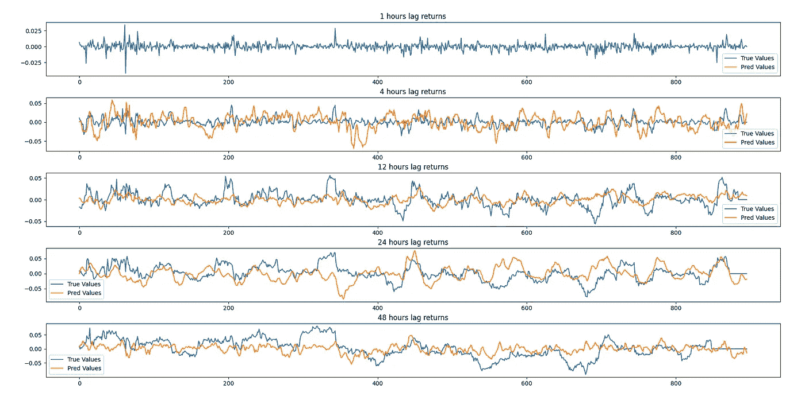

Predictions for the average ensemble. 1-hour predictions are missing due to not having good correlations.

```
1h lag spearman statistics:
Samples are un-correlated (Fail to reject H0) p=nan
Spearmans correlation coefficient: nan
4h lag spearman statistics:
Samples are correlated (reject H0) p=0.000
Spearmans correlation coefficient: 0.247
12h lag spearman statistics:
Samples are correlated (reject H0) p=0.000
Spearmans correlation coefficient: 0.292
24h lag spearman statistics:
Samples are correlated (reject H0) p=0.000
Spearmans correlation coefficient: 0.175
48h lag spearman statistics:
Samples are correlated (reject H0) p=0.000
Spearmans correlation coefficient: 0.327
```

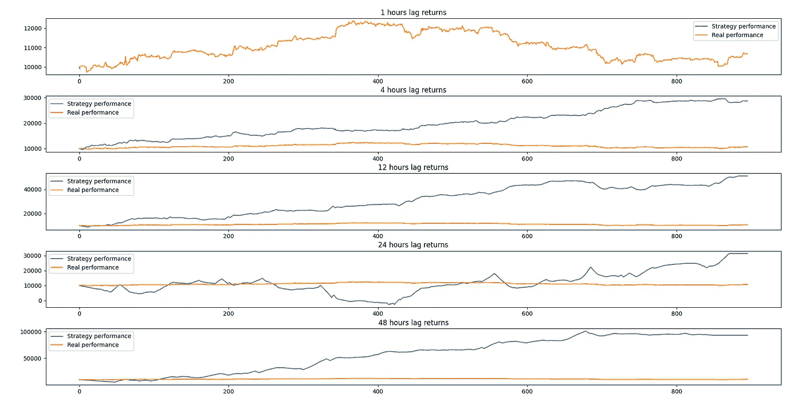

Backtest for ensemble model.

```
1h correct amount of signs is: nan
1h correct amount of signs with mean removal is: nan
4h correct amount of signs is: 134.0
4h correct amount of signs with mean removal is: 134.0
12h correct amount of signs is: 154.0
12h correct amount of signs with mean removal is: 224.0
24h correct amount of signs is: -50.0
24h correct amount of signs with mean removal is: 120.0
48h correct amount of signs is: -22.0
48h correct amount of signs with mean removal is: 222.0
```

哇！如此简单的合奏产生了多么伟大的结果。1-滞后结果完全缺失，因为在该区间内没有任何强相关模型。除此之外，我们在所有其他滞后上得到了很强的相关性，后验测试在除 24 小时之外的所有时间间隔上都做得很好(尽管它最终仍然胜过买入并持有方法)。我们也猜对了很多符号。相当不错的成绩！

我想做的最后一个回溯测试是对旧数据进行预测，剔除任何未来数据，就像那一小时一样。这样我们就可以检查如果我们在 n 个小时前运行我们的预测会有多准确。我从 50 小时前开始，对 1000 小时的 API 数据进行切片，然后每预测一次就往回移动 1 小时。

我用整套模型做了 446 个小时，结果如下:

```
nan,100,102,148,94-- samples predicted correct more than inccorect in  446 hours

4 hour %: 61.2%
12 hour %: 61.4%
24 hour %: 66.6%
48 hour %: 60.5%
```

这表明，如果我们过去运行它，集合将准确地预测。60%挺好的！令人惊讶的是，48 小时并没有超越其他滞后，但这可能是各种因素的组合，我现在还不知道。

总的来说，正如我们所看到的，单个模特的表现还不错，但远不如整体模特。这是有道理的，合奏技术的存在是有充分理由的。我仍然担心数据泄露的可能性，不幸的是，如果存在的话，我无法在我的代码中找到。在更长的时间间隔内对这些模型进行回溯测试是个好主意——但那是以后的事了。总的来说，我认为我们取得了不错的成绩。

可以做很多事情来改善这个结果——使用有状态 LSTMs、增加注意力或者更好的组装技术。

**第六部分—** 结论

所以，我们到了。我知道很多地方都被偷工减料了，但我相信结果是存在的。我们可以从技术分析中提取有用的信息，即使是使用低于标准的数据处理和方法。这完全是应用正确的工具和技术的问题。

我们将何去何从？好吧，首先，那些被削减的角落将不得不被取消。我相信，拥有订单簿数据是一件大事情，会有所帮助，拥有一个可以预测不止一种资产的投资领域也是如此。用更高分辨率的时间间隔扩充数据，并添加额外的功能，如蜡烛图分析。添加其他真实世界的数据，如经济因素也可能有所帮助——看看股票市场如何影响加密资产会很有趣。

尝试不同的时间范围会有所帮助——在我的测试中，很少有模型在 1 小时范围内表现良好，而很多模型在 48 小时范围内表现良好。预测 OHLCV 蜡烛会帮助网络更好地学习预测吗？这绝对是值得探索的事情。

在建模方面也可以做很大的改进——更高级的模型、集成、超参数调整，以及对单个模型结构的实验。通过自定义层引入新的动态损耗(或者可能将这些自定义层用于训练本身)，也绝对是需要探索的事情。

我们最终还需要找到一种方法，根据我们的预测生成何时买入和卖出的信号——我相信 GAN 网络在这方面非常出色，它可以接收市场和预测数据，并输出适当的信号。或者，可以编写手动算法来这样做。

可能还有数以百万计的其他事情我没有意识到或者忘记在这里提及——对于一个正在寻找的人来说，总有一些需要改进的地方。

**我相信**所有这些都是大多数“入门级”金融预测项目失败的原因——除了缺乏股票市场的免费信息之外，还有太多的复杂性需要解决，从数据到功能到网络。

我将继续扩展这个项目——我的下一个大目标是将这个项目部分转移到云计算服务，以利用他们的 GPU，这样我就可以测试更大更好的模型。上面所有的改进最终也需要解决——一旦我完成了足够多的事情，我会发布一个更新。至于现在，感谢阅读，让我知道我在评论中错过了什么！

> 加入 Coinmonks [电报频道](https://t.me/coincodecap)和 [Youtube 频道](https://www.youtube.com/c/coinmonks/videos)了解加密交易和投资

# 另外，阅读

*   [币安期货交易](https://coincodecap.com/binance-futures-trading)|[3 commas vs Mudrex vs eToro](https://coincodecap.com/mudrex-3commas-etoro)
*   [如何购买 Monero](https://coincodecap.com/buy-monero) | [IDEX 评论](https://coincodecap.com/idex-review) | [BitKan 交易机器人](https://coincodecap.com/bitkan-trading-bot)
*   [尤霍德勒 vs 科恩洛 vs 霍德诺特](/coinmonks/youhodler-vs-coinloan-vs-hodlnaut-b1050acde55a) | [Cryptohopper vs 哈斯博特](https://coincodecap.com/cryptohopper-vs-haasbot)
*   [顶级付费加密货币和区块链课程](https://coincodecap.com/blockchain-courses)
*   [MXC 交易所评论](/coinmonks/mxc-exchange-review-3af0ec1cba8c) | [Pionex vs 币安](https://coincodecap.com/pionex-vs-binance) | [Pionex 套利机器人](https://coincodecap.com/pionex-arbitrage-bot)