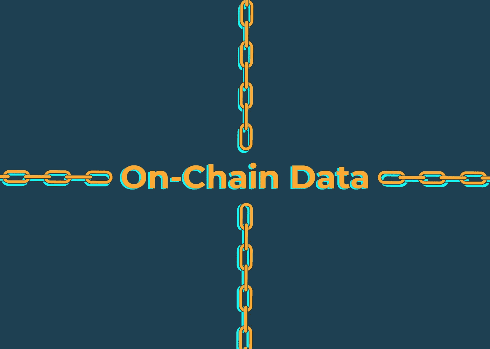

# 使用链上数据作为交易信号

> 原文：<https://medium.com/coinmonks/using-on-chain-data-as-trading-signals-c6daae249f71?source=collection_archive---------10----------------------->

区块链是你的朋友！跟踪主要地址和组织，为交易决策提供信息。

每个人都知道(大多数)区块链的交易是完全公开的，公众可以审计的，但是有多少人在进出交易时真正使用这些信息来帮助你的决策过程呢？

在本帖中，我们将探究一些简单的方法来监控区块链上的主要账户、基金和组织，从而一窥鲸鱼的行动。

*注意:以下任何内容都不应被理解为财务建议。交易加密货币的风险非常高，你不应该冒超过你承受能力的风险。*

# 警惕！警惕！

绝大多数加密货币是 ERC 代币，这意味着它们作为资产存在于以太坊区块链。因此，你可以使用像[以太扫描](http://www.etherscan.io)这样的块浏览器来跟踪钱包、合同和矿工，从而一瞥链上的活动。

通过创建一个帐户并将其链接到一个电子邮件地址，您可以在特定地址执行交易或转移资金时收到电子邮件通知。您还可以跟踪智能合同，例如 [Uniswap](https://etherscan.io/address/0x68b3465833fb72a70ecdf485e0e4c7bd8665fc45) 的合同，您可以通过该合同观察每一笔交易。

您可以设置自定义通知条件，以便您只在特定情况下收到警报，例如当受监视的地址传输以太网(而不是 ERC 令牌)等。这些提醒可以帮助你留意鲸鱼、主要的加密基金等等——如果他们正在购买或出售相当大规模的东西，他们可能知道一些你不知道的事情。

然而，重要的是要注意，以太坊区块链和去中心化应用是一种[玩家对玩家的环境](/@danrobinson/ethereum-is-a-dark-forest-ecc5f0505dff)，在这种环境中，高度复杂的参与者使用机器人来抢先进行重大交易，以努力从[自动做市商(AMM)](https://www.coindesk.com/learn/2021/08/20/what-is-an-automated-market-maker/) 的机制导致的价格波动中获利。这些演员通常非常聪明，而且很可能与拥有世界级人才的机构交易公司有联系，所以不要认为你自己就能比他们聪明。

如果你不明白这意味着什么，不要担心——这一切都很复杂，这篇文章不是关于这样的主题，因为有很多更好的资源。

然而，对于拦截探索者来说，电子邮件提醒只是冰山一角。专业交易员和高级交易机器人将通过其应用编程接口(API)连接到 Etherscan，这使机器人能够收集比 Etherscan UI 提供的信息多得多的信息。

# API 是你的朋友

如果你是一名程序员，连接到 Etherscan API 相对简单(点击这里了解更多)但是一旦你获得了一个 API 密匙，你就可以在你的计算机上编写简单的脚本来扫描内存池中的未决事务，观察跨各种 DeFi 协议的事务，等等。

由于套利，Uniswap 等分散交易所的资产价格可能会与币安等集中交易所的相同资产价格保持一致。然而，这两种资产之间的利差不会立即接近平价。

假设一个主要的 DeFi 协议决定在分散式交易所购买价值 1000 万美元的代币 XYZ。他们可能会以较小的批次执行这一购买，以防止[滑脱](https://www.investopedia.com/terms/s/slippage.asp)，但他们仍然可能会购买大量产品，以防止随着时间的推移不得不执行成千上万的小交易，在这些交易中，汽油费将超过潜在的滑脱。

如果你正在看这个协议，并且看到他们开始在$XYZ 上执行批量订单，你可以创建一个机器人，它也将购买$XYZ，期望这样的大量购买将在价格上创造一个本地底部，并在批量订单停止后不久出售。

这是一个非常天真的策略，但它是一个如何利用块浏览器来执行有效的交易策略的例子。

# 仪表板，仪表板，仪表板

还有其他工具可以监视密码领域的一切，尤其是仪表盘，如 [Nansen](https://www.nansen.ai/) 或 [Dune](http://www.dune.xyz) 。这些仪表板通常由社区构建，用于跟踪诸如 DeFi 协议库、NFT 项目等等。如果你有一点 SQL 知识，你可以很容易地在 Dune(一项免费服务，我们与它无关)上创建仪表板，以跟踪特定的合同和钱包地址。

这些数据可视化工具不仅可以更容易(从字面上)看到幕后发生的事情，还可以作为交易机器人的灵感。

Dune 的查询结果是公开的，这意味着你可以看到人们已经构建了什么，以及他们为了构建它而编写的代码。从这里，你可以很容易地模仿他们的方法(不要在没有署名的情况下发表)，你认为这些方法可能是有用的交易信号，例如资本流入新的流动性池。

留意新创造的代币是完全合理的，这些代币在流动性池中接收大量赌注(**非常*小心这个***)并且购买少量这种代币，希望这种新代币将会增加。当然，大多数新代币都是骗局和/或蜜罐(不能出售的代币)，所以在执行这种策略时你必须格外小心，但对于许多交易者来说，这样的事情肯定不是闻所未闻。

# 与 ArcTaurus 集成

我们的目标肯定是将 Etherscan API 与 ArcTaurus 集成，这样您就可以创建自定义查询，将区块链浏览器本身用作帮助您交易的工具。请继续关注关于此次整合的更多信息。

同时，注意安全，明智地交易，下次再见！

如果您有任何问题，请随时进入我们的[不和谐服务器](https://discord.gg/mymcmcfS5a)，向社区或 ArcTaurus 团队寻求建议。你也可以通过 [Twitter](https://twitter.com/arctaurushq) 、 [Instagram](https://www.instagram.com/arctaurushq) 联系我们，或者发邮件到[info@arctaurus.com](http://info@arctaurus.com/)联系我们。

> *加入 Coinmonks* [*电报频道*](https://t.me/coincodecap) *和* [*Youtube 频道*](https://www.youtube.com/c/coinmonks/videos) *了解加密交易和投资*

# 另外，阅读

*   [3 商业评论](/coinmonks/3commas-review-an-excellent-crypto-trading-bot-2020-1313a58bec92) | [Pionex 评论](https://coincodecap.com/pionex-review-exchange-with-crypto-trading-bot) | [Coinrule 评论](/coinmonks/coinrule-review-2021-a-beginner-friendly-crypto-trading-bot-daf0504848ba)
*   [莱杰 vs n rave](/coinmonks/ledger-vs-ngrave-zero-7e40f0c1d694)|[莱杰 nano s vs x](/coinmonks/ledger-nano-s-vs-x-battery-hardware-price-storage-59a6663fe3b0) | [币安评论](/coinmonks/binance-review-ee10d3bf3b6e)
*   [Bybit 交易所评论](/coinmonks/bybit-exchange-review-dbd570019b71) | [Bityard 评论](https://coincodecap.com/bityard-reivew) | [Jet-Bot 评论](https://coincodecap.com/jet-bot-review)
*   [3 commas vs crypto hopper](/coinmonks/3commas-vs-pionex-vs-cryptohopper-best-crypto-bot-6a98d2baa203)|[赚取加密利息](/coinmonks/earn-crypto-interest-b10b810fdda3)
*   最好的比特币[硬件钱包](/coinmonks/hardware-wallets-dfa1211730c6) | [BitBox02 回顾](/coinmonks/bitbox02-review-your-swiss-bitcoin-hardware-wallet-c36c88fff29)