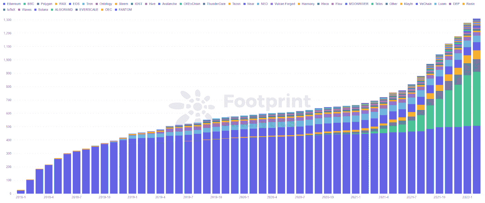
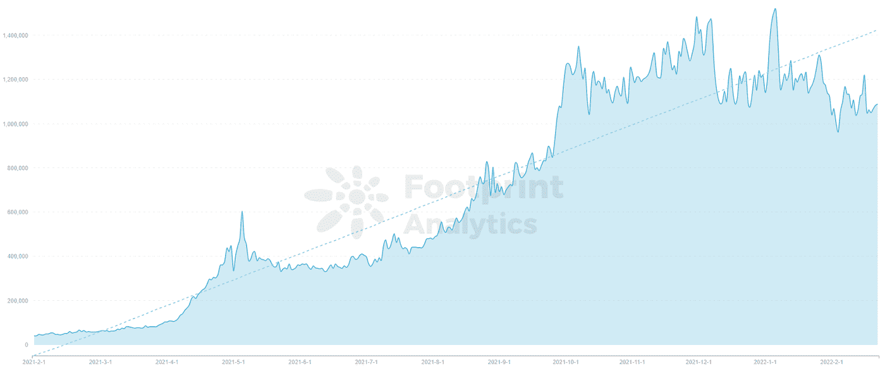
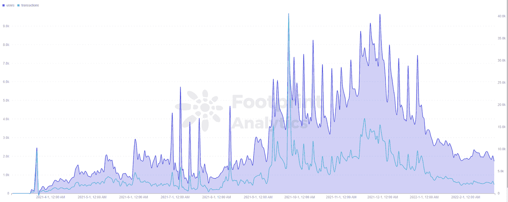
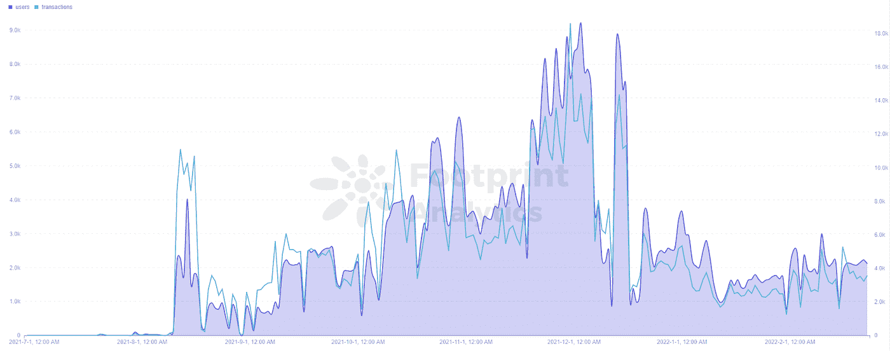

# 利用链上数据推动 GameFi 项目

> 原文：<https://medium.com/coinmonks/using-on-chain-data-to-boost-gamefi-projects-7c00034c03ce?source=collection_archive---------40----------------------->

数据来源:[足迹分析](https://www.footprint.network/)

描述:有了链上数据，区块链行业的企业可以做出正确的决策，加快运营效率，并允许更多伟大的项目出现。

GameFi 是游戏和 DeFi 的融合，由区块链、NFTs 和代币驱动。

*Footprint Analytics — GameFi Project Number*

自 2018 年以来，GameFi 项目逐渐在区块链市场出现。根据[足迹分析](https://www.footprint.network/guest/chart/game-fi-project-number-fp-6fcb71f0-55a1-4280-9ce3-08a67717a35d?channel=u-DBc983)，GameFi 项目的数量从 7 月份开始快速增长。

然而，项目的质量参差不齐。数据有助于确定项目的实际执行情况。

# 如何从用户行为分析 GameFi 项目数据

用户行为是由产品上的用户产生的。用户每天都有他们的行为。在 GameFi 项目中，事务尤其重要，因为它们支持系统。因此，对于 GameFi 项目负责人来说，以数据驱动的方式分析用户行为显得尤为重要。从用户行为角度对项目数据进行分析，可以达到监控前端获客、促进产品迭代升级、驱动产品决策行为的效果。

*   **用户数据是 GameFi 数据的来源**

用户数量是指一个 GameFi 项目的玩家数量，是 GameFi 生态系统健康运行的关键。

*Footprint Analytics — GameFi User Number*

[数据显示](https://www.footprint.network/guest/chart/game-fi-players-number-fp-5668bf93-0d79-4ddb-9496-333f086c5f38?channel=u-DBc983)GameFi 用户数量稳步增长，这与项目的增加和 GameFi 市场的不断发展密不可分。

*   **早期项目，看客户获取**

在一个项目的前期，前端客户的获取和保留是项目业主需要做的事情。目前，GameFi 正在蓬勃发展。项目的每一个动作都会带来显著的用户增长。所以最初的项目主要是看用户增长的量。

如果活动效果一直不好，那么可能是获客手段有问题，可以探索更多的推广方式。如果是新用户增长快但留存不足的案例，就要从准入门槛、用户体验、用户情绪等方面考虑，找到项目改进的方向。

在用户基数较小的情况下，用户数量的增长会非常明显。这场运动的效果很容易评估。

*Footprint Analytics — MetaverseMiner Users & Transactions*

*   **中期项目，看发展状况**

GameFi 项目的中后期，用户数量会比较稳定，所以是时候通过用户的增长曲线来判断项目是否处于健康状态了。有助于确定留存是否稳定，增长是否明显。

元宇宙·迈纳是元宇宙·NFT·加麦菲的理学学士。元宇宙矿工以通俗易懂的方式呈现其在元宇宙的游戏世界，给你虚拟世界中的星球“地主”和“二手地主”的称号。[数据显示](https://www.footprint.network/guest/chart/metaverse-miner-fp-da1cc2ef-7a16-4f57-9fe8-038707807863?channel=u-DBc983) MetaverseMiner 自推出以来一直处于整体增长趋势，但最近进入了缓慢增长期，需要专注于如何变得更加活跃。

# 交易数据是 GameFi 数据的生命线

用户的交易数据分为交易量和交易金额。

*   **如何使用交易量**

在 GameFi 数据中，人均交易量不仅体现了有多少用户参与，也体现了产品和代币经济的设计是否合理。

对于一个 GameFi 项目来说，用户参与度非常重要。第一代 GameFi 项目因为缺乏长期的玩家参与而衰落。交易量的增减有助于验证项目行为的可行性，以便做出更好的决策。

*REVV Racing Users & Transactions*

从[REVV Racing](https://www.footprint.network/guest/chart/revv-racing-users-transactions-fp-95ec18c2-9d49-48d3-bb42-7087e18d5577?channel=u-DBc983)的数据可以看出，项目前期用户质量较高，人均交易量较大，后期随着项目发展慢慢向人均交易量较小的小群体转化。

*   **如何使用交易金额**

人均交易额可以告诉你你的用户的位置。然后，您可以检查它是否与项目的目标用户相匹配。例如，如果平均交易金额很高，那么你可以在以太坊上开发你的项目。如果低，也可以选择其他油费低一点的连锁。

**总结**

数据分析可以帮助 GameFi 开发者对项目进行战略调整。有了链上数据，区块链行业的企业可以做出正确的决策，加快运营效率，并允许更多伟大的项目出现。

本文由[足迹分析](https://www.footprint.network/)社区提供。

> 加入 Coinmonks [电报频道](https://t.me/coincodecap)和 [Youtube 频道](https://www.youtube.com/c/coinmonks/videos)了解加密交易和投资

# 另外，阅读

*   [Coldcard 评论](https://coincodecap.com/coldcard-review) | [BOXtradEX 评论](https://coincodecap.com/boxtradex-review)|[uni swap 指南](https://coincodecap.com/uniswap)
*   [比特币基地评论](/coinmonks/coinbase-review-6ef4e0f56064) | [德里比特评论](/coinmonks/deribit-review-options-fees-apis-and-testnet-2ca16c4bbdb2) | [FTX 评论](/coinmonks/ftx-crypto-exchange-review-53664ac1198f)
*   [联合国硬币评论](https://coincodecap.com/unocoin-review) | [最佳加密赌注硬币](https://coincodecap.com/best-crypto-staking-coins)
*   如何使用 MetaMask Wallet 获得 KCC 地址？
*   [如何获得自己的。XYZ 领域？](https://coincodecap.com/xyz-domain)
*   [最佳加密交换平台](https://coincodecap.com/best-crypto-swap-platforms) | [最佳加密交易所](https://coincodecap.com/crypto-exchange)