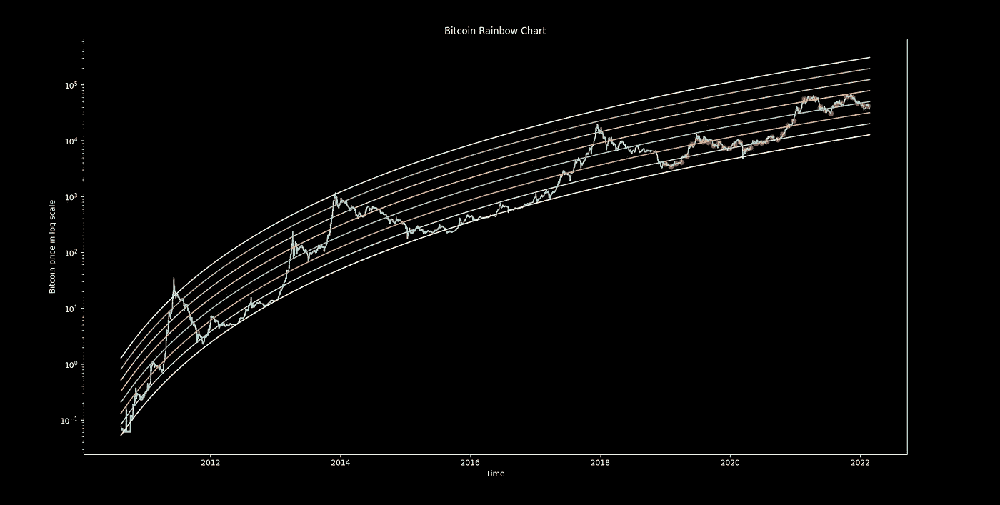
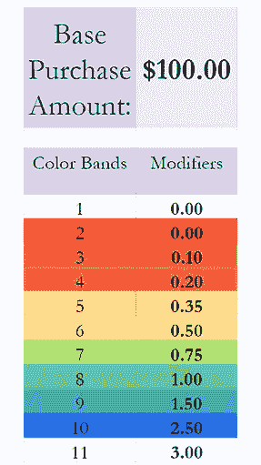
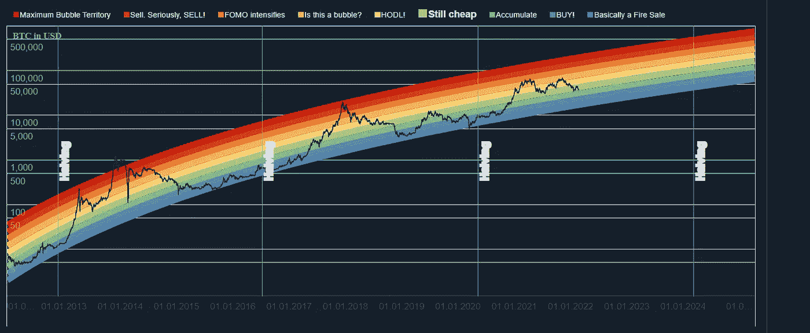
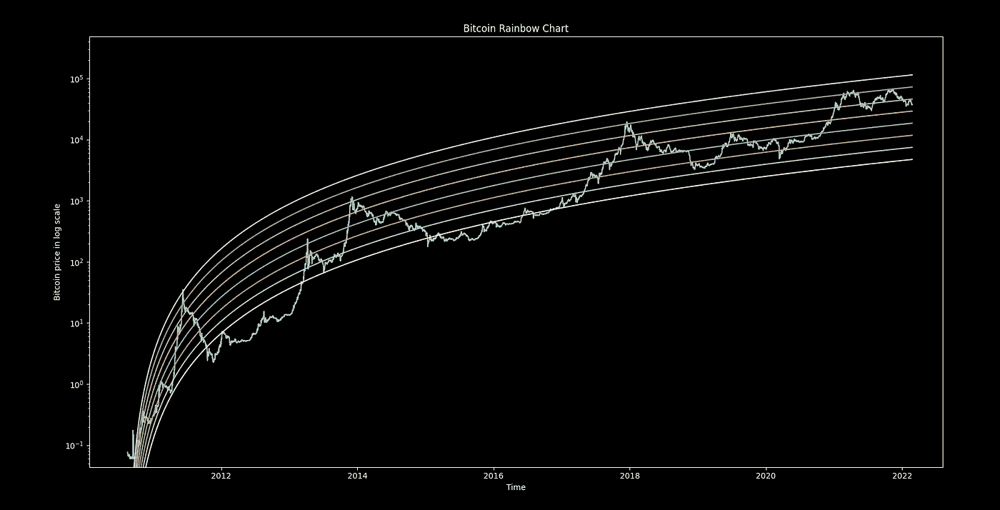
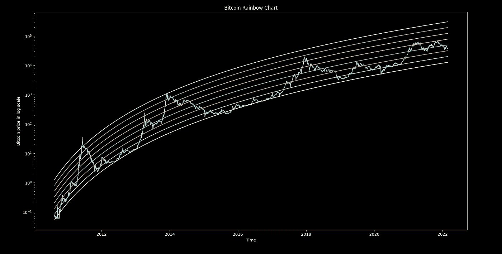
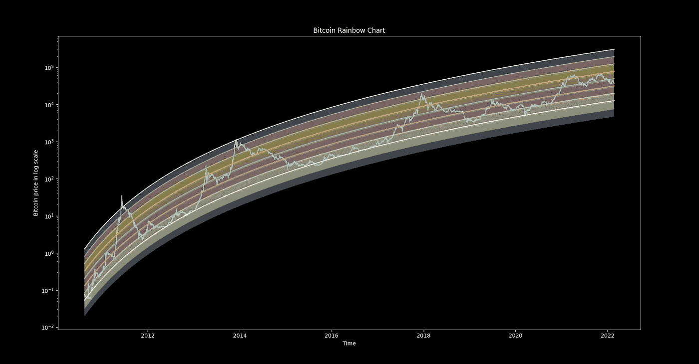
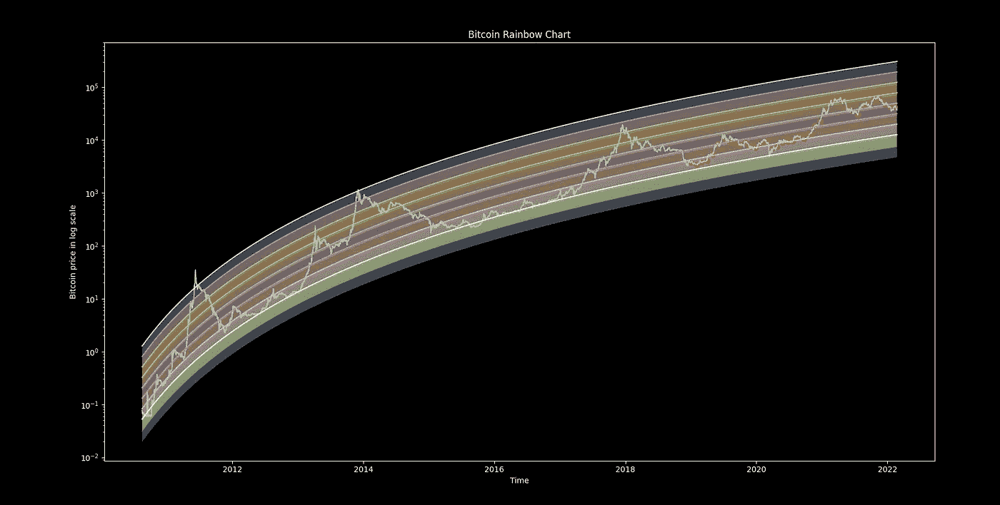

# 用 Python 分析彩虹加权平均——一种更有利可图的频率投资策略

> 原文：<https://medium.com/coinmonks/using-python-to-analyze-rainbow-weighted-averaging-a-more-profitable-frequency-investment-12009a8c3617?source=collection_archive---------1----------------------->



# 介绍

首先，我想把这个出色的投资策略完全归功于提出这个投资策略的 reddit 用户 [/u/pseudoHappyHippy](https://www.reddit.com/user/pseudoHappyHippy/) 。你可以在 [pseudoHappyHippy 的帖子](https://www.reddit.com/r/CryptoCurrency/comments/qg9s6v/introducing_rainbowweighted_averaging_a_more/)中找到更多关于这个策略的信息。现在，我将尝试给出一个简单的概述，它是如何工作的，以及我在下面分析它的原因。

正如任何读过我前两篇文章的人一样，我喜欢使用 Python 来构建 DCA 机器人，你可以在这里找到机器人[的当前状态，在这里](https://totesthegoats92.medium.com/creating-a-dca-bot-with-python-b9b16e32c1b4)找到更新版本[。机器人使用美元成本平均法(DCA)，我没有尝试过比这更极端的方法，因为我不是交易者。因此，我一直在寻找一种更有利可图的方式来将 DCA 包含在机器人的下一个迭代中。在我的搜索中，我遇到了彩虹加权平均法(RWA)。/u/pseudoHappyHippy 发明并声称的一种投资方法“在应用于历史 BTC 价格数据时，96.8%的时间表现优于 DCA，平均高出 35.3%的回报”，尽管这是经过严格测试的，但我需要对它进行一些尽职调查，以查看它是否有利可图，此外，我为此做的任何工作都可以在测试后添加到 DCA Bot 中。](https://totesthegoats92.medium.com/improving-the-dca-bot-python-51b82f6b4779)

策略很简单，用比特币彩虹图。这让我们大致了解了我们在比特币周期中的位置，以及我们在特定时间点的过热或欠热程度。该图表简单地显示了 BTC 的价格历史，y 轴是对数刻度，x 轴是时间(这不是对数刻度)。这让我们很容易发现牛市和熊市。彩虹是通过简单地将 BTC 回归带向上或向下移动一个系数 X(我们稍后会谈到这个)来创建的，它捕捉了周期的高点和低点，给我们一个相当好的想法，如果市场过热或不足。颜色对应于我们将 RWA 投资额乘以多少，这些颜色可以在下图中看到。



Band multiplies

# 彩虹图创建

第一个挑战是重建比特币彩虹图，对我来说，我无法找到原始图表创建中使用的确切参数，因此我不得不从头开始编写代码。



For context this is what we are trying to create [source](https://www.blockchaincenter.net/bitcoin-rainbow-chart/)

彩虹图使用对数回归来寻找比特币价格的“最佳拟合”，目的是尽可能接近上述价格

## 代码

现在我们开始讨论如何进行分析，我将尝试在这里给出尽可能多的信息，所以如果你喜欢，你可以跟着做，或者你可以在 Github [这里](https://github.com/Totesthegoats/cryptoDataScience.git)找到并运行代码。我还在这里放了一个[谷歌实验室](https://colab.research.google.com/drive/1IujtwiH40nHtjCx7PDB6Snu4oaedPCQw?usp=sharing)，这样你就可以自己测试了。

## 您将需要什么:

*   一些编程知识
*   Python 3
*   以下 Python 库

```
import numpy as np
import pandas as pd
import matplotlib.pyplot as plt
from scipy.optimize import curve_fit
import nasdaqdatalink
```

有相当标准的库，可以使用 pip 很容易地安装，

## 导入我们的数据

为了导入 BTC 的价格历史，我使用了 nasdaqdatalink，因为它是完全免费的，然而，它每天只允许 50 个免费的 API 调用，所以当你自己测试时，加入一个免费的 API 代码可能是值得的。你可以使用其他来源，但你的结果可能会改变，这是值得有一个完整的价格历史，以获得准确的回归曲线。下面的代码和注释解释了如何做到这一点。

```
*# This data was gotten on https://data.nasdaq.com/, you need an account to download it, but you have 50 free API calls per day and unlimited if you sign up, which is free.* raw_data = pd.DataFrame(nasdaqdatalink.get("BCHAIN/MKPRU")).reset_index()

raw_data['Date'] = pd.to_datetime(raw_data['Date']) *# Ensure that the date is in datetime or graphs might look funny* raw_data = raw_data[raw_data["Value"] > 0] *# Drop all 0 values as they will fuck up the regression bands*
```

## 逻辑回归

现在我们来了解一下它真正的意义，得到一个回归带。在网上搜索时，我能找到的与比特币回归带最接近的东西是以下函数。

```
*# this is your log* functiondef logFunc(*x*,*a*,*b*):
    return *a**np.log(*x*) + b
```

这就产生了下面的图表，如何？我们稍后会谈到这一点，但目前来看，这并不完全正确。



Regression band using the *a**log(*x*) + b formula

在互联网上进一步搜索后，我找到了一个数据科学网站，该网站建议包含第三个变量可以平滑回归曲线，因此我使用了以下方法。

```
*# this is your log function* def logFunc(*x*,*a*,*b*,*c*):
    return *a**np.log(*b*+*x*) + *c*
```

这产生了一个在我看来更好看的图，更接近实际的彩虹图。



Regression band using the *a**log(b+*x*) + c formula, a better fit I feel

接下来，我们需要定义我们的 x 和 y 数据，并使用 SciPy 的曲线拟合功能找到回归曲线的最佳拟合，这是最困难的部分，我们现在要做的就是绘制它。

```
*# getting your x and y data from the dataframe* xdata = np.array([x+1 for x in *range*(*len*(raw_data))])
ydata = np.log(raw_data["Value"])

*# here we ar fitting the curve, you can use 2 data points however I wasn't able to get a graph that looked as good with just 2 points.* popt, pcov = curve_fit(logFunc, xdata, ydata, *p0* = [10,100,90]) *# p0 is justa guess, doesn't matter as far as I know

# This is our fitted data, remember we will need to get the ex of it to graph it* fittedYData = logFunc(xdata, popt[0], popt[1], popt[2])
```

## 绘制数据图表

绘图相当简单，我们使用 matplotlib，深色背景，使用半对数绘制日期和价格。

```
*# Dark background looks nice* plt.style.use("dark_background")
*# Plot in a with long Y axis* plt.semilogy(raw_data["Date"], raw_data["Value"])
plt.title('Bitcoin Rainbow Chart')
plt.xlabel('Time')
plt.ylabel('Bitcoin price in log scale')
```

接下来，我们需要绘制彩虹带，为此，我们需要获取拟合曲线的指数值，并根据日期进行绘制，我们需要获取指数值，因为我们根据比特币价值的对数拟合了数据，而现在我们使用的是比特币的真实价值。然后我们可以用 for 循环来推断。还记得我之前讲过 X 吗？对于我的数据集，我发现 0.455 给了我最接近真实比特币彩虹图的值，但你可以随意使用它。

```
*# Draw the rainbow bands* for i in *range*(-2,6):
    raw_data[f"fitted_data{i}"] = np.exp(fittedYData + i*.455)
    plt.plot(raw_data["Date"], np.exp(fittedYData + i*.455))
    *#You can use the below plot fill between rather than the above line plot, I prefer the line graph
    #plt.fill_between(raw_data["Date"], np.exp(fittedYData + i*.45 -1), np.exp(fittedYData + i*.45), alpha=0.4)*
```

如果你包括阴影带，这将给我们一个完整的图表，我个人更喜欢只有回归带的图表。



Regression band with colours filled in

## RWA 回溯测试

从技术上讲，我们不需要这些图表来进行任何分析，但我认为拥有这些图表非常好，我们将来也可以在自己的分析中使用它们。

首先，我们需要设置我们的回溯测试参数。如我们将购买多少频率，我们将 RWA 的金额和开始日期。这些都是可以改变和测试的。我还加入了不同的权重，一个使用了原始帖子中提出的传统方法，另一个基于加权斐波那契数列。

```
*# Back Testing* df = raw_data
*# Change buy frequency here, daily = df[::1], weekly = [::7], biweekly = [::14], monthly = [::30], yearly = df[::365]]* buyFrequency = 30
monthly = df[::buyFrequency].reset_index()
*# Change the date you start to DCA here* startDate = '2019-01-01'
monthly = monthly[monthly['Date'] > startDate]
*# Change your buy amount here* buyAmount = 100
totalDCA = 0
totalRCA = 0
amount_invested_DCA = 0
amount_invested_RCA = 0
fibs = {"bubble":0, "sell":0.1, "FOMO":0.2, "Bubble?":0.3, "Hodl":0.5, "cheap":0.8, "accumulate":1.3,"Buy":2.1,"fire_sale":3.4}
originalRCA = {"bubble":0, "sell":0.1, "FOMO":0.2, "Bubble?":0.35, "Hodl":0.5, "cheap":0.75, "accumulate":1,"Buy":2.5,"fire_sale":3}0:1,-1:2.5,-2:3}
*# Choose what type of weightings you want to RCA with* weighted = fibs
*# This loop calculates what rainbow regression bands each data point for your DCA falls between.*
```

在此之后，我们可以运行我们的回溯测试，我不会在这里包括所有的代码，但它由一个循环和一系列逻辑语句组成，以确定某个特定的买入位置位于哪个回归带之间。

```
for x in *range*(0, *len*(monthly)):
    *# if below the first band the buy buyAmount*3.4 and so on for each successive line* if monthly.Value.iloc[x] < monthly["fitted_data-2"].iloc[x]:
        *print*("Bitcoin is below $", monthly["fitted_data-1"].iloc[x], " therefore our multiplier is ", weighted["fire_sale"])
        totalDCA = totalDCA + buyAmount/monthly.Value.iloc[x]
        totalRCA = totalRCA + buyAmount * weighted["fire_sale"] / monthly.Value.iloc[x]
        amount_invested_RCA = amount_invested_RCA + buyAmount * weighted["fire_sale"]
        amount_invested_DCA = amount_invested_DCA + buyAmount

    elif monthly.Value.iloc[x] > monthly["fitted_data-2"].iloc[x] and monthly.Value.iloc[x] < monthly["fitted_data-1"].iloc[x]:
        *print*("Bitcoin is below $", monthly["fitted_data-1"].iloc[x], " therefore our multiplier is ", weighted["Buy"])
        totalDCA = totalDCA + buyAmount/monthly.Value.iloc[x]
        totalRCA = totalRCA + buyAmount * weighted["Buy"] / monthly.Value.iloc[x]
        amount_invested_RCA = amount_invested_RCA + buyAmount * weighted["Buy"]
        amount_invested_DCA = amount_invested_DCA + buyAmount
```

最后，您可以检查您的回报类型，并使用以下代码比较传统 DCA 和 RWA。

```
*# This plots the locations of your buy points.* plt.scatter(monthly["Date"],monthly["Value"], *c*="red")

*print*("Total value RCA ", totalRCA)
*print*("Total value DCA ", totalDCA)
*print*(amount_invested_RCA)
*print*(amount_invested_DCA)
```

在这里标出你的每个购买点也是很好的。



Buy positions marked in red

# 结果

坦率地说，对于这个使用以下参数运行的示例，结果非常出色:

购买频率:每 30 天
策略开始日期:2019–01–01
购买金额:100 美元

色带乘数:
泡泡— 0
卖出— 0.1
FOMO — 0.2
泡泡？—0.3
Hodl—0.5
cheap—0.8
accumulate—1.3
Buy—2.1
fire _ sale—3.4

结果是:

总投资 DCA:3900.0 美元
总价值 DCA: 0.3654 BTC，或 15560.86 美元
%收益 DCA: 299.0 %

总投资 RWA:4480.0 美元
总价值 RWA: 0.5644 BTC 或 24030.68 美元
%收益 RWA: 436.4 %

相对于 DCA，RWA 性能提高了 45.95 %

在我测试的几乎每个案例中，RWA 都表现得更好，但是欢迎您用自己的时间框架来测试它。

# 结论

我知道从现在开始我会转投 RWA，因为它能提供更大的回报。我还将把它添加到我的 DCA 机器人的下一个迭代中，所以请关注这个空间，了解将在这里出现的关于如何编码的详细信息。

我也一直在使用 200 周移动平均线玩加权投资策略，但它还没有被测试。从我写的速度来看，虽然可能要几个月。

# **致谢**

我想感谢 [/u/pseudoHappyHippy](https://www.reddit.com/user/pseudoHappyHippy/) 提出这个想法并允许我编写代码，我也想感谢 [/u/gozunker](https://www.reddit.com/user/gozunker) 首先把我放到这个帖子上并给我这个想法。

# 支持我

如果你觉得这很有趣或者你真的很好，你可以发给我一些 sat。

BTC 钱包:BC 1 q 6 UE 97 Lyn 296 eeh 6 fzmqttvafgtm 2 q WPU 87 DDA 4

ETH 钱包:0 xfa 4c 099 ed 0 c 6 da 25d 2347 c 481 CFD 12 b 7 bcda 1329

> 加入 Coinmonks [电报频道](https://t.me/coincodecap)和 [Youtube 频道](https://www.youtube.com/c/coinmonks/videos)了解加密交易和投资

## 也阅读

[](/coinmonks/crypto-trading-bot-c2ffce8acb2a) [## 加密交易机器人——21 款最佳免费加密交易机器人

### 2022 年币安、比特币基地、库币和其他密码交易所的最佳密码交易机器人。Pionex，Bitsgap…

medium.com](/coinmonks/crypto-trading-bot-c2ffce8acb2a) [](/coinmonks/best-crypto-signals-telegram-5785cdbc4b2b) [## 最佳 4 个加密交易信号电报通道

### 这是乏味的找到正确的加密交易信号提供商。因此，在本文中，我们将讨论最好的…

medium.com](/coinmonks/best-crypto-signals-telegram-5785cdbc4b2b) [](https://coincodecap.com/crypto-trading-terminals) [## 2022 年 5 大最佳加密交易终端| CoinCodeCap

### 在这篇文章中，我们将通过什么是加密交易终端，它如何有利于你，和五个顶级加密…

coincodecap.com](https://coincodecap.com/crypto-trading-terminals) [](https://coincodecap.com/bitsgap-review) [## Bitsgap 评论-交易机器人加密信号和套利 2022

### 这篇文章的重点是 Bitsgap 审查，这是一个最终的交易解决方案，并提供交易机器人，信号…

coincodecap.com](https://coincodecap.com/bitsgap-review)