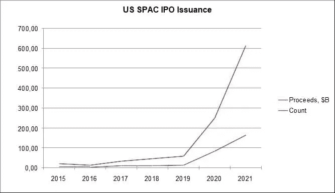
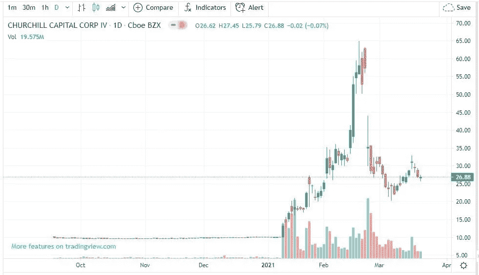
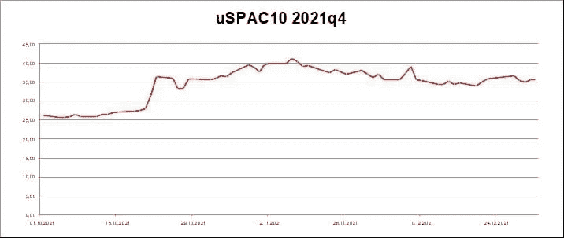

# 新的 uSPAC10 和 UNISX 合成令牌

> 原文：<https://medium.com/coinmonks/uspac10-token-8fc89fb23b04?source=collection_archive---------36----------------------->

*Universal Synthetic project 是一项基于 UMA 协议的合成数字资产发行服务，可通过智能合约机制分配与股票市场工具价值相关的合成资产。合成资产可以与传统的股票市场资产挂钩，如股票、债券、主题 ETF、指数和衍生品。*

*通用合成项目推出了一种新的 uSPAC10 令牌，这是代表特殊目的收购公司股票指数的合成令牌系列中的第一个。uSPAC10 合成代币使用户能够在指数级增长的特殊目的收购公司市场上获利，而无需与集中的中介互动和购买真实的股票。此外，强调 uSPAC10* *令牌的 DeFi 协议确保了其安全性并提供了额外的收益。因此，用户因发行合成代币而获得奖励，这些代币可以成为分散式交易所(DEX)的做市商，或者利用提供流动性而获得额外的收益。*

Photo by [Tima Miroshnichenko](https://www.pexels.com/@tima-miroshnichenko?utm_content=attributionCopyText&utm_medium=referral&utm_source=pexels) from [Pexels](https://www.pexels.com/photo/marketing-man-laptop-internet-7567606/?utm_content=attributionCopyText&utm_medium=referral&utm_source=pexels)

Anew***uspac 10***synthetic token 是一种衍生工具，其价格与 10 只最具活力的特殊目的收购公司股票指数挂钩，在纳斯达克和纽约证券交易所交易。由于 uSPAC10，人们可以从参与真实市场的价格变动中获利。

*特殊目的收购公司(或所谓的 spac)*是其股票在证券交易所交易的公司。特殊目的收购公司是作为传统首次公开募股的一种替代方式而产生的，它通过收购目标公司将企业带到股票市场。在过去的几年里，特殊目的收购公司市场呈指数级增长，并已被证明是一个非常有吸引力的投资对象。

Market overview

就其本质而言，当有消息(甚至只是传言)称已找到一家目标公司进行收购时，特殊目的收购公司股票容易出现冲动性上涨。

Typical SPAC quotation

因此，在不分析数百个 spac 的情况下，在如此仓促的增长中赚钱的一个好方法是操作指数值变化，其中包括最活跃的 spac 的股票。

我们的合成 *uSPAC10* token 为DeFi 用户提供了参与 SPACs 股票价格变动的机会。

> **uSPAC10** 在 UMA(通用市场准入)平台上创建，并受到保护。

USDC 稳定硬币被用作抵押品:铸造合成硬币的抵押品比率为 1.5。此外，抵押品降至 1.25 的水平会导致头寸平仓。

因为合成代币结合了真实市场的波动性和稳定货币的抵押品，我们得到了一个具有合理的风险平衡和潜在高盈利能力的衍生工具。因此，为了发行具有有限威胁的更不稳定的合成代币，用户可以以低收益稳定硬币的形式使用他们的无风险资产。

为了计算该指数，我们使用了由[特殊目的收购公司分析](http://www.spacanalytics.com)的数据确定的 10 只最具活力的特殊目的收购公司股票的报价。指数中包含的股票列表每季度审核一次。关于合成令牌成本的信息来自价格 oracle，它从外部来源接收指数中包含的股票价格数据。指数价值是每日计算的指数中股票每日收盘价的算术平均值。

uSPAC10 price in the 4th quarter of 2021

# **它是如何工作的？**

T 用户发行(铸币)一定数量的 uSPAC10，然后从钱包中以 1.5 比 1 的比例扣除发行的合成代币的成本。

> 例如，如果用户决定铸造数量为 10 的 uSPAC10，并且发行时的指数值等于 32.256 美元，则抵押品成本将为 10 * 32.256 * 1.5 = 483.84 美元。这意味着，为了发行 10 个 uSPAC10 代币，用户必须提供 483.84 USDC 的抵押品。

因此，用户成为他提供了抵押品的合成代币的所有者，或者用 UMA 术语来说，“T6”成为发行的衍生工具的发起人。对于赞助，用户会定期收到 UNISX 服务令牌形式的奖励，具体取决于锁定抵押品的价值以及该抵押品被锁定的时间。

赞助商可以在任何时候"*燃烧*"合成代币，并以当前指数价格获得用作抵押品的 USDC。然而，他的钱包里必须有足够的 uSPAC10 才能这样做。

赞助商可以如下操作发行的合成代币:

1.起初，这种代币可以放在钱包里。在这种情况下，赞助商仅获得铸造奖励，并有义务通过增加额外抵押品或“*燃烧*合成代币来将抵押品维持在所需水平。同时，他不承担与基础资产价格变化相关的风险，因为他独立管理已发行的合成代币。

2.另一个选择是出售合成材料。在这种情况下，发起人为该代币开立空头头寸，并从出售中获得资金，这些资金可用于投资以获得更高的回报(包括发行额外的合成代币(例如，与另一项基础资产挂钩))。

*   为了重新获得抵押品(或" *burn* "合成代币)，赞助商需要回购它们，但如果基础资产的价格下降，代币对赞助商来说成本会低得多，最终会带来利润。然而，如果基础资产变得更加昂贵，发起人可能会在购买合成代币时遭受损失，也可能因为需要增加抵押品而遭受损失。
*   赞助商在销售合成代币时不会收到额外的 UNISX 代币。

3.发起人还可以将合成令牌放入 DEX 流动性池(目前由 SUSHISWAP 支持),这可以通过服务接口完成。同时，转入资金池的 uSPAC10 金额和按汇率对应的 USDC 金额将从用户钱包中扣款。相应数量的流动性代币将记入用户账户，用户有权从 DEX 获得每次交易的佣金收入。如前所述，要“*烧掉*合成代币，赞助商必须首先将其从流动性池中取出。

# **奖励和实用代币**

用户因铸造了 uSPAC10 的 UNISX 奖励代币而获得奖励。DEX 上有一个 UNISX/USDC 流动性池，因此用户有机会将他的 UNISX 代币转移到流动性池，并从交易所操作中获得佣金，或者通过 DEX 出售 UNISX，以换取 USDC。

此外，用户可以通过服务接口将 UNISX 锁定在服务合同(stake)上。在这种情况下，为了降低通货膨胀，合成代币从流通中退出。用户还可以与赌注流动性代币进行交互。

*   用户因下注 UNISX 代币而获得奖励。
*   堆叠不仅适用于赞助商，也适用于 UNISX 的任何所有者。

持有纳入赌注合同的 UNISX 令牌的用户将收到新的 xUNISX 实用工具令牌，可用于以下用途:

*   从赌注中返还 UNISX 代币并获得赌注奖励。而且，从牛排返回 UNISX 时，对应的 xUNISX 令牌被销毁；
*   参与对服务发展的投票。请注意，只有那些长期参与项目并将其代币放入流动性池或股份中的 UNISX 所有者才能投票，这由用户钱包中的 xUNISX 代币确认；
*   通过 DEX 流动性池收取兑换合成代币的佣金返现。为了获得返现，交易者应该在钱包中至少有一定数量的 xUNISX 代币，这些代币将随着成交量的增加而增加。返现以 UNISX 代币支付。一个交易者可以通过对获得的 UNISX 进行赌注来获得 xUNISX，以及作为赌注的奖励而收到的 UNISX；
*   xUNISX 实用令牌可以买卖。

# **接下来是什么？**

在不久的将来，我们计划推出以下产品:

*   ***uSPAC50*** —追踪 50 只最活跃 SPACs 股票指数的合成令牌，让你对市场的变化做出更准确的反应；
*   ***uSPAC-fin tech***——包含 SPACs 针对金融科技公司的股票的指数；
*   ***【uSPAC-EV***——一个包含 SPACs 针对电动汽车及相关公司的股票的指数。
*   还有很多。

The curated series of articled created via ManyStories

*项目团队包括 8 名高素质的专业人员，他们拥有深入的金融和编程知识、MBA/博士学位、5 年以上的密码市场经验以及 20 多年的股票市场经验。*