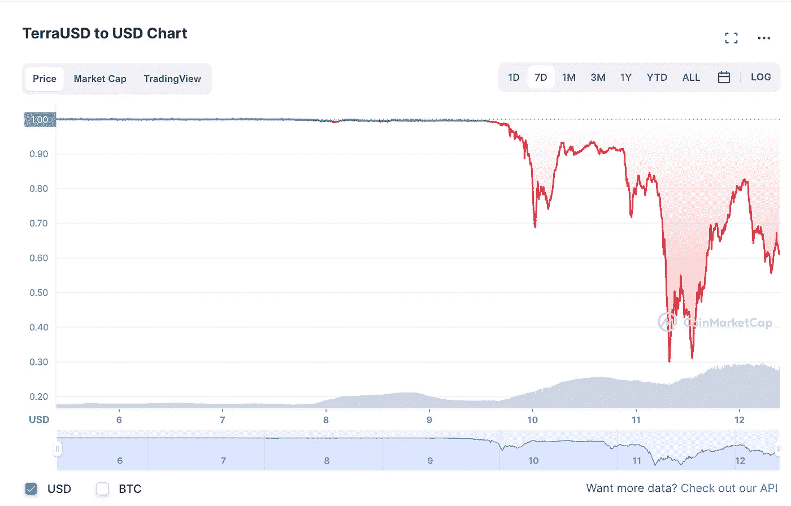

# UST 崩溃了！马厩是避风港吗？

> 原文：<https://medium.com/coinmonks/ust-collapse-are-stablecoins-a-safe-haven-19b680b8c332?source=collection_archive---------13----------------------->

直到最近，我们中的许多人都将 stablecoins 视为一项惊人的发明和区块链的避风港，在加密和 NFT 熊市期间，我们可以在那里储存价值。正如我们最近在 UST 看到的，稳定的资本并不总是稳定的。在极端情况下，没有基础资产 1:1 支持的稳定货币容易崩溃。

# ***UST —算法稳定积分:***

最近 UST 的崩溃是一个完美的例子，说明了一种算法稳定的货币挂钩在极端情况下是如何崩溃的。2022 年 5 月 9 日，Terra 的旗舰 stable coin UST 失去了挂钩，跌破 0.95 美元，随后暴跌至 0.30 美元。

7 — Day UST Chart — May 12, 2022

# ***USDT——100%资产支持——不可赎回***

抛开围绕 USDT 的所有谣言不谈，如果我们只看 MAH Cayman 所做审计的表面价值，它清楚地表明了以下情况:

USDT 背后的法定现金储备相当于总供应量的 5.33%。

43.9%的资产是美国国库券，这当然是一件好事，因为美国政府从来没有违约过，如果他们违约了，那就意味着美国政府已经崩溃了。当然，作为一个超级大国，并且有能力印钞，违约的风险很低，但是通货膨胀的损失很大。尽管如此，如果你持有 USDT，你就接受了随之而来的通货膨胀，因此这种风险是无法承受的。

由于 USDT 不可赎回，你真的不需要担心银行挤兑。

***风险在哪里？***

支持 USDT 的资产中有 50.77%可能是问题的源头。

50.77%的大部分分配如下:

1.  30.7% —商业票据
2.  5.3% —担保贷款
3.  4.6% —公司债券、基金和贵金属
4.  6.38% —其他投资(数字代币)

商业票据主要由评级文件组成，我认为这是一个可以接受的风险，尽管评级机构在过去一直是错误的，正如我们在 2008 年的危机中所看到的那样。

担保贷款、公司债券、基金、贵金属和其他数字代币投资加起来约占支持 USDT 的资产的 16.28%。这就是可怕的地方。如果这些资产总共损失 1.06%的价值，USDT 的资产将低于其负债。目前，USDT 在资产跌破负债之前，其所有投资加起来有 0.1%的缓冲。

我们不清楚公司债券的信用风险。我们不知道贷款背后证券的信用风险。6.38%的数字代币本身就很容易影响资产负债表。

许多中央交易所以及加密期货市场的大多数交易对都与 USDT 配对。在极端情况下，资产和负债的失衡似乎是不可避免的，除非他们的资产负债表上有紧急现金储备，否则市场可能会对 USDT 失去信心，其连锁反应将是灾难性的。

# ***USDC——菲亚特 1:1 100%支持——可赎回***

USDC 是一种稳定的货币，由实际美元以 1:1 的比例支持，可随时兑换。此外，USDC 在美国是受管制的代币。在撰写本文时，USDC 的市值为 488 亿美元，按日交易量计算，它是第二大美元稳定货币。

这也是我们决定在 USDC 而不是 USDT 建立 GoldPesa 流动性池的原因。

# 如果 USDT 崩溃，会发生什么？

如果 USDT 的资产价值大大低于其负债，市场失去信心，整个加密市场将以你无法想象的方式暴跌。其影响将动摇全球市场，包括股票和大宗商品。

如果发生这样的崩盘，似乎很明显，每个人都将试图跑到交易所，要求获得真正的菲亚特。当他们意识到没有足够的流动性时，他们会跑到 USDC。

虽然 USDC 似乎是一个不错的选择，但 USDC 有 3 个主要问题。

1.  USDC 受到通货膨胀的影响。
2.  无收益或上升空间——持有 USDC 不会产生任何收益或盈利，因此不会为其持有者提供任何上升空间。
3.  流动性——在极端情况下，交易所可能存在流动性问题，因为 USDC 市场的市值有限，而且价格是固定的。

# **GOLDPESA 的使命**

GoldPesa 的使命是创造一种先进的货币形式，一个远比 USDC 优越的区块链安全港。一种价值储存手段，它提供了对通货膨胀的对冲、收益(上升潜力)和强大的流动性。这是一种资产，世界可以在繁荣时期持有并创造财富，同时在萧条时期提供安全网和保障。

黄金支持的稳定硬币本身是一种很好的通胀对冲工具，但不提供任何收益或上行潜力，而且还会带来流动性问题，因为价格是固定的，供应是有限的。

GoldPesa 是一种使用量化科学和区块链技术创建的令牌化黄金支持(GPX)结构性产品。换句话说，GoldPesa 是世界上第一个具有上升空间的黄金支持令牌。不仅仅是另一个硬币！

# **GOLDPESA — 100%由实物黄金支持&可赎回**

GoldPesa 模型旨在解决所有三个问题:

1.  GoldPesa 由 Paxos 黄金代币 100%支持，而 Pax OS 黄金代币又由实物黄金 100%支持。
2.  GoldPesa 为其持有者提供了强大的通胀对冲。
3.  GoldPesa 使代币持有者能够在不拖累其基础黄金的情况下获得收益。
4.  GoldPesa 提供了上升空间，没有非永久性损失的风险。
5.  黄金不与黄金价格挂钩。因此，供应可能是有限的，但价值并不与黄金挂钩，即使需求大于供应，也可以获得。

总之，GoldPesa 是一种有上升空间的黄金支持代币，为代币持有者带来实际收益，同时提供强大的通货膨胀和事件风险对冲。

我总是说，那些已经准备好迎接那个从未发生的时刻的人最终会站在最顶端。为了准备好迎接这样的时刻，你必须已经准备好，因为当它真的到来时，你将不能及时做出反应，因此你不能真正为这样的事件风险做好准备，除非你已经准备好。

## GPX 如何溢价交易？

1.  无论何时买卖或转让 GPX，我们都收取 1%的费用。
2.  0.5%是杠杆，分配给典当，我们的专有和高度智能的外汇交易算法。
3.  典当产生的利润被用于回购和焚烧 GPX 代币，这实际上为代币持有者创造了收入，导致 GPX 价格偏离现货价格，并根据我们在股票市场上传统看到的市盈率溢价交易。
4.  GPX 代币持有人的基础 PAXG 在分散的智能合约中保持安全，并且在任何时候都不受阻碍，因为我们为了代币持有人的利益而冒险支付自己的费用。

## 【GoldPesa 如何在 2 分钟内完成工作？

我叫 Shamik Raja，是一名开发人员和计算机工程师，拥有加拿大不列颠哥伦比亚大学的学位，在数字信号处理、编程、商品和定量科学方面拥有丰富的经验。我过去 20 年的研究包括将数字信号处理原理应用于外汇市场。

GoldPesa 融合了我在贵金属行业的 8 年经验以及在定量科学和工程领域的 20 多年经验。

更多信息的关键链接:

1.  网站(推介资料、白皮书、审计)——【https://goldpesa.com/ 
2.  简短采访(2 分钟)——[https://www.youtube.com/watch?v=WQlKWvfjfxk](https://www.youtube.com/watch?v=WQlKWvfjfxk)
3.  主题演讲(25 分钟)——[https://www.youtube.com/watch?v=vkdK_4wdfl0&t = 831 秒](https://www.youtube.com/watch?v=vkdK_4wdfl0&t=831s)
4.  典当回溯测试详情—[https://medium . com/@ gold _ pesa/PAWN-3-0-back test-results-c 06224855361](/@gold_pesa/pawn-3-0-backtest-results-c06224855361)
5.  电报通知—[https://t.me/GoldPesaAnnouncements](https://t.me/GoldPesaAnnouncements)
6.  货币市场基金组织(GPO)——https://coinmarketcap.com/currencies/goldpesa/

如果您想以现货价+ 1%保留您的 GPX 代币，您必须购买我们的 GoldPesa 期权代币。GoldPesa Option Token (GPO)是一种奇异的看涨期权，具有变动的执行价格。每个 GPO 令牌代表一个以现货价格+ 1%购买 1 个新发行的 GPX 令牌的选项。