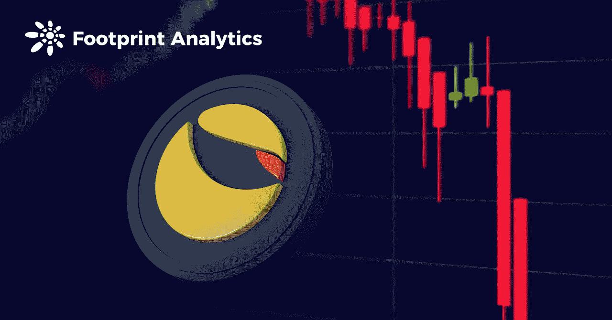
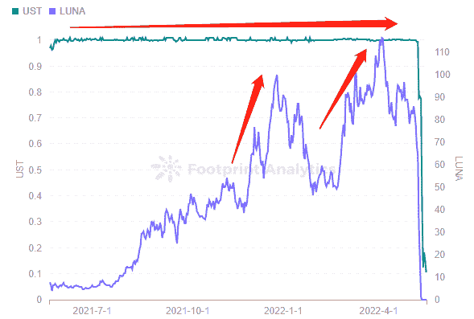
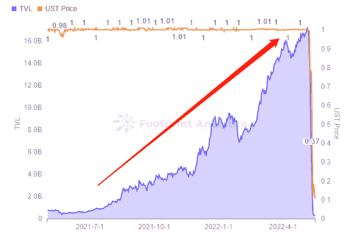
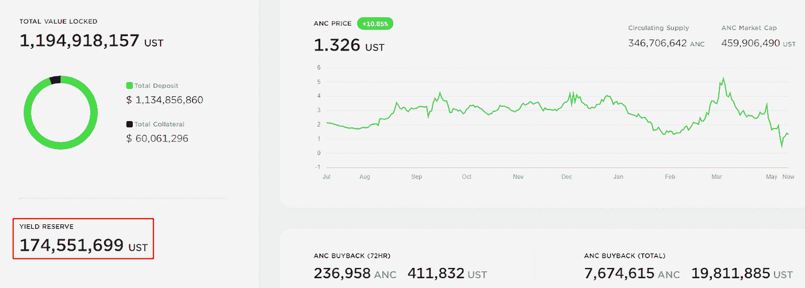
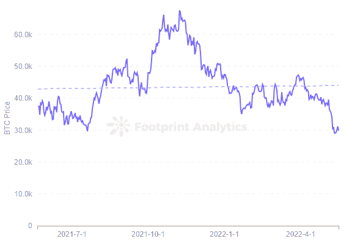
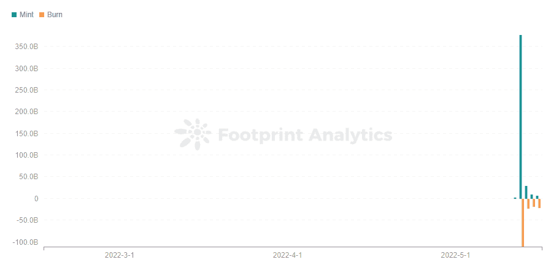
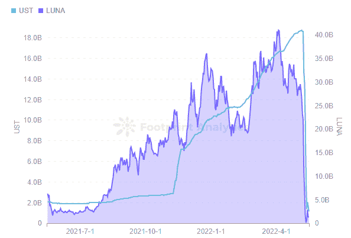
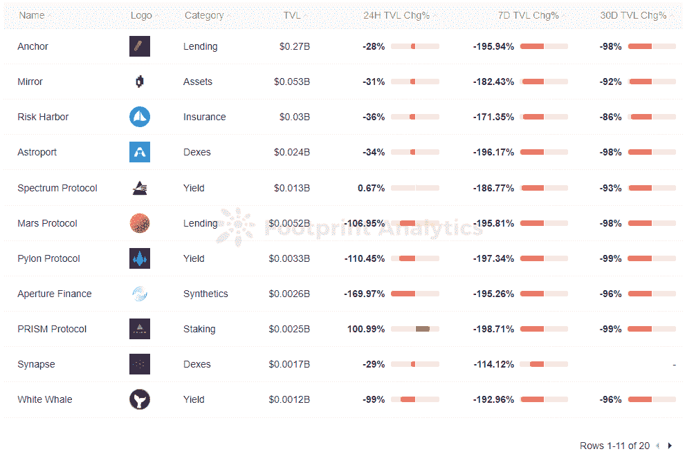

# UST 与美元脱钩，LUNA 暴跌 99.9%

> 原文：<https://medium.com/coinmonks/ust-decouples-from-usd-and-luna-plummets-by-99-9-7269d275bf3b?source=collection_archive---------46----------------------->

五月。2022

数据来源:足迹分析— [算法稳定积分分析](https://www.footprint.network/@KikiSmith/UST-Algorithm-Stablecoin-Analysis?channel=EN-254)

[TerraUSDT (UST)](https://www.footprint.network/@KikiSmith/UST-Algorithm-Stablecoin-Analysis?channel=EN-254) 是——尽管“曾经”可能更好——一种算法稳定币，其稳定机制源于对 [LUNA](https://www.footprint.network/@DamonSalvatore/Terra-Dashboard?channel=EN-254) 的支付承诺。出于对区块链大地的信任，交易者铸造并焚烧代币来确保 UST 的稳定。

然而，在最后一周，UST 的价格暴跌，跌破 10 美分，完全失去了它的联系。在与美元脱钩之前，按市值计算，UST 是第三大稳定货币。这使得崩溃成为加密领域最令人担忧的发展之一，也是区块链每个感兴趣的人都需要了解的事情。

为什么长期以来如此稳定的 UST 会脱钩？会有什么后果？

# 算法稳定点数不同于其他稳定点数

在分析 UST 的脱钩论之前，让我们看看它与合法的和过度抵押的稳定债券有何不同。

*   算法稳定积分不需要任何抵押品。相反，他们通过货币价格波动来调整用户持有的代币数量。
*   法定和过度抵押的硬币需要抵押品。例如，泰瑟(USDT)持有法定美元抵押品。超抵押硬币使用 BTC 和 ETH 作为抵押品。由于 BTC 和 ETH 的高价格波动性，抵押品必须被超额抵押。

UST 是锚定于 1 美元的稳定货币，但没有足够的抵押资产。一旦代币价格跌破 1 美元，它的整个生态系统，包括 LUNA 和 [Anchor](https://www.footprint.network/@GraceAtreides/Anchor-Protocol-Dashbord?channel=EN-254) 协议，都会随之被拖垮。

# UST 的脱钩:之前和之后

## UST 代币价格稳定在 1 美元

Footprint Analytics 数据显示，从 2021 年 5 月 27 日到 2022 年 5 月 8 日，UST 稳定在 1 美元左右约 1 年。在此期间，LUNA 的价格经历了 2 次大幅度上涨，最高价为 116.32 美元。

*Footprint Analytics — Token Price: UST vs LUNA*

UST 在 1 美元锚的稳定性是 Terra 生态系统增长的驱动力。

*   过去锚协议的流动资金占 Terra TVL 的 50%，稳定的存储收入支撑 UST 稳定在 1 美元。它提供了超过 2.67 亿美元的 UST 收益储备，允许用户通过在协议上存放 UST 获得 20%的 APY——远远高于其他稳定账户的回报。高收益率是推动稳定的硬币需求的一大因素，也导致 Anchor 在 TVL 吸引了 172 亿美元。

*Footprint Analytics — Anchor TVL vs UST Price*

*   露娜基金会卫队(LFG)成立于 2022 年 1 月，旨在支持 UST 的稳定，促进 Terra 生态系统的发展。今年 2 月，它通过出售 BTC 支持的 LUNA，从多家风投公司筹集了 10 亿美元的融资，以帮助锚定 UST 和开发 Terra 生态系统。

然而，这些机制和储备不足以维持 UST 的稳定。

## UST 为什么要脱钩？

UST 价格从 5 月 8 日的 1 美元跌至 5 月 14 日的 0.18 美元左右。它短暂反弹，调侃说这种机制或许有足够的弹性，但随后又继续崩盘。

截至 5 月 16 日，UST 似乎已经死了，也扼杀了市场对算法稳定性的信心。

发生了什么事？

*   5 月 7 日，一头巨鲸卖出了价值 2.85 亿美元的 UST。这是促使 UST 与美元脱钩的导火索。
*   随着 UST 失去了它的挂钩，卢娜开始印刷。这是因为用户抛弃了手中脱钩的 ust，导致 LUNA 更多的铸币，引发 LUNA 更深的下跌。
*   然而，卢纳的贬值发生得如此之快，以至于它根本无法回购足够的 UST 来将其重新盯住 1 美元。
*   卢娜和 UST 都崩溃了。
*   依靠 Terra 基金不断补充储备以覆盖 20% APY 的 Anchor 也崩溃了。

*Screenshot Source — Anchor Website Yield Reserve*

*   LFG 储备的 BTC 本应起到支撑作用，帮助锚定 UST。然而，BTC 价格自去年 11 月见顶以来一直在下跌。截至 5 月 16 日，BTC 的价格已经跌破 3 万美元。

这对 UST 的锚定和 Terra 生态系统的发展有负面影响。

*Footprint Analytics — BTC Price*

*   UST 不同于法定货币稳定货币，没有足够的抵押资产。

# UST 价格下跌的崩溃如何影响地球生态系统和密码

随着它的突然崩溃，Terra 生态系统似乎已经死亡。

随着 UST 跌破 1 美元，Terra 的本土代币 LUNA 的价格和市场信心崩溃。Footprint Analytics 的数据显示，LUNA 代币价格的下跌和 UST 持有者对 UST 的迅速放弃导致了更多的 LUNA 铸造，这引发了 LUNA 更深的下跌。截至 5 月 16 日，LUNA 的股票价格从 116.32 美元的峰值跌至 0.11 美元以下，在不到一个月的时间里下跌了 99.9%。

*Footprint Analytics — Daily Mint & Burn: LUNA*

UST 和露娜的市值已经倒置，LURA 的市值小于 UST。当 LUNA 倒下时，一般会预留足够的清算空间，以避免资不抵债的极端情况。如今，LURA 和 UST 的市值分别跌至 12 亿美元和 11.5 亿美元。这种下跌很容易导致信心崩溃和死亡螺旋的发生。

*Footprint Analytics — UST vs LUNA of Market Cap*

当然，除了货币价格，市值和其他指标受到影响，也有土地生态系统协议 TVL 显示负增长。尤其是像 Anchor 和 [Lido](https://cryptoslate.com/what-made-lido-a-top-eth-staking-platform/) 这样的协议，TVL 下降了 100%以上。受算法稳定货币 UST 影响最大的是 Anchor，而受 LUNA 价格下跌影响最大的是 Lido。

*Footprint Analytics — Terra Top 10 Protocols TVL Change*

# 摘要

当前的市场恐慌仍在蔓延，算法稳定币 UST 严重失控，月神币价格似乎遭受了灾难性的打击。虽然它的生存似乎不太可能，但在密码世界里，疯狂的事情可能会发生。

本文由[足迹分析](https://www.footprint.network/)社区提供。

Footprint 社区是一个世界各地的数据和加密爱好者相互帮助了解和获得关于 Web3、元宇宙、DeFi、GameFi 或区块链新兴世界任何其他领域的见解的地方。在这里，你会发现活跃的、不同的声音相互支持，推动着社区向前发展。

> 加入 Coinmonks [电报频道](https://t.me/coincodecap)和 [Youtube 频道](https://www.youtube.com/c/coinmonks/videos)了解加密交易和投资

# 另外，阅读

*   [我的加密副本交易经验](/coinmonks/my-experience-with-crypto-copy-trading-d6feb2ce3ac5) | [《比特币基地评论》](/coinmonks/coinbase-review-6ef4e0f56064)
*   [CoinFLEX 评论](https://coincodecap.com/coinflex-review) | [AEX 交易所评论](https://coincodecap.com/aex-exchange-review) | [UPbit 评论](https://coincodecap.com/upbit-review)
*   [AscendEx 保证金交易](https://coincodecap.com/ascendex-margin-trading) | [Bitfinex 赌注](https://coincodecap.com/bitfinex-staking) | [bitFlyer 点评](https://coincodecap.com/bitflyer-review)
*   [麻雀交换评论](https://coincodecap.com/sparrow-exchange-review) | [纳什交换评论](https://coincodecap.com/nash-exchange-review)
*   [拥护卡审核](https://coincodecap.com/uphold-card-review) | [信任钱包 vs MetaMask](https://coincodecap.com/trust-wallet-vs-metamask)
*   [TraderWagon 回顾](https://coincodecap.com/traderwagon-review) | [北海巨妖 vs 双子星 vs BitYard](https://coincodecap.com/kraken-vs-gemini-vs-bityard)
*   [Exness 回顾](https://coincodecap.com/exness-review)|[moon xbt Vs bit get Vs Bingbon](https://coincodecap.com/bingbon-vs-bitget-vs-moonxbt)