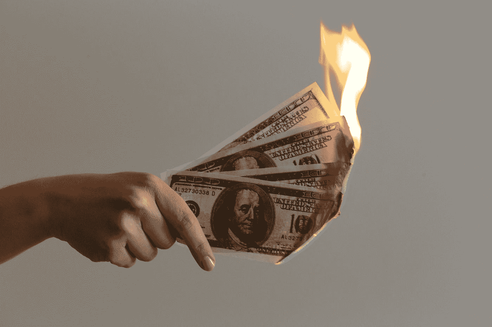

# UST-卢娜:拯救地球生态系统的下一步措施

> 原文：<https://medium.com/coinmonks/ust-luna-immediate-next-steps-for-saving-the-terra-ecosystem-695d213f474f?source=collection_archive---------2----------------------->

-被一个在 1922 年 1 月称 UST 钉住断裂的人

Photo by [Jp Valery](https://unsplash.com/es/@jpvalery?utm_source=medium&utm_medium=referral) on [Unsplash](https://unsplash.com?utm_source=medium&utm_medium=referral)

我在这里提出的建议，遵循了负债国成功避免破产并从更大危机中复苏的策略。如果你同意这些想法，请广泛分享，以便我们能够得到 Terra 基金会高层的关注。紧迫性是这里的关键。也向下滚动到最后，看看你如何可以在链上制造更大的噪音。

# 执行摘要

*   钉住汇率制度崩溃和银行挤兑的情况在各国历史上已经发生过多次，UST 钉住汇率制度崩溃绝对不是第一次
*   久经考验的剧本可以从这样的危机中恢复过来
*   需要紧急实施纠正措施——会有痛苦，需要吞下苦果以避免以后更大的痛苦
*   在 Luna 市值远远超过 UST 市值之前，钉住汇率制度的防御危机绝不意味着结束
*   建议的行动步骤(详见帖子) :
*   — 1.高层就问题所在进行坦诚和公开的沟通
*   — 2.保护 UST 持有者&立即遏制 UST 的抛售压力:提供投保金额为 1 美元的智能储蓄保险库，让持有者可以锁定他们的 UST
*   — 3.开始将 Terra 生态系统与 UST 隔离，在所有用例中用 Luna 替换 UST。UST 已经失去了民众的信任，甚至在灾后恢复阶段也可能会一次又一次地失去民众的信任。
*   — 4.停止用金融营销引诱轻信和易受骗的个人，促进过度杠杆化；在回报来源上要“积极和大声”
*   — 5.开始在各方面重建以 Luna 为核心货币的生态系统
*   读者们，如果你同意这些想法，请广泛分享，以便尽快联系到 Terra & Luna 基金会的高层人士。您也可以通过发送最后建议的单个交易来记录您的链上支持。

当我在 2012 年 1 月 22 日就 [***【打破 UST 盯住美元】*** 【链接】](/@tushar-sharma/terra-ust-breaking-of-the-1-peg-on-the-downside-11b58cc4e800)写了我的早期 UST 博客时，我收到了许多积极的评论，许多愤怒的评论，但最终都被置若罔闻。作为一名 10 年的 TradFi 投资组合经理，我当时看到的风险对任何一个了解 UST 钉住机制和一些基本金融经验的人来说都是显而易见的。

我不想这么说，但这对 Terra &Luna 基金会的人来说也是显而易见的。前提很简单:

> 用一项波动性较小的资产来捍卫一项大型稳定资产的盯住政策是不可能的

我写这第二篇文章的目的是让人们意识到需要采取什么措施来遏制这场危机。在撰写本文时，UST 和 Luna 的市值分别为 160 亿美元和 90 亿美元。UST 汇率已跌至 0.67 美元的低点，而且在超过 24 小时的时间里，未能恢复 1 美元的盯住汇率。

# 康复之路——确实存在！

毫无疑问，考虑到 Terra 生态系统对 UST 稳定货币的依赖，整个生态系统都将受到 UST 失去其固定货币的致命威胁。

然而，我的 Terra 社区伙伴&疯子们，知道这一点…

> 在现实世界中，许多国家都面临过银行挤兑和货币贬值，然后变得更加强大——我们也可以！

[https://www.abtrs.com/wp-content/uploads/2019/06/Road-to-Recovery-gets-Hard-1030x432.jpg](https://www.abtrs.com/wp-content/uploads/2019/06/Road-to-Recovery-gets-Hard-1030x432.jpg)

也就是说，我们目前真的处于危机之中。在 Luna 的市值远远超过 UST 之前，这场危机将持续下去。幸运的是，有一些屡试不爽的方法可以解决这种不幸的情况。然而，纠正行动将需要处于战备状态，并且将有苦果要吞下。任何延误只会进一步增加生态系统的成本。

# 立即行动步骤

[https://i.imgflip.com/4bpcef.jpg](https://i.imgflip.com/4bpcef.jpg)

## 1.保护最有价值的资产——人员和社区

基础应该清楚地显示出哪里出了问题。许多人一次又一次地强调了 UST 钉住汇率制的风险，但高层一直对此避而不谈。管理员们，你们需要清楚地交流发生了什么，并承认犯下的任何错误。

> @Terra Admins，相信社区会公平对待你。消除沟通中的困难，以便开始重建工作。

## **2。为 UST 持有者提供保护——创建智能储蓄金库**

创建储蓄智能金库，UST 持有者可以存放和锁定他们的 UST。随着 Terra-Luna 生态系统的恢复和 Luna 市值的再次上升，基金会可以使用其现在更高价值的资产以承诺的 1 美元的利率偿还 UST 持有者。

> 作为一个直接的影响，这将减少 UST 的抛售压力，以及邻近的卢纳硬币。

## 3.切除癌症，拯救社区

对于人类历史上所有潜在的货币来说，赢得信任是最难的事情。在破坏了一次信任之后，重新获得信任是不可能的。昨天，UST 稳定币变得比迷姆币更不稳定。UST 已经死了——它可能永远不会重新获得那些目睹自己的“稳定”硬币在几个小时内贬值 30%的人的信任。

> 即使 UST 这次重新与美元挂钩，谁又能有信心它不会再次崩溃呢？
> 
> @Terra 社区，开始在你的项目和生态系统中的任何地方用月神币取代 UST——收费、铸造、借贷、借款，一切！

从 TradFi 交易者那里听来，有时需要勇敢，有时需要明智——后者。多个创新项目的生存将取决于他们坚持 UST 还是用 Luna 取代它的决定。

> 在所有突发事件中优先考虑生存——这意味着将你自己与 UST 隔离开来

## 4.用锚变得真实

尽管 Anchor 不是一个庞氏骗局，但最终结果并没有太大不同。早期的锚鲸已经获利数百万，早期的储户也获得了一些回报，但绝大多数后来的储户都亏损了——这是典型的庞氏回报分布。

更不道德的是，庞大社区的巨大拉力——20%的利率——并不是由 Anchor 的任何真实商业操作产生的。相反，这笔奖金是由露娜基金会捐赠的，顺便说一下，该基金会恰好由那些从大量采用露娜、主播等节目中“大量”受益的鲸鱼运营。

所以对鲸鱼来说，通过花费几百万，他们确保他们的投资组合增加了几十亿。对于储户来说，在一个上涨的市场中，一切都很顺利，但当情况变糟时，只有他们最终会遭受真正的损失。

> 开始提供真实的、无补贴的锚定利率，或者提供关于被支撑的利率将持续多久的全面披露。
> 
> 停止用金融营销引诱轻信和易受骗的个人。

同样的建议也适用于所有鼓励储户和首次 DeFi 用户过度使用杠杆的项目。特别提一下——Abracadabra 和 MIM。

## 5.以月神为核心货币开始重建

我们需要尽快将这悲伤的一章抛在脑后，开始重建整个生态系统。所有的焦点都必须放在确保建立在 Terra 生态系统上的项目和社区在这场危机中幸存下来。不能指望 UST 在未来保持稳定——它已经失去了一次信任，而且可能还会继续下去。

大多数项目已经准备好将运营从 UST 无缝过渡到卢纳。这应该是企业的第一要务，以确保社区及其创新的连续性。毫无疑问，会有损失，但我们可以保留社区，财富会再次被创造。

> 交易中有句话:明天是新的一天

我们需要为明天开始重建，我们需要尽快开始。

# 请紧急传话！

钉住汇率制的打破在现实世界的货币中已经发生了多次，有一个成熟的经过反复试验的剧本来解决这个问题。来自管理员的沟通需要诚实和坦率，纠正措施需要迅速，需要吞下苦果。

如果你同意上面提到的观点，请广泛分享这篇文章，这样我们就能很快接触到 Terra 高层。

## 链上支持

要进一步记录您的在线支持，请向下面提到的地址发送一个小提示。

地址:terra 1 qjhaft 27 c 9 kyayptzc 5 ulywrcgdy 7 jenh 6 dkfx

金额并不重要，我们想要的是大量的交易计数来传播意识。零金额交易同样有效！

> 加入 Coinmonks [电报频道](https://t.me/coincodecap)和 [Youtube 频道](https://www.youtube.com/c/coinmonks/videos)了解加密交易和投资

# 另外，阅读

*   [加拿大最佳加密交易机器人](https://coincodecap.com/5-best-crypto-trading-bots-in-canada) | [Bybit vs 币安](https://coincodecap.com/bybit-binance-moonxbt)
*   [阿联酋 5 大最佳加密交易所](https://coincodecap.com/best-crypto-exchanges-in-uae) | [SimpleSwap 评论](https://coincodecap.com/simpleswap-review)
*   [购买 Dogecoin 的 7 种最佳方式](https://coincodecap.com/ways-to-buy-dogecoin) | [ZebPay 评论](https://coincodecap.com/zebpay-review)
*   [最佳期货交易信号](https://coincodecap.com/futures-trading-signals) | [流动性交易所评论](https://coincodecap.com/liquid-exchange-review)
*   [火币的加密交易信号](https://coincodecap.com/huobi-crypto-trading-signals) | [Swapzone 审查](/coinmonks/swapzone-review-crypto-exchange-data-aggregator-e0ad78e55ed7)