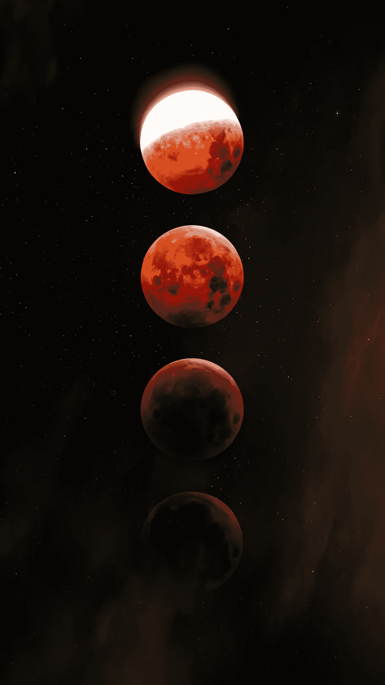

# UST/露娜的崩溃——完整的故事

> 原文：<https://medium.com/coinmonks/ust-luna-meltdown-the-full-story-5b3f8697bf97?source=collection_archive---------7----------------------->

我们刚刚见证了密码史上最大规模的事件之一。UST 的陷落和月蚀。

简单来说，Terra 是一个由许多不同产品和集成协议组成的区块链生态系统，服务于多种用例，但主要用例是他们的算法稳定积分和支付处理。在这一节选中，我们将讲述一个最受喜爱的生态系统的兴衰，发生了什么以及接下来会发生什么。

**背景**

Terra 的 stablecoin 算法(如果该机制保持不变)允许其代币(UST/KRT、EUT)与美元、韩元和欧元 1:1 挂钩。这些 stablecoins 背后的主要思想是提供一种传统货币的分散替代方案，以及提供一种更快、更便宜和更简单的 DeFi 交易方式。

露娜，泰拉的原生硬币是生态系统的核心。Luna 用于将 UST 的价值维持在 1 美元，以及网络费用，我们不会在这里深入讨论。

**机制**

Terra 协议使用基本的市场供求力量来维持 UST 的价格。实施了一种“先造后烧”的机制，即当 UST 的价格相对于 1:1 的挂钩汇率较高时，供应过低，而需求过高。该协议鼓励用户燃烧露娜和薄荷 UST。UST 的新增供应使其“储备”变得更大，从而平衡了供需。用户从烧毁的月神中铸造更多的 UST，直到 UST 达到其目标价格(1:1 挂钩)。月神池在此过程中变小，增加了月神的价格。这个过程被称为 UST 膨胀。

相反，当 UST 的价格相对于其挂钩汇率过低时，供给就会过大，需求就会过低。该协议鼓励用户燃烧 UST 和薄荷露娜。UST 供应量的减少导致稀缺，UST 价格上涨。更多的月神是从燃烧的 UST 铸造的，直到它达到目标价格(1:1 挂钩)。月神池价格上涨和下跌——收缩——这正是月神大衰退时发生的情况——供应量呈指数增长。需求也是如此。

**死亡螺旋**

这是从第一天开始就有的事情。这可能是 Terra 社区对此“视而不见”的一个例子。或者一个积极的强化，利润和繁荣的回音室。毕竟，UST 和露娜都曾以 500 多亿美元的总市值跻身市值前十。

> —“算法稳定的内容天生脆弱。这些试图利用金融工程、算法和市场激励来锁定参考资产价格的无抵押数字资产根本不稳定，而是处于一种永久脆弱的状态。”来源:[http://www . wakeforestlawreview . com/2021/10/build-to-fail-the-inherent-frability-of-algorithm-stable coins/](http://www.wakeforestlawreview.com/2021/10/built-to-fail-the-inherent-fragility-of-algorithmic-stablecoins/)
> 
> 上面的文章认为——“算法稳定点从根本上来说是有缺陷的，因为它们依赖于三个因素，而历史已经证明这三个因素是不可能控制的。首先，它们需要一个支持运营稳定性的需求水平。第二，它们依赖具有市场激励的独立行为者进行价格稳定套利。最后，他们需要始终可靠的价格信息。这些因素没有一个是确定的，在金融危机或极度动荡时期，所有这些因素都被证明是历史上脆弱的。”

## 简而言之；包括以上 3 个因素。UST 和露娜的死亡可以归结为:“无网可捕”，也就是说，UST 和卢娜的支持抵押品和巨大的卖出压力不可避免地打破了这一机制。

UST 和卢娜都吸收了大量的资本。大量抛售可能会使这一机制失衡(解释如下)——大量抛售 UST 会使其脱钩，铸造卢娜，增加其供应量并降低其价格。UST 和卢娜都陷入恐慌(因为他们都重仓投资)，导致双方都面临巨大的卖出压力。死亡螺旋。让我们进入细节。

**协同进攻还是必然性？**

具体细节尚不清楚。无论这是对 UST 的多层次经济攻击，还是 UST 如履薄冰。

它似乎是从曲线融资开始的，在 3-pool 中进行了 8500 万美元的 UST-USDC 掉期交易，使 pool 失衡，并导致 50，000 ETH 交易来平衡它。或者是一方有目的的曲线倾销 2.85 亿美元。

谣言在 crypto 中迅速传播，导致 20 亿美元从 Anchor Protocol (Terra 的领先协议，在 TVL 达到 140 亿美元的高峰)中退出，导致盯住 0.987-0.995 每 UST 的偏差。恐惧、不确定性和怀疑继续在整个社区蔓延，导致 UST 的销售增加，反过来又使卢娜·明廷处于过度驱动状态。

有传言称，“攻击者”会继续抛售 UST，这导致露娜基金会的警卫出售他们的储备资产 BTC，以应对抛售压力。熊和牛之间的战斗——实时进行！

露娜和 ust 面临的清算、做空和持续抛售压力实在太大了 Terra 的创始人权道(虽然从社区的角度来看是很晚了)在 twitter 上说，“在其他任何事情之前，唯一的前进道路将是吸收稳定的币源，这些币源希望在 UST 开始复苏之前退出。”

这太少也太晚了，而且没有带来信心。在此期间，熊市/牛市之争仍在继续，熊市以超乎寻常的规模取得了胜利。加密史上最大的一次投降！

在撰写本文时，UST 的交易价格为每枚 0.11 美元(-91%)，卢纳的交易价格为每枚 0.00003749 美元(-99.80%)。对于所有的加密公司来说，这是令人难以置信的悲伤的一天——如此大规模的失败是难以接受的，尤其是当涉及数十亿美元和数千人在一夜之间失去财富的时候。

下一步是什么？

首先，值得注意的是，Terra 生态系统是“丰富的”,有创新的协议，聪明的个体和曾经繁荣的社区。这三个组成部分将会发生什么还不得而知。

> Terra 区块链公司在 7607789 区块正式停工，12 小时后恢复区块生产。“验证者已经决定禁用链上互换，IBC 渠道现已关闭。鼓励用户将链外资产(如 bETH)连接到他们的本地链。来源:https://twitter.com/terra_money/status/1525095111389945857

最初的提议似乎是，从实验室中移除 Terra，完全担保 UST，并为 Luna 起草新的机制。不幸的是，这对生态系统来说可能太晚了，因为大多数人已经完全失去了对这个系统的信任。

**结论**

加密是非常基于信任的。这一事件已经影响了整个行业，随着许多散户投资者纷纷退出，加密本地人正在寻找答案，监管机构可能会开始磨砺，没有明确的方向。你认为接下来会发生什么？

我们所知道的是，在危机时刻，将会吸取大量的教训。不要投资超过你能承受的损失，永远不要在一个生态系统/硬币或代币上下赌注，多样化你的持有和许多许多其他的教训。

在外面注意安全。

问候你，罗杰奥。

由 Sheesha Finance 的项目协调员罗杰奥·莫莱斯撰写。*

*   [领英](https://www.linkedin.com/in/rog%C3%A9rio-morais-b9152a194/)
*   [推特](https://twitter.com/tokenparks)

> 加入 Coinmonks [电报频道](https://t.me/coincodecap)和 [Youtube 频道](https://www.youtube.com/c/coinmonks/videos)了解加密交易和投资

# 另外，阅读

*   [印度加密交易所](/coinmonks/bitcoin-exchange-in-india-7f1fe79715c9) | [比特币储蓄账户](/coinmonks/bitcoin-savings-account-e65b13f92451)
*   [OKEx vs KuCoin](https://coincodecap.com/okex-kucoin) | [摄氏替代品](https://coincodecap.com/celsius-alternatives) | [如何购买 VeChain](https://coincodecap.com/buy-vechain)
*   [币安期货交易](https://coincodecap.com/binance-futures-trading)|[3 comas vs Mudrex vs eToro](https://coincodecap.com/mudrex-3commas-etoro)
*   [如何购买 Monero](https://coincodecap.com/buy-monero) | [IDEX 评论](https://coincodecap.com/idex-review) | [BitKan 交易机器人](https://coincodecap.com/bitkan-trading-bot)
*   [CoinDCX 评论](/coinmonks/coindcx-review-8444db3621a2) | [加密保证金交易交易所](https://coincodecap.com/crypto-margin-trading-exchanges)
*   [红狗赌场评论](https://coincodecap.com/red-dog-casino-review) | [Swyftx 评论](https://coincodecap.com/swyftx-review) | [CoinGate 评论](https://coincodecap.com/coingate-review)