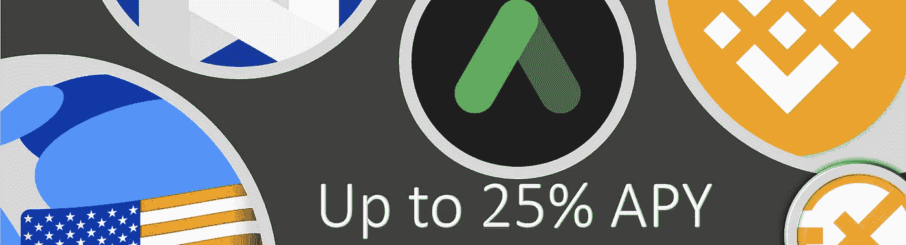

# UsT 稳定币——高达̶2̶5̶%̶每年 21.66%

> 原文：<https://medium.com/coinmonks/ust-stablecoin-up-to-25-apy-3f5ece14f45d?source=collection_archive---------18----------------------->

[**奖励:免费赠送约 50 美元的 TKX 代币，绝对免费，无需押金、承诺、交易。**](https://financialfreedom.quest/free-approx-usd-50-giveaways-by-doing-only-2-simple-steps-7c7d33e2378f?source=user_profile---------1----------------------------)

# 什么是 StableCoins？

简而言之，它基本上支持或盯住法定货币。在这种情况下，UsT 与美元挂钩。[我在这里分享了不同种类的稳定玉米。](https://financialfreedom.quest/high-yield-interest-stablecoins-from-singapore-context-c8c4f440e82f)

# 什么是 UST？