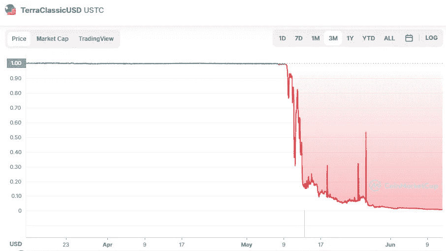

# 美国证券交易委员会正在调查中国科技大学 stablecoin 熔毁事件

> 原文：<https://medium.com/coinmonks/ustc-stablecoin-meltdown-is-under-investigation-by-the-sec-fc2b3bb0847e?source=collection_archive---------13----------------------->

Source photo [TerraClassicUSD price today, USTC to USD live, marketcap and chart | CoinMarketCap](https://coinmarketcap.com/currencies/terrausd/)

根据彭博的一份报告，美国证券交易委员会(SEC)正在调查上个月市场崩溃之前的 TerraUSD stablecoin 交易。

虽然大多数稳定债券依赖于中央发行人，但 USTC 依赖于一种算法来确保对等性。Terraform 实验室介入，在一个单独的项目下为 stablecoin 用户提供进一步的帮助…