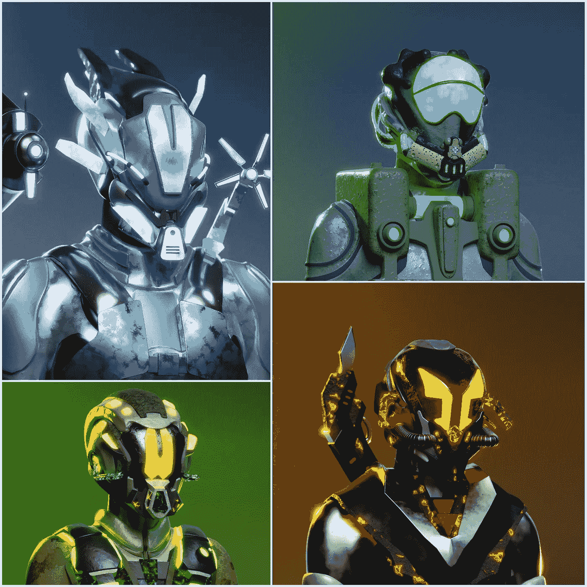
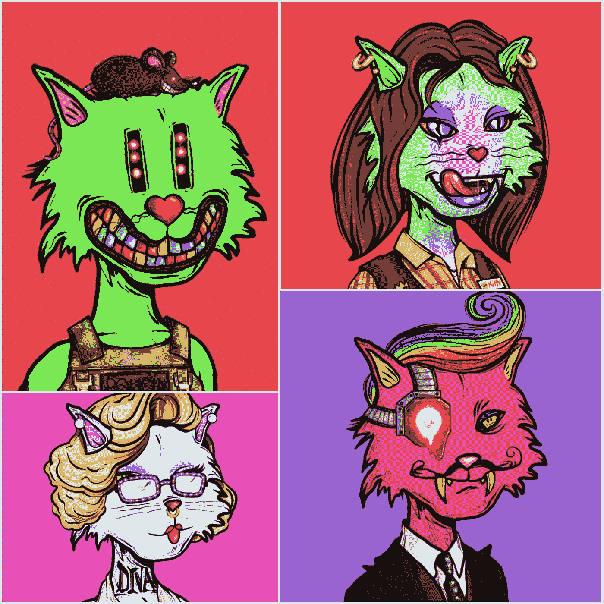
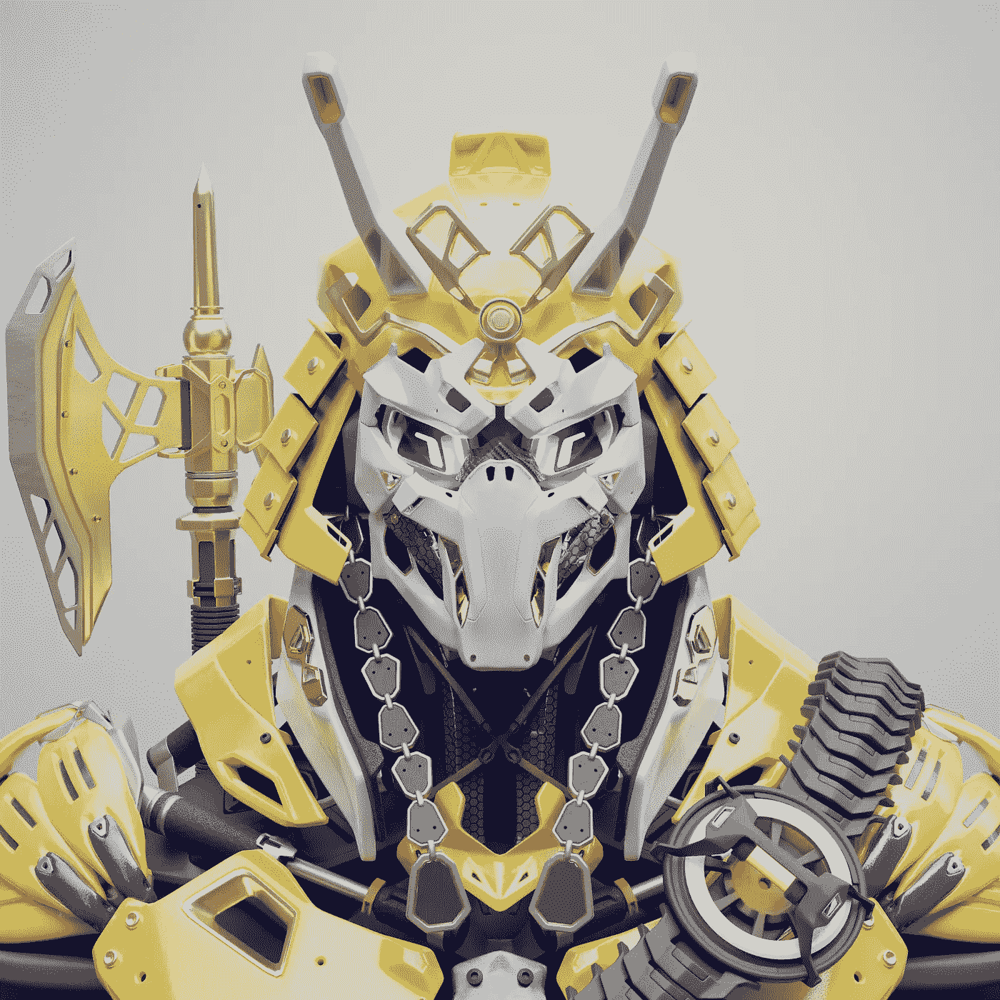
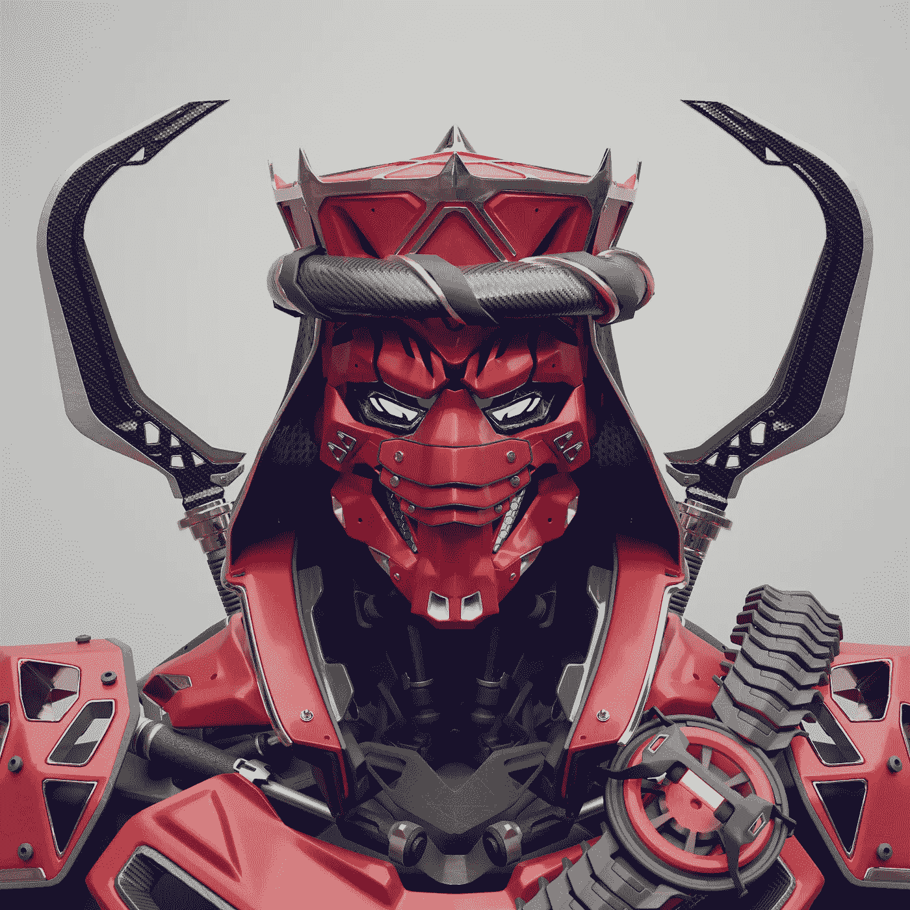
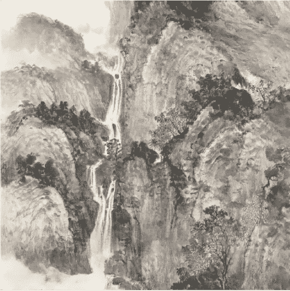

# 你可以利用的公共设施:NFT 项目的演变

> 原文：<https://medium.com/coinmonks/utilities-you-can-utilise-the-evolution-of-nft-projects-287dba6de267?source=collection_archive---------20----------------------->

所以你已经建立了你的社区，你已经有了那种渴望，那种需求……你已经放弃了你的收藏，它们已经卖出去了(也许不完全，但是足够好)……那么你如何维持这个项目呢？

这就是今天 NFT 项目面临的挑战。这个空间正在经历一种达尔文式的推算，只有强者才能生存。但是你如何识别什么是强大，更重要的是，这种“强大”是如何获得的。

在今天的 NFT 世界(与几周或一个月前大不相同)中突围是非常具有挑战性的。似乎每个人都在启动一个 NFT 项目。对于 NFT 的粉丝来说，努力跟上是令人疲惫的。对于 NFT 项目的创始人来说，随着失败项目的数量与日俱增，让自己置身其中是很可怕的。

在所有的复写纸、猿中的猿、下一个无形物体、阳光下的每一种滑稽动物之间，有一些项目已经在其中建立了一个真正的长期社区。但是，仅仅放弃一个系列，然后寄希望于大肆宣传已经不够了。今天的下跌仅仅是开始，昨天制造不和才是开始。

那么下一步是什么？继续保持社区参与的工具是什么？是时候利用这些工具了…

公用事业是平等的吗？

以上的答案是……绝对不是。我见过声称拥有丰富公用事业资源的项目，但其中大多数都是空的，不相关的，或者只是其他项目的一个 spruik，即只是白名单…这些公用事业承诺很薄，社区很快就从谷壳中挑出小麦。

那么公用事业做的好的项目有哪些呢？(以我的经验来看)..

[探路者](https://opensea.io/collection/the-pathfinders):

【https://thepathfinders.io/ 

在之前，我已经写过关于探路者的文章。为什么？因为我喜欢。伟大的项目，优秀的社区参与，高质量的艺术和设计(在这个复制的 NFT 世界中，这是一个独特的祝福)。另一件吸引我的事情是 ZepBox 的概念。什么？我听到你说…

所以 ZepBox 是一种战利品盒。想象一下在一个旧的视频游戏中的一次能量提升，然后乘以一百万。它为项目社区提供了他们可以实际使用的工具。第一个很快就会公布，但我们已经知道它包含物理产品、NFT 和白名单的组合，包括:

5x Oculus Quest 2

10 倍莱杰纳米

我真的很想要一个 Oculus Quest 2…好的，现在已经有了…

除了 ZepBox 中的赠品，它最大的好处是社区参与。你可以投票决定你想投入多少社区基金，并指定你想包括哪些赠品。此外，他们提供的白名单实际上是针对好项目的，经过审查的和可靠的机会。

此外，该项目认可持有人，并为他们所称的“创世纪”社区成员提供奖励。在即将到来的“以太之旅”中，创世纪社区成员将从该系列中获得一枚免费的薄荷糖。

创始人定期召开 ama，并提供定期更新，在其他项目模糊不清的地方提供清晰的信息。

这绝对是一个值得一试的项目。

以下是我的:

[精神病患者](https://crypto.com/nft/collection/faa3d8da88f9ee2f25267e895db71471)

好吧，他们说你永远不会忘记你的第一次……心理猫是我的第一个 NFT 项目。一个朋友告诉我的，我刚刚加入 Crypto.com，我想要一个小时左右的下降。我设法从随机等候名单上的 7000 人左右迅速增加到 2000 人左右。最终我能够铸造并达到最大值 5 英镑。这是一个伟大的决定，也是参与其中的第一个美妙的项目。我永远不会忘记它。

这个项目的成功使我能够投资于我现在参与的所有其他项目，而不必花费额外的资本。此外，我还被邀请参加了一个狂欢派对。好吧，我的系统并不是最好的，我无法控制我的虚拟形象，最终我把自己锁在厕所里大约 5 分钟，但总的来说，这很有趣，完全独一无二。

从那以后，我收到了一份免费的心理健康空投，并且成为了一个持续回馈项目的一部分。已经宣布了与重金属的合作，另一个 Crypto.com 系列以及 2500 只兔子将赠送给 PsychoKitty 和 PsychoMolly 的持有者。

路线图的第二版将会有更多的空投，但是这个项目已经给了我很多。能成为其中的一员真是太好了，而旅程才刚刚开始。

以下是我拥有的…

[特隆沃斯](https://opensea.io/collection/thetronwars)

【https://thetronwars.com/ 

另一个有腿的项目，TronWars 从一开始就让我着迷。我看了路线图，忍不住想参与进来。该路线图目前正在更新为 2.0 版本，但最初的项目承诺:

传奇持有者的 Tron 全尺寸 3D 打印

社区通过"一体行动"基础设施参与项目，使持有人能够对项目的技术、经济和商业方面给予指导

一个私人投资项目，让持有者提出想法或目标，以获得投资机会

针对持有者的私人活动和研讨会

一个元宇宙生态系统，包括一个特隆沃斯游戏的潜力

从那时起，他们还宣布，每个 Trons 持有者将获得一个新的收集空投，称为 BabyTrons 或 TronX，取决于你对谁说话。

他们还宣布:

数字工作室的创建，由为特隆沃斯进行令人敬畏的设计的团队组成。这个“工作室”将为 NFT 的其他项目工作。

Trons 持有者也将获得 TronWars 代币，他们可以在这些其他项目的 NFT 上花费。

Trons 持有者还将从 DigitalT 工作室在这些其他项目上开展的工作中获得一定比例的资金。

TronWars 代币的更多用途将会公布。

这一系列实用工具的神奇之处在于，它来自于一个在几分钟内销售完所有 8888 颗薄荷糖的项目。它已经取得了成功，但人们对社区重要性的信念丝毫没有减弱。

以下是我拥有的:

[CSLIM——世界收藏](https://www.cslim-studio.com/)

最后但同样重要的是，我想对 CSLIM 和他在 Crypto.com 的名为世界的[上的收藏发出一声欢呼。很简单，我只是喜欢艺术。这是惊人的，你一定要去看看。](https://crypto.com/nft/collection/258b45221dda385339d7c90098f24da9)

我总是觉得受日本、中国或韩国启发的艺术品很迷人。他们和我说话，带我回忆起去这些不可思议的地方旅行的美好回忆。艺术的文化意义令我震惊，我不禁被迷住了。

现在，我知道这是关于实用程序的，实际上 CSLIM 提供的实用程序只有一个，所以我觉得我几乎是在作弊，因为其他提到的项目提供了一系列实用程序。然而，对世界的效用是简单的，中肯的，非常真实的。

CSLIM 将在艺术家活着的剩余时间里，在每个月的 21 号提供每月一次的人工智能艺术空投。所以基本上，我每个月都能得到免费的艺术品。当你热爱艺术时，你真的不需要要求比这更多的东西…

以下是我拥有的:

所以，你看，NFT 项目今天必须发展，不仅是为了竞争，也是为了维持一个积极参与的长期社区。我真的很兴奋看到接下来会有什么项目出现，但很难击败 ZepBox 的创新和 TronWars 的包容性以及 CSLIM 的世界的简单性。

欢迎在下面的评论中分享你参与的任何项目，这些项目提供了很好的实用工具…