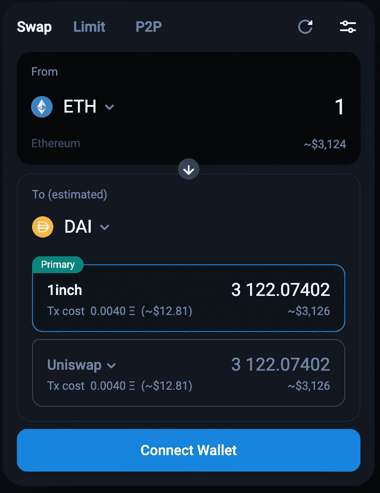
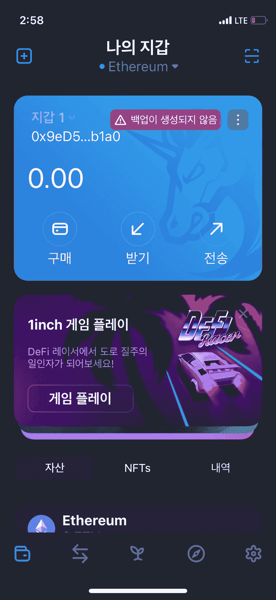

# 面向 UX 的加密钱包系列(1)1 英寸钱包

> 原文：<https://medium.com/coinmonks/ux-oriented-crypto-wallet-series-1-1inch-wallet-981735873f6f?source=collection_archive---------27----------------------->

*免责声明:我不代表任何公司或基金会的利润*

# 大约 1 英寸

1inch 是一家总部位于 EVM 的 DeX 聚合公司。它为基于 AMM(自动做市商)的指数提供了最佳的互换路径。你可以把 1inch 想象成 DeFi 行业的“股票经纪人”。

1inch Swap

# 大约 1 英寸钱包

然而，这个流行的 DeX 聚合器有自己的移动钱包，名为“1inch wallet”。这个钱包提供了许多用户友好的功能，如 iCloud 备份、类似 CeX 的交易体验(限价单等)等等。

1Inch Wallet

# 要解决的目标痛点是什么？

在去中心化的交易所中，滑点是最大的痛点，这是由于缺乏流动性、去中心化和细分化的各种交易协议以及更多的各种流动性池。因此，1inch 为 DeFi 开发了一个流动性聚合器，以提供最佳的交易体验。

为了提供无缝的交换体验，1inch 还开发了一款名为 1inch wallet 的钱包，这是一款 DeX 聚合器集成加密钱包。这为客户提供了更加无缝和舒适的交换体验。

# 印象和竞争对手

我认为这个钱包提供了最好的交换体验，就像币安、火币等加密交换应用一样。所以我认为 1 英寸钱包是以太坊上币安的非托管、去中心化版本。

# 棘手问题

交换，还有什么？HODL？1inch wallet 没有任何应用内“赚取”功能，如连接 AAVE、复合等。所以这很不舒服，因为我们必须连接到一个外部网站来赚取这些交换的硬币。

即使像币安这样的集中式交易所也在应用程序中提供一些盈利/赌注功能，所以为了扩大 1inch wallet 的用户，我认为一些盈利功能集成将是一个很好的路线图。

> 加入 Coinmonks [电报频道](https://t.me/coincodecap)和 [Youtube 频道](https://www.youtube.com/c/coinmonks/videos)了解加密交易和投资

# 另外，阅读

*   [瓦济里克斯 NFT 评论](https://coincodecap.com/wazirx-nft-review)|[Bitsgap vs Pionex](https://coincodecap.com/bitsgap-vs-pionex)|[Tangem 评论](https://coincodecap.com/tangem-wallet-review)
*   [如何使用 Solidity 在以太坊上创建 DApp？](https://coincodecap.com/create-a-dapp-on-ethereum-using-solidity)
*   [币安 vs FTX](https://coincodecap.com/binance-vs-ftx) | [最佳(SOL)索拉纳钱包](https://coincodecap.com/solana-wallets)
*   如何在 Uniswap 上交换加密？ | [A-Ads 审查](https://coincodecap.com/a-ads-review)
*   [加密货币储蓄账户](/coinmonks/cryptocurrency-savings-accounts-be3bc0feffbf) | [YoBit 审核](/coinmonks/yobit-review-175464162c62)
*   [Botsfolio vs nap bots vs Mudrex](/coinmonks/botsfolio-vs-napbots-vs-mudrex-c81344970c02)|[gate . io 交流回顾](/coinmonks/gate-io-exchange-review-61bf87b7078f)