# UXD、stablecoin stable 或只是另一个正在进行的白日梦？

> 原文：<https://medium.com/coinmonks/uxd-stablecoin-stable-or-just-another-pipedream-in-the-works-cc7a27ae46f1?source=collection_archive---------16----------------------->

## 随着 UST 算法稳定性的下降，寻找最有弹性的稳定性的探索还在继续 UXD 的特性会证明自己是一个好的稳定性吗？

毫无疑问，设计一个好的、工作稳定的密码是密码中最难解决的挑战之一。目前市场上有这么多稳定的股票。我们如何知道哪一个最适合使用？
今天，我们将观察索拉纳生态系统中一种叫做 UXD 的稳定蛋白质。

像往常一样，谢谢你的阅读！欣赏一张 2 只仓鼠咀嚼食物的照片。如果你喜欢你正在阅读的东西，不要忘记跟随或评论下面的内容😄

# **非理财建议**

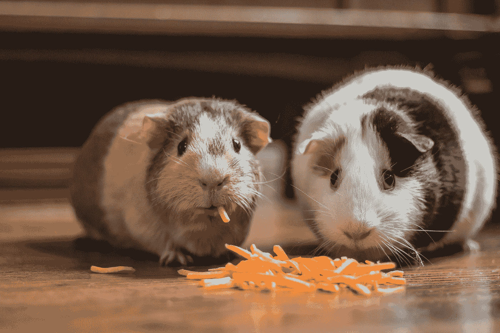

Photo by [Bonnie Kittle](https://unsplash.com/@bonniekdesign?utm_source=medium&utm_medium=referral) on [Unsplash](https://unsplash.com?utm_source=medium&utm_medium=referral)

# **UXD 及其特点**

UXD 方案形成于 2020 年，之前称为 Soteria，但后来更名为 UXD。
本协议共有 2 个令牌，

*   UXD 本机稳定连接
*   UXP——道的治理象征

UXD 是索拉纳区块链上一个不可信的算法稳定器。它的独特之处在于，它使用**增量中立位置**来支持其稳定加入。稳定的货币也能够从它拥有的永久期货头寸中产生收益。

未爆弹药与美元挂钩，100%支持。用户将**、*始终*、**能够用 1 个未爆弹药兑换 1 美元的资产。如果 UXD 脱离了钉住汇率制，它也将依靠套利者将其拉回钉住汇率制。

由于其 delta 中性头寸，在不需要对市场状况进行过度整理或监控清算的情况下，UXD 也具有资本效率。

# **如何工作？**

我相信一个好的稳定的加入不需要一个过于复杂的设计，这需要很多深刻的理解。虽然对于 UXD 来说，有一些新概念需要理解，但是它如何工作的基本原理仍然是非常直观的。

因此，在我们继续之前，请对术语进行快速总结，以便更好地理解…

*   **Delta，Delta Neutral**——与标的资产相比的价格变动量、衍生品。如果是中性的，价值不受基础资产价格变化的影响。
*   **衍生工具**——一种允许在不实际拥有资产(参考资产)的情况下押注资产价格的工具
*   **永久期货**——双方以约定价格购买/出售资产且无到期日(合同不结算)的合同

UXD 通过平衡多头和空头来维持其稳定性。当你在协议上铸造 UXD 时，你将把你的抵押品存入其中。智能合约将使用该抵押品在芒果市场上建立 delta 中性头寸(相当于空头头寸)。如果抵押品的价格上涨 1 美元(盈利)，空头头寸将下跌 1 美元(亏损)。因此，即使您的初始抵押品的价值发生了变化，总体价值也没有发生变化。

这就是通过 Delta-neutral 实现稳定性的方式。

当用户想要取回他们的抵押品时，他们可以存回铸造的 UXD，智能合约将解除芒果市场的头寸，并将抵押品返还给他们。他们可能会收到更多/更少数量的抵押品，但美元价值将保持不变。(稳定币)

# **铸造和赎回**

存入担保品(SOL ),你将能够铸造 UXD

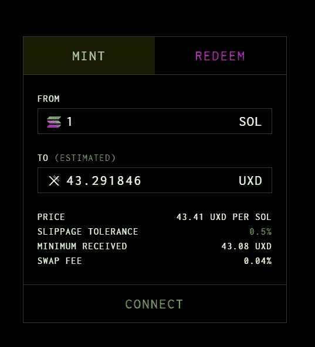

由于永续期货的性质，利息正在产生。由于期货实际上并不交易市场上的实际资产，所以它的虚拟价格将根据买入/卖出的需求而变化。

因为我们需要期货的**虚拟价格**来跟踪基础资产的实际**市场价格**，所以存在一种机制，使得虚拟价格不会偏离资产的市场价格太远。

引入**资金率**。(资金利率=虚拟价格-市场价格)
当有太多的人购买期货时，这种增加的需求将推动长期货的价格上涨。
资助率是从热门职位到冷门职位的定期付款。(在这种情况下，期货的买家=热门头寸)

由于芒果市场有一个小时的资金率，如果虚拟价格仍然高于市场价格，做多的用户将需要支付每小时的资金率。
这样做的目的是激励人们进行相反的交易，以便价格能够重新平衡回到市场价格。

**融资利率** —当融资利率为正时，利息将支付给那些持有 UXD 股份的人和保险基金(普遍的立场是买入)

**保险基金** —当资助率为负时，协议将通过保险基金支付负资助率。(流行的立场是卖出)

当保险基金耗尽时，协议将拍卖其 UXP 令牌来补充保险基金。
如果因黑客攻击导致 UXD 抵押不足，也可以动用保险基金。

Photo by [Justus Menke](https://unsplash.com/@justusmenke?utm_source=medium&utm_medium=referral) on [Unsplash](https://unsplash.com?utm_source=medium&utm_medium=referral)

# **风险**

虽然稳定的债券存在许多风险，但我想指出几个我认为与其他风险相比更为重要的风险，前提是假设不管当前的市场条件如何，获取期货指数价格的预测仍然有效。

1 **保险资金告罄或完全耗尽**
在熊市中，卖空者通常会比做多者多。这将导致资金利率为负。保险基金将用于支付负利率。如果这种情况无限期发生，一旦保险资金耗尽，负利率将导致那些持有 UXP 的人抵押不足。(因为那些负融资利率仍将需要支付)

当用户试图赎回时，他们将无法将其初始抵押品的 100%赎回全额。实际上，稳定的货币将会失去其挂钩。

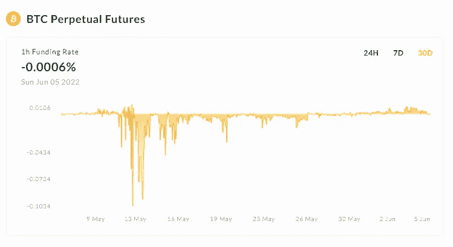

BTC funding rate over a 30 day period on Mango markets

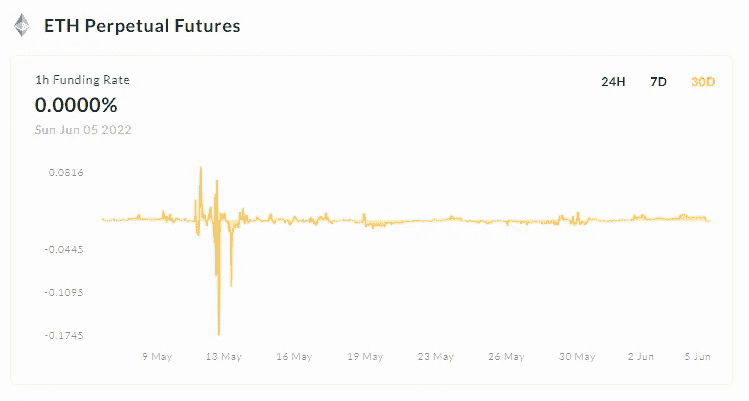

ETH funding rate over a 30 day period on Mango markets

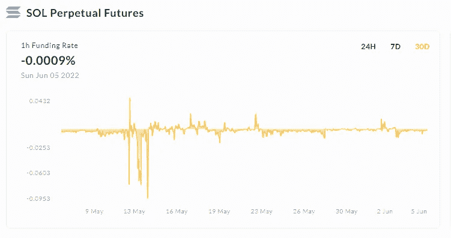

SOL funding rate over a 30 day period on Mango markets

虽然这只是芒果市场上 3 种抵押品的融资利率的一个简短表示(30 天),但我们至少可以对它的未来有一个大致的了解。

我们可以看到，大部分大幅波动发生在 5 月初，当时市场开始显示出进入熊市的迹象，还有 UST 脱钩事件。除此之外，图表的其余部分与融资利率没有太大的变化。

2 我们将快速浏览一下令牌组学和 UXP 令牌的效用。

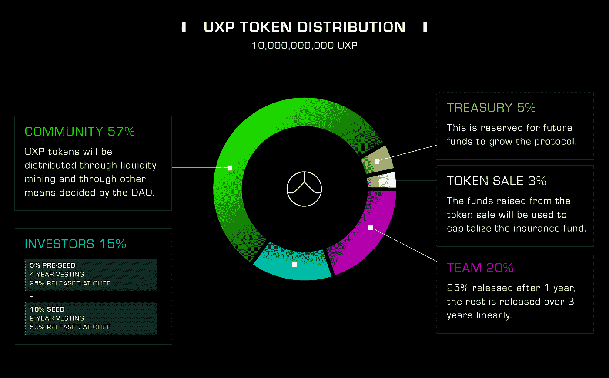

[https://docs.uxd.fi/uxdprotocol/overview/uxp-token-economics](https://docs.uxd.fi/uxdprotocol/overview/uxp-token-economics)

对于团队和投资者来说，他们的 UXP 将被锁定到 2022 年 11 月 14 日，直到悬崖结束，其余金额将每月发布(线性)。因此，我们可能会在那个时期看到一些行动，这取决于他们的目标。

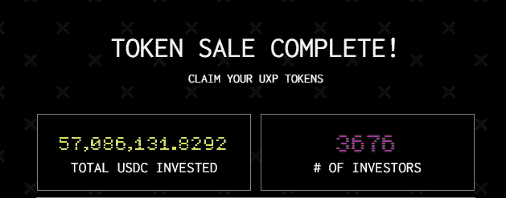

USDC raised from the 3% sale of UXP tokens

UXP 的使用案例(不完整)

*   增加新的衍生产品交易所
*   为 delta 中性头寸增加其他形式的加密抵押品
*   正筹资率的变化
*   引入管理保险基金的新策略

要问的问题是，在长期熊市中，UXP 与市场其他部分的关联度如何？出售代币能带来足够的资本吗？通过治理，关于协议如何获得更多保护性资金和 UXP 实际使用案例的新提案将在引导和保护稳定币增长方面发挥作用。

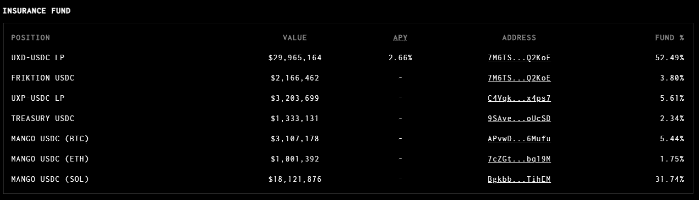

[https://dashboard.uxd.fi/](https://dashboard.uxd.fi/)

我们可以看到，保险基金得到了很好的利用，赚取了 APY，而不是只是坐在“金库”无所事事。虽然积累更多资金以备不时之需通常是个好主意，但这确实会给等式带来新的风险，比如这些资金来源是否真的安全可靠。

> 保险基金的增长需要与 UXD 的增长保持一致，否则，当融资利率长期为负时，稳定的货币可能无法保持稳定。

3 **衍生品流动性不足 DEX/es** 当流动性不足，大量用户同时试图赎回 UXD 时，可能无法立即完成赎回。

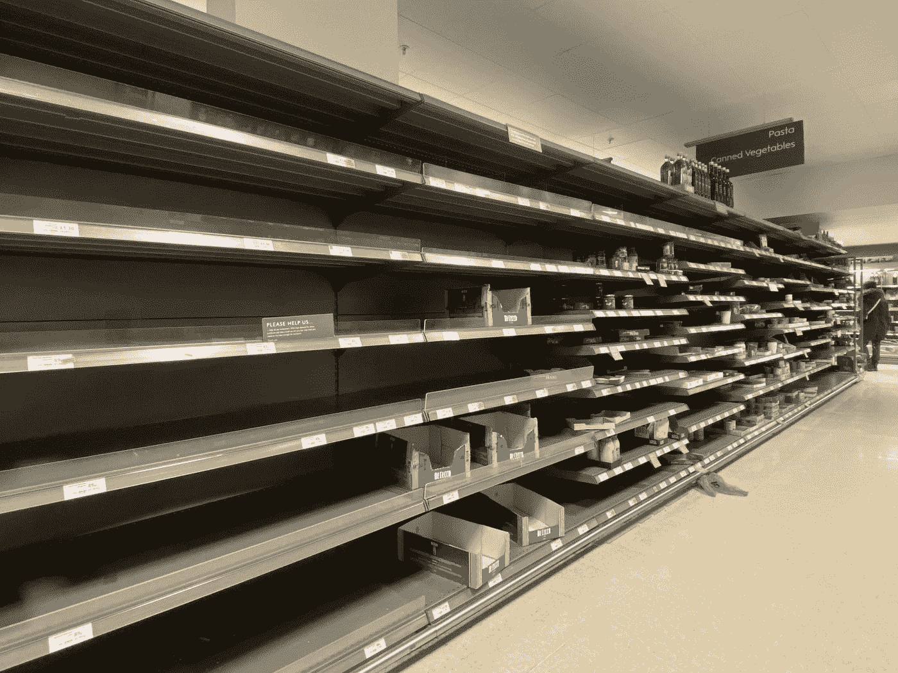

Photo by [John Cameron](https://unsplash.com/@john_cameron?utm_source=medium&utm_medium=referral) on [Unsplash](https://unsplash.com?utm_source=medium&utm_medium=referral)

当恐慌和恐惧因“赎回失败”而爆发时，很可能会导致银行挤兑，更多的人试图逃离。退出的方法之一是将他们的稳定币换成 Dex-es 上的另一个代币，前提是他们还能换。我只展示了稳定交换的例子，人们仍然可以把它换成另一个令牌。因此，关注这些平台上的流动性将是有益的。

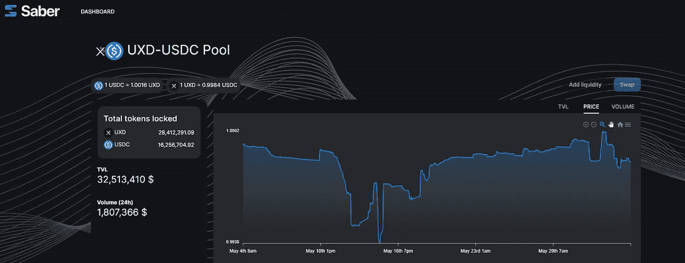

[https://saber.markets/#/pools/KEN5P7p3asnb23Sw6yAmJRGvijfAzso3RqfyLAQhznt](https://saber.markets/#/pools/KEN5P7p3asnb23Sw6yAmJRGvijfAzso3RqfyLAQhznt)

[https://www.mercurial.finance/pools/uxd-3pool](https://www.mercurial.finance/pools/uxd-3pool)

当谈到衍生品的流动性时，另一种看待它的方式是，UXD 的部分增长可能受限于 DEX 能够提供多少。毕竟我们需要我们的三角洲中立位置来保持稳定。

这可以通过使用提供相同衍生产品的多个指数来解决，但这又会增加现有的风险。我们现在还必须考虑另一个指标的稳健性。

但这不是一个需要解决的大问题或关键问题，因为它仍处于 UXD 的早期阶段。

4
在有许多交易发生的高峰期，同样的事件是否会再次发生，导致用户无法成功退出或添加更多担保品？如果一些恶意行为者只是想看到世界燃烧，并故意发送大量的 txn 来淹没网络，试图在我们最需要的时候停止网络，该怎么办？

所有这一切都取决于索拉纳如何解决这个问题。它的建造是为了快速，但如果什么都不能通过，这一切都是毫无意义的。即便如此，我仍然对索拉纳保持乐观，因为这是他们需要解决的一个关键问题，如果最终人们不会转向另一家连锁店，那也是一样快，一样便宜，但运行时间更长。

Photo by [JESHOOTS.COM](https://unsplash.com/@jeshoots?utm_source=medium&utm_medium=referral) on [Unsplash](https://unsplash.com?utm_source=medium&utm_medium=referral)

# **结论**

虽然 UXD 不是 Solana 链中出现的第一枚 stablecoin，但它的独特之处确实让它脱颖而出，至少对我来说是这样。虽然它声称已经解决了稳定币三难问题，但我仍然不确定稳定性部分。这是因为保险基金对其稳定性至关重要(芒果市场也是如此)。

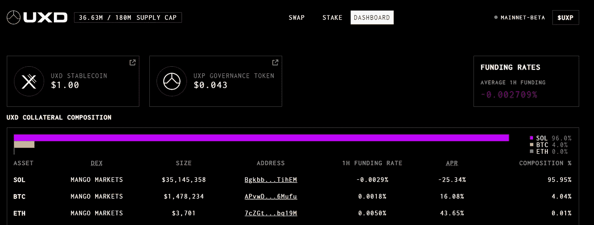

根据我的快速计算，如果我们现在达到 1.8 亿 UXD 的最大供应上限，保险基金和平均融资利率保持不变。保险基金完全耗尽大约需要 1.34 年。

0.002709% * 24 * 365 = 23.73%
180m 的 23.73% = 42，715，512(因负资金而需支付的费用)
57，086，131.8292 / 42，715，512 = 1.34 年

虽然 UXD 出现的时间不长，但它还没有达到爆炸式普及的地步，最终成为索拉纳的 stablecoin 的海报男孩。
自 2022 年 1 月 18 日 [Mainnet Beta](https://uxdprotocol.medium.com/uxd-launches-mainnet-beta-bringing-the-first-fully-decentralized-capital-efficient-stablecoin-to-74cd4075f4d9) 发布以来已经过去了 19 周，看起来它并没有达到其预计的 2 亿 UXD 供应上限(最终上限)的目标。
目前的抵押品组合只有 3661 万英镑。坦率地说，我觉得这有点令人失望，因为我曾希望看到这样一种稳定的硬币被更多人采用。(我认为这部分是因为 USDC 是一个强有力的竞争对手，它在索拉纳生态系统中已经有了很多使用案例)

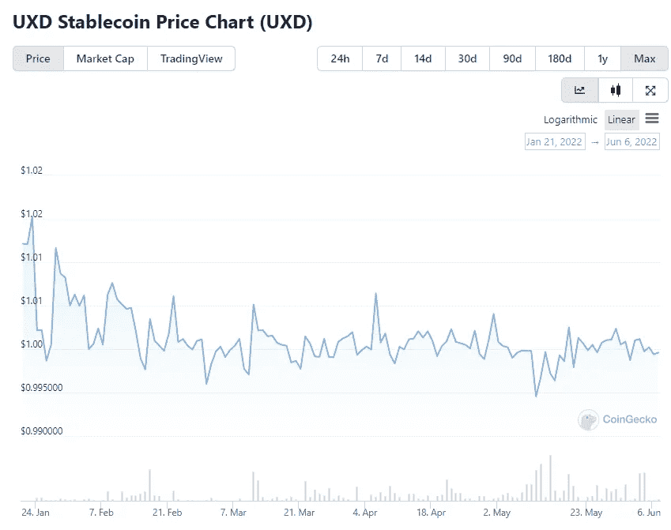

From coingecko

我觉得 UXD 有潜力，有解决问题的独特方法，但现在说还为时过早。一旦它越过 11 亿英镑的供应关口，并经历几次极端的市场状况，我们就会知道它是否真的能够经受住时间的考验，成为一种真正稳定的货币。

你怎么想呢?

> 加入 Coinmonks [Telegram group](https://t.me/joinchat/Trz8jaxd6xEsBI4p) 学习加密交易和投资

查看我的列表中关于 stablecoins 的其他文章！

约翰·方德伯克

## 稳定币系列

[View list](/@John_Funderburker/list/stablecoin-series-824c6d307261?source=post_page-----cc7a27ae46f1--------------------------------)4 stories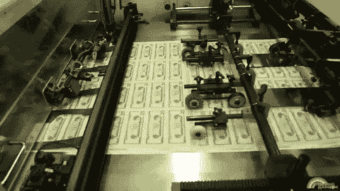

**补充阅读** ——[保险资金的含义](https://987185596-files.gitbook.io/~/files/v0/b/gitbook-x-prod.appspot.com/o/spaces%2F-Mj8VWsobdvjhMutae2g%2Fuploads%2FK8B4Qq1s6iS16m2dDiYP%2FInsurance_Fund_Simulation_vF.pdf?alt=media&token=8e79050d-0835-4154-a38c-eddc4fa8b2a9)

希望你已经从这篇文章中受益😸
关注或留言评论！👍
一如既往，感谢阅读！🙏