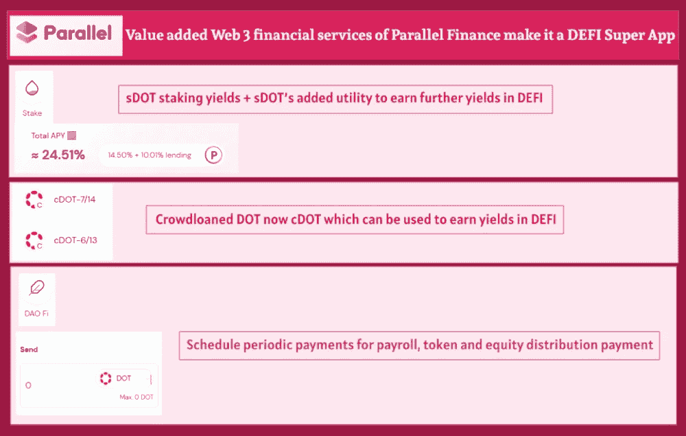
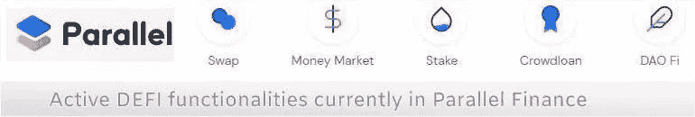
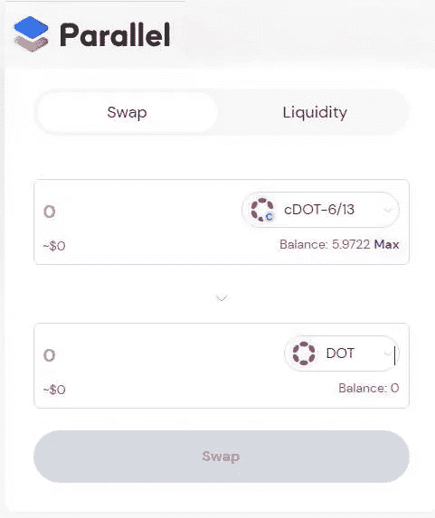
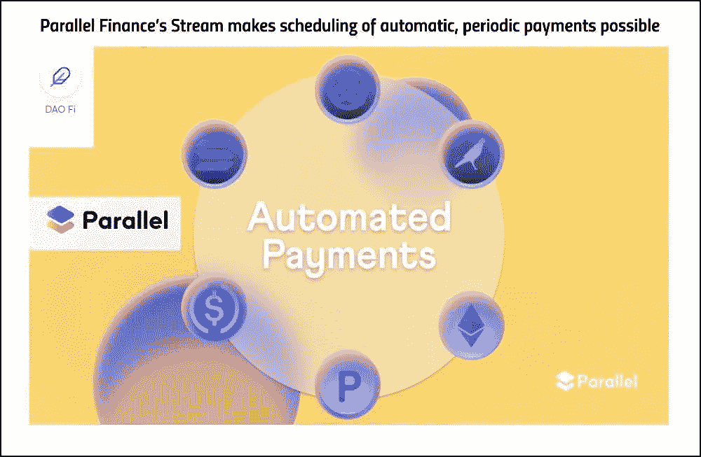
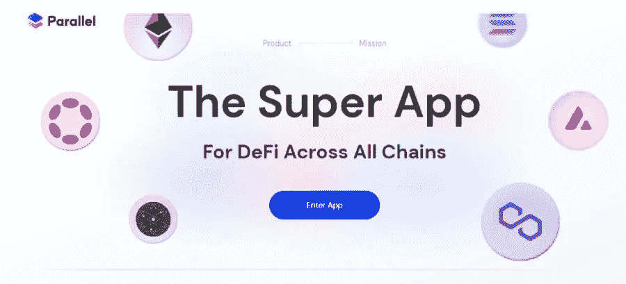

# 并行金融的增值 Web 3 金融服务使它成为一个 DEFI 超级应用程序

> 原文：<https://medium.com/coinmonks/value-added-web-3-financial-services-of-parallel-finance-make-it-a-defi-super-app-ebe04a7f8e66?source=collection_archive---------37----------------------->

# Parallel Finance 的 DEFI 服务具有一些增值元素，使其与众不同

并行金融 DEFI 已经是 Polkadot 生态系统中相当活跃的 DEFI 协议，该协议锁定的资产总价值超过 4 . 3 亿美元。

用户一直出于各种目的使用 Parallel Finance 的平台，从使用 Parallel Finance 的 Crowdloan 模块向 parachain crowdloans 贡献他们的 DOT，到为协议中的各种互换对提供流动性，到在 Parallel Finance 的货币市场中借贷资产，到为赚取 sDOT 赌注奖励而流动下注他们的 DOT。

平行金融的上述服务是非常有价值的，具有一些附加值，使这些服务非常有用。

我将在下面总结并行金融服务中普遍存在的这些增值元素。

# cDOT 资产的增值使大众贷款 DOT 成为具有效用的流动资产

在[这篇文章](/@kikctikcy/parallel-finance-expands-its-utility-with-defi-functions-having-initiated-in-the-platform-9f4f5ee14897)中完成详细说明，这篇文章解释了关于 cDOT 的内容，cDOT 是持有人使用 Parallel Finance 的 Crowdloan 模块向各种 parachains 提供的众筹贷款点。

[平台首创 Defi 功能，平行金融拓展应用](/@kikctikcy/parallel-finance-expands-its-utility-with-defi-functions-having-initiated-in-the-platform-9f4f5ee14897)

## 利用 cDOT 资产赚取更多收益

cDOT 用于 Parallel Finance 的 DEFI，可以为各种 cDOT 对提供流动性并赚取 LP 奖励。这些 LP 奖励可用于在并行金融货币市场中赚取更多收益。

这在本文谈及并行金融的收益率货币市场功能时被不当解释了-

[通过并行金融的收益率货币市场功能为 LP 提供商提供更多奖励](/@kikctikcy/more-rewards-for-lp-providers-with-the-yield-money-market-functions-of-parallel-finance-452834f737a3)

cDOT 的优势在于，众筹贷款参与者可以获得流动性的众筹贷款 DOT，cDOT 的流动性可以用于并行金融的 DEFI，并获得更多收益。该 cDOT 将解锁给 DOT，并在 parachain 租期(96 周或 2 年)结束时记入众筹贷款贡献者账户。

否则，如果众筹贷款贡献者以一般方式借出他们的 DOT，他们的 DOT 将被锁定在 Polkadot 的众筹贷款金库中，直到 parachain 的 2 年租期结束。这个锁定点不能在任何地方使用，以赚取收益！！

**cDOT 可以通过交换转换成 DOT**

Parallel Finance DEFI’s swap module

cDOT 持有人可以在 parachain 的租赁期结束前，通过在 Parallel Finance 的互换模块中将其 cDOT 交换为 DOT，将其 cDOT 转换为 DOT。但是，在交换模块中，由于池的不平衡，当交换为点时，cDOT 的值可能不等于 1 点。

然而，在副链租赁期结束时情况并非如此，届时 cDOT 将解锁并以与 DOT 价格 1:1 的比例贷记给 cDOT 持有人。

# 在并行金融的流动点锁定模块中使用 sDOT 增加价值

另外，平行金融提供的这种有用的功能是流动性点赌注。这里的价值比例是，点持有者可以从他们的流动性赌注 sDOT 中获得赌注回报，并在 Parallel Finance 的 DEFI 中使用 sDOT，通过在货币市场上借贷 sDOT，并向各种 sDOT 对提供流动性来获得更多收益。

我在以前的文章中已经深入讨论过这个问题:

[流动赌注 sDOT 累积赌注奖励，可在 Parallel Finance 的 DEFI 生态系统中使用，以获得更多收益](/coinmonks/liquid-staked-sdot-accrues-staking-rewards-which-can-be-used-in-parallel-finances-defi-ecosystem-f823b14967cb)

# Parallel Finance 的 Dao Fi 功能超越了通常的 DEFI 服务

除了我们在这里提到的由 Parallel Finance 提供的所有这些服务之外，该协议还具有 Dao Fi 功能及其流模块，使用户能够定期安排自动循环支付。

这使得 stream 成为用于工资、令牌和股权分配的 web 3 解决方案。

我已经在[这篇文章](/coinmonks/parallel-finances-stream-makes-scheduling-of-automatic-periodic-payments-possible-372fc802fa6f)中解释了 Parallel 的具有 DAO Fi 功能的流模块:

[Parallel Finance 的现金流使得自动定期付款成为可能](/coinmonks/parallel-finances-stream-makes-scheduling-of-automatic-periodic-payments-possible-372fc802fa6f)

# Parallel Finance 必须提供的不同 Web3 金融服务使其成为一个超级 DEFI 应用程序

[Parallel Finance](https://parallel.fi/)

并行金融的所有这些服务使该协议成为一个 DEFI 平台，可以为其用户提供大量的众筹贷款模块、掉期和流动性模块(赋予 DEFI 协议 AMM 功能)、货币市场模块和 Dao Fi 模块。

然而，这还不是全部，并行金融正在发展，为用户提供更多的服务，因此协议的功能不断扩展。

这就是为什么平行金融是一个超级 DEFI 应用程序，因为它的目标是成为一站式 DEFI 中心，提供我们加密用户需要的所有基本金融服务！！

**此处进入平行金融 App**—[https://app.parallel.fi/](https://app.parallel.fi/)

**了解平行金融-**

网站—[https://parallel.fi/index.html](https://parallel.fi/index.html)

推特——https://twitter.com/ParallelFi

https://discord.gg/DeyEntFT 的

**这位作者的文章也可以在这些平台上阅读—**

[https://peakd.com/@mintymile/posts](https://peakd.com/@mintymile/posts)

[https://steemit.com/@mintymile/posts](https://steemit.com/@mintymile/posts)

[https://www.publish0x.com/@greenchic](https://www.publish0x.com/@greenchic)

> 加入 Coinmonks [电报频道](https://t.me/coincodecap)和 [Youtube 频道](https://www.youtube.com/c/coinmonks/videos)了解加密交易和投资

# 另外，阅读

*   [OKEx vs KuCoin](https://coincodecap.com/okex-kucoin) | [摄氏替代品](https://coincodecap.com/celsius-alternatives) | [如何购买 VeChain](https://coincodecap.com/buy-vechain)
*   [ProfitFarmers 回顾](https://coincodecap.com/profitfarmers-review) | [如何使用 Cornix Trading Bot](https://coincodecap.com/cornix-trading-bot)
*   [如何匿名购买比特币](https://coincodecap.com/buy-bitcoin-anonymously) | [比特币现金钱包](https://coincodecap.com/bitcoin-cash-wallets)
*   [瓦济里克斯 NFT 评论](https://coincodecap.com/wazirx-nft-review)|[Bitsgap vs Pionex](https://coincodecap.com/bitsgap-vs-pionex)|[丹吉尔评论](https://coincodecap.com/tangem-wallet-review)
*   [如何使用 Solidity 在以太坊上创建 DApp？](https://coincodecap.com/create-a-dapp-on-ethereum-using-solidity)